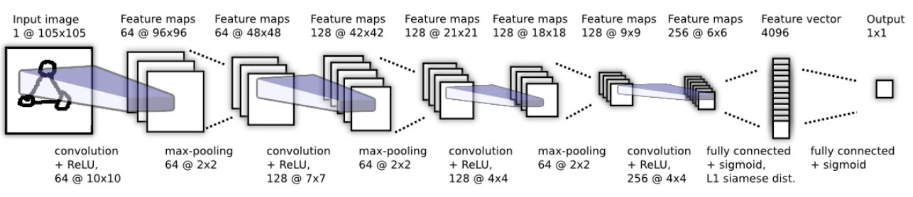
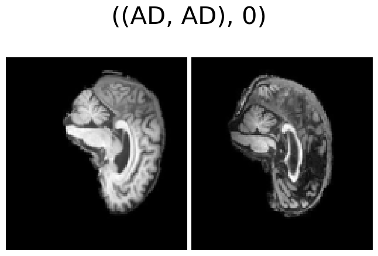
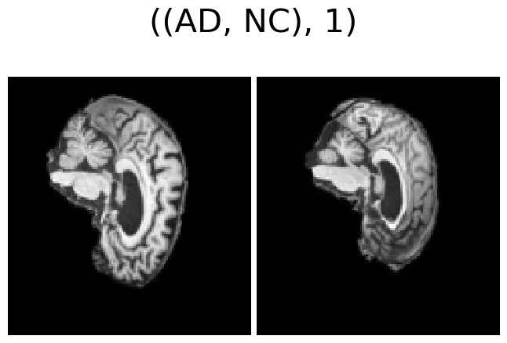
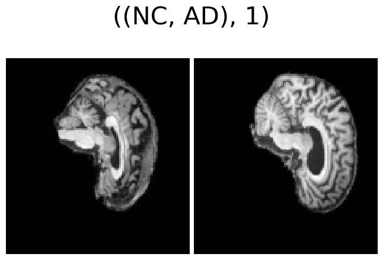
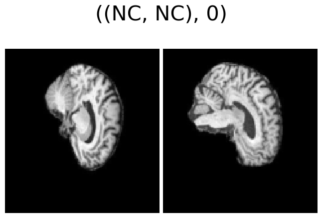
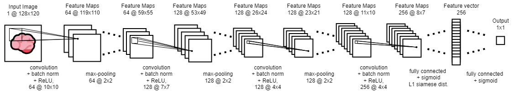
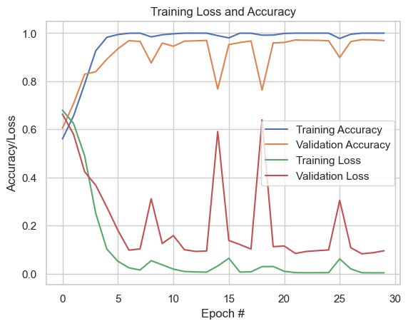

# Classifying Alzheimer's Disease in The ADNI Dataset Using The Siamese Network
## Siamese Network
The Siamese Network aims to classify images based on its similarity to a range "query" images which represents multiple classes. The network takes two images as inputs and returns a number between 0 and 1, indicating how similar these images are. The input image is then classified to be the class of the query image of which it is most similar to.

It does this by passing these images through the __same__ convolutional neural network (CNN), all with the __same__ weights, to extract the features of the images into single feature vectors. We then take the component-wise, absolute difference between these vectors and join it to a fully connected layer with one output - a value between 0 and 1 indicating similarity. This is depicted in the following image: ([G. Koch, R. Zemel, R. Salakhutdinov et al.], Figure 4)

The component-wise absolute distance is used because we wish to find feature vectors of images which have a small euclidean distance between them if they are similar, and a larger distance when they are not. The benefit of this architecture is that it allows for one-shot prediction - that is, you can classify an image as a class without having any images of that class in the training set.

## Classifying the ADNI Dataset
### Preprocessing The Data
The preprocessed ADNI dataset contained train and test datasets already but in my implementation, I found I got better results when combining the datasets and randomly splitting them by 60% for the test set, 20% for the validation set and 20% for the training set. I also found that applying resizing the image from (256, 240) to (128, 120) improved results. A grayscale transformation was also made on the images so that the pixel values are a value between 0.0 and 1.0 and that the image has only 1 channel.

In order to work with the Siamese Network, the class `SiameseADNIDataset` was made to make pairs in the data be made where 0 denotes both images are of the same class and 1 denotes otherwise. 

 
 
 

### Siamese Network Model Implementation
The structure I implemented follows pretty closely to structure shown in the previous image with the main differences being the input image dimensions, the convolutional layer uses batch norm, and that the length of the feature vector is 256.

I used binary cross-entropy as the loss function and Adam as the optimizer with 0.00005 learning rate and 0.001 weight decay.

## Results
### Training
The following plot shows the loss and accuracy for both the training and validation set across 30 epochs.

We can see that the model reaches good training and validation accuracy at around 6 epochs and continue to perform well, staying above 0.8 accuracy except for two times. At 30 epochs, the model has decent training and validation performance and when evaluating the test set we also get great performance as seen below:

### Prediction
Predicting the class of image requires a 'query' image from each class which will be tested for similarity against the input image. The following plots are two examples predicting the class of an image.

## Reproducibility
train.py includes the best model and training parameters found. The train/validation/testing split is kept the same since it uses a set seed, however, the seed is not set for assigning a random pair, so training pairs are different for each run. This means the exact results as described in the report will not be achieved for every run. But since the class population for AD and NC are around the same size, similar results will be achieved - as I have observed on repeated runs. 

## Dependencies
Python Version 3.11.5
* PyTorch 2.0.1
* Torchvision 0.15.2
* NumPy 1.24.3
* Matplotlib 3.7.1
* random
* time
  

## References

[1] G. Koch, R. Zemel, R. Salakhutdinov et al., “Siamese neural networks for one-shot image recognition,” in ICML deep learning workshop, vol. 2. Lille, 2015, p. 0. (https://www.cs.cmu.edu/~rsalakhu/papers/oneshot1.pdf)