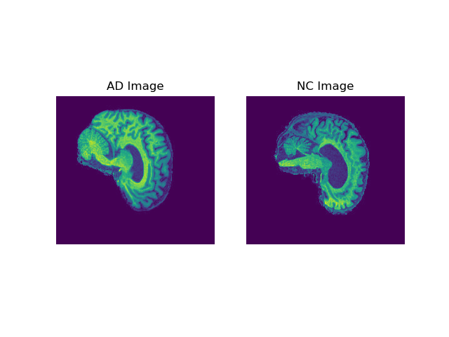
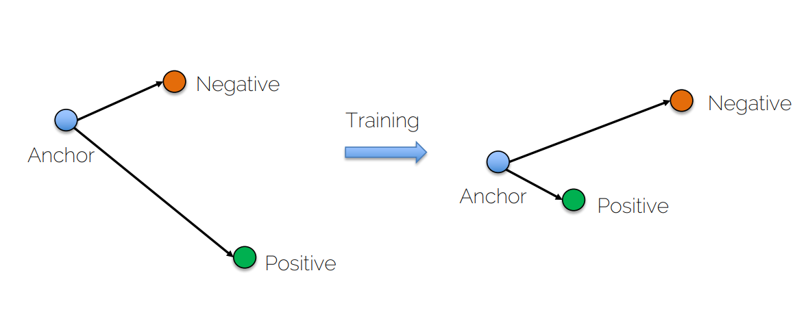
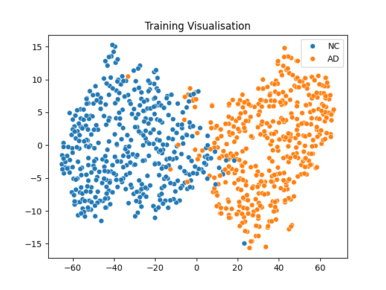
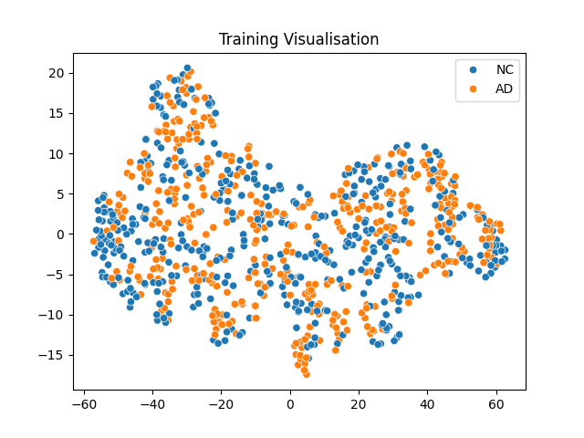
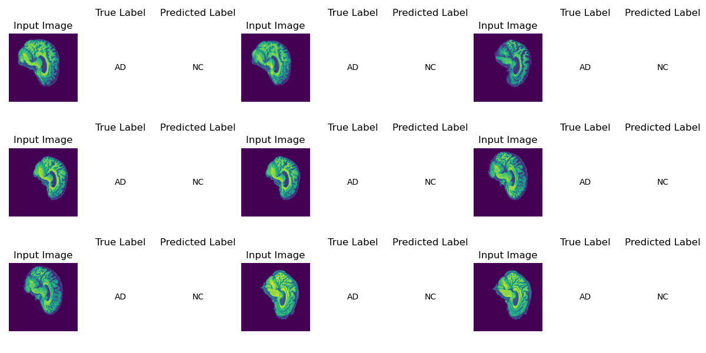
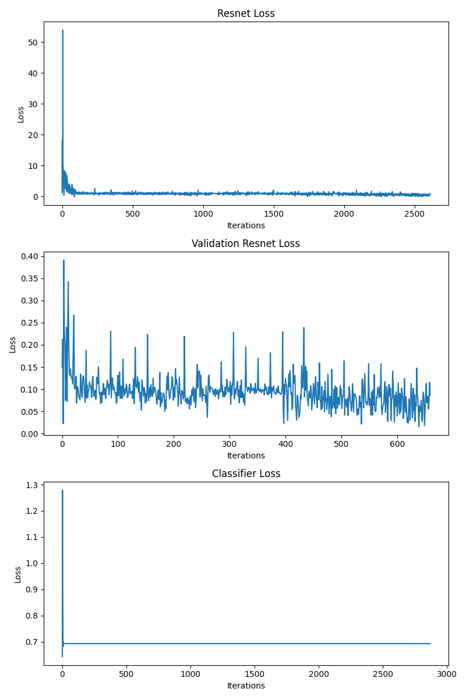

# Siamese Network classification on the ADNI brain data set
___
Task: The given task was to "create a classifier based on the Siamese network to classify either Alzheimer’s disease (normal and AD)
of the ADNI brain data set or classify the ISIC 2020 Kaggle Challenge data set (normal and melanoma)
having an accuracy of around 0.8 on the test set." 

As such, the ADNI dataset was chosen for classification. 

## ADNI Dataset 
___
The ADNI dataset used contains two folders for training and testing respectively, both of which contain a further two subfolders 
for 'NC' (Normal Cognitive) and 'AD' (Alzheimer's Disease). The training set consists of 11120 'NC' images and  10400 'AD' images while 
the testing set consists of 4460 'AD' images and 4540 'NC' images. 

In the dataset, each image is one of 20 slices of a patient's brain and are named according to the patient and the slice of the brain.
i.e. '505732_80' for the 80th slice of patient 505732's brain. 

Shown below in Figure 1 are example images of an 'AD' and a 'NC' brain slice. 

  

    <em> Figure 1: AD and NC ADNI Images  </em>

## Siamese Network
___

For this particular implementation of the Siamese Network, a triplet loss Siamese Network was used. Triplet loss works by designating one image an 'anchor' and then selecting a similar image to be the 'positive'
and a dissimilar image to be the 'negative'. Using these three images, triplet loss tries to maximise the distance between the anchor
and the negative image while minimising the distance between the anchor and the positive image. 

It does this with the equation:

> L(a, p, n) = max{d(a_i, p_i) - d(a_i, n_i) + margin, 0}

Where a is the embeddings of the anchor, p is the embeddings of the positive and n is the
embeddings of the negative  (Mandal, 2023)[^1].  

As seen below in Figure 2, after training the negative moves further from the anchor while the positive moves closer.

  

    <em> Figure 2: Triplet Loss Training  </em>

Regarding the specific task, if the anchor image is 'AD', the positive would be 'AD' and the negative 'NC', and vice versa for an 'NC' anchor. 

## Data Preprocessing
___
Due to the way the images are stored, some preprocessing is required. Each image in both the train and test folders of the dataset are one of 20 slices. 
As such, the paths of each of the 20 images for a patient are read and then combined by 'stacking' them on each other to create the brain which can then be passed into the 3D resnet. 
This 'Patient-Level split' allows the model to compare and classify each patient's brain rather than random slices of a random brain. 

To reduce over-fitting of the data, the brains are randomly flipped horizontally and vertically via transforms. 

## Model and Training
___

The 'backbone' model implemented is a custom 3D resnet that takes 64 input channels and eventually outputs 1000 features. The classifier then takes these 1000 features, passes
them through some fully connected layers and produces 1 output channel which can then be used to classify the image as either 1 representing 'AD' or 0 representing 'NC'. 

The 3D resnet makes use of convolutional and Relu layers as well as max-pooling and dropout layers. The significance of the resnet 
model in particularly is it's 'shortcut connections' that allow it to skip parts of the model initially and then reuse the activations later on. This solves the
'vanishing gradient' problem where the gradient reduces so much that it 'disappears' due to the number of layers needed for complex models (Datagen, n.d.)[^2].

Using the triplet loss function mentioned before and the 3D resnet model, the data visualisation shown in Figure 3 was produced after training the resnet for 30 epochs. 

  

    <em> Figure 3: Feature Visualisation -- 30 Epochs  </em>

It is worth noting the data must be trained for at least 30 Epochs, as less than that does not sufficiently separate the data.
Below in Figure 4 shows the results of training the 3D resnet for only 25 Epochs. 

  

    <em> Figure 4: Feature Visualisation -- 25 Epochs  </em>

## Predict Output:

Running predict.py will load the pretrained models from train.py and use them to predict the labels
of the first iteration of images from the specified loader (by default the testloader)

An example output of running the file is shown in Figure 5:

  

    <em> Figure 6: Predict Example Output  </em>

## Code Functions
___
+ modules.py: 
    * Defines 3DResnet and Classifier Models. 
+ dataset.py:
    * Image Preprocessing
    * Creation of custom datasets and dataloaders
    * Combining slices into full brain.
+ train.py:
    * Resnet training and validation loops.
    * Classifier training and validation loops.
    * Data Visualisation.
    * Testing, Loss Plotting and accuracy calculations
    * Saves trained models for later use.
+ predict.py:
    * Loads models trained in train.py.
    * Runs testing, produces accuracy.
    * Displays images, true labels and predicted labels. 

## Dependencies: 
___
The below dependencies with their versions were used.

+ torch | 2.1.0+cu118
    * torchvision | 0.16.0+cu118
+ pytorch-cuda | 11.7
+ seaborn | 0.13.0
+ scikit-learn | 1.3.1
+ opencv-python | 4.8.1.78
+ numpy | 1.26.1
+ time | 1.8

## Loss and Accuracy:
___

The 3DResnet model with Triplet Loss showed great results, separating the data to a high level, however the classifier performed poorly, potentially due to overfitting.

Results are shown in Figure 6: 

  

    <em> Figure 6: Loss Results  </em>

As the Classifier did not function as intended. It's overall accuracy is poor at ~50%. 

## References:

[^1]: Mandal, S. (2023) *Power of Siamese Networks and Triplet Loss: Tackling Unbalanced Datasets*. Medium.com.
Retrieved from: https://medium.com/@mandalsouvik/power-of-siamese-networks-and-triplet-loss-tackling-unbalanced-datasets-ebb2bb6efdb1

[^2]: Datagen. (n.d.) *What Is Residual Neural Network (ResNet)?* Datagen Tech. Retrieved from: https://datagen.tech/guides/computer-vision/resnet/#
