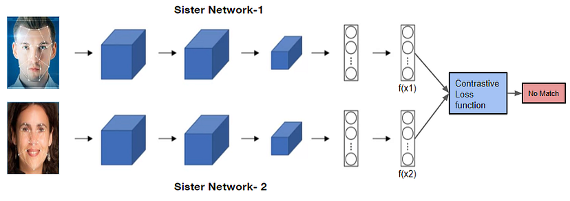
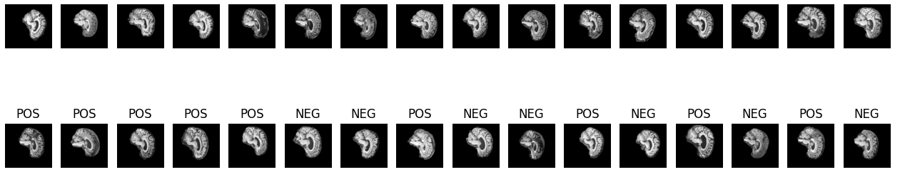
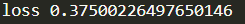
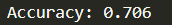
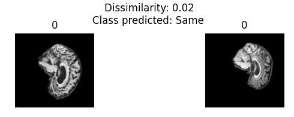
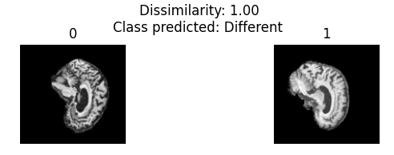

# Siamese Network classifier to classify Alzheimer's disease

Project uses Siamese Network to predict the similarity between two images and classify normal or AD(Alzheimer's Disease).

## Siamese network

Siamese Network is a specialized neural network architectural which uses two identical subnetworks that shares parameters and weight.

Use two images as inputs and produces a similarity score between the two. Then classify with a label.

Popular with face verification, signature verification, and few-shot learning.

Both uses the same identical Convolutional Neural Network(CNN). 

During Training, Siamese networks often uses pairs that are "similar" or "dissimilar". Network learns to minimize the distance for similar pairs and maximize it for dissimilar pairs.

After processing the inputs, the final layer/differencing layer computes a distance metrics between the two outputs, often Euclidean distance. Similar items will have smaller distance between their output, while dissimilar items will have a larger distance.

Main advantages of using Siamese Network is their ability to perform one-shot learning. The ability to recongize new classes or entities with little data.

## ADNI brain dataset

### 1. Data Preprocessing

The ADNI brain dataset contains two classes, AD and NC in both Training and Test. All image has initial shape of (3,240,256) 256 x 240 (W x H) [batch_size,channel,height,width]. Loading the dataset, all images will be normalized.All Images are resized to (1,120,128) to increase training speed.

It is then paired and labeled accourdingly if it is similar class or not. Pairing process randomly pics between 2 classes to pair up. In doing so doesn't overtrain the model.

Batchloader is set to 16 to speed up the training process, can be change if needed.

Figure shows a batch with labels stating if it's a Similar or Dissimilar pair.

POS being Positive pair and NEG being Negative pair for visual purposes.

### 2. Siamese Model

The Siamese Model first part begins with the embedding where it transforms the input images into a continuous vector space.

3 convolutional layers, 2 max-pooling layer and 2 dense layer with sigmoid activation function. 

Sigmoid activation for final layer as output is within specific range.

### 3. Training

Contrastive Loss is used as a loss function as it is focus on learning the similarity or dissimilarity between pairs of the inputs.

Optimizer is Adam with a learning rate of 0.00006

After 40 Epoch,

### 4. Testing

Testing the trained model results,

### 5. Prediction

  

## Code Discription
1. "dataset.py" contains Data loader for loading and preprocessing the dataset.
   
2. "modules.py" contains Source code of the components of the model.Each component is implementated as a class or a function.
   
3. "predict.py" contains to showexample usage of trained model. Print out any results and/ or provide visualisations where applicable.

4. "train.py" contains the source code for training, validating, testing and saving the model.
    - Change TRAIN_PATH to PATH of training dataset and set TRAINING_MODE to True if you want to use model for training.
    - If use checkpoint of trained model to test edit CHECKPOINT PATH

## **Dependencies**
1. Python 3.11.5
2. External Libriaries:
    - torch 2.01
    - matplotlib 3.8.0
    - torchvision 0.15.2
    - numpy 1.25.2

## References
[1] Images of Achitecute of Siamese Neural Network https://www.latentview.com/blog/siamese-neural-network-a-face-recognition-case-study/