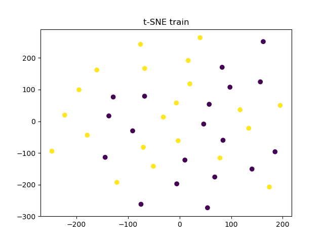
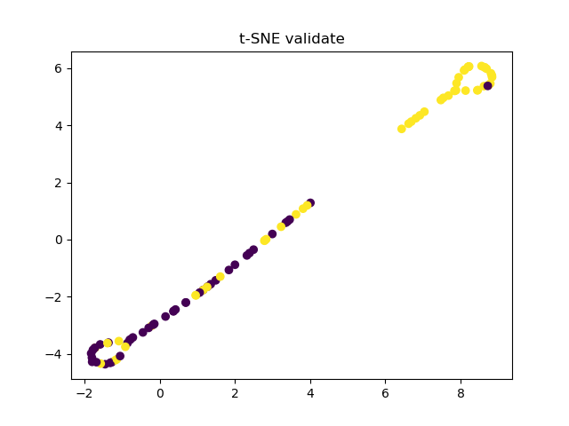
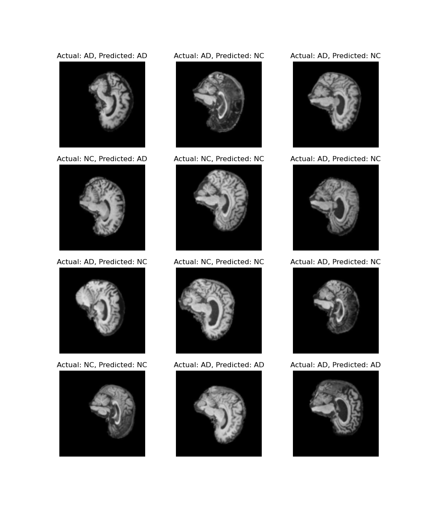
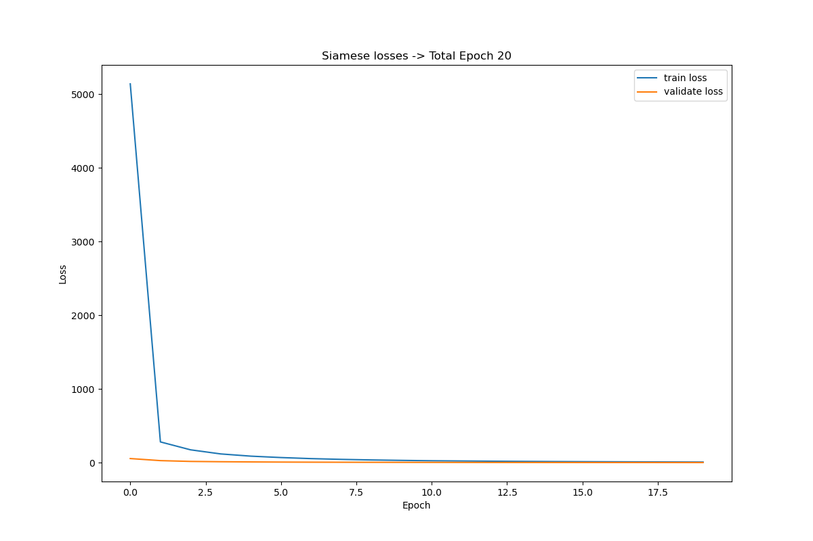
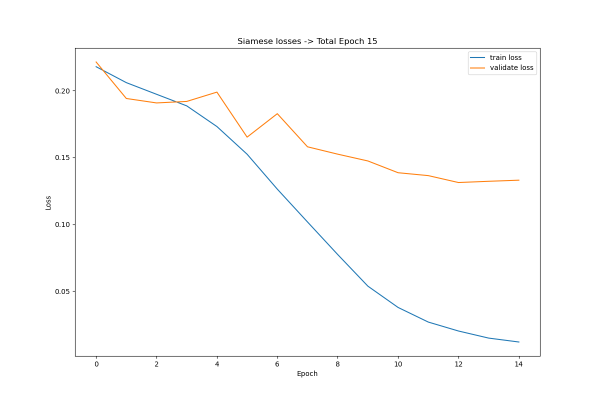
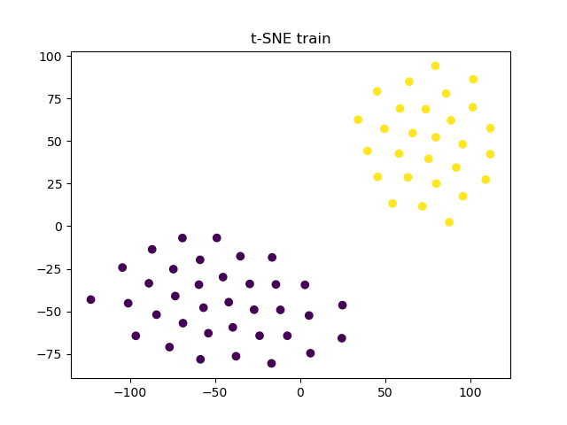
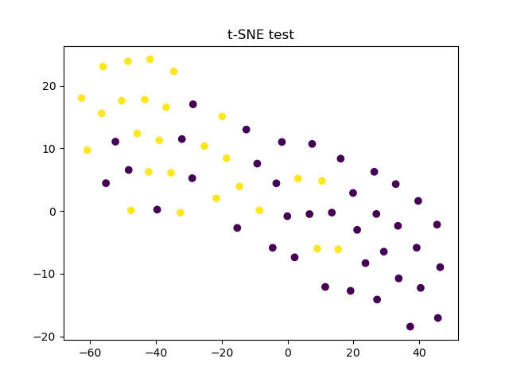
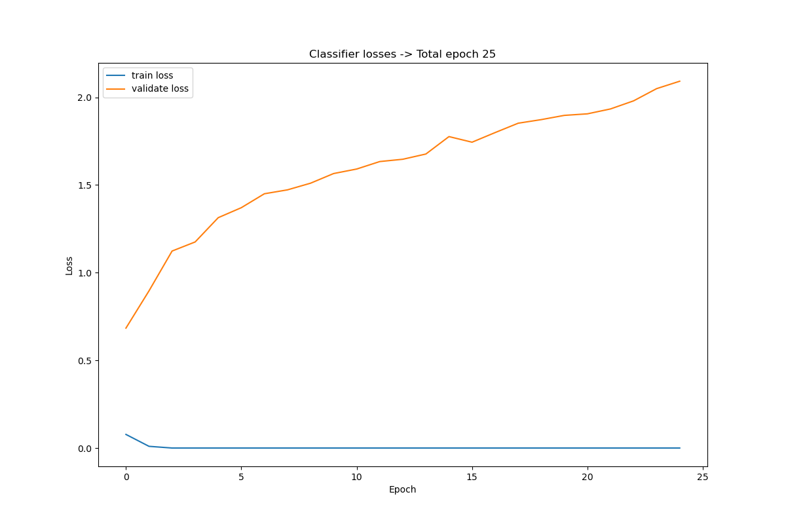
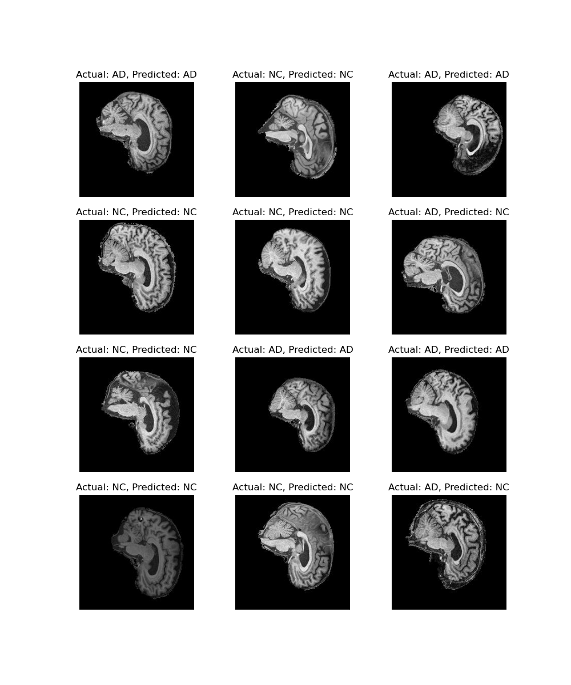

# COMP3710 Project: Siamese classification for ADNI data
**Student Number:** 46419712

## Table of Content
1. [Introduction](#1-introduction)
2. [Project structure](#2-project-structure)
3. [Model](#3-model)
4. [Train and validate loss](#4-train-and-validate-loss)
5. [Result](#5-result)
6. [Reproducibility](#6-reproducibility)
7. [Future improvement](#7-future-improvement)
8. [References](#8-references)

## 1. Introduction
The Siamese model is a powerful deep learning model that is often used to assess the dissimilarity between two images. In this project, this model will be adapted to classify the ADNI dataset, determining whether a brain image belongs to a patient with Alzheimer's disease or a normal person.

## 2. Project structure
1. ```modules.py``` containing the code for the Siamese model, Siamese Contrastive Loss and Binary Classifier model.
2. ```dataset.py``` containing the data loader for loading and preprocessing ADNI data. This includes splitting the train data to 80% training and 20% validation. This also includes a custom dataloader to handle PairDataset for Siamese model and data augmentation.
3. ```train.py``` containing the source code for training, validating, testing and saving the training model. The test result will be print after finish training.
4. ```predict.py``` plots the image and classifies whether the image belongs to AD or NC class. This will be compared side by side with the actual label of the image.

## 3. Model
### 3.1. Background

According to a paper by Koch, Zemel, and Salakhutdinov [1] about Siamese network for one shot image recognition, the Siamese model is best when it is used to find the similarity between two images. That is why, traditional Siamese model often trained on pair dataset.

For the Siamese model, this project will adapt the Siamese Neural Networks One-shot image recognition below.

* Siamese architecture


The figure above demonstrate Siamese's architecture One-shot image recognition.

Instead of including the final layer to calculate the similarity between the two images, this project will use the key features of the Siamese model, which is to extract feature vectors from the image using convolutional layers. Instead of using these feature vectors to compare between two images to identify the similarity, this project will use these feature vectors to train the binary classifier to classify the image (AD or NC).

After the first four feature extraction layers, the Siamese L1 distance will be calculated between the two images and minimized using the contrastive loss function. Images with high similarity will be close to each other while images with higher dissimilarity will be separated. This is complete using the contrastive loss function (This is showed below) [1].


The overall architecture for siamese model of this project is as followed [2]:


For the binary classifier, this project will only use a simple multi fully connected layer that convert 4096 feature vector into binary classifier. 
The architecture is as followed (primary source)


### 3.2. Implementation

**Data preprocessing**

There are three main features in data preprocessing:
1. Data splitting: The project split the training dataset into 80% training data and 20% validation data. The splitting is done on patient level, that is, the image with the same patient ID won't exist both in training and validation data, only one or the other.
2. Pair dataset: The Siamese model is well-known for its specialised training using pairs of images. Hence, the Pair custom dataset is processed in ```dataset.py```, allowing the model to train with a pair of image, the label is categorised whether the two image belong to the same class or not. Note that the model only take in one image at a time, but the using the same model to apply training for two image, then those two output are pass through the contrastive loss.
3. Data augmentation is done through resize the image down to 224 x 224, this is following the approach from an online source (the source is include within the code), and perform a number of data augmentation such as RandomAffine. When performing data augmentation on a small dataset, this will create more variation of the dataset and enhance the testing accuracy. It is worth pointing out that the size of the image is debatable of whether to resize it to (105 x 105) suggested by Koch, Zemel, and Salakhutdinov [1], or resize to 224 x 224 because massive resize may reduce the data quality.

**Siamese model**

The siamese model simply follow the approach suggested by Koch, Zemel, and Salakhutdinov [1] for every single layer, except the last one where the model stop at the point where it extract the feature vector and return it.

**Binary classification model**

Once the Siamese model is finish training, the model was used to help trained the binary classifier to classify the class of the image. First, the image will go through the Siamese to extract the feature vector. This feature vector is expected to distancing images that are dissimilar. The classifier is then used to classify the image. The classifier follow a simple multi fuly connected layer for better classification.

**Hyper-parameter Tuning**

The hyper-parameter tuning for Siamese:
1. For the training of Siamese model, the number of epoch is set in the range of [10, 20] because the Siamese model seemed to be overfit quite easily.
2. The criterion for the Siamese model is ContrastiveLoss, where the margin is set at 0.2 when the data is resize to (105 x 105) or 1.0 when the data is resize to (224 x 224). The bigger the margin, the less fine grained it will inspect for similarity between the two images. For bigger size data, it is more suitable for bigger margin.
3. The optimizer is using Adam optimizer, which is known for working best with a wide variety of model with little tuning required and still achieve high accuracy. If more knowledge about the optimal tuning parameter for the optimizer, a different variation will be chosen. The learning rate is 0.0001.

The hyper parameter turning for Classifier:
1. For the training of classifier model, the number of epoch is set in the range of [40, 60].
2. The criterion for the classifier is BCELoss. The reason for choosing BCELoss because this criterion is good when use to train binary classifier.
3. The optimizer is also using Adam optimizer, same as the Siamese model. The learning rate is 0.001.

## 4. Train and validate loss


The Siamese's train and validate loss show that when training and validating, the loss is converging and getting close to one another.


However, when the image is put through the train Siamese model to extract feature vector to train the binary classifier, the loss model from the binary classifier showed that it is overfitting. This is due to the validate loss 

<div>
    
    
</div>

The t-SNE diagram shows that when evaluate Siamese model during validate using test set, there is some clear difference in the separation between the AD and NC data. However, in the train dataset used for training classifier, there is no clear difference between the AD and NC classes. This is a good indication that there might be some overfitting in the training where for certain dataset, the Siamese model extract a good quality feature vector for differentiate between the two class, whereas for other cases, it doesn't work very well.

<div class="side-by-side">
  
  <p>Based on the accuracy plot at classifier on training data vs validating data is a clear evidence of overfitting in the mode. The training accuracy is increasing while the accuracy of validation data is capped at around 75%.</p>
</div>

<style>
  .side-by-side {
    display: flex;
  }

  .side-by-side img {
    margin-right: 15px;
  }
</style>

## 5. Result
### 5.1. What went wrong
Initially, this project took a wrong path when the file path for the training dataset was  used during the testing phase. This caused false information, and with the remaining time, it was impossible to tune the hyperparameters and model to increase the accuracy.

When the wrong path was used, the highest accuracy achieved is 82.65%. The following is the image showcasing the visual prediction of the model, classifying the image from the test dataset versus the actual label.



### 5.2. Accuracy after correct the issue
After correcting the path for the testing phase, the actual accuracy fell to 61.69%. Some attempts to tune the accuracy included using batchnorm and dropout layers to prevent overfitting in the Siamese model. However, in the end, the highest accuracy achieved was only 63.4%

In an attempt to increase the predict accuracy and also prevent to prevent overfitting, ResNet-18 was used as the Siamese layer by removing the last layer and replacing it with a fully connected layer to extract the feature vector. However, the Resnet-18 is too powerful and with out careful tuning the model does not work very well. The best accuracy achieved using ResNet-18 was around 50.4%. Here is the representation of the loss function of the siamese model.



The result shows that at around 2 epochs the model loss function is close to achieving 0 loss. This is an indication that the model is still overfitting, and using a more powerful convolutional neural network layer like ResNet-18 speeds up the process.

## 6. Reproducibility
This project is reproducible given that it uses deterministic algorithms for the convolutional layer and sets teh seed whenever a random variable is used (random.seed() or torch.manual_seed()).

### 6.1. Dependencies
The dependencies of this project is install using miniconda. Here is a [link](https://docs.conda.io/projects/miniconda/en/latest/miniconda-install.html) on how to install miniconda.

The following is the dependencies and version of the dependencies.

| Dependency   | Version     |
| ------------ | ----------- |
| python       | 3.8.17      |
| pytorch      | 2.0.1       |
| torchvision  | 0.15.2      |
| matplotlib   | 3.7.2       |
| numpy        | 1.24.3      |
| scikit-learn | 1.0.2       |

### 6.2. Command to reproduce the result
Assuming all the relevant dependencies are installed.
Also, note that to reproduce the run, the path in ```utils.py``` need to match the path in the environment.

```python3 train.py```

When run ```python3 train.py```, it will first train the Siamese model. Then, when the Siamese model is finished training, it will use the Siamese model to train the classifier model by applying the image over the Siamese model to generate feature vector. Finally, it will print the test accuracy to the stdout. In addition, after finish running, it will save the Siamese and classifier models to the result folder (create the folder if it does not exist, or udpate the path in ```utils.py```). 

Note that in order to reduce the complexity of including multiple python script in ```slurm.sh```, the key feature from ```predict.py``` is include at the end of ```train.py```. This means, it is the same as running ```predict.py``` one the model is finish training.

```python3 predict.py```

If the program is successully run, and ```Siamese.pt and Classifier.pt``` exists, running ```predict.py``` will save a random batch of test data that the model predicted, along with the real class.

## 7. Future improvement
Due to an unfortunate incident that misled the interpretation of the model performance, future work will focus on tuning the parameters and applying mode data augmentation to increase the accuracy of the model. In the future, this project will explore ResNet-18 (CNN) as the as Siamese embedding layer to extract better feature vectors from the data.

### 7.1. Future implementation and result
For the future improvement, there are a number of hyper-parameter get tuning to enhance the accuracy:

The number of tuning paramaters include:

***For Siamese model***

**Number of epochs**: the number of epoch is reduced to 15 because the loss function is converging too fast.



The plot still showed that there are some overfitting in the model itself, this is due to the difference between loss plot for during training phase vs during validation phase.

**Contrastive loss function**: The order of the label in the formula above is reversed. When doing this, the tsne plot of Siamese model exhibits a clear differences between AD and NC. Hence, this mean previously, the loss function may applied incorrectly.

Evidence for this can be found in the following T-SNE,

<div>
    
    
</div>

The images when put through the Siamese model during classifier training phase and classifier testing phase showed that there is some clear separation between the two classes AD and NC.

**Data augmentation**: There are some slight change in data augmentation approach, the primary approach of data augmentation now is using RandomCrop for augmentation, given RandomCrop can provide in depth analysis of the data when it can crop into certain point but still retain the resolution of the data.

***For classifier model***

There are not much change in the classifier model, the primary change is reduce the number of epoch from the original 40 epochs down to 25 epochs. This is because the Siamese model is already return a 4096 feature vectors that extracting distinctive feature between AD and NC data. Hence, the classifier doesn't need to do much and can achieve a high accuracy of 76.04 %.

The classifier loss plot and the accuracy plot is as followed 




Both plot showcasing there is a clear overfitting, possible derive from the Siamese model due to a large different between the train vs validating plot.

**Future Result**

For the result, the image generate is as followed



The accuracy of this visualisation is much better than before (more similarity between predicted and actual).

Overall, the best accuracy is 76.04%. 

## 8. References
[1]	G. Koch, R. Zemel, and R. Salakhutdinov, "Siamese neural networks for one-shot image recognition," in ICML deep learning workshop, 2015, vol. 2, no. 1: Lille. 

[2] P. Singh, “Siamese Network Keras,” Medium, Aug. 27, 2019. https://medium.com/@prabhnoor0212/siamese-network-keras-31a3a8f37d04.

***Code adaptation from external source is reference within the code comment***
