# COMP3710 Project: Siamese classification for ADNI data
**Student Number:** 46419712

## Table of Content
1. [Introduction](#1-introduction)
2. [Project structure](#2-project-structure)
3. [Model](#3-model)
  - 3.1. [Background](#31-background)
  - 3.2. [Implementation](#32-implementation)
4. [Train and validate loss](#4-train-and-validate-loss)
5. [Result](#5-result)
  - 5.1. [What went wrong](#51-what-went-wrong)
  - 5.2. [Tuning and final accuracy](#52-tuning-and-final-accuracy)
  - 5.3. [Visualisation of predicted image](#53-visualisation-of-predicted-image)
6. [Reproducibility](#6-reproducibility)
  - 6.1. [Dependencies](#61-dependencies)
  - 6.2. [How to reproduce the result](#62-how-to-reproduce-the-result)
7. [Future improvement](#7-future-improvement)
  - 7.1. [Future implementation](#71-future-implementation)
8. [References](#8-references)

## 1. Introduction
The Siamese model is a powerful deep learning model that is often used to assess the dissimilarity between two images. In this project, this model will be adapted to classify the ADNI dataset, determining whether a brain image belongs to a patient with Alzheimer's disease or a normal person.

## 2. Project structure
1. ```modules.py``` containing the code for the Siamese model, Siamese Contrastive Loss and Binary Classifier model.
2. ```dataset.py``` containing the data loader for loading and preprocessing ADNI data. This includes splitting the train data to 80% training and 20% validation. This also includes a custom dataloader to handle PairDataset for Siamese model and data augmentation.
3. ```train.py``` containing the source code for training, validating, testing and saving the training model. The test result will be print after finish training. This can be considered the test script, once this script is run, it will plot all the graph and return the accuracy.
4. ```predict.py``` plots the image and classifies whether the image belongs to AD or NC class. This will be compared side by side with the actual label of the image.

## 3. Model
### 3.1. Background

According to Koch, Zemel, and Salakhutdinov [1],Siamese networks are best suited for finding the similarity between two images. That is why, traditional Siamese model is often trained on pair datasets.

This project will adapt the Siamese Neural Networks One-shot image recognition model according to the architecture below.

* Siamese architecture

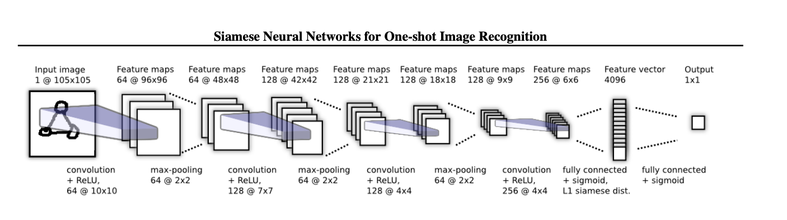

The figure above demonstrate Siamese architecture One-shot image recognition.

However, the architecture above is for used to classify the similarity between two iamges. For this project, the final layer that used to calculate the similarity between the two images will be remove. This project will use the Siamese model to extract feature vectors from the image using convolutional layers. The feature vectors will be used to train the binary classifier to classify the image (AD or NC).

The contrastive loss function will be used as criterion to distancing image that are not the same. Images with high similarity will be close to each other, while images with higher dissimilarity will be separated [1]. Formula for contrastive loss function is shown below.

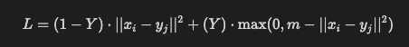

The overall architecture for siamese model of this project is as followed [2]:

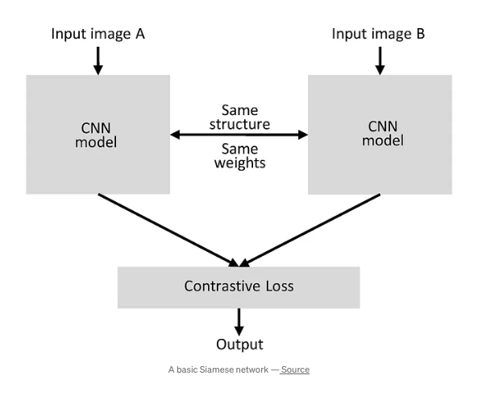

For the binary classifier, this project will use a simple multiple fully connected layer that convert 2048 feature vector into binary classifier. Note that the number of feature vector is 2048 instead of 4096. After some experiment, the result showed that 4096 might be too much for the classifier.

The architecture is as followed (primary source)

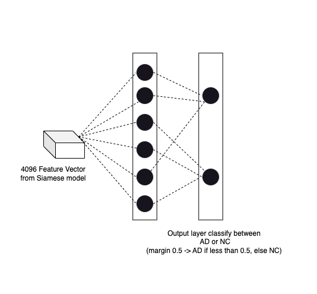

### 3.2. Implementation

**Data preprocessing**

There are three main features in data preprocessing:
1. Data splitting: The project splits the training dataset into 80% training data and 20% validation data. The splitting is done at patient level, that is, images with the same patient ID are not exist in both training and validation data sets.
2. Pair dataset: The Siamese model is well-known for its specialised training using image pair. Hence, the Pair custom dataset is processed in ```dataset.py```, allowing the model to train with a pair of images, where the label indicates whether the two images belong to the same class or not. Note that the model only takes in one image at a time, but the same model is used to apply training for two image, then those two outputs are passed through the contrastive loss.
3. Data augmentation: Data augmentation is done by randomly cropping the image down to 224 x 224 with 18 pixel reflect padding. Intially, the idea was to resize the image to 105 x 105 to follow the training approach outlined in the report. However, resizing the image from the original size of 240 x 256, can greately reduced the image quality and lowerws the accuracy. After some research, random cropping [3] was chosen instead of resizing. This prevents CNN from overfitting and increases the accuracy. When performing data augmentation on a small dataset, this can create more variation in the dataset, increasing the accuracy of the final model.

**Siamese model**

The siamese model follows the approach suggested by Koch, Zemel, and Salakhutdinov [1] with some slight modifications. For this project, the goal is to use the Siamese model to extract the feature vectors from the images. These feature vectors will then be given to the binary classifier to classify which class the image belongs to. Thereby, the model has similar structure for the first four convolution layers and return 2048 feature vector.

**Binary classification model**

Once the Siamese model is finished training, it is used to train the binary classifier to classify the class of the image. First, the image is passed through the Siamese to extract the feature vectors. The feature vectors are expected to distancing images that are not from the same class. The feature vector is then used by the classifer to classify the image. The classifier follow a multiple fuly connected layers for better classification, specifically, three fully connected layers.

**Hyper-parameter Tuning**

Hyper-parameters for Siamese model:
1. The number of epoch is set at 15 epochs. Some training showed that the Siamese model seemed to be overfitting after this point.
2. The criterion for the Siamese model is Contrastive Loss with a margin of 1.0. The bigger the margin, the less fine grained it will inspect for similarity between the two images. For bigger size data, it is more suitable for bigger margin. In addition, the Contrastive loss function was modified where the label is reverse. This help the Siamese model to distinguish between the two images with a clearer distance when the two images are not the same.
3. The optimizer is using Adam optimizer, which is known for working best with a wide variety of model with little tuning required and still achieve high accuracy. The learning rate is set at 0.0001 and betas was set to (0.5, 0.999) to prevent the risk of overfitting.

Hyper-parameter for Classifier model:
1. For the training of classifier model, the number of epoch is set at 20 epochs. Initially the number of epochs was set to 50, however, when changing the contrastive loss function, the classifier was able to pick up the difference between the classes better, so it began to overfit after 20 epochs, which led to greatly reduce in accuracy.
2. The criterion for the classifier is BCELoss. The reason for choosing BCELoss because this criterion is good for training binary classifier.
3. The optimizer is also using Adam optimizer, same reason as the Siamese model. The learning rate is 0.001.

## 4. Train and validate loss

**Siamese loss**

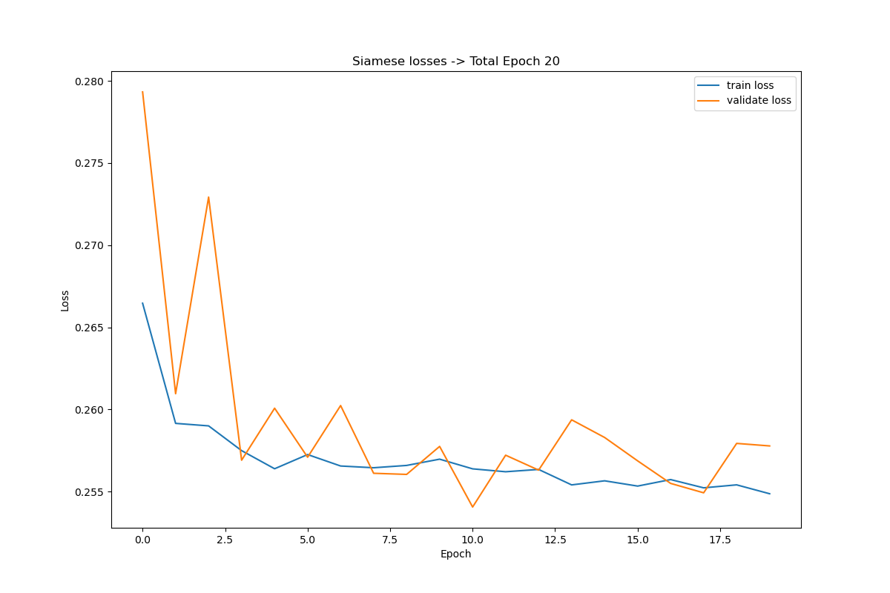

The Siamese training and validation loss showed signs of overfitting during the process. After 8 epochs of training, there is a significant gap between the training and validation loss, indicating overfitting of the data. The model will be saved at the epoch where the average validation loss is the lowest, and it will be used for training the binary classifier.

**Classifier loss**

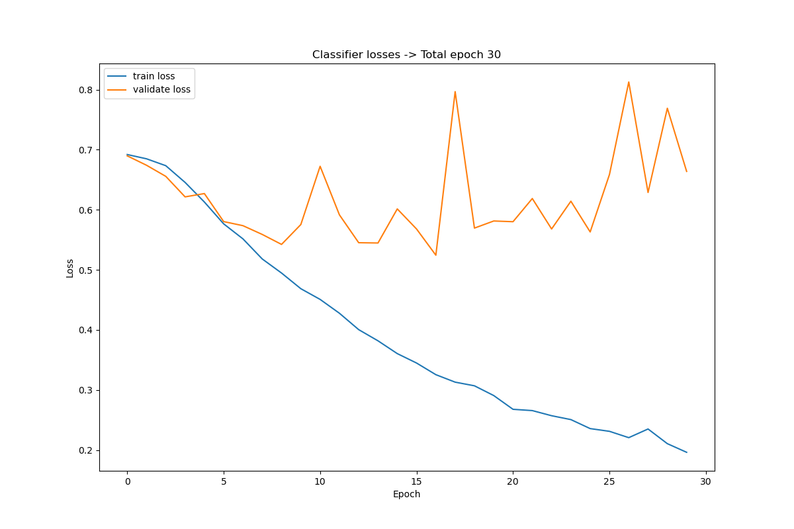

This is also showed in the classifier loss. After 2 epochs, the train loss becomes relatively close to zero, indicating that the model stops learning after only one epoch. For this project, the model will be saved at the point where the validation loss is the lowest and it will be used for testing. The model's parameters used for testing is at epoch 1.

**T-SNE plot showing the impact of Siamese model**

<div>
    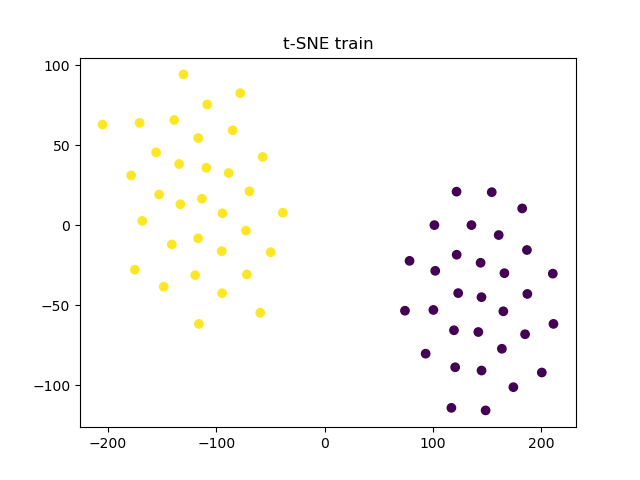
    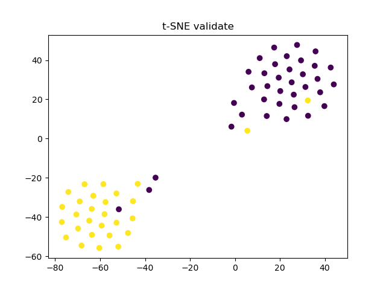
    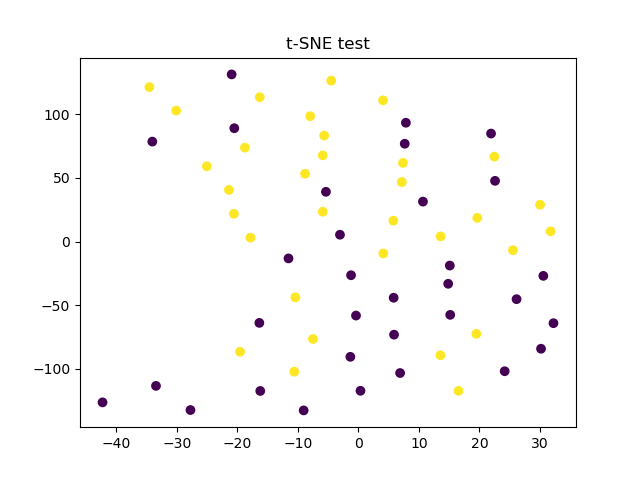
</div>

The t-SNE diagram shows that, when evaluating the Siamese model on validation and training sets, there are some clear differences between the two type of image (AD and NC), indicating that the Siamese model is doing it jo effectively. However, when evaluating the model on testing dataset, the difference between AD and NC classes are not that clear. This might be due to the fact that when training, there are some dataset, the Siamese model extract a high-quality feature vectors to distinguish between the two classes, in other cases, it does not perform as good.

**Accuracy plot between training data, validation data and testing data**

<div class="side-by-side">
  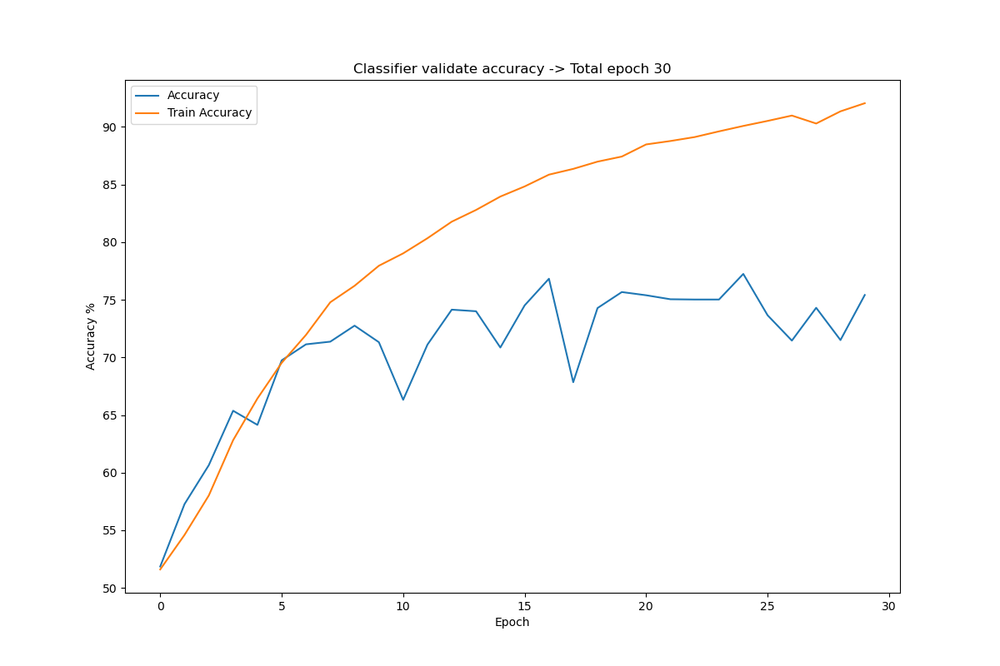

  The accuracy plot for the classifier on training data, validation data, and test data clearly shows that the model is overfitting. The training accuracy is 100%, but the validation accuracy is around 90% and test accuracy is fluctiates between 75%. This suggests that there is a sign of data leakage, possibly because both the training and validation data are subjected to the same data augmentation, which is random cropping. Meanwhile, the data augmentation for test data set is center crop. The reason for using center crop is to ensure consistency when testing.

</div>

<style>
  .side-by-side {
    display: flex;
  }

  .side-by-side img {
    margin-right: 15px;
  }
</style>

## 5. Result
### 5.1. What went wrong
Initially, this project used the file path for training dataset during the testing phase, resulting in a false accuracy of 82.65%. After correcting the path for the testing phase, the actual accuracy fell to 61.69%.

### 5.2. Tuning and final accuracy
New attempts at tuning the model are described in [Section 3.2](#32-implementation).

The output accuracy is 76.92%. However, based on the accuracy plot in [Section 4](#4-train-and-validate-loss), if the early stopping is applied and classifier parameters at epoch 18 are used for the final testing, the best accuracy achieved will be 77.48% (refers to result/test_out.txt line 514, look at classifier epoch 18). During the run, the parameters of the classifier at epoch 1 were used for training, and this is not the one that can produce the best accuracy, given that epoch 18 can achieved 77.48%. This is due to overfitting, but it could also be due to the one-shot Siamese architecture, where the classifier picks up the difference between the two images too early, leading to overfitting when the training is continued.

Overall, the best accuracy that this implementation can achieved is 77.48%.

### 5.3. Visualisation of predicted image

The following image shows the model's visual predictions for test dataset in comparison with the actual labels.

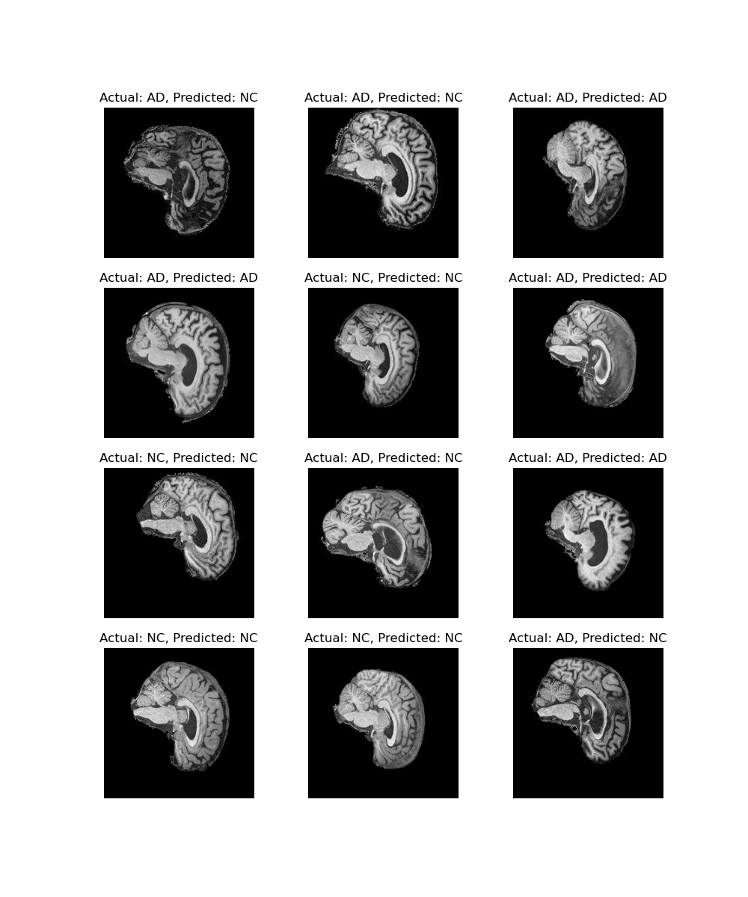

## 6. Reproducibility
This project is reproducible, given that it uses deterministic algorithms for the convolutional layer and sets the seed whenever a random variable is used (random.seed() or torch.manual_seed()).

### 6.1. Dependencies
The dependencies of this project is install using miniconda. Here is a [link](https://docs.conda.io/projects/miniconda/en/latest/miniconda-install.html) on how to install miniconda.

The following is the dependencies and version of the dependencies.

| Dependency   | Version     |
| ------------ | ----------- |
| python       | 3.8.17      |
| pytorch      | 2.0.1       |
| torchvision  | 0.15.2      |
| matplotlib   | 3.7.2       |
| numpy        | 1.24.3      |
| scikit-learn | 1.0.2       |

### 6.2. How to reproduce the result
Assuming all the relevant dependencies are installed.
Also, note that to reproduce the run, the path in ```utils.py``` need to match the path in the environment.

```python3 train.py```

When run ```python3 train.py```, it will first train the Siamese model. Then, when the Siamese model is finished training, it will use the Siamese model to train the classifier model by applying the image over the Siamese model to generate feature vector. Finally, it will print the test accuracy to the stdout. In addition, after finish running, it will save the Siamese and classifier models to the result folder (create the folder if it does not exist, or udpate the path in ```utils.py```). 

Note that in order to reduce the complexity of including multiple python script in ```slurm.sh```, the key feature from ```predict.py``` is include at the end of ```train.py```. This means, it is the same as running ```predict.py``` one the model is finish training.

```python3 predict.py```

If the program is successully run, and ```Siamese.pt and Classifier.pt``` exists, running ```predict.py``` will save a random batch of test data that the model predicted, along with the real class.

Note that, ```train.py``` is the main script.

## 7. Future improvement
Due to an unfortunate incident that misled the interpretation of the model's performance, the final accuracy is only around 77%. Future work will focus on tuning the parameters and applying mode data augmentation to increase the accuracy of the model. In addition, this project will explore ResNet-18 (CNN) as the as Siamese embedding layer to extract better feature vectors from the data.

### 7.1. Future implementation
For future implementations, Resnet-18 will be used as CNN for Siamese model, however, the initial attempt in developing the Siamese model using ResNet-18 is not very promising.

In an attempt to increase the prediction accuracy and prevent overfitting, ResNet-18 was used as the embedding layer for Siamese model. This is done by removing the last layer and replacing it with a fully connected layer to extract the feature vector. However, the Resnet-18 is a powerful mode, and without careful tuning, the model can overfit quite easily. The best accuracy achieved using ResNet-18 was around 50.4%. The following graph shows the loss function of the Siamese model using ResNet-18: 


Note that this is only a proposed approach to improve the accuracy of the Siamese model. It does not represent the best possible accuracy that can be achieved. Please refers to Section [Result](#5-result) for the best accuracy achieved in this project.

## 8. References
[1]	G. Koch, R. Zemel, and R. Salakhutdinov, "Siamese neural networks for one-shot image recognition," in ICML deep learning workshop, 2015, vol. 2, no. 1: Lille. 

[2] P. Singh, “Siamese Network Keras,” Medium, Aug. 27, 2019. https://medium.com/@prabhnoor0212/siamese-network-keras-31a3a8f37d04.

[3] R. Takahashi, T. Matsubara, and K. Uehara, "Data augmentation using random image cropping and patching for deep CNNs," IEEE Transactions on Circuits and Systems for Video Technology, vol. 30, no. 9, pp. 2917-2931, 2019.

***Code adaptation from external source is reference within the code comment***
