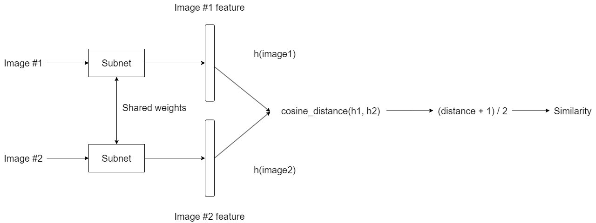
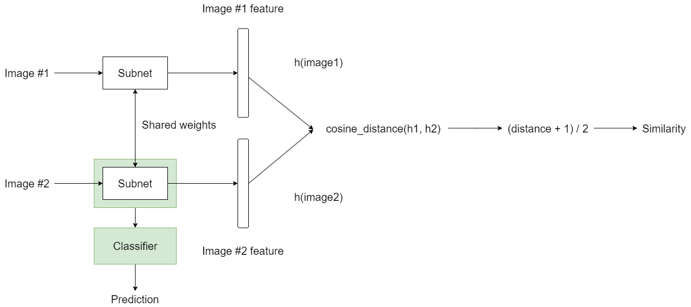
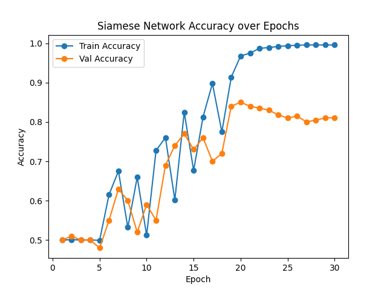
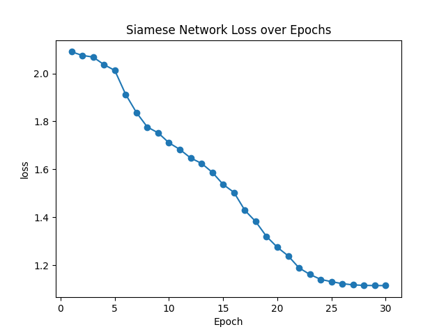
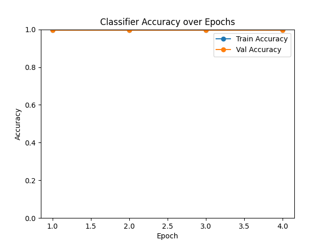
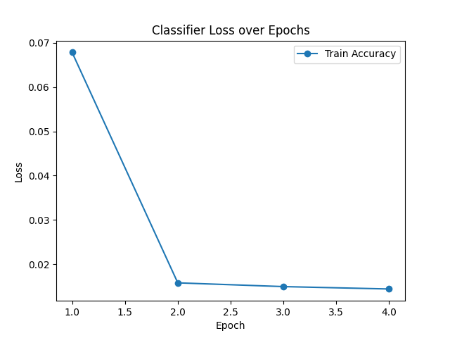

  # A Classifying the Alzheimer's Disease on the brain data set using Siamese Network

## Siamese Network

### Model
A Siamese Network is a unique neural network architecture used for comparing the similarity between two separate inputs. It's composed of twin subnetworks, which are identical and share the same parameters. These twins are connected at the top by a distance function, which calculates a metric that quantifies how similar or different the inputs are.

### Cosine Distance
Cosine distance is a measure used to gauge how similar two non-zero vectors are in a multi-dimensional space. It's computed as one minus the cosine of the angle between the vectors. This metric ranges from -1 to 1, where -1 indicates complete dissimilarity, 1 signifies total similarity, and 0 denotes orthogonality (no similarity). It's particularly useful because it can be directly interpreted as a degree of similarity — the closer the value is to 1, the more similar the vectors are.

This is in contrast to Euclidean distance, which calculates the straight-line distance between two points in space, potentially varying significantly across different scales and dimensions. This can make it difficult to set a consistent benchmark for similarity across diverse datasets. Cosine distance, by focusing on the angle between vectors, provides a more consistent measure of similarity, irrespective of the magnitude of the vectors.

### Triplet Loss
Triplet loss, a concept used in deep learning, measures the similarity between samples. It works with three elements, known as a "triplet": an anchor, a positive example, and a negative example. The anchor and positive example belong to the same class, while the negative example comes from a different class. The purpose is to bring the anchor and positive examples closer in the embedded space while pushing the negative example further away.

Siamese networks often employ Triplet Loss over Contrastive Loss as it captures relative distance information among an anchor, positive, and negative, leading to better discrimination and a more nuanced understanding of similarities and differences within the data. In terms of cosine distance, the triplet loss function adapts like so:

$loss=max(0, (1 - cosine_similarity_positive) + (1 + cosine_similarity_negative) - margin)$

- 1 - cosine_similarity_positive converts the similarity measure to a distance measure (the lower the similarity, the higher this distance).
- 1 + cosine_similarity_negative does the same but inversely (the lower the similarity, the higher this distance).

### Model Architecture

*The diagram above illustrates the architecture of my model, detailing how inputs progress through the network.*

### Classifier Architecture

*The classifier employs the subnetwork derived from the Siamese network, retaining the existing parameters while integrating an additional classification layer to enhance its functionality.*

## Data

### ADNI Data
I trained my model using the Alzheimer's Disease Neuroimaging Initiative (ADNI) dataset, a key resource in neuroscience. This rich dataset includes longitudinal neuroimaging, genetic, and clinical data, crucial for studying the progression of Alzheimer's disease. It encompasses various data types like MRI and PET scans, cognitive assessments, and more, spanning different stages of the disease, and is instrumental for research in early diagnosis and treatment advancements.

*Note: The ADNI dataset requires proper access permissions, which can be obtained [here](http://adni.loni.usc.edu/data-samples/access-data/).*

### Data preprocessing
For the triplet loss to function, it requires three types of data: an anchor, a positive sample (similar to the anchor), and a negative sample (different from the anchor). my approach involves iterating over each image in the dataset, randomly selecting positive and negative samples for each anchor image. This methodology is vital for training the model to discern subtle distinctions and similarities in the data.

During the training phase, I split the dataset (approximately 20,000 images) randomly: 50% for training and the other 50% for validation. This approach ensures the model learns effectively and its performance is assessed unbiasedly. Post-training, I evaluate the model's accuracy and reliability on a comprehensive test set to ascertain its real-world applicability.

### Label Example
- NC (Non-Conditioned, Label: 0)


- AD (Alzheimer's Disease, Label: 1)


*The images above represent examples of NC and AD conditions, respectively.*

## Result
### SNN



### Classifier



## Dependices
- python: 3.9.2
- torch: 2.0.1
- torchvision: 0.15.2

## Usage

### Install dependices
```bash
pip3 install torch torchvision torchaudio --index-url https://download.pytorch.org/whl/cu118
```
Before you start, make sure you have installed all the necessary dependencies.

### Training the Model
To train the model, use the following command format:
```bash
python train.py <model> --data_dir <train_data_path> --output_path <model_output_path> --siamese_model <the_siamese_model_path_use_to_train_classifier>
```
Parameter Descriptions:

- `model`: Specifies the type of model to train. Options are siamese or classifier.
- `--data_dir`: Path to the training data.
- `--output_path`: Path where the trained model will be saved.
- `--siamese_model`: Required only when the model is classifier, specifies the path to the siamese model used for training the classifier.

You can change training parameters like `batch size` and `epoch` inside train.py.

Example:
```bash
python train.py classifier --data_dir ./data/train --output_path ./models/classifier --siamese_model ./models/siamese
```

### Prediction
To make predictions with the trained model, use the following command format:
```bash
python predict.py <model> --data_dir <data_path> --model_path <the_model_need_to_evaluate>
```
Parameter Descriptions:

- `model`: The type of model used, should correspond with the model type chosen during the training phase.
- `--data_dir`: Path to the data to be used for predictions.
- `--model_path`: Path to the model that needs to be evaluated.

Example:
```bash
python predict.py classifier --data_dir ./data/test --model_path ./models/classifier
```

## Reference
- [14 PyTorch tutorial - How to create Siamese Networks and create a face recognition system](https://www.youtube.com/watch?v=9hLcBgnY7cs)

- [Measuring Similarity using Siamese Network](https://github.com/pytorch/examples/tree/main/siamese_network)

- [Triplet Loss: Intro, Implementation, Use Cases](https://v7labs.com/blog/triplet-loss)
