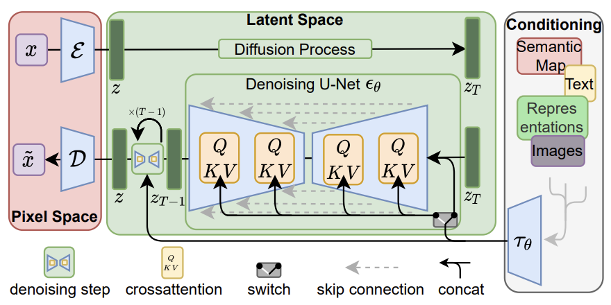
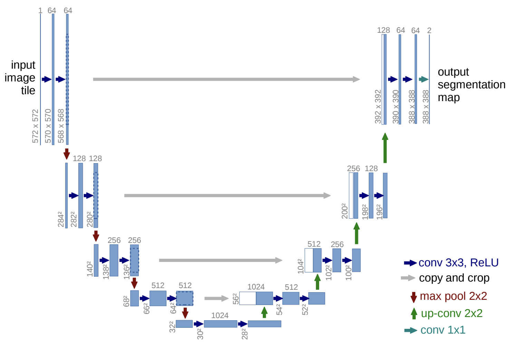
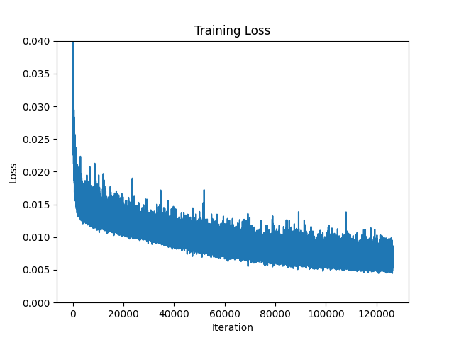
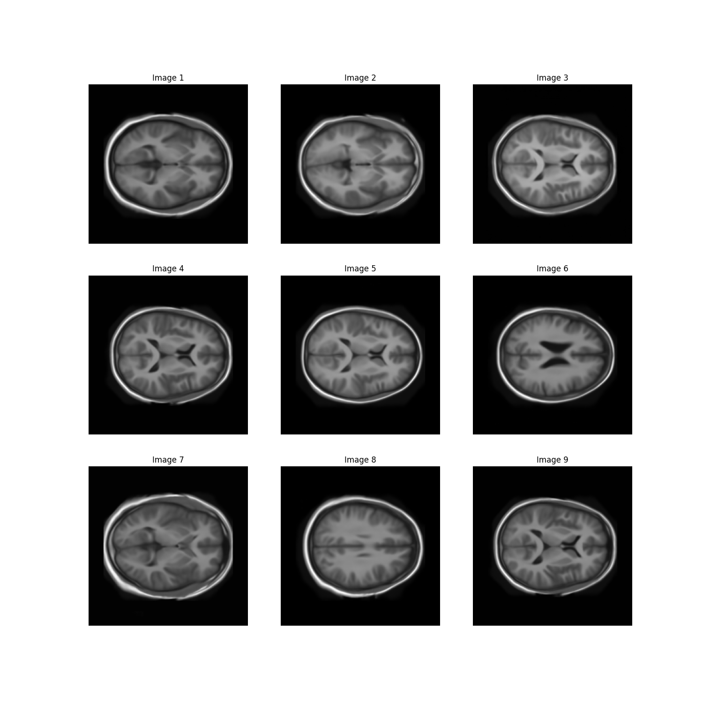

# Diffusion Model on the OASIS Brain Dataset

## Project Overview
In this project, a generative model based on the Diffusion algorithm has been developed using PyTorch to simulate the [OASIS Brain Dataset](https://www.oasis-brains.org/). The objective is to generate images of sufficiently high clarity that closely resemble the anatomical structures found in the original dataset.

<details open>
  <summary>Table of Contents</summary>

- [Dependencies](#dependencies)
- [File Structure](#file-structure)
- [Data Loading and Preprocessing](#data-loading-and-preprocessing)
- [Model Architecture](#model-architecture)
- [Training](#training)
- [Usage](#usage)
- [References](#references)

</details>

## Dependencies

```python
python - 3.11.4
pytorch - 2.0.1
torchvision - 0.15.2
matplotlib - 3.8.0
```

## File Structure
`imports.py` Imports necessary libraries and modules.

`dataset.py` Contains the class for data loading and a function for preprocessing.

`modules.py` Outlines the diffusion network's forward pass with encoder and decoder blocks composed of ResNet layers.

`train.py` Sets up the training algorithm for the diffusion model, including plotting training loss over iterations.

`predict.py` Defines the algorithm for reversing diffusion using a pre-trained model with visualisation.

`utils.py` Defines essential components for implementing both the forward and backward dynamics of a generative diffusion model.

`driver.py` Trains a Diffusion Network and performs image reconstruction algorithm.

## Data Loading and Preprocessing
In this project, the objective is to generate high-quality brain images that closely resemble those found in the OASIS brain dataset. To optimise the model's performance, both training and test datasets have been merged, thereby increasing the overall number of images available for training.

```python
train_data = ImageDataset(
    directory=train_dir, image_transforms=image_transforms)
test_data = ImageDataset(
    directory=test_dir, image_transforms=image_transforms)

# Combine training and test datasets into single dataset for training
combined_data = ConcatDataset([train_data, test_data])
```

Though numerical validation metrics were not a requirement, the architecture has been designed to accommodate future validation efforts. Metrics such as the Structural Similarity Index [(SSIM)](https://github.com/VainF/pytorch-msssim) or Fréchet Inception Distance [(FID)](https://github.com/mseitzer/pytorch-fid) could be integrated in subsequent development phases for more rigorous evaluation.

## Model Architecture
Diffusion models are a class of generative model aims to model  the underlying probability distribution of data—in this case, 2D images. The training procedure involves starting with actual data samples and transforming them into noise through a sequence of diffusion steps. The model learns to execute a series of denoising operations that can reverse this process, thereby generating new samples from the learned data distribution during inference.

The architecture of our model is inspired by the U-Net framework and consists of a series of encoder blocks and decoder blocks. Each of these blocks is constructed using ResNet units as the fundamental computational elements.



The architectural design of this project is informed by the research presented in the paper "High-Resolution Image Synthesis with Latent Diffusion Models" by Robin Rombach et al., accessible [here](https://arxiv.org/pdf/2112.10752.pdf). It should be noted that the conditional aspects of the model discussed in the paper are not implemented in this project, as the OASIS brain dataset does not contain conditional variables.

To incorporate temporal information into the model, we have integrated Sinusoidal Position Embeddings. This design choice is informed by the research presented in the paper "Denoising Diffusion Probabilistic Models" by Jonathan Ho et al., which can be accessed [here](https://arxiv.org/pdf/2006.11239.pdf). Some implementations are also referenced from Niels Rogge and Kashif Rasul's blog post, The Annotated Diffusion Model, on Hugging Face, available [here](https://huggingface.co/blog/annotated-diffusion).


#### Model Flow:
The architecture of the U-Net model implemented is inspired by the seminal work "U-Net: Convolutional Networks for Biomedical Image Segmentation" by Olaf Ronneberger et al.. The paper can be accessed through [here](https://arxiv.org/pdf/1505.04597.pdf).



1. **Encoding Path**: Four EncoderBlocks (`down1` to `down4`) progressively downsample the input while capturing spatial features. Intermediate `skip` outputs are stored.
   
2. **Bottleneck**: A standalone ResNet block (`bottle_neck`) serves as the bottleneck layer with a higher channel dimension.
   
3. **Decoding Path**: Four DecoderBlocks (`up1` to `up4`) upsample the bottleneck output, utilizing 'skip' outputs from the encoding path for feature fusion.
  
4. **Output Layer**: The final output is normalized with BatchNorm and passed through a 1x1 convolution to produce the model's output.

## Training
The Adam optimizer is selected as the optimization algorithm, and the loss function employed is the [smooth L1 loss](https://pytorch.org/docs/stable/generated/torch.nn.SmoothL1Loss.html), calculated between the true and predicted noise values.

```python
optimizer = optim.Adam(model.parameters(), lr=1e-3)
```

```python
loss = F.smooth_l1_loss(noise, predicted_noise)
```



## Usage
1. To configure the training, testing, and validation datasets, please modify the `process_dataset` function in the `dataset.py` file. To verify that the data is loaded correctly, modify the corresponding directories under the `if __name__ == '__main__':` section and execute the script.

```python
# configure datasets
def process_dataset(batch_size=8, is_validation=False,
                    train_dir="WRITE ME", # directory for training set
                    test_dir="WRITE ME", # directory for test set
                    val_dir="WRITE ME"): # directory for validation set
```

```python
# verify data loading
if __name__ == '__main__':
    image_dir = os.path.expanduser('WRITE ME') # directory for input images
    save_dir = os.path.expanduser('WRITE ME')  # directory for saved images
```

2. Specify the target directory for storing the plotted training loss and generated images by modifying the appropriate variables in `driver.py`.

```python
save_plot_path = os.path.expanduser("WRITE ME") # directory for saved plots
save_image_path = os.path.expanduser("WRITE ME") # directory for saved images
```

3. Execute the `driver.py` script to train the model and generate synthetic brain images. You can customise the training process by adjusting parameters such as `epochs` and `batch_size`.

```python
EPOCHS = 100 # Set the training epochs
BATCH_SIZE = 16 # Set the training batch size
```

The following sample output was generated after training the model for 100 epochs on the OASIS Brain dataset. The reasonable clarity and fidelity of these images demonstrates model's performance capabilities.



Going forward, the future work entails quantitatively evaluate the quality of generated images and visualise the image generation process via GIFs.

## References
- [OASIS Brain Dataset](https://www.oasis-brains.org/)
- [SSIM](https://github.com/VainF/pytorch-msssim)
- [FID](https://github.com/mseitzer/pytorch-fid)
- [High-Resolution Image Synthesis with Latent Diffusion Models](https://arxiv.org/pdf/2112.10752.pdf)
- [Denoising Diffusion Probabilistic Model](https://arxiv.org/pdf/2006.11239.pdf)
- [The Annotated Diffusion Model](https://huggingface.co/blog/annotated-diffusion)
- [U-Net: Convolutional Networks for Biomedical Image Segmentation](https://arxiv.org/pdf/1505.04597.pdf)
- [Smooth L1 loss](https://pytorch.org/docs/stable/generated/torch.nn.SmoothL1Loss.html)
