# Overview
StyleGAN2's application in brain image generation is driven by the need for realistic and versatile synthetic brain scans in medical and research contexts. Its primary purpose is to provide a powerful tool for creating diverse and customizable brain images. By offering fine-grained control and reducing privacy concerns, StyleGAN2 not only accelerates research and aids in the development of diagnostic tools by helping understand the variability and anomility in the scans, but also addresses data scarcity issues, ultimately benefiting the field of neuroscience and medical imaging.

    This project leverages StyleGAN2 to generate synthetic MRI scan images that closely resemble authentic ones. The model is trained on the subset of the OASIS brain dataset.

<div style="display: flex; justify-content: space-between;">
  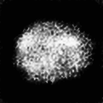
  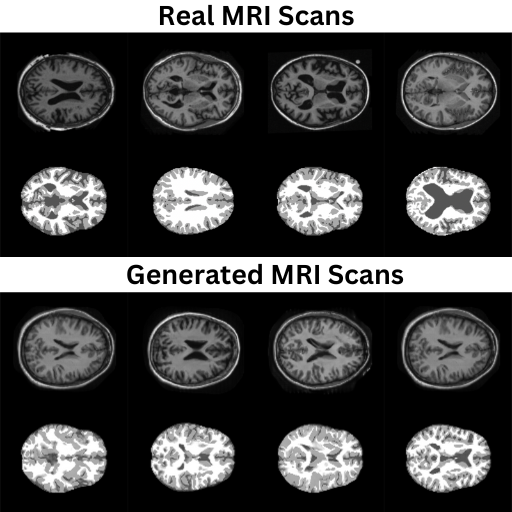
</div>


## Table of Contents
- [Installation](#Installation)
- [Requirements](#Requirements)
- [Usage](#Usage)
- [Dataset](#Dataset)
- [Dataset Augmentation](#Dataset-Augmentation)
- [File Structure](#File-Structure)
- [StyleGAN](#Stylegan)
- [StyleGAN2](#Stylegan2)
- [Model Architecture](#Model-Architecture)
- [Training configs](#Training-configs)
- [Results](#Results)
- [Conclusion](#Conclusion)
- [References](#References)

## Installation
1. Download [OASIS dataset](https://www.oasis-brains.org)
2. Set the path of the dataset folder in [config.py](config.py) 
3. Ensure you have all the neccessary [dependencies](#Dependencies) installed.

## Requirements
- Both Linux and Windows are supported, Linux is recommended due to its performance and compatitibity.
- 64-bit Python 3.10 or later installation. Anaconda3 is recommended due to its intra-library compatibility installation.
- Additional libaries include -

    | |  Libaries         | | | |Version           | |
    |-|-----------------  |-|-|-|------------------|-|
    | |  pytorch          | | | |2.0.1             | |
    | |  torchvision      | | | |0.15.2            | |
    | |  pytorch-cuda     | | | |11.8              | |
    | |  cudatoolkit      | | | |10.1              | |
    | |  numpy            | | | |1.22.3            | |
    | |  matplotlib       | | | |3.7.2             | |
    | |  tqdm             | | | |4.66.1            | |

    Note: Libaries may use newer version. If using conda, install pytorch, torchvision and cuda [together](https://pytorch.org).
- An NVIDIA GPU is required. For high dimension picture generation, higher GPU may be required. The training was performed on NVIDIA A100 40GB vGPU with 128GB of DRAM.

## Usage

Single usage as shown below (does not support cmd args parsing). Refer to [config.py](config.py) for resetting parameters. \
The network is trained from scratch, the generator and discriminator loss is printed on each iteration.
```
> python train.py

Python 3.10.13
Device:  cuda

  0%|          | 0/708 [00:00<?, ?it/s]
  0%|          | 0/708 [00:01<?, ?it/s, gp=0.978, loss_critic=9.94]
  0%|          | 1/708 [00:01<22:40,  1.92s/it, gp=0.978, loss_critic=9.94]
  0%|          | 1/708 [00:02<22:40,  1.92s/it, gp=0.972, loss_critic=9.05]
  0%|          | 2/708 [00:02<12:18,  1.05s/it, gp=0.972, loss_critic=9.05]
  0%|          | 2/708 [00:02<12:18,  1.05s/it, gp=0.957, loss_critic=8.4] 
  0%|          | 3/708 [00:02<08:59,  1.31it/s, gp=0.957, loss_critic=8.4]
  0%|          | 3/708 [00:03<08:59,  1.31it/s, gp=0.948, loss_critic=7.72]
  1%|          | 4/708 [00:03<07:25,  1.58it/s, gp=0.948, loss_critic=7.72]
  1%|          | 4/708 [00:03<07:25,  1.58it/s, gp=0.925, loss_critic=6.83]
  1%|          | 5/708 [00:03<06:33,  1.79it/s, gp=0.925, loss_critic=6.83]
  1%|          | 5/708 [00:04<06:33,  1.79it/s, gp=0.899, loss_critic=5.85]
  1%|          | 6/708 [00:04<06:01,  1.94it/s, gp=0.899, loss_critic=5.85]
  1%|          | 6/708 [00:04<06:01,  1.94it/s, gp=0.861, loss_critic=4.78]
```
The figures are saved on every _ epoch as set in config.py \
Plot for the generator and discriminator loss over all iterations are saved at the end of training.

## Dataset
The OASIS datasets hosted by central.xnat.org provides open access to a significant database of neuroimaging and processed imaging data across a broad demographic, cognitive, and genetic spectrum for use in neuroimaging, clinical, and cognitive research on normal aging and cognitive decline.  
The subset of OASIS dataset used for this project uses T1-weighted MRI scans. \
The dataset specification can be found below.

| |  Attributes       | | | | Values           | |
|-|-----------------  |-|-|-|------------------|-|
| |  Individuals      | | | | 1,298            | |
| |  Total images     | | | | 22,662           | |
| |  Image size       | | | | 256x256          | |
| |  Image color      | | | | Grayscale        | |

All data is available via [OASIS-BRAINS](www.oasis-brains.org).

Few images from the dataset is shown below.

<div style="text-align:center">
    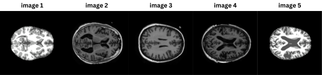
    <p style="text-align: center;">Images from dataset</p>
</div>

## Data Augmentation

**Resize**: The imported images were resized to lower resolution (128x128) for faster computation. \
**RandomVerticalFlip**: The images were flipped vertically randomly at 50% probability to introduce variabiliity in data. \
**Normalise**: Images were normalised with mean 0.5 and standard deviation of 0.5 for each channels. \
**Grayscale**: Since the default import for img dataset is 3 channels, when using 1 channel the images are transformed to grayscale. \

Few examples of images after augmentation is shown in the figure below.

<div style="text-align:center">
    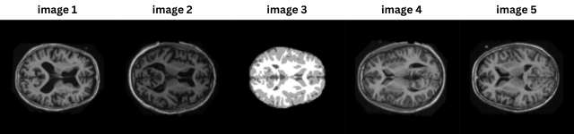
    <p style="text-align: center;">Images after augmenting dataset</p>
</div>

## File Structure
The folder comprises of 5 files.

[config.py](config.py): Comprises of all the hyperparameters and predefined settings for the model training. \
[dataset.py](dataset.py): Reads data, augments and load the datasets to tensors. \
[modules.py](modules.py): Creates a mapping network for the latent space. Implements the Generator and the Discriminator. And their subsequent layers. \
[utils.py](utils.py): Helper functions for the generator, calculating path length penalty and for generating images. \
[predict.py](predict.py): Generates the fake image from the learning / leant generator. generates plots for the loss values over all iterations.

## StyleGAN
StyleGAN, short for Style Generative Adversarial Network, is a state-of-the-art generative model used for creating high-quality synthetic images. It was first introduced by the engineers at NVIDIA in 2008. It revolutionized the field of generative adversarial networks (GANs) with its ability to generate highly realistic and diverse images. The main characteristic of StyleGAN lies in its ability to control the style and appearance of generated images, offering fine-grained manipulation of visual elements such as facial features, background scenery, and more. It does so by introducing a concept of "style," using a progressive growing approach, and utilizing a high-dimensional latent space to produce images that can seamlessly interpolate between various visual attributes. Additionally, StyleGAN incorporates noise inputs, a discriminator network to assess image authenticity, and a unique architecture that progressively increases image resolution for better results.

## StyleGAN2

StyleGAN2 introduced several improvements, including a two-part generator architecture consisting of a mapping network and a synthesis network, which allows for better control over the style of generated images. It also introduced the concept of "minibatch standard deviation" to encourage image diversity during training, leading to more realistic and varied outputs. Another significant enhancement was the equalized learning rate, which provided better training stability and balanced contributions from different layers of the network. StyleGAN2 offered improved performance, higher image quality, and greater control over the generated content, making it a go-to choice for a wide range of applications, including art, image manipulation, and data augmentation. These advancements established StyleGAN2 as a cutting-edge solution for high-quality image synthesis.

## Model Architecture

<div style="text-align:center">
    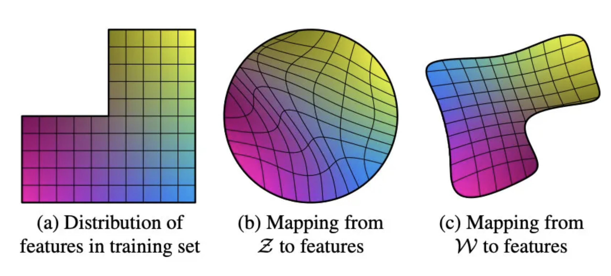
    <p style="text-align: center;">Maniform mapping</p>
</div>

**1. Mapping Network:** 
Initialized using z_dim (latent space) and w_dim (style vector) as parameters, the mapping network consists of eight EqualizedLinear layer, that equalizes the learning rate, with ReLU as their activation function.
Latent space dimension is initialized using pixel norm.

**2. Latent Space:** StyleGAN operates in a high-dimensional latent space, where each point in the space corresponds to a unique image. The generator network maps points in this latent space to images, allowing for smooth interpolation between different images by interpolating between points in the latent space.

<div style="text-align:center">
    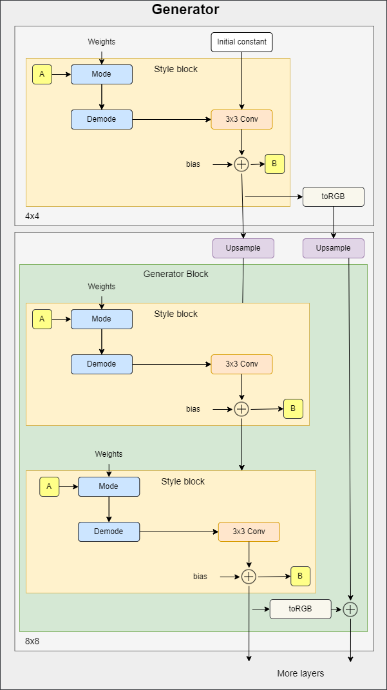
    <p style="text-align: center;">Generator's architecture</p>
</div>

**3. Generator Network:** The generator network is responsible for creating synthetic images. It takes a random noise vector as input and produces an image as output. StyleGAN uses a progressive growing approach, where the generator consists of multiple layers that increase in resolution gradually. Each layer uses a convolutional neural network (CNN) architecture to transform the input noise into an image.

<div style="text-align:center">
    
    <p style="text-align: center;">Discriminator's architecture</p>
</div>

**4. Discriminator Network:** The discriminator network is used to distinguish between real and generated images. It is also a CNN, and its role is to assess the authenticity of the images produced by the generator. The discriminator is trained to minimize the distinguishability of generated images from real ones.

**5. Style Mapping Network:** StyleGAN introduces the concept of "style" into the generative process. It uses a separate style mapping network to map the latent code to a set of style vectors. These style vectors control various aspects of the generated image, such as the features and appearance.

**6. Noise Inputs:** StyleGAN also incorporates noise inputs at various layers of the generator network. This noise adds stochastic variations to the images and contributes to their diversity and realism.

**7. Augmented Convolution:** StyleGAN2 introduces an augmented convolution operation in the discriminator. This involves applying convolution with a dynamic filter that depends on the input, allowing the discriminator to adapt its receptive field based on the characteristics of the input.

**8. Progressive Growing:** StyleGAN uses a progressive growing technique, where the generator and discriminator networks start with low-resolution images and gradually increase the resolution as training progresses. This approach helps in generating high-quality images with fine details.
Mapping Network and Synthesis Network: StyleGANv2 introduced a two-part generator architecture, consisting of a mapping network that converts the latent code into style vectors and a synthesis network that generates the image. This separation of concerns allows for better control over the style of generated images.

**9. Equalized Learning Rate:** StyleGAN often employs an equalized learning rate for different layers of the network. This helps in training stability and ensures that the contributions of different layers are balanced.

**10. Weight Demodulation:** Weight demodulation is used in the generator to adjust the convolutional filter weights based on the magnitude of the style vectors. This helps the model adapt to the scale of different features in the image.

**11. Minibatch Standard Deviation:** To encourage diversity in generated images, StyleGANv2 introduced the concept of minibatch standard deviation, which measures the diversity of feature statistics across a minibatch of images during training.
These components work together to create a generative model capable of producing high-quality, diverse, and realistic synthetic images. StyleGAN has been widely used in various applications, including art generation, image editing, and data augmentation.

**12. Path Length Regularization:** Path Length Regularization is a regularization technique used during training to encourage more predictable and stable learning. It minimizes the length of feature vectors in the latent space.

## Training configs

The model was trained using different parameters for first 1-20 epochs to assess the convergence and evaluate the generator's performance.

### 1. Interpolation Mode

The model was trained for 1 epoch using Linear interpolation during upscaling vs Bilinear interpolation.
<div style="text-align:center">
    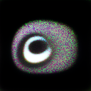
    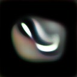
    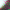
    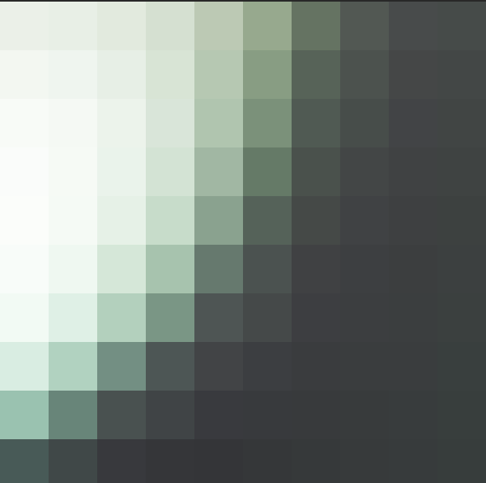
    <p style="text-align: center:">From left -  Linear Interpolation, Bilinear interpolation, crop zoom of 10x10px of both respectively</p>
</div>

The image displayed above demonstrates that when upscaled, **the bicubic interpolation produces smoother edges compared to bilinear interpolation**. Given the inherently curved nature of MRI scans, bicubic interpolation was selected.

Note: the crop zoom of images shown in above fig uses interpolation when upscaled on markdown. Check out the files [bilinear crop](bilinear_crop.png) and [bicubic crop](bicubic_crop.png) for actual difference.

### 2. Learning Rate

The model was trained for 15 epoch using learning rate of 0.01
<div style="text-align:center">
    
    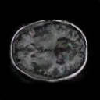
    <p style="text-align: center;">Image generated using lr=0.01 (left) and lr=0.001</p>
</div>

The generator produces a black image. Using high learning can result in overshooting optimal points, as styling requires fine tuning when traversing latent space.

**The learing rate of 0.001 was selected**. Smaller learning rate resulted in better convergence.

### 3. 3 channels vs 1 channel

The model was trained using 3 channels vs 1 channels. This was configured by transforming the imported img to grayscale. Although the images are already grayscale, during import the images default to 3 channel.

<div style="text-align:center">
    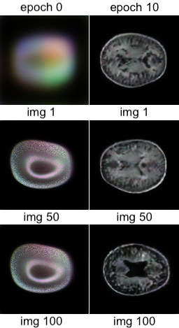
    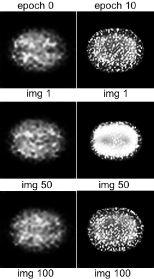
    <p style="text-align: center;">Image generated using channels=3 (left) and channel=1</p>
</div>
<div style="text-align:center">
    
    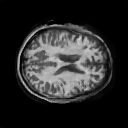
    <p style="text-align: center;">Image generated using channels=3 (left) and channel=1 at 50 epoch</p>
</div>

Using 3 channels for grayscale images converge faster than using a single channel. This may be due to conv2d kernel generating more features resulting in quicker improvement in generated image quality. This however increases the number of tensor multiplication thereby increasing the iterations per second from 2.75 it/s for 1 channel to 3.55 it/s for 3 channel.

Since this project implements single GPU implementation, **a single channel was selected to priortise computation speed**.

### 4. Batch size, Latent space dimension, style vector dimension, and raw input and output resolution

 Model was trained on different Latent space dimension, style vector dimension, and image resolution. Image generated from each model for small epochs are shown below.

<div style="text-align:center">
    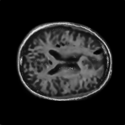
    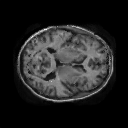
    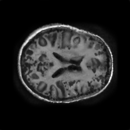
    <p style="text-align: center;">Image generated using 256x256px resolution (left), 512x512 vector space for latent and style vector (center) and both combined at 15, 15 and 45 epochs respectively</p>
</div>

Using higher resolution for image vector produces better result than increasing the dimensional complexity of latent and style vectors. These settings were set low (img res = 128x128px) (z_dim & w_dim to 256) to prioritise the computational speed.

## Results

<div style="text-align:center">
    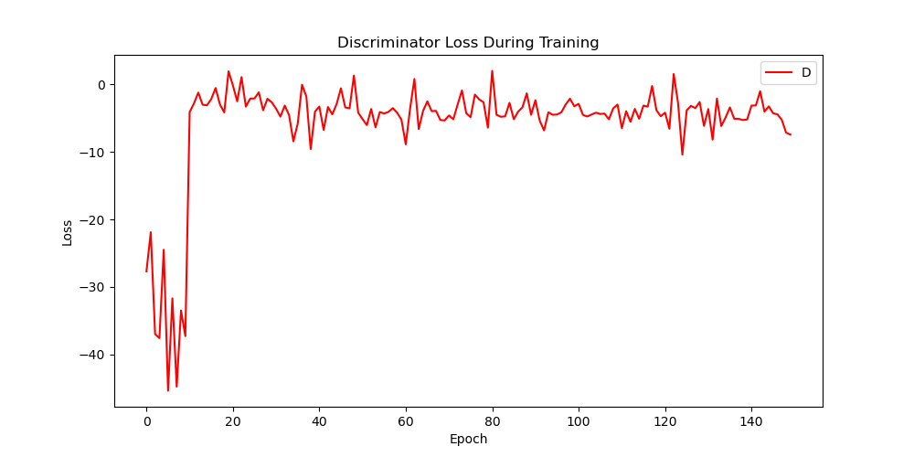
    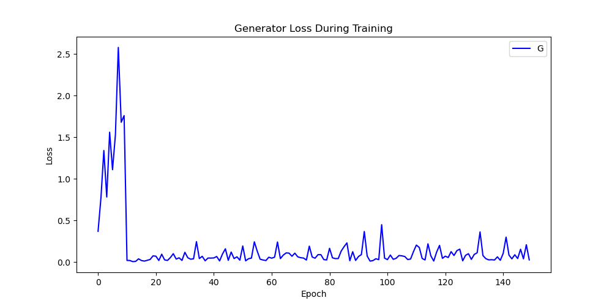
    <p style="text-align: center;">loss over iteration for Discriminator (left) and Generator over epoch</p>
</div>
The Generator and Discriminator's loss can be observed from the plot above.

<div style="text-align:center">
    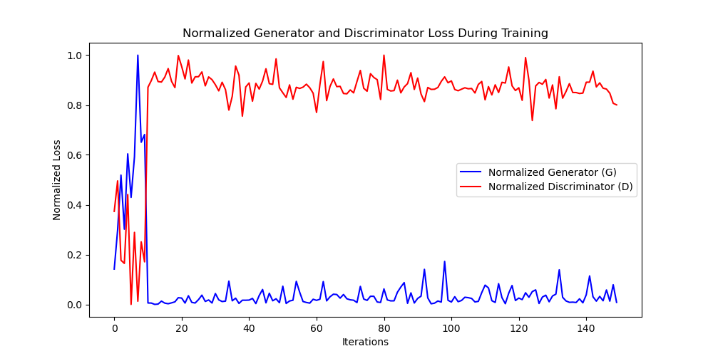
    <p style="text-align: center;"> Normalized loss values over epochs</p>
</div>

The plot for loss vs iterations shows expected learning where both Generator and Discriminator engages in the zero-sum game. The Discriminator get progressively worse at distinguising the fake image from real, And the Generator progressively get better at producing better image. 
This could perhaps be illustrated better with a combined plot with normalised values as shown above.

<div style="text-align:center">
    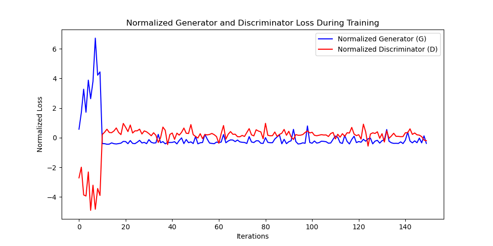
    <p style="text-align: center;">Standardized loss values over epochs</p>
</div>

By standardising the loss values and plotting the graph (above) we can see the model convergence acceptably by 50th epoch. After which the generator fine tunes the model and the improvement in the generated images are minimal.

<div style="text-align:center">
    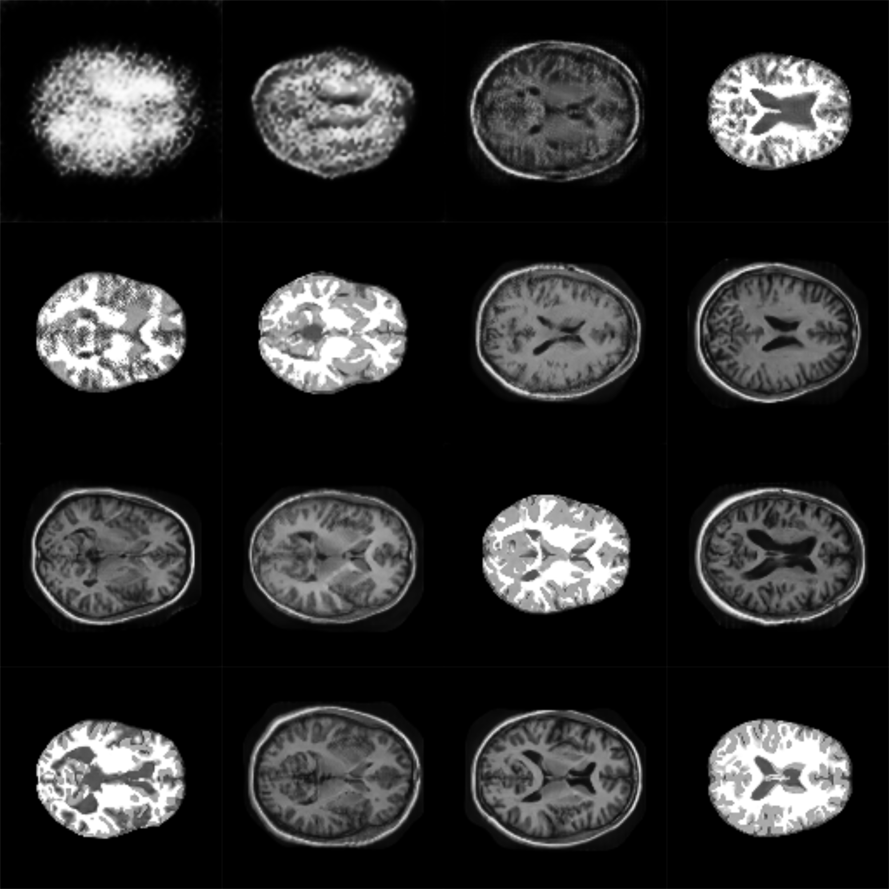
    <p style="text-align: center;"> Generated images arranged in 8x8 grid configuration with epoch interval of 10</p>
</div>

Overall, Using StyleGAN2 we are able to produce resonably good images from just the 50th epoch and realistic looking images at 150 epoch.

## Conclusion

The StyleGAN2 model employed in this study effectively generated realistic brain images by leveraging preprocessing techniques and StyleGAN2's distinctive style vector. The findings indicated that, after approximately 60 epochs, the model improvement became very minimal and almost neglible after 100 epochs. Further enhancements to the generated images could be achieved through the utilization of a larger dataset, employing the full resolution for the image tensor, and increasing the latent vector and style dimension using multi-GPU distributed processing.

## References

The source code was inspired from the following GitHub repo, and papers.

Elilah TAUIL, A 2023, Implementation StyleGAN2 from scratch, Paperspace Blog, viewed 18 November 2023, <https://blog.paperspace.com/implementation-stylegan2-from-scratch/>.

Hui, J 2020, GAN — StyleGAN & StyleGAN2, Medium, viewed 18 November 2023, <https://jonathan-hui.medium.com/gan-stylegan-stylegan2-479bdf256299>.

Karras, T, Laine, S & Aila, T 2018, A Style-Based Generator Architecture for Generative Adversarial Networks, arXiv.org.

Karras, T, Laine, S, Aittala, M, Hellsten, J, Lehtinen, J & Aila, T 2020, ‘Analyzing and Improving the Image Quality of StyleGAN’, arXiv:1912.04958 [cs, eess, stat].

NVIDIA 2023, NVlabs/stylegan2-ada-pytorch, GitHub, viewed 18 November 2023, <https://github.com/NVlabs/stylegan2-ada-pytorch/tree/main>.