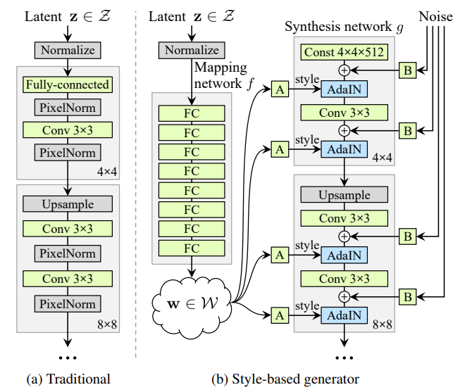

# StyleGAN for the OASIS Brain data set

Pattern recognition using a PyTorch style generative adverserial network (GAN) that is part of the COMP3710 repository. This particular implementation looks to create a generative model of the OASIS brain dataset using a variant of StyleGAN that has a "reasonably clear image".

## Motivation of synthesis with StyleGAN

A StyleGAN is used for synthesis. By learning the probability distribution to some underlying data (images in this case), it is possible to synthesis new images following the learnt distribution. There are a number of motivating reasons why a StyleGAN would be used:
- **Image synthesis** As mentioned, images can be generated from the learnt underlying distribution for artistic and entertainment purposes
- **Augmentation** When limited data are available for training, data augmentation techniques expand the available training data through image variations such as rotation, shear, and colour perturbations. StyleGAN permits a richer form of augmentation by generating brand new variations rather than limited transforms of existing data
- **Content creation** Synthesis can be used to generate new content for media, such as gaming, social media, or even movies (background generation for example)
- **Annonymity** As a result of the synthesis, new samples produced are different from the training data. This permits datasets to be generated that hide the identity of the training data, such as annonymity through face synthesis

## StyleGAN Algorithm

A traditional GAN generates images directly from the latent z. While the introduction of this technique produced impressive results, it reaches limitations due to artifacts in the output as a results of its inability to control image features. StyleGAN addresses this by learning a manifold of z via the fully connected Mapping network (see image below). The output of the Mapping network represents the style weights that feed into each synthesis layer of the GAN. Amazingly, the GAN input is no longer random, but rather a constant 4x4 image. Each synthesis block is similar to a traditional GAN, except for two important features, namely adaptive instance normalisation and noise injection. 

Adaptive instance normalisation, known as AdaIN, normalises each batch image, then scales and shifts (bias) each image by the styling weights produced by the Mapping network. Additionally, a noise injection occurs prior to AdaIN to promote variation. The consequence of applying AdaIN and noise injection is that over the full depth of the synthesis network, each layer focuses on different aspects of the generation process. Earlier layers focus on shape and composition, while later layers focus on finer details such as texture.  

## How It Works

_Describe how my particlar implementation works_

_Provide example inputs, outputs and plots of your algorithm_

## Reproducibility of Results

_Referenced libraries and their versions_

_Results of multiple runs, including run times_

## Preprocessing

The OASIS training dataset was used, which has 10,000 RGB images of size 256x256. Each synthesis layer requires training data for a particular size. Therefore, preprocessing included downsampling to the required size for each layer's training as well as the usual normalisation across the RGB channels.

## Versioning and Dependencies

PyTorch and CUDA for version 2.0.1 is required.

Torchvision version 0.15.2 was used.

## Loss Plots

## References
_T. Karras, S. Laine, and T. Aila, “A Style-Based Generator Architecture for Generative Adversarial
Networks,” arXiv:1812.04948 [cs, stat], Mar. 2019, arXiv: 1812.04948. [Online]. Available: http:
//arxiv.org/abs/1812.04948_