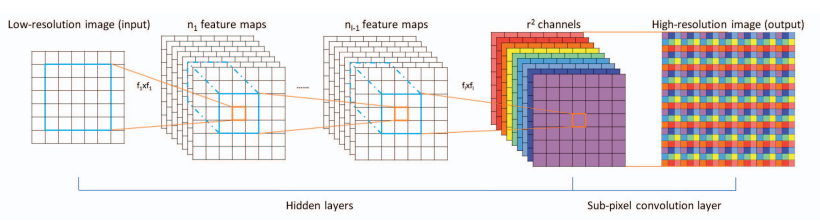
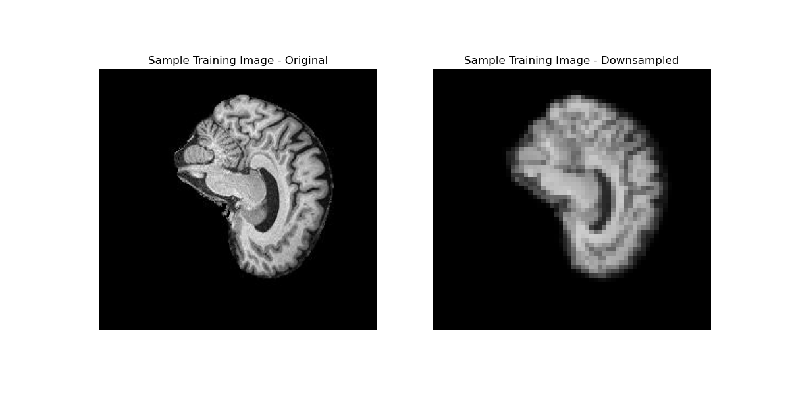
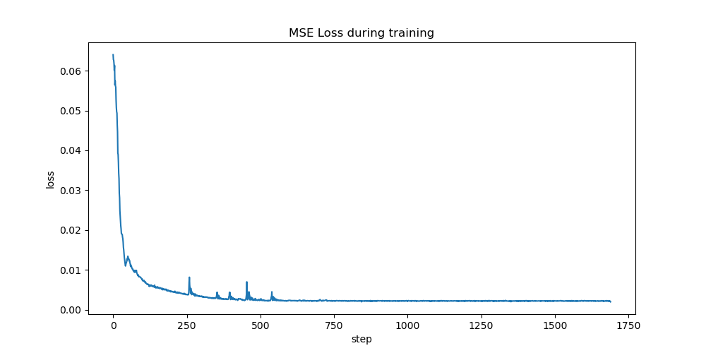
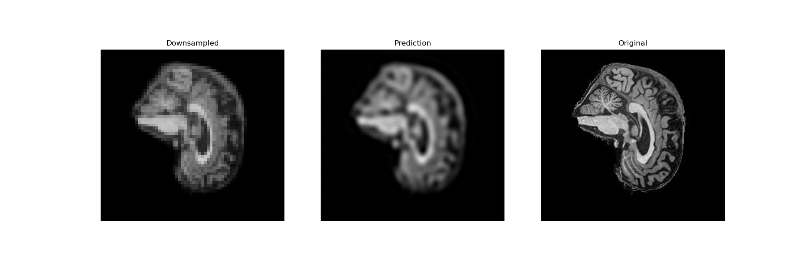
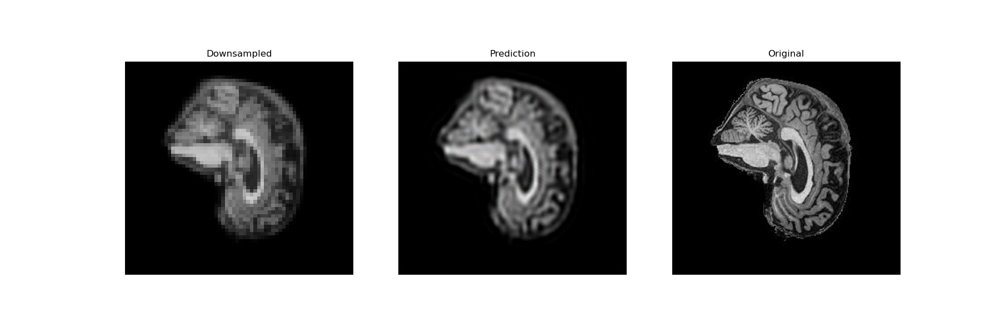
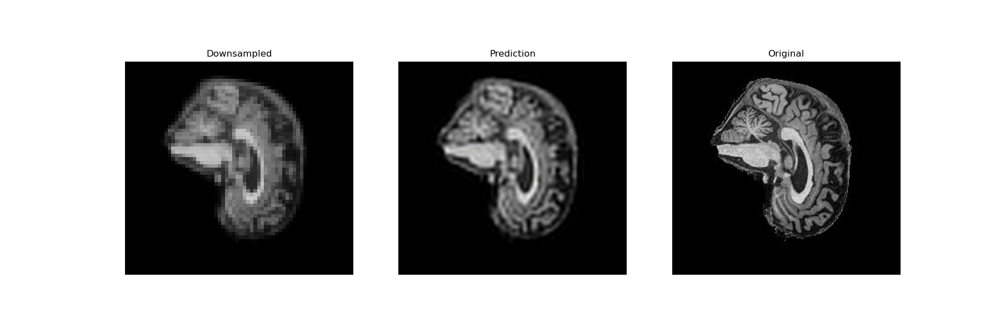
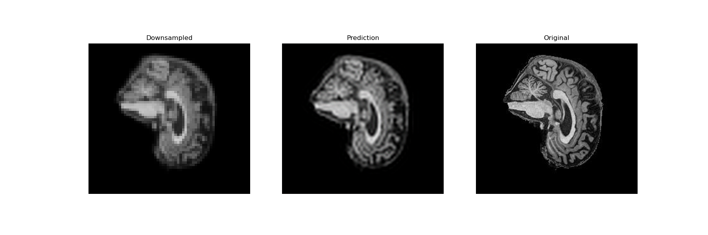

<h1>Efficient Sub-Pixel CNN for Super Resolution of MRI images</h1>

<h3>Mikhail Matveev - s4696671</h3>
 

<h2>Instructions</h2>

To train the model, run train.py. This will generate a loss plot in losses.png, a sample input image in sample_input.png, and a model.pth file which contains the state dictionary of the trained model. Note -- please ensure that you have the ADNI dataset [2] and it is placed within the root directory, or that you have modified the dataroot variable in dataset.py to point to where you have the data stored. 

predict.py contains a sample usage of the model where it loads an image from the test set, downscales it, passes it through the model, and saves a side by side comparison image. Note -- model.pth needs to exist in the directory for predict.py to function.

<h2>Report Purpose</h2>

Contained in this repository is a implementation of the the Efficient Sub-Pixel CNN from [1] in python using Meta's open source PyTorch library, and an application of it to the ADNI dataset to learn a network to upscale low-resolution MRI images by a factor of 4.

<h2>Model</h2>

The Efficient Sub-Pixel Convolutional Neural Network is a network which makes use of a convolutional sub-pixel layer to efficiently upscale images by increasing their resolution. Originally, this model was described in [1].

The model architecture that was used for this report was taken from this paper, with some slight modifications that improved model performance. From the paper, this architecture is visualised as the following:

[1]

Which contains several activated convolutional layers in sequence followed by a single "sub-pixel" convolutional layer, which constructs the high resolution image. The way that this works is by taking a low-resolution input and passing it through the sequence of convolutional layers, which ends up with r2 channels. Here, r is the upscaling factor of the model. These channels are then rearranged by the sub-pixel layer into the high resolution image, which is the model output.

In my implementation of this architecture I have chosen to use 6 convolutional layers, with most of them learning 128 channels. The first convolutional layer has a kernel size of 5 as was used in the paper, and all following kernel sizes were 3 (also as in the paper).
I chose the amount of convolutional layers and their channel amounts based on experimental model performance. Additionally, I chose to activate every convolutional layer except for the last with the Tanh activation function, as that was the activation function that was used in the paper. The sub-pixel layer is also the same as in the paper, except that in PyTorch this operation is called 'pixel_shuffle'.

<h2>Training</h2>

<h3>Data Preprocessing</h3>

The ADNI dataset is split into two sections, training and testing. Additionally, inside both of these sections there are two other sections, AD and NC. AD means Alzheimer's disease, and NC means Normal Cognitive. Since this report is not aiming to classify these MRI images, both of these classes from the training set were used to train the network. Both of the classes from the test set were used to evaluate the model's performance.

The only data preprocessing that was done was to apply random horizontal and vertical flips to the data, to hopefully reduce the chance of model overfit. Dataloaders were created for both the training and test data, using a batch size of 128 samples.

<h3>Training Loop</h3>

The training loop consists of getting a batch of high-resolution images from the train loader, downscaling them, passing them through the model and comparing the result to the original image using pixel-wise MSE to evaluate the result and improve the model.

Since the input images have a resolution of 256*240 pixels, when downscaled by a factor of 4 they would have a resultant resolution of 64*60 pixels.

The above image displays a sample model input image, before and after downscaling to illustrate the effect of the information loss associated with a 4x downsample.

I chose to use the Adam optimiser as it is a very good general use optimiser for machine learning problems, and I also used a learning rate scheduler with a max learning rate of 0.001 to comply with the training regime that was used in the model.

<h2>Results</h2>

Shown below is the training loss of the model over 10 epochs of training:

A single epoch is 169 steps.

It can be seen that the loss of the model flatlines very quickly, converging entirely after around 600 steps, or three and a half epochs. Anything after this can be considered to very likely be overfit.

Here is the model output for a single sample after each of the 10 epochs, to visualise how the model progresses and learns.

1 Epoch   - 0.0037726 Test Loss

2 Epochs  - 0.0027588 Test Loss

3 Epochs  - 0.0025033 Test Loss

4 Epochs  - 0.0023304 Test Loss

5 Epochs  - 0.0022982 Test Loss

6 Epochs  - 0.0022791 Test Loss

7 Epochs  - 0.0022778 Test Loss

8 Epochs  - 0.0022714 Test Loss

9 Epochs  - 0.0022774 Test Loss

10 Epochs - 0.0022705 Test Loss

It can be seen that there stopped being a noticeable improvement in the model output after the third epoch, which correlates well with the loss plot that was shown earlier.

While the produced image does not achieve perfect clarity, it is a significant improvement over the downscaled image and recovers much of the lost information from the downscaling, and to getting an output from the model is very quick, with the model on average taking only 0.054 seconds to produce a high-resolution output from a low-resolution input.

<h2>Dependencies</h2>

This project has the following dependencies:

<ul>
<li>Python 3.11</li>
<li>PyTorch 2.1.0</li>
<li>Matplotlib</li>
<li>ADNI dataset [2]</li>
</ul>

<h2>References and Links</h2>

[1] W. Shi, J. Caballero, F. Huszar, J. Totz, A. P. Aitken, R. Bishop, D. Rueckert, and Z. Wang, “Real-time
single image and video super-resolution using an efficient sub-pixel convolutional neural network,” in
<i>Proceedings of the IEEE Conference on Computer Vision and Pattern Recognition (CVPR)</i>, June 2016.

[2] The ADNI dataset for Alzheimer’s disease <a>https://adni.loni.usc.edu/</a>

