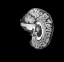

# Brain MRI super-resolution network 
## Introduction
This project implemented a super-resolution CNN network trained on the ADNI brain dataset. The trained model can convert a low resolution image into a high resolution version. The CNN consists of four convolutional layers followed by a depth-to-space transformation. The dataset used in training and testing is ADNI dataset, including 2D slices of MRI for both Alzheimer’s disease patients (AD) and health control (HC). For our purpose, dataset for AD and HC are combined together into one dataset (since our model do not deal with classification). The training and testing achives mean PSNR of 28.82 and 24.83 WITH loss of 0.0013 and? respectively.
## Getting Started
### Install the required dependencies
pip install -r  recognition/SuperResolutionShanJiang/requirements.txt   
### Loading dataset
The dataset used for training(and validation) and testing is loaded in `dataset.py`.The images are cropped into specified size (256*248 in our case). 20% of the training dataset is reserved for validation. Pixel values of traning and validation images are rescales to range of 0 to 1. A list of path for each testing image is also created for later use.        
Then we produce pairs of  high resolution and loss resolution images from the training and validation dataset. To get high resolution images,we convert images from the RGB color space to the YUV colour space and only keeps Y channel. To get low recolution version, we convert images from the RGB color space to the YUV colour space,only keeps Y channel and resize them by certain ratio (4 in our case) so that their resolution is reduced. Each pair is put into a tuple to be fed into the model for training. The following images show exmaple of a high resolution image and the corresponding low resolution image. 

To run dataset.py, follow these steps in `dataset.py`:
1. Creat a folder in the same directory as the python file and put images for training inside. Specify the exact directory of this folder at line ?? by altering the value of variable `data_dir`.
2. Creat a folder in the same directory as the python file and put images for testing inside. Specify the exact directory of this folder at line ?? by altering the value of variable `test_path`.
3. Creat a folder in the same directory as the python file and put images for prediction inside. Specify the exact directory of this folder at line ?? by altering the value of variable `prediction_path`. Those images is used to provide a demo of the prediction result of the model in `predict.py`
4. (optional) change the value of `upscale_factor` at line ?? to downsample your training and validation images by a different ratio
5. Change the values of `crop_width_size` at line ?? and `crop_height_size` in line ?? to make sure they are less than or equal to the orginal width and height of the images, and is divisible by `upscale_factor`.
6. (optional) Adjust batch size for training and validation by changing the value of `batch_size`at line ??.
7. run `dataset.py`
### Building model
The model structure is defined in `modules.py`. using keras framwork. The structure of the model is as following:
- first layer: A convolutional layer with 64 filters and a kernel size of 5 to extract features.
- second layer: A convolutional layer with 64 filters and a kernel size of 3 to extract features.
- third layer: A convolutional layer with 32 filters and a kernel size of 3 to extract features.
- fourth layer: A convolution layer with `channels * (upscale_factor ** 2)` filters and a kernel size of 3 to increase spatial resolution.
- depth to space operation: Using TensorFlow's tf.nn.depth_to_space function to perform a depth-to-space upscaling operation specified 'upscale_factor' to produce the super-resolved image with a higher resolution.
Note: for best performance, keep the value of `upscale_factor` parameter (default to 4) in `get_model` the same as the value of `upscale_factor` parameter defined in `dataset.py` and keep the value of `channels` to the default value (1).
### Utilities
Two functions are defined in `utils.py`. 
- `get_lowres_image(img, upscale_factor)` downsamples given `image` by  ratio of given `upscale_factor`. It is later used in train.py to convert testing images to low resolutions images.
- `upscale_image(model, img)` preprocessed given `image` and use the give `model` to increase its resolution. The preprocessing include convert the image into YCbCr color space and isolate and nomalise(dividing by 255) the Y channel, reshape the Y channel array to shape shape matches the model input shape. The prediction output from the model is demornalised(multiplying by 255) and restored to RGB color space.
### Model training
Model training, validation and testing is are implemented in `train.py`.
#### Training and validation 
`ESPCNCallback` class is used to monitor and display the accumulating mean PSNR after each epoch; and the plots of loss function (for both training and validation) vs epoch number are saved to specified directory after every 10 epochs. Mean Squared Error is used as the loss function and Adam is used as the optimiser. `early_stopping_callback` is set so that the training stops automatically if loss does not improve for 10 consecutive epochs. During training, the best(resultin in minimul loss) model weight is saved to specified path. The following image is the plot of loss over epoch for the entire training process (epoch 1 to 60).
To run model training, do following in `train.py`:
1. Make sure the value of `upscale_factor` at line ?? is the same as the one defined in `dataset.py`
2. Make sure training dataset is well defined in `dataset.py`. (Refer to "Loading dataset" of this doc )
3. Creat a empty folder in the same directory as the python files to save the weights. Specify the exact directory of this folder at line ?? by altering the value of variable `checkpoint_filepath`at line ??. Make sure add a "/" at the end of the path, for example: "exact/path/to/the/folder/".
4. Creat a empty folder in the same directory as the python files to save the loss plots. Specify the exact directory of this folder at line ?? by altering the value of variable `loss_plot_path` at line ??. Make sure add a "/" at the end of the path, for example: "exact/path/to/the/folder/".
5. Comment out code for testing (from line ??? to line ???)
6. run `train.py`
#### Testing
During model testing, the images are first downsampled by passing them to the functions `get_lowres_imageget_lowres_image(img, upscale_factor)` and then a reconstructed high resolution version is predicted using the model. The average PSNR of lower resolution images and prediction are calculated to verify the effectiveness of the model (PSNR of prediction should be higher than lower resolution images)
To run model testing, do following in `train.py`:
1. Make sure the value of `upscale_factor` at line ?? is the same as the one defined in `dataset.py`
2. Make sure the model has been trained and weights have been saved (see training part)
3. Make sure testing dataset is well defined in `dataset.py`. (Refer to "Loading dataset" of this doc )
4. Comment out code for training (from line ??? to line ???)
5. run `train.py`
### Prediction
Example usage of this model is shown in `predict.py`. In this file, 10 images from testing daaset are downsampled, predicted using the model. For each image, we show the lower resolution version, higher resolution version and prediction in one figure and saved in specified directory. The following figures show an example of the figure.
To run this file, do following in `predict.py`:
2. Make sure the model has been trained and weights have been saved (see training part)
3. Make sure prediction dataset is well defined in `dataset.py`. (Refer to "Loading dataset" of this doc)
4. Creat a empty folder in the same directory as the python files to save the example figures. Specify the exact directory of this folder at line ?? by altering the value of variable `prediction_result_path` at line ??. Make sure add a "/" at the end of the path, for example: "exact/path/to/the/folder/".
5. run `predict.py` 

       

     
    
