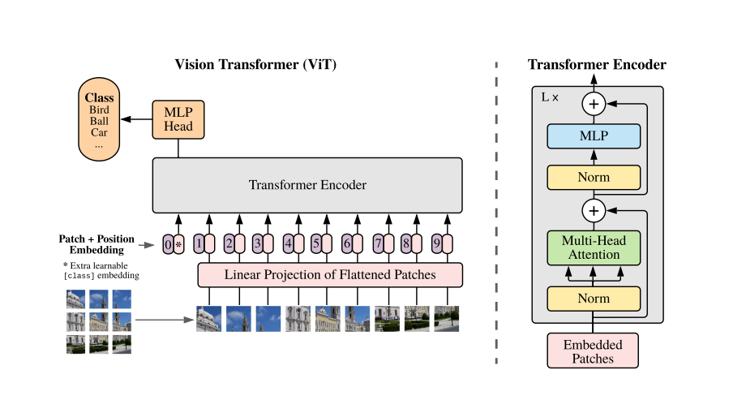

# ViT Transformer for image classification of the ADNI dataset

 
## Description
This code can be used to train, validate, and test a ViT (Visual Transformer) model
on the ADNI brain dataset. The ViT model is a binary classifier that takes 2D MRI slice
images as its inputs. It attempts to determine if the patient in the MRI image slice has
either Alzheimer's disease, or a healthy (Cognitive Normal) brain.


## Dependencies
This code is written in Python 3.11.5. 

The following libraries/modules are also used:
- pytorch 2.1.0
- pytorch-cuda 11.8
- torchvision 0.16.0
- torchdata 0.7.0
- matplotlib 3.7.2
- scikit-learn 1.3.0
- einops 0.7.0

It is strongly recommended that these packages are installed within a new conda
(Anaconda/Miniconda) environment, and that the code is run within this environment. 
These libraries can then be installed into the conda environment 
using these lines in the terminal:

```
conda install pytorch torchvision torchaudio torchdata pytorch-cuda=11.8 -c pytorch -c nvidia

conda install matplotlib

conda install scikit-learn

pip install einops
``````

### Reproducibility
Model training was completed on the UQ Rangpur HPC server, using the vgpu40
node with the following hardware specifications:

- 8x vCPU cores (AMD Zen 2)
- 128 GB RAM
- NVIDIA A100 40GB vGPU

For more information, see [UQ EAIT compute infrastructure.](https://student.eait.uq.edu.au/infrastructure/compute/)

The model was saved after training, and inference was later completed on a local device.


## How a ViT works
A ViT (Visual Transformer) is a variation on Transformer models, designed specifically for image processing.

In a Transformer, input data and target values are given an embedding with a positional encoding. This stores the sequential characteristics/nature of the inputs and targets. In the case of a ViT used for classification, an input image is split into tokens, made up of separated, smaller 'patches' of the original image. Patches generate a positional embedding, based on the position of the patch within the entire image. The target values would be categorical labels, used to classify the input images.

These are converted into Keys, Queries, and Values, which are fed into multi-head attention modules, followed by small, linear feed-forward networks. An encoded representation of the original inputs is produced, which is fed into other network components (as well as target values). Finally, a softmax layer is applied to the outputs, giving the probabilities of each class being predicted.

Here is a diagram illustrating the main components of a ViT:

*(Dosovitskiy et al., 2021)*

The overall architecture of this ViT was based on the ViT-S/16 model, created in the 2022 IEEE conference paper "Scaling Vision Transformers" (Zhai et al.)

### S/16 model details
The S/16 model variant of the ViT was chosen, as it was believed that it would provide a "good tradeoff" between performance and computational speed/efficiency (Beyer et al., 2022). It was believed that this would be the most appropriate, where hardware resources were partly limited.

Model specs (as specified in Zhai et al, 2022):
- **Patch size:** 16x16
- **Number of encoder blocks (depth):** 12
- **Dimensionality of patch embeddings and self-attention modules (width):** 384
- **Number of attention heads:** 6
- **Dimension of hidden MLP Linear layers:** 1536

The created model differs slightly from the original S/16 ViT model, including modifications as added by Beyere et al. (2022). These include 2-dimensional sinusoids used for positional embeddings, and the use of global average/mean pooling instead of using a class token.


## Examples
### Model inputs - ADNI dataset
The input images are 2D MRI slices of a patient's brain, taken from a Alzheimer's 
Disease Neuroimaging Initiative (ADNI) dataset. 
The images used with this model have been preprocessed.
For more specific details, please see the [ADNI dataset website.](https://adni.loni.usc.edu/)

The model takes 224x224 colour/RGB images as inputs, where each RGB channel contains
intensity values for each pixel in the range [0, 255].

ADNI images are cropped and resized from 256x240 to 224x224.


Each image is also assigned a class label representing whether or not Alzheimer's 
disease was observed in the patient. These labels are "AD" (Alzheimer's Detected) 
and "NC" (Cognitive Normal). Within the model, these labels are transformed into
numerical categorical values (0 for AD, 1 for NC).

### Model outputs
A binary classification label is generated by the model, based on the input image.
A 0 value is returned if the AD (Alzheimer's Detected) is predicted, and a 1 value
is returned if predicting the NC (Cognitive Normal) class.


## Preprocessing

### Image resizing
Input images of size 256x240 were resized, then center cropped to a square
resolution of 224x224, which was used as the image input size for the model.
As the images were approximately centred (and all positioned similarly), 
processing them in this manner preserved the position of brains in the MRI slices,
whilst resizing them to dimensions that could be evenly downsampled multiple times
by the model network.

### Normalising the data
The files were loaded as RGB images. These contained 3 channels, in which each
channel represents an intensity value in the range [0, 255]. These values were
standardised such that the means and standard deviations were both changed to
0.5. This placed intensity values for each channel within the range [-1, 1]. 

### Data augmentation
No data augmentation was explicitly applied to the input data. However, all available
MRI image slices for each patient were used in the data set (20 slices per patient). As these slices are
distinct, but all map the same patient's brain (for the same classification), 
these slices may act similarly to 'augmented' data. This may result in the model being
more invariant to changes in the different MRI slices provided to it. In some contexts
where additional unseen data (potentially from different datasets) is tested, 
the model could potentially be more generalisable as a result.

### Train, validation, and test splits
The data was split into a training, validation, and test set. 
Training set data was used to train the model, with binary cross-entropy loss used
to evaluate its performance throughout the training process.

During training, the model performance was evaluated on the validation set at the final step of
each epoch. The relationship between training set loss and validation set loss was observed, to note the 
points of training in which the model was overfitting or underfitting. The most optimal 
length of time for training the model was manually selected, and the model was re-trained with a
different number of epochs. As such, validation set performance was used to perform tuning/selection of
a hyperparameter (the number of epochs).

The test set was used to evaluate the model performance on unseen data, quantified
by the accuracy metric.

#### Number of data points
The ADNI dataset contains 1526 patients (30520 MRI image slices).
The test set was composed of data points sampled from the 'test' directory of the ADNI dataset.
This set contained MRI image slices from 223 AD patients (4460 images) and
227 NC patients (4540 images), giving 450 patients (9000 images total). The test set
comprises of roughly 29-30% of the entire dataset.

Training and validation sets contained points sampled from the 'train' directory of this dataset,
which contains around 70-71% of the data.
80% of 'train' dir data (860 patients, 17200 images) was used in the training set, 
with 416 AD patients (8320 images) and 444 NC patients (8880 images).
20% (216 patients, 4320 images) of this data was used in the validation set - 
this contained 104 AD patients (2080 images) and 112 NC patients (2240 images).

#### Justification
The validation set was chosen to be approximately half the size of the test set.
It was considered more beneficial to quantify the model's performance on
a larger selection of unseen data (in the test set), than to utilise more of this
data for the purpose of hyperparameter tuning or training. When more data is moved to the
test set, the distribution of test data more accurately represents the 
characteristics of the entire dataset. 
The size of the training set was also not decreased in favour of the other sets used,
to allow for the model to train on an appropriate quantity of varying data points.

The split between the training and validation sets was stratified 
(attempting to roughly preserve the class proportions within each split set).
A stratified split can result in more effective training/useful testing. In saying
this, I don't believe that this has made a significant difference to this model
(as the class proportions are almost approximately equal).

#### Preventing data leakage
The training and validation set data appears to be independent from the test set data,
with no overlapping patient MRI images within both of the 'train' and 'test' data
directories.

To prevent data leakage within the train and validation sets (split from the 'train'
directory data), the MRI slices were grouped by patient, then the patients were 
shuffled and split between each set. After the split, data points (each MRI image 
slice) were shuffled within each set. This process ensured that the data was 
appropriately shuffled, whilst preventing images from one patient being allocated 
to both the train and validation set.


## Results:
### Training for 90 epochs:
To perform hyperparameter tuning for the number of epochs, a large number of epochs (90) was initially chosen. The results from the training and validation sets were saved and plotted:


Noticeably, the training and validation set loss appears to reach an optimal point between 40 and 60 epochs, then begins to fluctuate significantly at some points after this, despite reaching what appear to be the optimal loss values. 

Validation set accuracy (per-batch) approaches 100% around this training period:


 Whilst these values appear optimal, the test set performance for the model trained for 90 epochs was ~60.81%, indicating that the model is overfitting significantly to the training set, and generalising poorly to the test set. The smaller quantity of validation set data points may also be providing misleading information about the model's performance on unseen data - the particular split of data used when training this model contained a large quantity of data points that had similar features to those present in the training set. If this was the case, then 

 To avoid overfitting the model, a shorter, more optimal training duration of 40 epochs was chosen.

### Training for 40 epochs:
TODO Provide plots of the algorithm (train and validation loss, validation accuracy)

TODO state the achieved test set accuracy and optimal # of epochs


## Possible improvements?
Whilst the model's performance is not ideal, it could be improved on or further experimented with, in multiple different ways:

### Data augmentation
The majority of the images featured the brains positioned roughly in the middle,
with an approximate orientation. However, it was noted that the ADNI dataset would
occasionally contain MRI images that were rotated or positioned differently to others.
As the model would be less likely to see this data during the training process, 
it may be less invariant to minor rotations and positional changes. To improve the
model performance and make the model more generalisable, it could be regularised by augmenting the training set data. Images could be duplicated within the training set, then augmented with minor rotations and positional translations. Beyer et al. (2022) noted
that ViT models experienced improved performance on baseline image processing datasets
with the use of similar data augmentation techniques.

### Changing RGB images to greyscale:
The input data is MRI images, in which each pixel of the image is a "greyscale value 
that ranges from 0 (pure black) to 255 (pure white)" (Gerber & Peterson, 2008). 
Because of this, loading the input data as RGB images results in superfluous 
information (the intensity values in each channel are identical). 

Converting the image to a single-channel, greyscale format would likely improve
the computational efficiency of the model during training and inference.
It's also possible that the model could achieve more ideal performance by training on data points with less superfluous data.

### More hyperparameter tuning:
Whilst the number of epochs/length of training was examined with a validation set,
many other model hyperparameters could additionally be tuned. For example, other
model configurations listed in the Zhai et al. (2022) paper could also be tested on the ADNI dataset, and their performance compared with the S/16 model. 
This paper also suggests using either a constant or a reciprocal square-root 
learning rate scheduler, to prevent the learning rate from decaying too quickly during training.
This scheduler would include a "warmup" and a "cooldown" period.
Currently, the PyTorch OneCycleLR scheduler is used to "warmup", then "cooldown" the 
learning rate in a non-linear fashion. It's possible that a constant or inverse
square-root scheduler may encourage the model to train more effectively in later
epochs (when the learning rate decays at a slower rate).


## References
- Alzheimer's Disease Neuroimaging Initiative. (2017). *ADNI | Alzheimer's Disease Neuroimaging Initiative.* https://adni.loni.usc.edu/

- Beyer, L., Zhai, X., Kolesnikov, A. (2022). *Better plain ViT baselines for ImageNet-1k.* https://arxiv.org/abs/2205.01580

- Doshi, K. (2021, January 17). *Transformers explained visually (Part 3): Multi-head attention, deep dive.* https://towardsdatascience.com/
transformers-explained-visually-part-3-multi-head-attention-deep-dive-1c1ff1024853

-   Dosovitskiy, A., Beyer, L., Kolesnikov, A., Weissenborn, D., Zhai, X., Unterthiner, T., Dehghani, M., Minderer, M., Heigold, G.,  Gelly, S., Uszkoreit, J., Houlsby, N. (2021). An image is worth 16x16 words: Transformers for image recognition at scale. *International Conference on Learning Representations.* https://arxiv.org/pdf/2010.11929.pdf

- Gerber, A. J., & Peterson, B. S. (2008). What is an image? *Journal of the American Academy of Child and Adolescent Psychiatry*, 47(3), 245–248. https://doi.org/10.1097/CHI.0b013e318161e509

- Raschka, S. (2022, June 12). *Taking Datasets, DataLoaders, and PyTorch's new DataPipes for a spin.* https://sebastianraschka.com/blog/2022/datapipes.html#DataPipesforDatasetsWithImagesandCSVs

- Zhai, X. Kolesnikov, A., Houlsby, N., Beyer, L. (2022). Scaling Vision Transformers. *Institute of Electrical and Electronics Engineers.* https://ieeexplore.ieee.org/document/9880094

