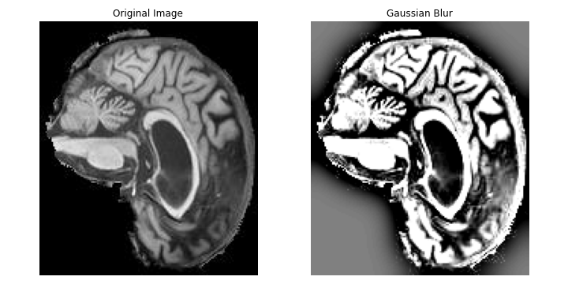
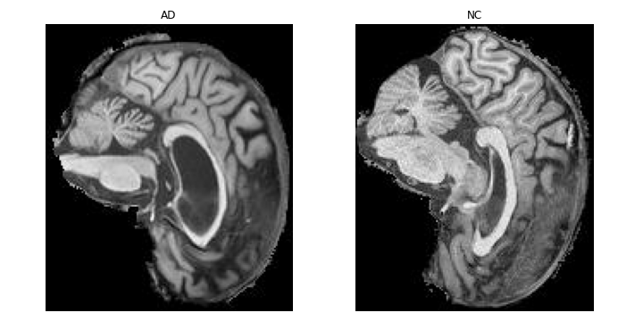
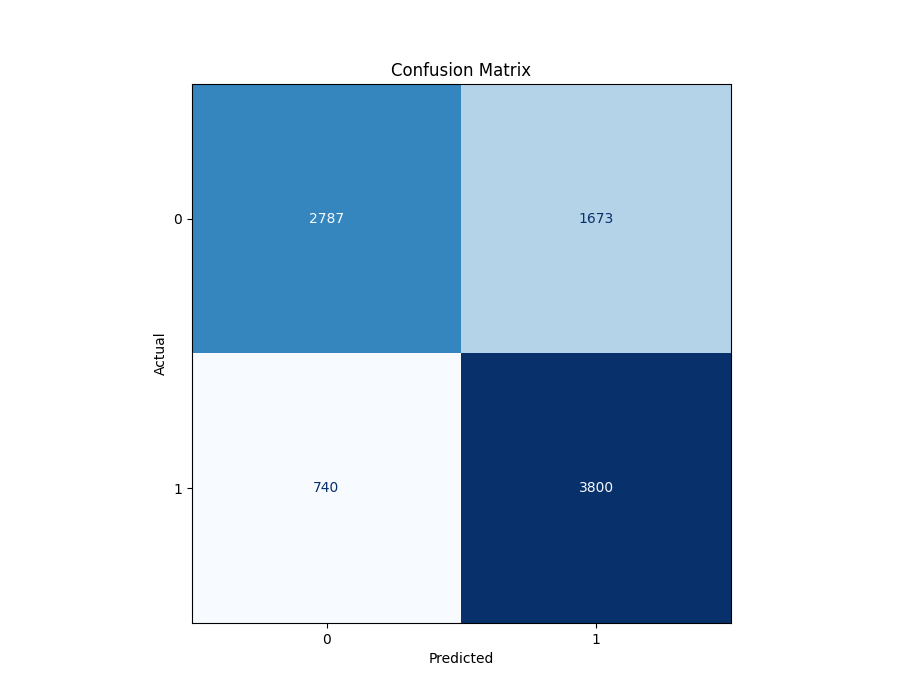
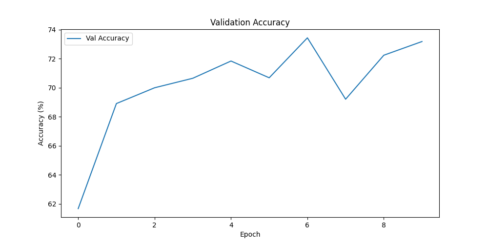
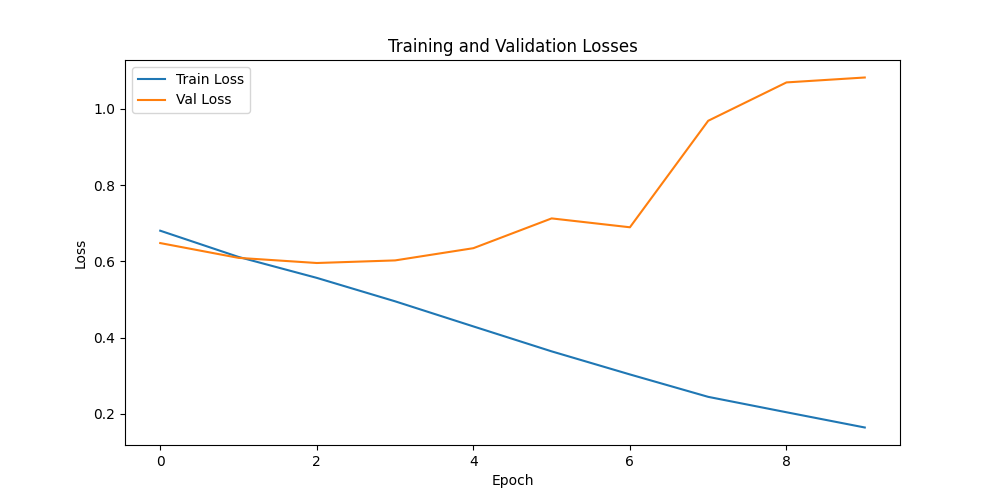

# Alzheimer's Disease Classification with Swin Transformer 💻
<p align="center"> Name: <b>TARUSHI GERA</b><br>Student ID: <b>48242204</b>
    <br> 
</p>

## Index 🖋️

- [Description](#description)
- [Working](#working)
- [Requirements](#requirements)
- [Configuration File](#configuration-file)
- [How to Run](#how-to-run)
- [Model Evaluation](#model-evaluation)
- [Plots](#plots)
- [References](#references)

## Description 📖 <a name="description"></a>

Alzheimer's disease is a neurodegenerative condition affecting millions worldwide, making early and accurate diagnosis critical for patient care and research. Extracting meaningful features from medical images is challenging due to the subtlety of disease-related patterns. The Swin Transformer, a state-of-the-art deep learning architecture, excels at capturing fine-grained details and long-range dependencies within images. This capability significantly enhances the accuracy of Alzheimer's disease classification, contributing to early diagnosis and research efforts. The Swin Transformer's hierarchical structure allows it to efficiently process the large and complex medical images commonly used in this field.


## Working 🪛 <a name="working"></a>
### Swin Transformer Working 🏋️‍♀️

1. For Computer Vision purposes. we use Swin Transformer Architecture. In contrast to traditional transformer architectures, they can handle large image resolutions.
2. It utilizes the process of dividing images into several non-overlapping patches instead of processing a single image.
Swin transformer follows a hierarchical architecture beginning with a small transformer operating on the patch level, eventually followed by larger ones on higher spatial resolutions.
3. To capture more spatial resolution, the Swin transformer uses a shifted window strategy. It alternatively shifts the position of patches, allowing more scope for capturing information from neighboring patches.
4. Swin transformer aggregates information from both local and global contexts by token mixing.

### Data Preprocessing 🖥️

Data preprocessing plays a pivotal role in preparing input images for classification. The key steps include:

1. **Background Removal**: Eliminating undesirable background elements by generating a binary mask that isolates the object of interest while eliminating surrounding gray or dark regions. This process is adaptable to both grayscale and color images.


2. **Color Space Conversion**: Ensuring uniformity and compatibility by converting input images to the RGB color space.

3. **Gaussian Noise (Optional)**: An optional step that introduces Gaussian noise to images. While this can enhance model robustness by adding variability to the training data, it is currently commented out and can be enabled as needed.


We used 19520 samples for training, 2000 for validation, and 9000 for testing.

### Example Input and Output 👷‍♀️

Following are the example input images where **AD** means Alzheimer Disease and **NC** means No Disease.



## Requirements 🧱 <a name="requirements"></a>

Make sure you have the following dependencies installed:

- Python >= 3.7
- PyTorch
- timm

    ```bash
    pip install -r requirements.txt

## Configuration File 📁 <a name="configuration-file"></a>

You can customize the model, data, and training settings using the configuration file config.yaml. Update the configuration to match your dataset and training requirements.
    
    ```bash
    data:
      train_data_dir: "./data/train"  # Replace with the path to your training data
      val_data_dir: "./data/val"      # Replace with the path to your validation data
      test_data_dir: "./data/test"    # Replace with the path to your testing data

    model:
      num_classes: 2                  # Number of classes for binary classification

    training:
      is_train: true                  # Whether to train the model
      device: 'cuda'                  # Use cuda for gpu else cpu
      image_size: [224, 224]          # Input Image size
      batch_size: 32                  # Batch Size
      learning_rate: 1e-5             # Learning Rate
      epochs: 15                      # Number of epochs to train
      save_dir: './results'           # Directory for saving logs

    testing:
      is_test: true                   # Whether to test the model
      model_path: #'./results/swin_transformer_model.pth'   # Path to the checkpoint


## How to Run 🏃 <a name="how-to-run"></a>

1. For training, set is_train = true in config.yaml
   
   ```bash
   python train.py
   
2. For testing, set is_train = false and is_test = true in config.yaml
   
   ```bash
   python train.py

For this project, I used Google Colab Pro for its flexibility and the option to work online without having to setup several softwares.

## Model Evaluation 🧑‍🏫 <a name="model-evaluation"></a>

We evaluated our model on testing data. The results indicate the following:

**Accuracy (0.7227):** This metric tells us that the model correctly predicts the class of about 72.27% of the instances. It represents the overall ability of the model to classify samples correctly.

**Precision (0.714):** Precision measures the ability of the model to correctly classify positive cases. In this context, it indicates that when the model predicts Alzheimer's Disease (AD), it's correct about 71.4% of the time.

**Recall (0.750):** Recall, also known as sensitivity, measures the ability of the model to correctly identify positive cases out of all actual positive cases. In this context, it indicates that the model correctly identifies 75.0% of the actual AD cases.

**F1 Score (0.732):** The F1 score is the harmonic mean of precision and recall. It provides a balance between these two metrics. An F1 score of 0.732 indicates a reasonable balance between precision and recall.



## Plots 📈 <a name="plots"></a>





## References 🔖 <a name="references"></a>
- [Swin Transformer Module and Architecture](https://arxiv.org/abs/2103.14030)
- [Overview of Swin Transformer](https://www.section.io/engineering-education/an-overview-of-swin-transformer/) 
- [More about Swin Transformers](https://medium.com/@crlc112358/swin-transformer-hierarchical-vision-transformer-using-shifted-windows-ca1ccc8760b)
