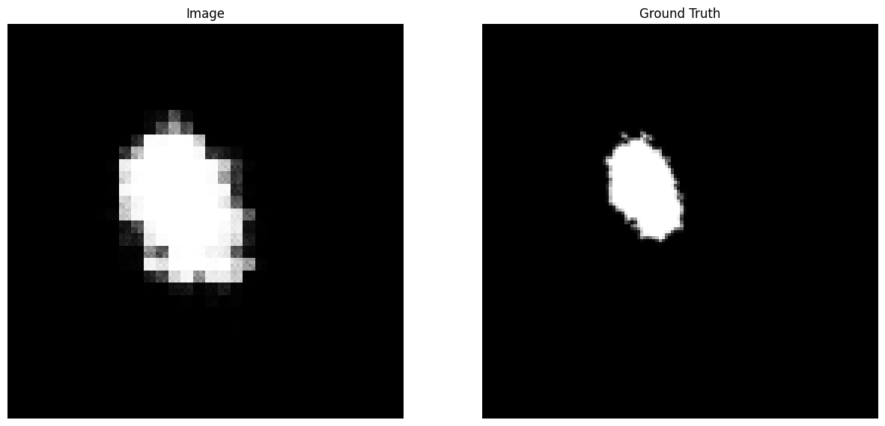

2
recognition/Tord_Improved_UNet/pictures/Unknown.png


## Images of the output compared to the ground truth for different epochs:

In order to log with wandb run the following command: ```wandb login```


### Epoch 2

### Epoch 5

### Epoch 13

### Epoch 44

### Epoch 100
