# Improved UNET lesion segmentation

This repository defines a type of U-Net implementation. The goal is to segment colored pictures of the proximal area of a lesion. Using labeled and segmented data to train the model.

# Results
The results after 64 epochs yielded a Dice score of 0.8104. Each step in the image describes the average dice score over 1000 images. The two earlier iterations with a with less learning rate and fewer images. The two different configurations will be described later, and pictures of the outputs of the models will be shown:
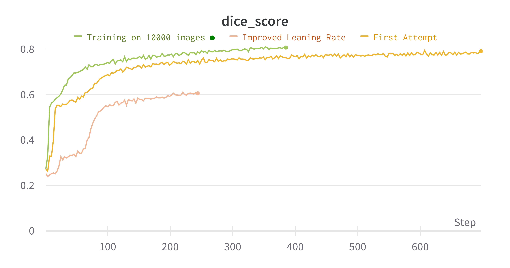


## The data
The data is preprocessed into 256x256 pixels, and the inputs have 3 color channels. The outputs have 1 color channel. In reality, the labeled output is binary, meaning that for each pixel, it is either labeled as being part of the lesion or not.

### Example


### Transforms
```data_transform = transforms.Compose([
    transforms.Resize((256, 256)),
    transforms.ToTensor(),
    CustomNormalize(mean, std)
    
])
```
## The model
The improved UNET model follows the paper which Shakes refrences in the project description:

F. Isensee, P. Kickingereder, W. Wick, M. Bendszus, and K. H. Maier-Hein, “Brain Tumor Segmentation and Radiomics Survival Prediction: Contribution to the BRATS 2017 Challenge,” Feb. 2018. [Online]. Available: https://arxiv.org/abs/1802.10508v1

The only difference is the two final operations in the model. Since the ground truth only has one color channel, the model ends with a feature reduction transform and a final sigmoid function.

Otherwise, the code is straightforward. The implementation focus has been on being easily readable and, more importantly, easily decodable model code. When designing the code after the referenced paper, there were some bugs. My way of implementing the code allowed for easy print statements to facilitate a quick matching of dimensions.

The first part of the model expands the number of features using context modules:

The first part of the model expands the amounts of features, using context modules:
```def context_module(in_channels, out_channels):
        module = nn.Sequential(
            nn.Conv2d(in_channels, out_channels, kernel_size=3, padding=1),
            nn.LeakyReLU(0.01),
            nn.Dropout(p=0.3),
            nn.Conv2d(out_channels, out_channels, kernel_size=3, padding=1),
            nn.LeakyReLU(0.01)
        )
        return module
```
On each level and iteration of this module a residual is also "stored". When the later localization module:
```
def localization_module(in_channels, out_channels):
        module = nn.Sequential(
            nn.Conv2d(in_channels, out_channels, kernel_size=3, padding=1),
            nn.LeakyReLU(0.01),
            nn.Conv2d(out_channels, out_channels, kernel_size=1),
            nn.LeakyReLU(0.01)
        )
        return module
```

reduces the amount of features and adding in the residuals for each layer.

## Images of the output compared to the ground truth for different epochs:
One of the initial attempts at training the model yielded these photos:
### Epoch 2
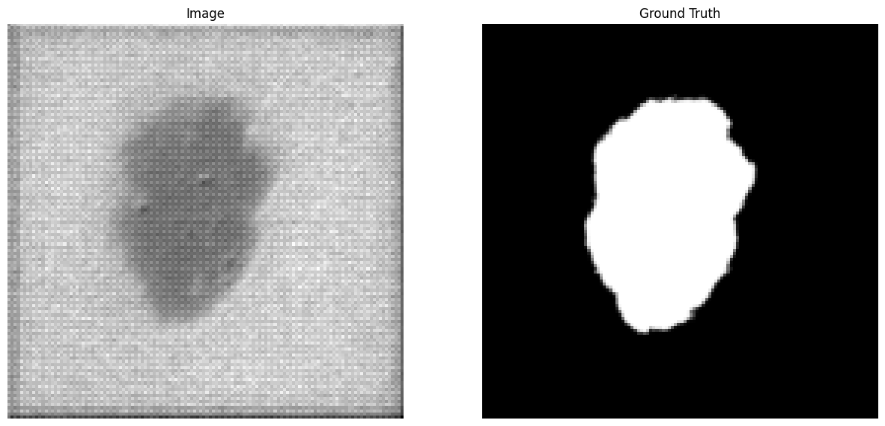
### Epoch 5
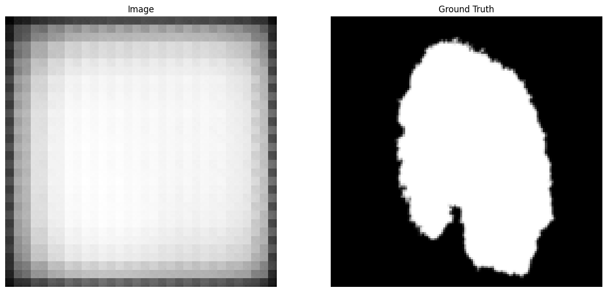
### Epoch 13
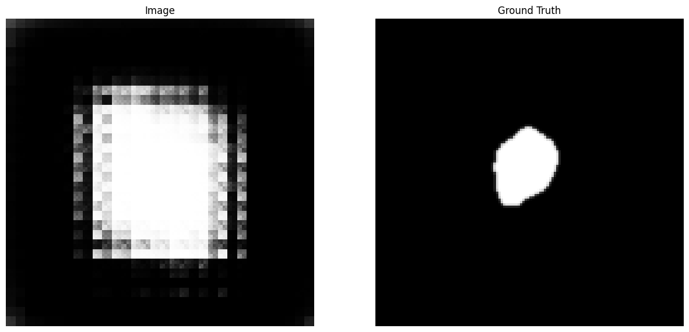
### Epoch 44
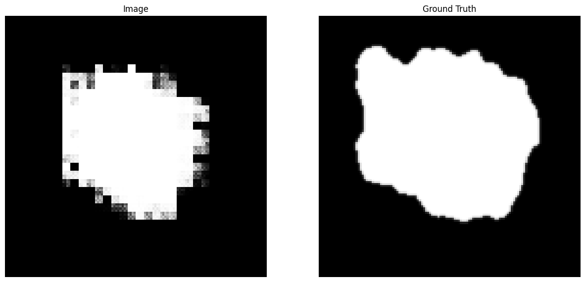

Subsequently increasing the initial learning rate from 5e-4 to 1e-3 and decreasing the lambda learning rate from init_lr * (0.985 * epoch) to init_lr * (0.999 * epoch)

This gave a drastic increase in dice score as seen from the results.

### Epoch 2
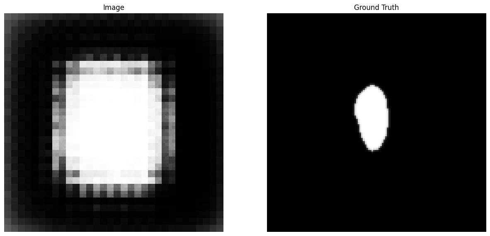
### Epoch 5
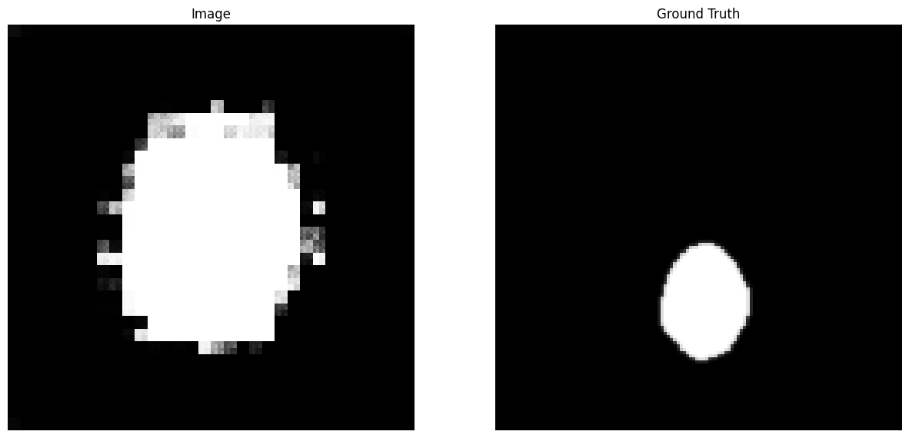
### Epoch 13
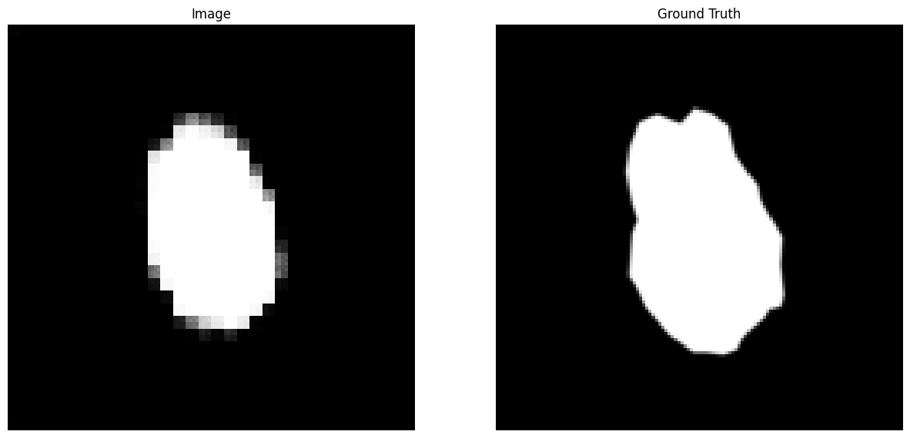
### Epoch 44
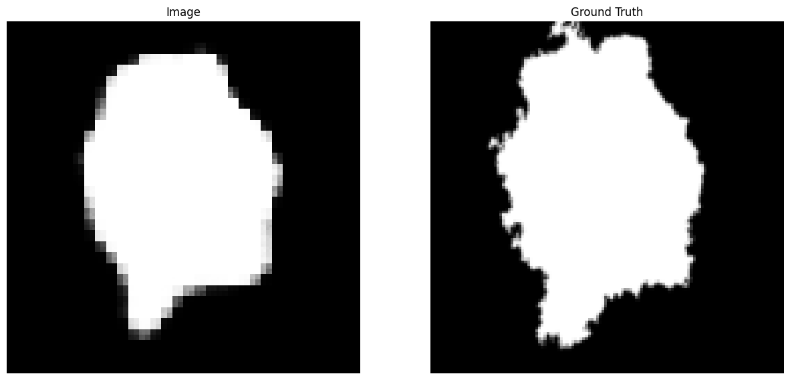

The final attempt with 10000 images
### Epoch 2
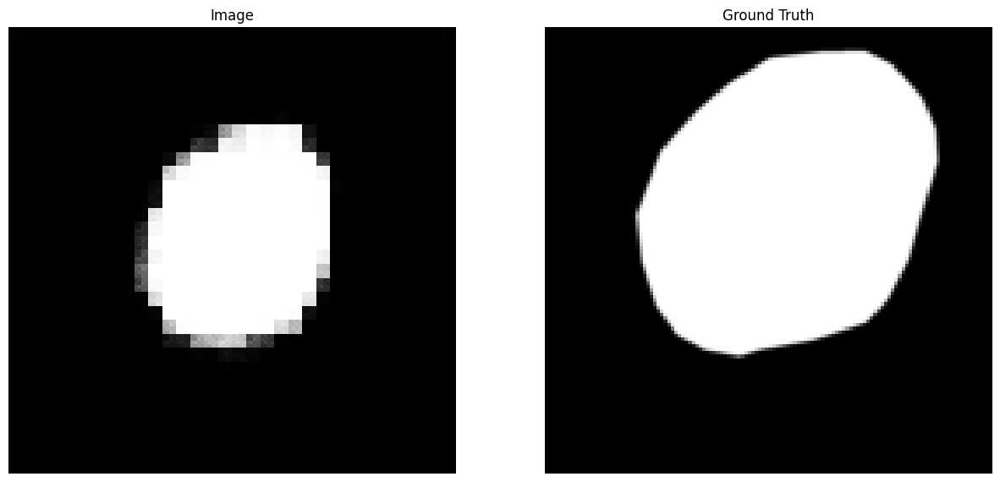
### Epoch 5
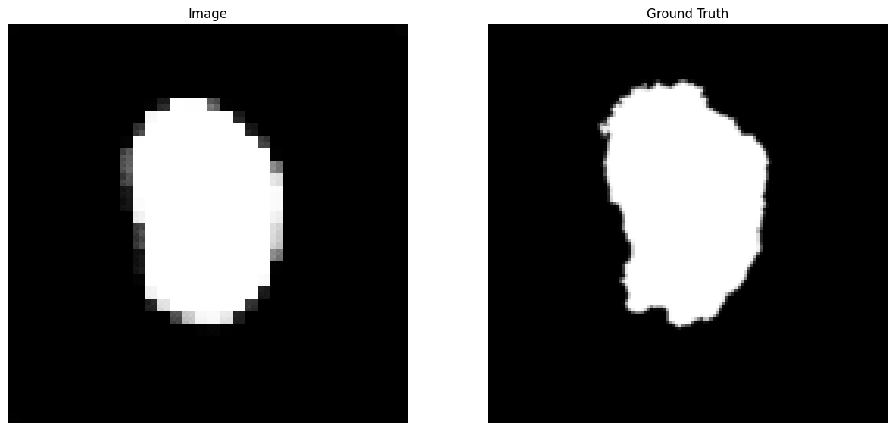
### Epoch 13
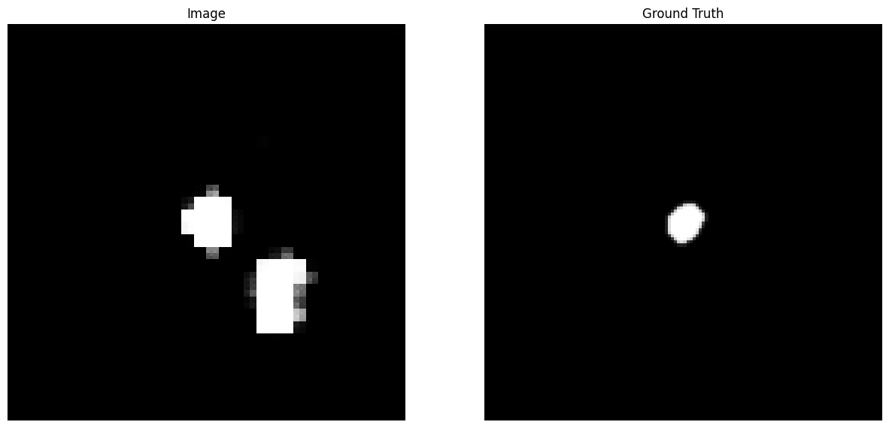
### Epoch 44
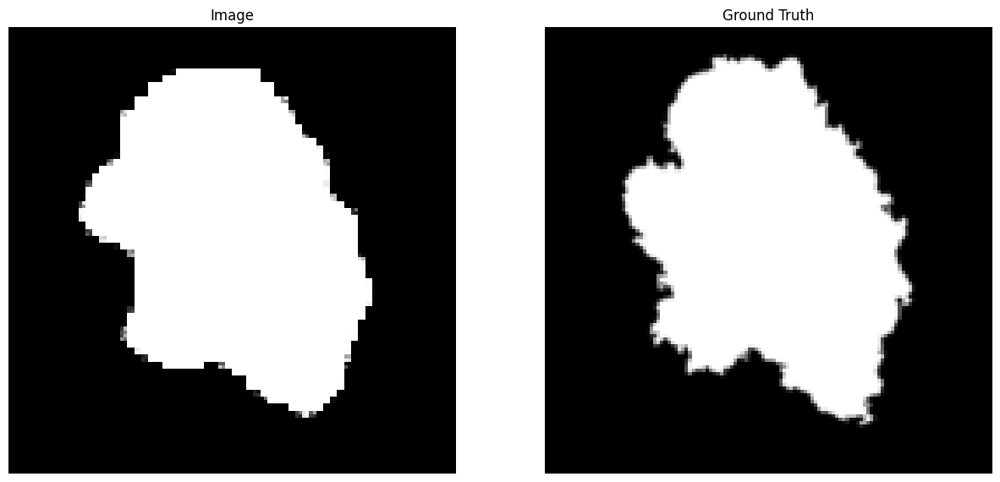

## Dependencies

All dependencies will have to be install, which in my case was using pip. Torch, Torchvision, PIL, matplotlib and wandb.

In order to log with wandb run the following command: ```wandb login```

