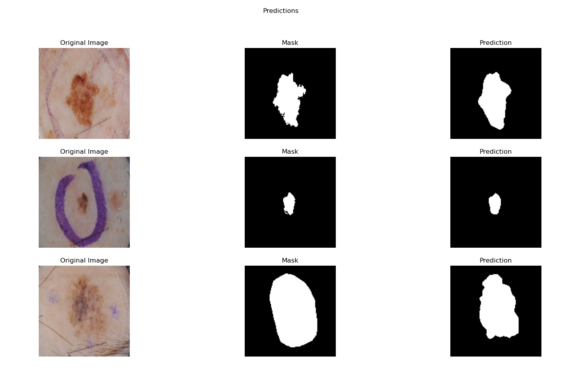
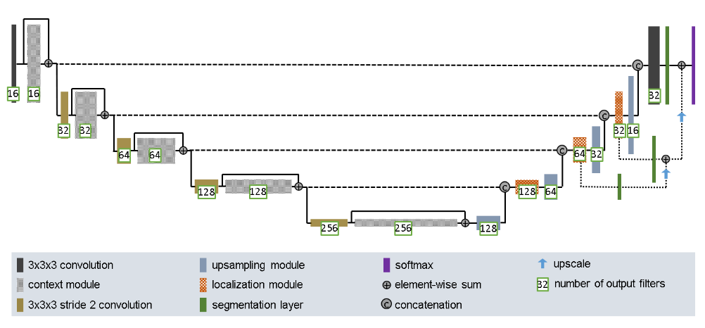
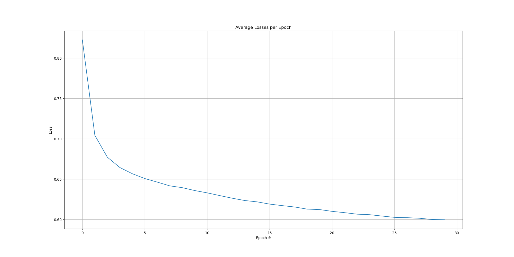
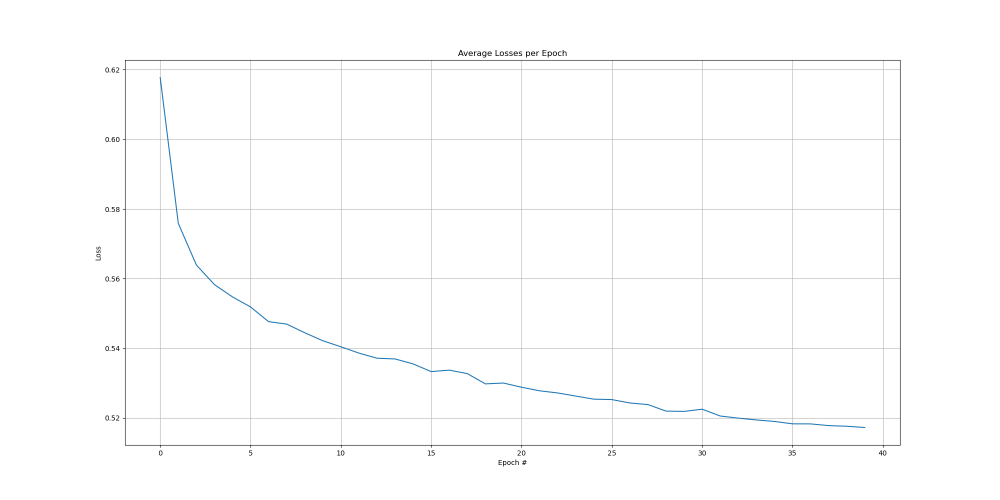
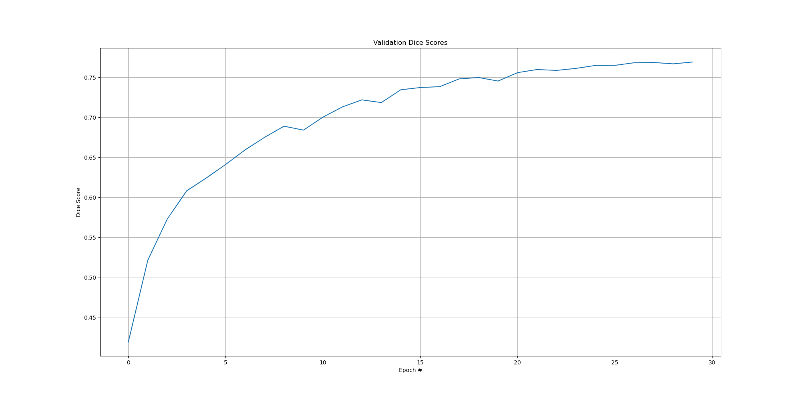
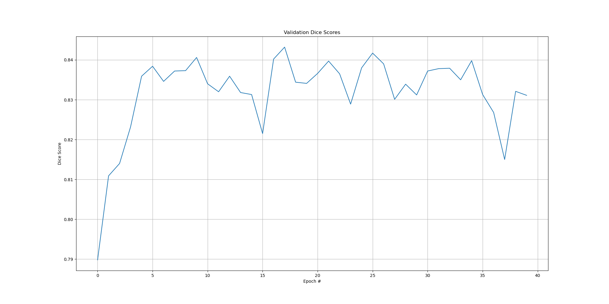
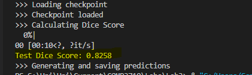
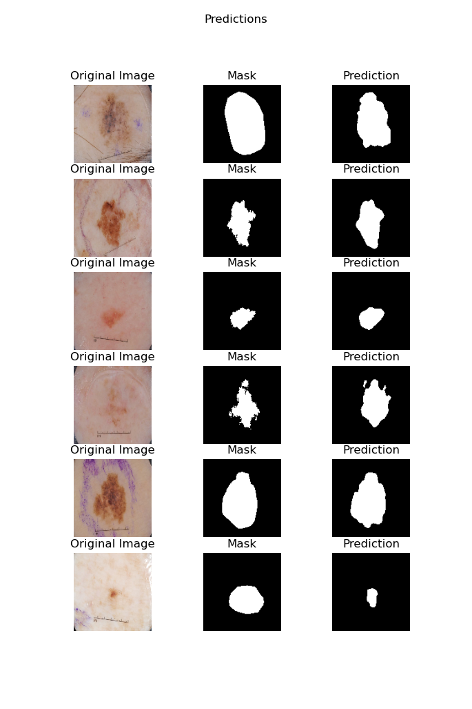

# Segmentation of skin lesions using an Improved UNet
##### Author: Sam Pollard, 46408211

### Files:
* `dataset.py` contains the custom PyTorch data set for the ISIC 2017 data.
* `modules.py` contains the Improved UNet model class as well as other modules used in the network architecture.
* `dice_loss.py` Contains a custom loss function module based on the dice similarity coefficient. Credit [^3]
* `global_params.py` contains global variables such as file directories for the data and hyperparameters for training.
* `utils.py` contains helper functions for visualizing results, saving and loading models, etc.
* `train.py` the training script for the model.
* `predict.py` loads the trained model and visualizes example usage as well as calculating evaluation metrics.
* See `requirements.yaml` for dependencies.

## Introduction:
The aim of this project is to automatically produce segmentation masks of skin lesions from the ISIC 2017 data set using a deep convolutional neural network model based on the improved UNet[^1] implemented in PyTorch.

Example visualization:

*Figure 1: example output with ground truth and original image*.

### Usage:
To create predictions and evaluate the model, simply set the `TRAIN_IMG_DIR, TRAIN_MASK_DIR, TEST_IMG_DIR, TEST_MASK_DIR, VAL_IMG_DIR, VAL_MASK_DIR` variables in the `global_params.py` file to the directories of the corresponding images/masks, run the `train.py` script to train the model if no pre-trained checkpoint is available. set the `CHECKPOINT_DIR` variable in `predict.py` to the directory of the pre-trained checkpoint, optionally change the number of examples to be displayed, and run `predict.py`.

## Data:
The International Skin Imaging Collaboration (ISIC) hosts the worlds largest publicly available collection of quality controlled dermoscopic images. Including several deep learning challenge data sets, one such data set is the ISIC 2017 challenge data set. The ISIC 2017 data set, available at https://challenge.isic-archive.com/data/#2017 consists of 2000 lesion images in JPEG format with 2000 corresponding binary masks in PNG format for the train set. The provided validation and test sets were used, so there was no need for a train test split.

### Data Preprocessing:
Images where read using PIL and converted to tensors with lesion images in RGB format and masks as greyscale. All images where normalized and resized to 128x128 to reduce training time and memory consumption.

## Model:
The Improved UNet uses the architecture shown in the diagram below:

*figure 2: improved UNet model architecture[^1]*

Much like the original UNet, the improved UNet architecture consists of an encoder and a decoder, joined by skip connections. The encoder uses stride 2 convolution to reduce the spatial dimensions of the data and extract features and the decoder upscales the input while reducing the number of feature maps to produce the binary segmentation mask. The features extracted from the encoder encode high level information like which parts of the image contain a mole, while the skip connections add spatial information to the layers in the decoder, allowing it to produce a more detailed segmentation mask.

### Context Module:
Context modules are used in the encoder after convolutional layers. Each context module consists of a 3x3 convolution followed by instance normalization, then a leaky relu activation with negative slope of 1e-2, this is followed by a dropout layer with p = 0.3 then the convolution, instance normalization and leaky relu are repeated. The input to the context module is summed element wise with the output of the layers described, making it a pre-activation residual block. 

### Localization Module:
Localization modules consist of a 3x3 convolution layer followed by a 1x1 convolution layer that halves the number of feature maps. Localization modules are used with upsampling modules in the decoder to increase the spatial resolution of the information in the feature maps.

## Training:
The model was initially trained for 30 epochs but showed evidence of continued improvement, so the model was loaded and fine tuned for an additional 40 epochs, making a total of 70 epochs. The dice similarity coefficient[^2] was used as the main evaluation metric with a goal of achieving a dice score greater then 0.8. The loss function used is based on the dice similarity coefficient, with loss equalling 1 - dice score, credit for this loss function goes to GitHub user hubutui[^3]. The Adim optimizer was used with an initial learning rate of 1e-4, the reduce learning rate on plateau (ReduceLROnPlateau) learning rate scheduler was used with patience=2, meaning if the average training loss did not decrease over 2 epochs, the learning rate would be reduced by a factor of 10.
See training metrics below:

*figure 3: average training losses per epoch (first 30 epochs)*

*figure 4: average training losses per epoch (last 40 epochs)*

*figure 5: validation dice score per epoch (first 30 epochs)*

*figure 6: validation dice score per epoch (last 40 epochs)*

It can be seen from figure 6 that only about 5 more epochs where needed for the model to reach its peak performance. The final dice similarity coefficient on the test set was 0.8258.

This dice score is satisfactory as it exceeds the goal of 0.8.

See more examples from the model below:

*figure 7: example images and predictions*

## References:
[^1]: [1802.10508v1] brain tumor segmentation and radiomics survival ... Available at: https://arxiv.org/abs/1802.10508v1
[^2]: https://en.wikipedia.org/wiki/S%C3%B8rensen%E2%80%93Dice_coefficient
[^3]: https://github.com/hubutui/DiceLoss-PyTorch