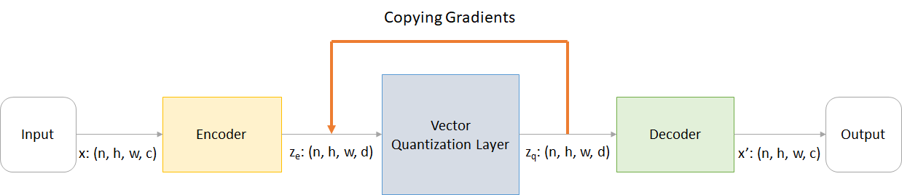
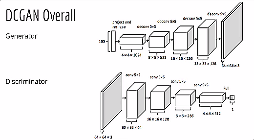
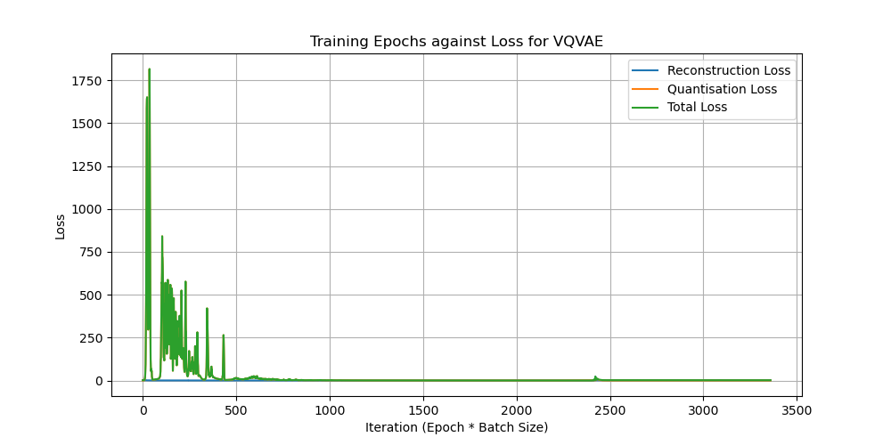
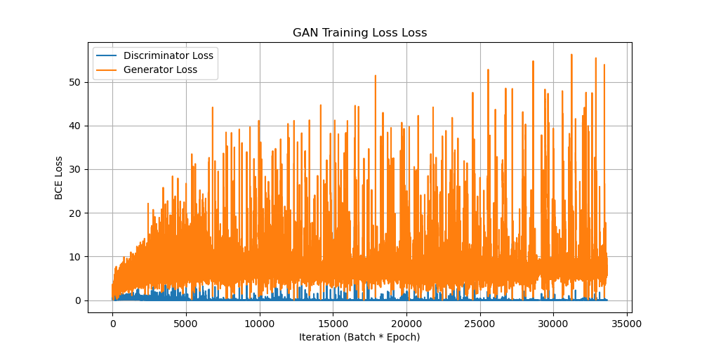
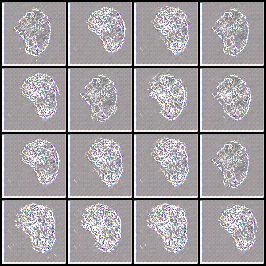
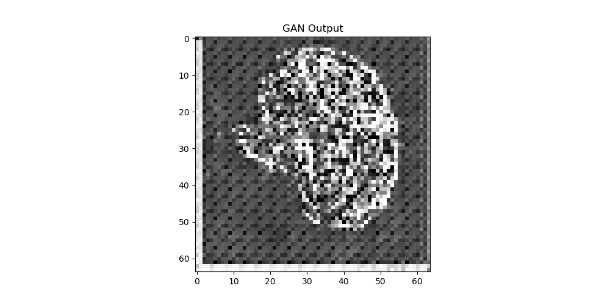
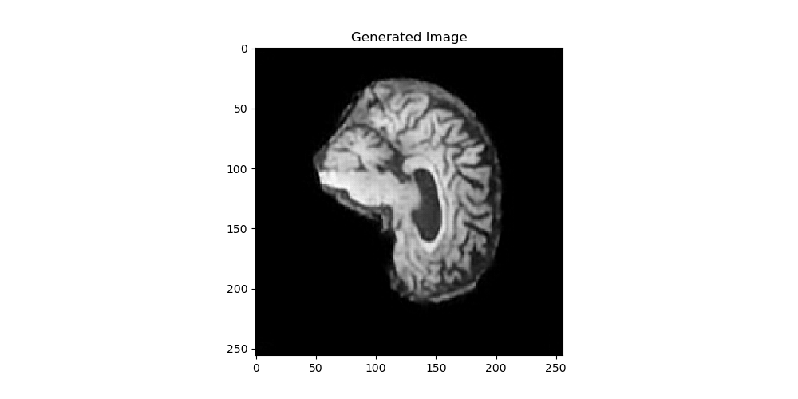

# VQVAE on the ADNI Brain Data Set

## Table of Contents
- [Background](#background)
    - [Problem Description](#problem-description)
    - [Dataset: ADNI](#dataset-adni)
    - [Architecture](#architecture)
        - [VQVAE](#vqvae)
        - [Prior](#prior)
- [Dependencies](#dependencies)
- [Usage](#usage)
- [Results](#results)
    - [Training](#training)
    - [Validation](#validation)
    - [Generation](#generation)
- [Conclusion](#conclusion)
- [Documentation](#documentation)
    - [dataset.py](#datasetpy)
        - [Loader](#class-loader)
        - [Dataset](#class-dataset)
        - [ModelLoader](#class-modelloader)
        - [ModelDataset](#class-modeldataset)
    - [modules.py](#modulespy)
        - [ResidualLayer](#class-residuallayernnmodule)
        - [ResidualBlock](#class-residualblocknnmodule)
        - [Encoder](#class-encodernnmodule)
        - [VectorQuantiser](#class-vectorquantisernnmodule)
        - [Decoder](#class-decodernnmodule)
        - [Discriminator](#class-discriminatornnmodule)
        - [Generator](#class-discriminatornnmodule)
        - [GAN](#class-gannnmodule)
    - [predict.py](#predictpy)
        - [Predict](#class-predict)
    - [train.py](#trainpy)
        - [Trainer](#abstract-class-trainerabc)
        - [TrainVQVAE](#class-trainvqvaetrainer)
        - [TrainGAN](#class-traingantrainer)
- [References](#references)

## Background
### Problem Description
The selected problem is to develop a generative model on the ADNI brain dataset using a VQVAE, to learn the latent space representation and thus produce realistic images. The test driver script is implemented in `main.py`.

### Dataset: ADNI
The models are trained on the Alzheimer's Disease Neuroimaging Initiative (ADNI) dataset. This consists of MRI of the brain for selected patients, with the resulting data labelled as Cognitive Normal (NC) and those with Alzheimer's Disease (AD). The dataset is already separated into a train and test split as follows:

- 21520 images in the training split
    - 10400 images of Alzheimer's Disease (AD)
    - 11120 images of Cognitive Normal (NC)
- 9000 images in the test split
    - 4460 images of Alzheimer's Disease (AD)
    - 4540 images of Cognitive Normal (NC)

Images were scaled to 128 by 128 for interaction with the models used. No augmentation was used as the dataset is of a suitable size.

### Architecture
#### VQVAE
The Vector Quantized Variational Autoencoder (VQ-VAE) is a variant of the standard Variational Autoencoder (VAE) model. The VAE model operates in a continuous latent space, with sampling via a Gaussian distribution<sup>[2]</sup>. The VQVAE adds a vector quantisation layer to instead learn a discrete latent representation<sup>[1]</sup>.


<caption>
    <strong>Figure 1:</strong> VQVAE Architecture
</caption>

<br>
<br>

The VQ-VAE model consists of an encoder, decoder and an added vector quantisation layer. The encoder network parameterises the distribution of the data to convert it to an encoding vector, with each dimension a learned attribute of the data<sup>[5]</sup>. The vector quantiser then discretises this encoding vector from continuous to produce a discrete latent representation. The decoder then reconstructs the data from the discrete latent representation. The vector quantiser is trained to minimise the distance between the input and output of the encoder and decoder, and the encoder and decoder are trained to minimise the distance between the input and output of the vector quantiser<sup>[1]</sup>. The loss function for training the VQVAE is the sum of the embedding loss and reconstruction loss.

#### Prior
A prior network in a VQVAE is used to model the prior distribution of the latent space, as the encoding vector otherwise may not be responsive to random noise. The initial model for the VQ-VAE employed an autoregressive encoder as the prior  via a PixelCNN for the generation of images, following the paper Neural Discrete Representation Learning<sup>[1]</sup>. However, this was substituted with a DCGAN due to familiarity. The generative adversarial network, or simply GAN/DCGAN, is used to take the encoded indices from the VQ-VAE to generate images based on the discrete space representation of the codebook.


<caption>
    <strong>Figure 2:</strong> DCGAN Architecture
</caption>

<br>
<br>

The GAN network trains a generator and discriminator in competition. The discriminator is a binary classification network, which classifies an input/image  as being derived from the generator distribution or data distribution. The generator then aims to maximise the probability of the discriminator incorrectly classifying the output<sup>[4]</sup>. 

## Dependencies
The package dependencies used for the project are:
| **Dependency** | **Version** |
|---|---|
| Python | 3.7.16 |
| pytorch | 1.13.1 |
| torchvision | 0.14.1 |
| numpy | 1.21.5 |
| matplotlib | 3.5.3 |
| skimage | 0.22.0 |

## Usage
The code is bundled and parametrised using the `utils.py` file into `main.py`, which is the driver for the training and prediction sequence. All other files define the architecture, training, testing, dataset and prediction segments of the problem.

Parameters can be edited in `utils.py` to modify the architecture or system. However, components of the code can also be modified to produce custom networks and/or change the models.

For the dataset, create a new Dataset class with the path to the dataset, and the fraction of the dataset to use. This data can be in image folders with labels if desired.
```console
dataset = Dataset()
```

The model can then be created from any child class of `nn.class`. Using the selected `VQVAE()` and `GAN` classes:
```
vqvae = VQVAE()
```

The trainer can then be defined as a child class of `Trainer()` in `train.py`. As we are using the VQVAE model, we will define it:
```
vqvae_trainer = TrainVQVAE(vqvae, dataset)
gan_trainer = TrainGAN(gan, dataset)
```
We can then train the model using the trainer and save the state dictionary containing the network weights to a selected directory and filename:
```console
vqvae_trainer.train()
vqvae_trainer.validate()
vqvae_trainer.save()
gan_trainer.train()
gan_trainer.save()
```

With the model trained, predictions can be performed using a child class of `Predict`. The predict class is implemented specifically to use the prior model (GAN) to generate images using the codebook of the VQVAE. Usage is as follows:
```
predict = Predict(vqvae, gan, dataset)
predict.generate_vqvae()
```

It is highly recommended to use the `main.py` file to execute the code as desired, with the parameters predefined in `utils.py` being modified to reflect the running environment.

## Results
### Training
Training for the VQVAE was performed for 5 epochs, with a learning rate of 0.001 on the full training set. The training set was not split, as the problem is a generative one and so the full dataset is beneficial. A batch size of 32 to prevent issues with memory limits. The loss function used was the embedding (quantised) loss added with mean-squared error of the output defined as the reconstruction loss. The loss function was plotted at each batch, this time unit was defined as an iteration denoted as batch by epoch. The loss over training is shown in Figure 3 below.


<caption>
    <strong>Figure 3:</strong> VQVAE training loss.
</caption>

<br>
<br>

Figure 3 shows that the loss function was dominated by the quantisation loss - which is the loss for embedding the latent space of the features to create a representation of the image. The loss rapidly converges after the first few iterations. Hence, the additional epochs were redundant for training as a local minima was already attained. The model was saved at the end of training.

The Generator and Discriminator networks were trained in competition, as is their architecture, using the VQVAE model to derive the dataset. The generator was trained for 50 epochs, with a learning rate of 0.001. The discriminator was trained for 50 epochs, with a learning rate of 0.001. The loss function used was the binary cross-entropy loss. The loss over training is shown in Figure 4 below.


<caption>
    <strong>Figure 4:</strong> Generator and discriminator training loss.
</caption>

<br>
<br>

The loss of the generator does not converge, and diverges as the training progresses. This is a function of the discriminator rapidly improving, as it approaches a loss of zero. This results in the generator loss increasing as the discriminator is able to classify the generated images as fake or real with complete accuracy. 


### Validation
Validation was performed through a reconstruction process of the test set, to observe how well the model was able to reconstruct the images. This was observed manually. Figure 5 below compares the original images (left), to the reconstructed images.


<caption>
    <strong>Figure 5:</strong> One batch of VQVAE reconstructed images from test set.
</caption>

<br>
<br>

The output of the GAN at each stage was also tracked to observe the progression of the model. Figure 6 below shows the output of the GAN near the end of training.



<caption>
    <strong>Figure 6:</strong> Outputs of the generator at Epoch 48/50.
</caption>

<br>
<br>

### Generation
The model produces images by taking the codebook from the VQVAE, and encoding the indices based on the probabilies from the GAN. The GAN then acts as the generator from the latent space. A generated image from the GAN is shown below:

<caption>
    <strong>Figure 7:</strong> Encoded indices for a single output of the generator from the trained GAN.
</caption>

<br>
<br>

This image is then passed to the `generate_vqvae` function, which quantizes the data using the codebook and then decodes the quantized data to reconstruct the image.


<caption>
    <strong>Figure 8:</strong> VQVAE reconstructed image using the indice from the GAN.
</caption>

<br>
<br>

Compared to an actual image from the dataset.

<p align="center">

</p>
<caption>
    <strong>Figure 9:</strong> Example image from the test set (label is Alzeimer's Disease).
</caption>

<br>
<br>

We see that the structure is highly similar. However, the VQVAE-produced image is unable to generate granular or fine details like those in an actual image. This could be attributed to not enough epochs to learn the requires indices in the codebook, or a poor generation of the indices from the GAN. The generated image is very clearly fake, and hence, this may explain the divergence of the generator loss. The discriminator loss approached zero as the training progressed, as it was always able to classify the generated image as fake due to the inability of the models to learn the indices with sufficient detail.

The accuracy of the images produced by the model can be defined by the structural similarity of the generated image to the testset. It is the overlap of between the structure of the objects in the image, and hence can define the image quality<sup>[6]</sup>.
The generated image was compared using this metric to the entire testset, to compute the average and maximum structural similarity.

| **Metric** | **Value** |
|---|---|
| Average | 0.6239095408766524 |
| Maximum | 0.6728032407980924 |

The SSIM index defines 1.0 as identical, and a value of 0 as having no correlation. Hence, it can be stated that the generated model did have a similar structure to the testset but can be distinguished - as viewed. Thus, the model had reasonable performance.

## Conclusion
The generated images had a structural similarity index above 0.6, indicating that there are distinct similarities between the image structures. However, visually and using this metric, this is not sufficient to deceive an outside observer that the generated image is real. The VQ-VAE was validated, and could reconstruct images from the testing set with loss approaching zero. The GAN was trained on the encoded indices of the VQ-VAE, and was able to classify the generated images as fake with a loss approaching zero. However, the generator loss diverged as the discriminator was able to easily classify the generated images as fake. This is a function of the discriminator rapidly improving, attaining virtually 0 loss. This results in the generator loss increasing as the discriminator is able to easily classify the generated images as fake. Hence, to achieve more realistic results, the autoregressive prior model must be better tuned or a different model must be used.

## Documentation
Documentation for all classes, including their associated public methods and parameters is provided below. The implementation of the software flow is class-based, and hence, is not executable directly as a script. Driver implementation is provided in `main.py`, with all parameters defined in `utils.py`.

### `dataset.py`
#### Class `Loader()`
Abstract class for implementing the dataset object.

**Parameters**
- __batch_size, 32__ -> Size of the batch for processing
- __path__ -> Directory path of the dataset
- __fraction, 1.0__ -> How much of the dataset to use to create the loader
- __transform__ -> Transform to apply to the data

**Methods**
`load() -> None`
Load the dataset from the ImageFolder at the given path and store it.

`get() -> DataLoader`
Return the loaded dataset.

`unloaded() -> bool`
Verify that the dataset has been loaded.

`variance() -> float`
Compute the variance of the dataset and store it. Once computed, it does not need to be recalculated.

#### Class `Dataset()`
**Parameters**
- __batch_size, 32__ -> Size of the batch for processing
- __path__ -> Directory path of the dataset for both test and train splits
- __fraction, 1.0__ -> How much of the dataset to use to create the loader

**Methods**
`load_train() -> None`
Loads the data for the training set.

`get_train() -> DataLoader`
Returns the training dataset.

`load_test() -> None`
Loads the data for the testing set.

`get_test() -> DataLoader`
Returns the testing dataset.

`train_unloaded() -> bool`
Check if the training set has not yet been loaded.

`train_var() -> float`
Get the variance of the training set.

`test_unloaded() -> bool`
Check if the testing set has not yet been loaded.

`test_var() -> float`
Get the variance of the testing set.

#### Class `ModelLoader()`
Abstract class for implementing the dataset object.

**Parameters**
- __model__ Model to use to generate the images
- __batch_size, 32__ Size of the batch for processing
- __path__ Directory path of the dataset
- __fraction, 1.0__ How much of the dataset to use to create the loader
- __transform__ Transform to apply to the data

**Methods**
`load() -> None`
Load the dataset from the ImageFolder at the given path and store it.

`get() -> DataLoader`
Return the loaded dataset.

`unloaded() -> bool`
Verify that the dataset has been loaded.

`variance() -> float`
Compute the variance of the dataset and store it. Once computed, it does not need to be recalculated.

#### Class `ModelDataset()`
**Parameters**
- __model__ Model to use to generate the image loaders
- __batch_size, 32__ -> Size of the batch for processing
- __path__ -> Directory path of the dataset for both test and train splits
- __fraction, 1.0__ -> How much of the dataset to use to create the loader

**Methods**
`load_train() -> None`
Loads the data for the training set.

`get_train() -> DataLoader`
Returns the training dataset.

`load_test() -> None`
Loads the data for the testing set.

`get_test() -> DataLoader`
Returns the testing dataset.

`train_unloaded() -> bool`
Check if the training set has not yet been loaded.

`train_var() -> float`
Get the variance of the training set.

`test_unloaded() -> bool`
Check if the testing set has not yet been loaded.

`test_var() -> float`
Get the variance of the testing set.

### `modules.py`
#### Class `ResidualLayer(nn.Module)`
Reusable residual layer for use in residual stacks/blocks.
**Parameters**
__in_channels__ Number of input channels
__n_hidden__ Number of output channels (generally equal to number of input)
__n_residual__ Number of residual hidden layers


#### Class `ResidualBlock(nn.Module)`
**Parameters**
- __dim_in__ Dimension of the tensor input
- __dim_hidden__ Dimension of the hidden layers
- __dim_residual__ Dimension of the residual hidden layer
- __n_residuals__ Number of residual layers

#### Class `Encoder(nn.Module)`
**Parameters**
- __in_channels__ Number of input channels
- __n_hidden__ Number of hidden layers
- __n_residual__ Number of residual hidden layers
- __out_channels__ Number of channels of output

#### Class `VectorQuantiser(nn.Module)`
**Parameters**
- __n_embeddings__ Number of embeddings in the codebook
- __dim_embedding__ Dimension of each embedding
- __beta__ Commitment cost of loss

#### Class `Decoder(nn.Module)`
**Parameters**
- __in_channels__ Number of input channels.
- __n_hidden__ Number of hidden layers
- __n_residual__ Number of residual hidden layers
- __out_channels__ Number of channels for the output

#### Class `VQVAE(nn.Module)`
Class which layers the encoder, vector quantiser and decoder.
**Parameters**
- __channels__ Number of input channels
- __n_hidden__ Number of hidden layers
- __n_residual__ Number of residual hidden layers
- __n_embeddings__ Number of embeddings in the codebook
- __dim_embedding__ Dimension of each embedding
- __beta__ Commitment cost term for vector quantizer

#### Class `Discriminator(nn.Module)`
Discriminator is used as a binary classifier to detect the quality of the generator. It will output the probability of the image being real or fake.

**Parameters**
- __channels__ Number of input channels on the image
- __img_size__ Size of the image

#### Class `Generator(nn.Module)`
The generator will create images of the selected size from the random latents.
**Parameters**
- __latent_size__ Latent size of input vector
- __channels__ Number of channels for the output


#### Class `GAN()`
GAN class for containing the generator and discriminator models to ensure that the parameters passed to the models are aligned.
**Parameters**
- __channels__ Number of input channels
- __latent_dim__ Size of noise
- __img_size__ Size of image output, assumed square

### `predict.py`
#### Class `Predict()`
The Predict class is specific to the VQVAE with Prior model. It handles the generation of images and provides performance metrics.
**Parameters**
- __vqvae__ A trained VQVAE model
- __gan__ A trained GAN
- __dataset__ Dataset 
- __device, 'cpu'__ Device to perform the methods on
- __savepath, './models/predictions/'__ The directory path to save the outputs to by default
- __img_size, 64__ The size of the images to be generated

**Methods**
`generate_vqvae() -> None`
Generate a reconstruction of an image using the latent space from the GAN, and display it using Matplotlib.

`quantise() -> Tensor`
Quantise the latent space using the codebook from the VQVAE. It will return the quantised result.

`generate_gan() -> None`
Using random noise, generate the encoded indices of the dataset and set a single output of the batch to the class.

`ssim() -> float`
Compute and print the max and average structural similarity index of a single generated image, compared to the testset of the provided dataset.

### `train.py`
#### Abstract Class `Trainer(ABC)`
This super class is provided to define the required methods and initialise parameters for any future train classes.

**Parameters**
- __model: nn.Module__ The module to be trained
- __dataset: Dataset__ Dataset object containing train data
- __lr, 1e-3__ The learning to use
- __wd, 0__ Weight decay to use
- __epochs, 10__ Number of epochs to train for
- __savepath, './models/vqvae'__ The default save directory for outputs and the model

**Methods**
`train() -> None`
Abstract method to implement to define the train behaviour.

`validate() -> None`
Abstract method to implement to define the validate behaviour.

`plot() -> None`
Abstract method to define how to plot any results.

#### Class `TrainVQVAE(Trainer)`
Trainer specific for the defined VQVAE module. It uses the Adam optimiser by default, and error is defined as the embedding loss summed with the mean-squared error of the model output.

**Parameters**
- __model: nn.Module__ The module to be trained
- __dataset: Dataset__ Dataset object containing train data
- __lr, 1e-3__ The learning to use
- __wd, 0__ Weight decay to use
- __epochs, 10__ Number of epochs to train for
- __savepath, './models/vqvae'__ The default save directory for outputs and the model

**Methods**
`train() -> None`
Training is done in batches from the dataset. The loss is saved to the model via `self.losses` for future plotting. This must be run to train the model.

`validate() -> None`
Use the testset to reconstruct the images using the quantizer and decoder for visualisation.

`plot(save = True) -> None`
Implementing of the abstract plot method. It will plot the losses at each iteration computed during training. If save is true, then the figure will be saved to the savepath.

`save(newpath = None) -> None`
Method to save the state dictionary of the model network. The save path can be overriden using newpath, else it will be saved to the directory of savepath.

#### Class `TrainGAN(Trainer)`
Trainer specific for the defined GAN module. It uses the Adam optimiser by default for both generator and discriminator. The criterion used is BCE loss, with the generato

**Parameters**
- __model: nn.Module__ The module to be trained
- __dataset: Dataset__ Dataset object containing train data
- __lr, 1e-3__ The learning to use
- __wd, 0__ Weight decay to use
- __epochs, 10__ Number of epochs to train for
- __savepath, './models/gan'__ The default save directory for outputs and the model

**Methods**
`train() -> None`
Training is done in batches from the dataset. Two models are 

`plot(save = True) -> None`
Implementing of the abstract plot method. It will plot the losses at each iteration computed during training. If save is true, then the figure will be saved to the savepath.

`save(newpath = None) -> None`
Method to save the state dictionary of the model network. The save path can be overriden using newpath, else it will be saved to the directory of savepath.


## References
[1] A. v. d. Oord, O. Vinyals, and K. Kavukcuoglu, “Neural Discrete Representation Learning,”
arXiv:1711.00937 [cs], May 2018, arXiv: 1711.00937. [Online]. Available: http://arxiv.org/abs/1711.00937

[2] Laskin, Misha (2019), Vector Quantized Variational Autoencoder. [Online] Available: https://github.com/MishaLaskin/vqvae

[3] Team, K. (2021). Keras documentation: Vector-Quantized Variational Autoencoders. [Online] Keras.io. Available: https://keras.io/examples/generative/vq_vae

[4] I. J. Goodfellow, J. Pouget-Abadie, M. Mirza, B. Xu, D. Warde-Farley, S. Ozair, A. Courville, and Y. Bengio, "Generative Adversarial Nets," arXiv:1406.2661v1, June 2014, [Online]. Available: https://arxiv.org/abs/1406.2661

[5] J. Jordan, "Variational Autoencoders," Jeremy Jordan, 19-Mar-2018. [Online]. Available: https://www.jeremyjordan.me/variational-autoencoders/

[6] C. Gerlach, "Different Measures of Structural Similarity Tap Different Aspects of Visual Object Processing," in Frontiers in Psychology, Vol. 8, 2017. [Online]. Available: https://doi.org/10.3389/fpsyg.2017.01404