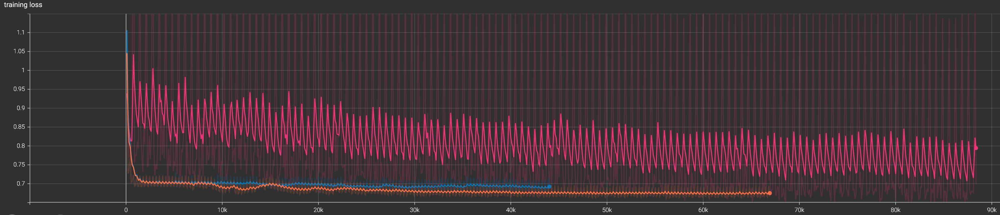
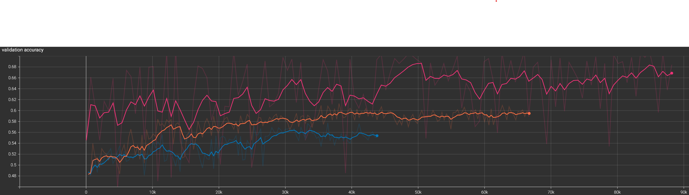

# Visual Transformer for Classification

This project uses a Vision Transformer model to classify images from the ADNI brain dataset as images of either normal or Alzheimer brains. It makes use of the `vit_base_patch32_224.augreg_in21k_ft_in1k` model from the paper [How to train your ViT? Data, Augmentation, and Regularization in Vision Transformers](https://browse.arxiv.org/pdf/2106.10270.pdf), and supplied by the **timm** package by Ross Wightman.

## What is a Vision Transformer?

A Vision Transformer is a model that takes in an image, splits it into a number of small (in this case 32x32) chunks, creates a linear array of those chunks, and passes that array of chunks (with each chunck concatenated with a positional embedding vector) as the tokens for a transformer classifier to operate on.

The reason that Vision Transformers can be more effective than CNNs when given sufficient data comes down to the essential reason that CNNs are effective; they are structured based on the assumption that two pixels next to each other are going to be highly correlated, and that repeatedly analysing local relationships is sufficient to determine the global structure of the image. This is a reasonable bias to introduce into a classifier, since it is broadly true of most images, and allows a CNN to achieve a high amount of accuracy on a small amount of data. ViTs, meanwhile, have no inductive bias towards considering local relationships and to the extent that this is important have to learn it. This means they require more data to get to the same level of accuracy (benefitting significantly more than CNNs from data augmentation), but have the advantage that they can learn exactly the extent to which local relationships are important and no more. Viewing them as statistical constructs, CNNs have a bias introduced to allow them to converge faster, but because they are biased they don't converge towards true predictors of the image labels, whereas ViTs, as unbiased (or at least less biased) estimators converge slower, but do converge towards true predictors of the image labels.

## Train, Validation, Test Split

The dataset used for this task was the ADNI dataset for Alzheimer’s disease. This dataset comes with a test, train split already outlined, with the test split containing 4060 images in the AD class and 4060 in the NC class. To get a validation dataset I manually split the train dataset in two. I moved all images for patients with IDs starting with 41 from the test AD class to a validation AD class, and all images for patients with IDs starting with 11 from the test NC class to a validation NC class. This resulted in the validation AD class having 400 images and the NC class having 480, while the train AD class has 10400 and the train NC class has 11120.

## Pre-Processing

To pre-process the data I have simply padded the images to be square 256x256, converted them from 3-channel to 1-channel since the images are greyscale, and normalised them. For the training data specifically I have also done some data augmentation, by randomly rotating the images and randomly resizing and cropping them. This was done since this is a fairly small dataset, the more data a transformer can see the better, and while augmenting the data is not the same as providing actual new independent samples, it is better than not. I have not performed any model regularisation since [How to train your ViT? Data, Augmentation, and Regularization in Vision Transformers](https://browse.arxiv.org/pdf/2106.10270.pdf) suggests that regularisation is less likely to be useful than augmentation.

## Example Classifications

Below are some example images of brains, with each one listed along with their true label, what the trained model guessed the label was, and the confidence that the model assigned that guess as a probability. This is based on the 5th long training run I completed, which had the best accuracy on the test set.

Interestingly, the model still seems very unsure in its guesses, assigning them all probabilities near 50%.

## How does the Vision Transformer perform?

I performed six long training runs in total. The first two were done with the `vit_base_patch32_224.augreg_in21k_ft_in1k` model, the next two with `vit_tiny_patch16_224.augreg_in21k_ft_in1k` to see if less parameters would improve the training, and the last back with `vit_base_patch32_224.augreg_in21k_ft_in1k`, but with the model set to train only the last layer's weights. The training runs with the unmodified `base` model were able to get the lowest training loss, but performed worse on validation accuracy than `base` only training the final layer. The `tiny` model never improved at all beyond its starting performance and thus I have not shown those runs in the below graphs. Finally, the two runs with the `base` model only training the last layer were essentially identical and so only one is being shown for clarity. In both of the below, the orange line shows the first runs performance, the blue shows the second's, and the pink shows the final.

This graph shows the value of the loss function during training, with the faded line showing the raw value sampled every 100 steps, and the full-colour line being the smoothed value. As noted above, the first two runs perform much better than the final by this metric. Looking at the unsmoothed value of the pink graph, we can see that the graph is very consistently spiky, indicating that there is a subset of the training set which the model performs much worse on than it does on the rest.

This graph shows the value of the validation accuracy, recorded after each epoch. Here we can see that neither of the first two runs achieves more than 60% accuracy on the validation set, while the final run had a peak performance of approximately 70% and by the end of the run was fairly consistently averaging in the 65% to 68% range. Together with the graph above this indicates that the unconstrained `base` model was likely overfitting on the training data and failing to generalise.

The final accuracy of the run 5 model on the test set was 62.3%, which I believe is fairly good for this model considering the small amount of data and the degree to which transformers require large amounts of data to successfully overcome the lack of inductive bias that they have.

## Dependencies

Notable dependencies of this project are as follows:

[//]: # (Check torch version on rangpur.)

|   Package   |   Version    |
| ----------- | ------------ |
| matplotlib  |    3.5.3     |
|    numpy    |    1.23.1    |
|    torch    | 2.0.1+cu117  |
| torchvision | 0.15.2+cu117 |
|    timm     |    0.9.7     |
