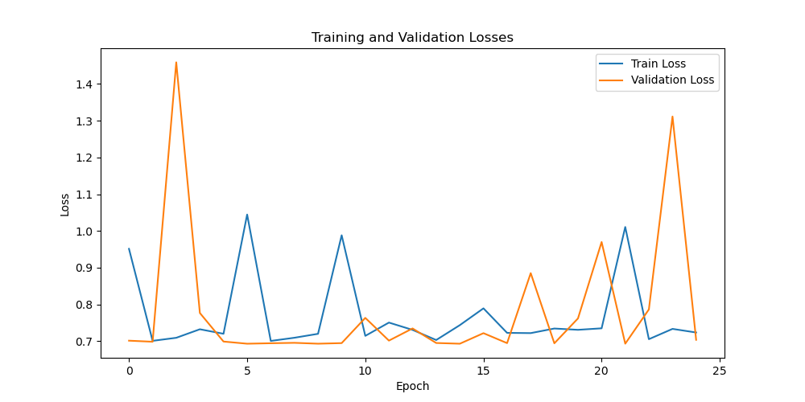
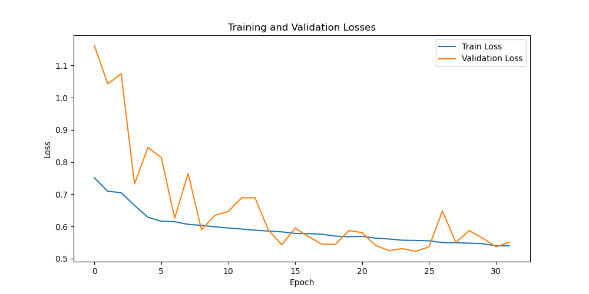

# Classify Alzheimer’s Disease using ViT

## Description
Alzeimer's disease from MRI scans using Visual Transformers (ViT). It leveraged the algorithms ability to create correlations between different parts of the brain with teh hopes of it being able to identify the key areas which relate to Alzeimer's disease. The project was completed as part of the COMP3710 course at the University of Queensland. The final model was able to achieve 66.94% accuracy on the test set.

---

## Table of Contents
- [How it works](#how-it-works)
- [Dependencies](#dependencies)
- [Reproducibility](#reproducibility)
- [Example Inputs, Outputs, and Plots](#example-inputs-outputs-and-plots)
- [Data Pre-Processing and Splits](#data-pre-processing-and-splits)
- [Training and Evaluation](#training-and-evaluation)


## How it Works

### Overview
The Visual Transformer is a model which is based on the orinally text-based Transformer architecture. It considers an image input, divides it into patches, and then linearly embeds them. Following this the patches would go through a series of transformer layers so as to extract features. The final feature vector is then used for the classification. In this particular case, the model is trained on a dataset of medical images, each labeled as either 'Normal' or 'Alzheimer’s disease'.


### Network Architecture: Visual Transformer (ViT)


As previously stated, the Visual Transformer (ViT) is a neural network architecture which leverages the, originally natural language-based, Transformer model. The architecture consists of the following main components:

1. **Patch Embedding**: The input image is divided into small patches (e.g., 16x16 pixels). Each of these patches is then flattened and transformed into a 1D vector. This is done so as to linear embedd them so as to form a sequence of embeddings.
  
2. **Positional Encoding**: Most interesting about the transformer model is its ability to encapsulating information about relative positions of the patches. This is done by adding positional encodings to the patch embeddings.

3. **Transformer Blocks**: Core to the ViT model are the Transformer blocks. Each of these blocks consists of a multi-head self-attention layer followed by feed-forward neural networks. These transformer blocks are the components which are responsible for feature extraction.

4. **Classification Head**: Finally the output from the Transformer blocks is passed through a linear layer for classification.

---

#### Modules in `modules.py`

1. **PatchEmbed**: This module is the one responsible for breaking the input image into patches and linearly embedding them. It does this by using a Conv2D layer for both patch extraction and linear embedding.

2. **Attention**: This is the multi-head self-attention module. It works by taking in the patch embeddings, applying self-attention to weigh the importance of different patches relative to each other, and outputing a new set of embeddings.

3. **MLP**: This is a simple Multi-Layer Perceptron (as commonly found within neural networks) which consists of fully connected layers, usually followed by activation functions like ReLU and normalization layers. This is crucial since it serves as the feed-forward neural network in the Transformer blocks.

4. **Block**: This encapsulates one "block" of the transformer consisting of the Attention layer and the MLP - in that order. It should be noted that layer normalization is also usually applied before and/or after each of these sub-layers.

5. **VisionTransformer**: This is where is all comes together! It takes an image as input, applies PatchEmbed (see above) so as to create patch embeddings, adds positional encodings, and then passes them through multiple Transformer Blocks. After all that, finally, a classification head is applied to the output of the last Transformer block so as to make predictions.

---

## Dependencies

### Main Packages
- `torch==2.0.1`
- `torchvision==0.15.2`
- `Pillow==9.4.0`
- `matplotlib==3.7.1`
- `numpy==1.25.0`

### Additional Packages (Optional)
- `scikit-image==0.20.0`
- `scikit-learn==1.2.2`
- `scipy==1.11.1`

---

## Reproducibility

### Random Seeds
To ensure reproducibility, the following random seeds were set:

```python
random.seed(0)
torch.manual_seed(0)
torch.cuda.manual_seed(0)
torch.cuda.manual_seed_all(0)
```

### Data Configuration & Split
The dataset was pre-split into training and test sets, organized in the following folder structure:

```
AD_NC
├── test
│   ├── AD
│   └── NC
└── train
    ├── AD
    └── NC
```

The dataset can be obtained from [ADNI](http://adni.loni.usc.edu/).

---

### Training Configuration
- Learning Rate: 0.075
- Optimizer: SGD with CyclicLR
- Batch Size: 128
- Number of Epochs: 50
- Number of Workers: 2
- Momentum: 0.9
- Early Stopping: After 7 epochs of no improvement in validation loss

---

### Model Initialization Parameters
- Image Size: 256
- Depth: 4  
- Number of Heads: 4  
- MLP Ratio: 2.0  
- Embedding Dimension: 256  
- Dropout Probability: 0.25 (for both MLP and Attention)

---

### Environment
The model was trained on Rangpur High-Performance Computers with P100 GPUs. 1 GPU was allocated and an additional 2 CPU units were allocated for the data loaders.

---

## Example Inputs, Outputs, and Plots

### Input Images
The model takes in 256x256 pixel images as input. Below are some examples:

AD:


NC:


---

### Predictions
The model outputs a classification closer to 0 or 1 - for 1 (or near 1) indicates a classification Alzheimer's Disease. 

---

### Plots
The following graph shows the final chosen training and validation loss across epochs:


To appreciate what's happening here, let's compare it with the following plot:


This second model was trained with relatively the same attributes except:
- it did not normalise the data
- it had a small learning rate

Let's now compare the two plots, so as to appreciate the strength of the final chosen model.

A common occurence during the training was overfitting. This is evident in the graph above as the train scores keep getting better yet the validation scores actually increase! In some cases, this may be because model become so large that it would simply learn the training data - [this plot from test 49](train_val_loss_curves/training_and_validation_loss_49.png) is a good example of where this might happen. Thus the strength of the chosen model comes from its ability to generalise well to unseen data. Methods such as teh introduction of droppout, normalisation and early stopping were implemented to help to prevent overfitting.

---

### Attention Visualizations
The model's attention mechanism can be visualized so as to understand where the model focuses its "attention" while making predictions. Below are some examples:


---

## Data Pre-Processing and Splits

### Pre-Processing
Images were resized to 256x256 pixels. The following data augmentation techniques were applied to the training data:

- Random Horizontal Flip
- Random Vertical Flip

Images were normalized using calculated mean and standard deviation values:

- Mean: 0.1156
- Standard Deviation: 0.2244

```python
# Data transforms for training data
data_transforms = transforms.Compose([
    transforms.Resize((img_size, img_size)),
    transforms.RandomHorizontalFlip(),
    transforms.RandomVerticalFlip(),
    transforms.ToTensor(),
    transforms.Normalize(mean=mean, std=std),
])

# Standard transforms
standard_transforms = transforms.Compose([
    transforms.Resize((img_size, img_size)),
    transforms.ToTensor(),
    transforms.Normalize(mean=mean, std=std),
])
```

Mean and standard deviation were calculated using the `DatasetStatistics` module:

```python
dataset_statistics = DatasetStatistics(train_dataset)
mean, std = dataset_statistics.calculate_statistics()
```

### Data Splits
The dataset was pre-divided into training and test sets. The training set was further divided into training and validation sets, comprising 80% and 20% of the data, respectively. Special care was taken to ensure that all slices from the same patient are in the same subset (either training or validation).
Data split is crucial so as to ensure generalisability as well as balance it with the amount of data available. For this case the data was already split into training and test sets. Additional to this though it was further split into training and validation sets, comprising 80% and 20% of the data, respectively. Special care was taken to ensure that all slices from the same patient are in the same subset (either training or validation).

The code snippet below shows how the data was split:

```python
train_dataset = ADNIDataset(root_dir=root_dir, subset='train', transform=data_transforms)

unique_patient_ids = list(set('_'.join(path.split('/')[-1].split('_')[:-1]) for path, _ in train_dataset.data_paths))
validation_patient_ids = set(random.sample(unique_patient_ids, int(0.2 * len(unique_patient_ids)))) 

train_data_paths = [(path, label) for path, label in train_dataset.data_paths if '_'.join(path.split('/')[-1].split('_')[:-1]) not in validation_patient_ids]
val_data_paths = [(path, label) for path, label in train_dataset.data_paths if '_'.join(path.split('/')[-1].split('_')[:-1]) in validation_patient_ids]

# train data set paths were then re-assigned and the validation dataloader was created
```

## Training and Evaluation
### Evaluation and Final Output
The final evaluation was a relatively small ViT model which was able to get 66.94%. The attention visualisations help to see that it chose key areas to focus on - these may correlate to key parts in the brain which relate to differences between AD and NC patients. 
The model itself exited training after stopping early after 26 epoch - choosing the previously best model after 19 epoch (hence the patience of 7 epoch). It took less than 20min to train and test the model on the GPU, which is much faster than other models tested - with the larger ones takeing a couple hours.


### Hyperparameters Tuning
So how did we get to the final model?
In the process of trying to increase the model performance, a myriad of hyperparameters were tuned. The following table shows the hyperparameters that were tuned, along with the values that were tried:
<html><head><meta http-equiv="Content-Type" content="text/html; charset=utf-8"/><title>Hyperparameter Tuning Table</title>
</head>
<body>
	<article id="6b6c22c8-c8bb-41cc-93cb-fb88f03a75fa" class="page sans">
		<header>
			<h1 class="page-title">Hyperparameter Tuning Table</h1>
			<p class="page-description">Table recording results from training a range of different hyperparameters. Note that it was not until test 45 that std and the mean were added as data regularisation. Other key changes include changing the droppout probabilities from 0 (activating them), the model size, and the learning rate.</p>
		</header>
		<div class="page-body">
			<table class="collection-content">
				<thead>
					<tr>
						<th>Name</th>
						<th>Acc</th>
						<th>lr</th>
						<th>model</th>
						<th>Sched.</th>
						<th>Epoch</th>
						<th>Batch</th>
						<th>loss curve</th>
						<th>Mom-entum</th>
						<th>depth</th>
						<th>embed dim</th>
						<th>mlp ratio</th>
						<th>num head</th>
						<th>drop p</th>
						<th>drop attn p</th>
						<th>
							<span class="icon property-icon">
								<svg role="graphics-symbol" viewBox="0 0 16 16" style="width:14px;height:14px;display:block;fill:rgba(55, 53, 47, 0.45);flex-shrink:0" class="typesCreatedAt">
									<path d="M8 15.126C11.8623 15.126 15.0615 11.9336 15.0615 8.06445C15.0615 4.20215 11.8623 1.00293 7.99316 1.00293C4.13086 1.00293 0.938477 4.20215 0.938477 8.06445C0.938477 11.9336 4.1377 15.126 8 15.126ZM8 13.7383C4.85547 13.7383 2.33301 11.209 2.33301 8.06445C2.33301 4.91992 4.84863 2.39746 7.99316 2.39746C11.1377 2.39746 13.6738 4.91992 13.6738 8.06445C13.6738 11.209 11.1445 13.7383 8 13.7383ZM4.54102 8.91211H7.99316C8.30078 8.91211 8.54004 8.67285 8.54004 8.37207V3.8877C8.54004 3.58691 8.30078 3.34766 7.99316 3.34766C7.69238 3.34766 7.45312 3.58691 7.45312 3.8877V7.83203H4.54102C4.2334 7.83203 4.00098 8.06445 4.00098 8.37207C4.00098 8.67285 4.2334 8.91211 4.54102 8.91211Z"></path>
								</svg>
							</span>
						</th>
					</tr>
				</thead>
				<tbody>
					<tr id="9b3fd3bf-c3af-430a-b5c4-4a76f39ed866">
						<td class="cell-title"><a href="https://www.notion.so/test-1-9b3fd3bfc3af430ab5c44a76f39ed866?pvs=21">test 1</a></td>
						<td class="cell-GIf?">50.44%</td>
						<td class="cell-iPv?">0.1</td>
						<td class="cell-{HMZ"><span class="selected-value select-value-color-orange">AdamW</span></td>
						<td class="cell-zrto"><span class="selected-value select-value-color-purple">NONE</span></td>
						<td class="cell-bqmk">25</td>
						<td class="cell-oDAq">32</td><td class="cell-Om|L"><span style="margin-right:6px"><a href="train_val_loss_curves/training_and_validation_loss_1.png"></a></span></td>
						<td class="cell-wpjC"></td>
						<td class="cell-wO]S">12</td>
						<td class="cell-W^v&lt;">768</td>
						<td class="cell-Bb=T">4</td>
						<td class="cell-AKYc">12</td>
						<td class="cell-[t|F">0</td>
						<td class="cell-ug~:">0</td><td class="cell-WNgS"><time>Oct 1 7:06 PM</time></td>
					</tr>
					<tr id="68ae512d-8d27-458d-ada5-e5af743b1813">
						<td class="cell-title"><a href="https://www.notion.so/test-3-68ae512d8d27458dada5e5af743b1813?pvs=21">test 3</a></td>
						<td class="cell-GIf?">50.44%</td>
						<td class="cell-iPv?">0.05</td>
						<td class="cell-{HMZ"><span class="selected-value select-value-color-orange">AdamW</span></td>
						<td class="cell-zrto"><span class="selected-value select-value-color-purple">NONE</span></td>
						<td class="cell-bqmk">21</td>
						<td class="cell-oDAq">32</td><td class="cell-Om|L"><span style="margin-right:6px"><a href="train_val_loss_curves/training_and_validation_loss_3.png"></a></span></td>
						<td class="cell-wpjC"></td>
						<td class="cell-wO]S">12</td>
						<td class="cell-W^v&lt;">768</td>
						<td class="cell-Bb=T">4</td>
						<td class="cell-AKYc">12</td>
						<td class="cell-[t|F">0</td>
						<td class="cell-ug~:">0</td><td class="cell-WNgS"><time>Oct 1 7:06 PM</time></td>
					</tr>
					<tr id="de89d91e-f622-4c07-be40-707082a9acaf">
						<td class="cell-title"><a href="https://www.notion.so/test-4-de89d91ef6224c07be40707082a9acaf?pvs=21">test 4</a></td>
						<td class="cell-GIf?">50.44%</td>
						<td class="cell-iPv?">0.05</td>
						<td class="cell-{HMZ"><span class="selected-value select-value-color-orange">AdamW</span></td>
						<td class="cell-zrto"><span class="selected-value select-value-color-yellow">Cyclic</span></td>
						<td class="cell-bqmk">24</td>
						<td class="cell-oDAq">32</td><td class="cell-Om|L"><span style="margin-right:6px"><a href="train_val_loss_curves/training_and_validation_loss_4.png"></a></span></td>
						<td class="cell-wpjC"></td>
						<td class="cell-wO]S">12</td>
						<td class="cell-W^v&lt;">768</td>
						<td class="cell-Bb=T">4</td>
						<td class="cell-AKYc">12</td>
						<td class="cell-[t|F">0</td>
						<td class="cell-ug~:">0</td><td class="cell-WNgS"><time>Oct 1 7:06 PM</time></td>
					</tr>
					<tr id="5fd9ac6f-d84b-4665-9835-2c06184556c4">
						<td class="cell-title"><a href="https://www.notion.so/test-5-5fd9ac6fd84b466598352c06184556c4?pvs=21">test 5</a></td>
						<td class="cell-GIf?">49.55%</td>
						<td class="cell-iPv?">0.3</td>
						<td class="cell-{HMZ"><span class="selected-value select-value-color-orange">AdamW</span></td>
						<td class="cell-zrto"><span class="selected-value select-value-color-yellow">Cyclic</span></td>
						<td class="cell-bqmk">23</td>
						<td class="cell-oDAq">32</td><td class="cell-Om|L"><span style="margin-right:6px"><a href="train_val_loss_curves/training_and_validation_loss_5.png"></a></span></td>
						<td class="cell-wpjC"></td>
						<td class="cell-wO]S">12</td>
						<td class="cell-W^v&lt;">768</td>
						<td class="cell-Bb=T">4</td>
						<td class="cell-AKYc">12</td>
						<td class="cell-[t|F">0</td>
						<td class="cell-ug~:">0</td><td class="cell-WNgS"><time>Oct 1 7:06 PM</time></td>
					</tr>
					<tr id="58715d76-5315-44fb-8ee1-294df16cb1a7">
						<td class="cell-title"><a href="https://www.notion.so/test-6-58715d76531544fb8ee1294df16cb1a7?pvs=21">test 6</a></td>
						<td class="cell-GIf?">59.44%</td>
						<td class="cell-iPv?">0.3</td>
						<td class="cell-{HMZ"><span class="selected-value select-value-color-orange">AdamW</span></td>
						<td class="cell-zrto"><span class="selected-value select-value-color-purple">NONE</span></td>
						<td class="cell-bqmk">21</td>
						<td class="cell-oDAq">32</td><td class="cell-Om|L"><span style="margin-right:6px"><a href="train_val_loss_curves/training_and_validation_loss_6.png"></a></span></td>
						<td class="cell-wpjC"></td>
						<td class="cell-wO]S">12</td>
						<td class="cell-W^v&lt;">768</td>
						<td class="cell-Bb=T">4</td>
						<td class="cell-AKYc">12</td>
						<td class="cell-[t|F">0</td>
						<td class="cell-ug~:">0</td><td class="cell-WNgS"><time>Oct 1 7:15 PM</time></td>
					</tr>
					<tr id="85906804-604f-427f-9585-c1f43c9668f8">
						<td class="cell-title"><a href="https://www.notion.so/test-7-85906804604f427f9585c1f43c9668f8?pvs=21">test 7</a></td>
						<td class="cell-GIf?">51.4%</td>
						<td class="cell-iPv?">0.5</td>
						<td class="cell-{HMZ"><span class="selected-value select-value-color-orange">AdamW</span></td>
						<td class="cell-zrto"><span class="selected-value select-value-color-yellow">Cyclic</span></td>
						<td class="cell-bqmk">21</td>
						<td class="cell-oDAq">32</td><td class="cell-Om|L"><span style="margin-right:6px"><a href="train_val_loss_curves/training_and_validation_loss_7.png"></a></span></td>
						<td class="cell-wpjC"></td>
						<td class="cell-wO]S">12</td>
						<td class="cell-W^v&lt;">768</td>
						<td class="cell-Bb=T">4</td>
						<td class="cell-AKYc">12</td>
						<td class="cell-[t|F">0</td>
						<td class="cell-ug~:">0</td><td class="cell-WNgS"><time>Oct 1 7:15 PM</time></td>
					</tr>
					<tr id="54176f75-12c6-43bc-a4f2-62c32d2aa017">
						<td class="cell-title"><a href="https://www.notion.so/test-11-54176f7512c643bca4f262c32d2aa017?pvs=21">test 11</a></td>
						<td class="cell-GIf?">65.7%</td>
						<td class="cell-iPv?">0.05</td>
						<td class="cell-{HMZ"><span class="selected-value select-value-color-purple">SDG</span></td>
						<td class="cell-zrto"><span class="selected-value select-value-color-yellow">Cyclic</span></td>
						<td class="cell-bqmk">50</td>
						<td class="cell-oDAq">32</td><td class="cell-Om|L"><span style="margin-right:6px"><a href="train_val_loss_curves/training_and_validation_loss_11.png"></a></span></td>
						<td class="cell-wpjC"></td>
						<td class="cell-wO]S">12</td>
						<td class="cell-W^v&lt;">768</td>
						<td class="cell-Bb=T">4</td>
						<td class="cell-AKYc">12</td>
						<td class="cell-[t|F">0</td>
						<td class="cell-ug~:">0</td><td class="cell-WNgS"><time>Oct 2 11:12 AM</time></td>
					</tr>
					<tr id="9297609c-fdf5-4fc1-a3d0-5a9d9f2b102a">
						<td class="cell-title"><a href="https://www.notion.so/test-12-9297609cfdf54fc1a3d05a9d9f2b102a?pvs=21">test 12</a></td>
						<td class="cell-GIf?">63.56%</td>
						<td class="cell-iPv?">0.05</td>
						<td class="cell-{HMZ"><span class="selected-value select-value-color-purple">SDG</span></td>
						<td class="cell-zrto"><span class="selected-value select-value-color-yellow">Cyclic</span></td>
						<td class="cell-bqmk">33</td>
						<td class="cell-oDAq">32</td><td class="cell-Om|L"><span style="margin-right:6px"><a href="train_val_loss_curves/training_and_validation_loss_12.png"></a></span></td>
						<td class="cell-wpjC">0.01</td>
						<td class="cell-wO]S">12</td>
						<td class="cell-W^v&lt;">768</td>
						<td class="cell-Bb=T">4</td>
						<td class="cell-AKYc">12</td>
						<td class="cell-[t|F">0</td>
						<td class="cell-ug~:">0</td><td class="cell-WNgS"><time>Oct 2 11:14 AM</time></td>
					</tr>
					<tr id="792cf30a-c3f5-43e6-acf6-88ec24fe8932">
						<td class="cell-title"><a href="https://www.notion.so/test-13-792cf30ac3f543e6acf688ec24fe8932?pvs=21">test 13</a></td>
						<td class="cell-GIf?">64.14%</td>
						<td class="cell-iPv?">0.075</td>
						<td class="cell-{HMZ"><span class="selected-value select-value-color-purple">SDG</span></td>
						<td class="cell-zrto"><span class="selected-value select-value-color-yellow">Cyclic</span></td>
						<td class="cell-bqmk">44</td>
						<td class="cell-oDAq">32</td><td class="cell-Om|L"><span style="margin-right:6px"><a href="train_val_loss_curves/training_and_validation_loss_13.png"></a></span></td>
						<td class="cell-wpjC">0.05</td>
						<td class="cell-wO]S">12</td>
						<td class="cell-W^v&lt;">768</td>
						<td class="cell-Bb=T">4</td>
						<td class="cell-AKYc">12</td>
						<td class="cell-[t|F">0</td>
						<td class="cell-ug~:">0</td><td class="cell-WNgS"><time>Oct 2 11:15 AM</time></td>
					</tr>
					<tr id="c795540b-e7e4-4aaf-873a-fc842a5f61ad">
						<td class="cell-title"><a href="https://www.notion.so/test-14-c795540be7e44aaf873afc842a5f61ad?pvs=21">test 14</a></td>
						<td class="cell-GIf?">64.12%</td>
						<td class="cell-iPv?">0.075</td>
						<td class="cell-{HMZ"><span class="selected-value select-value-color-purple">SDG</span></td>
						<td class="cell-zrto"><span class="selected-value select-value-color-yellow">Cyclic</span></td>
						<td class="cell-bqmk">22</td>
						<td class="cell-oDAq">16</td><td class="cell-Om|L"><span style="margin-right:6px"><a href="train_val_loss_curves/training_and_validation_loss_14.png"></a></span></td>
						<td class="cell-wpjC"></td>
						<td class="cell-wO]S">12</td>
						<td class="cell-W^v&lt;">768</td>
						<td class="cell-Bb=T">6</td>
						<td class="cell-AKYc">16</td>
						<td class="cell-[t|F">0</td>
						<td class="cell-ug~:">0</td><td class="cell-WNgS"><time>Oct 2 6:16 PM</time></td>
					</tr>
					<tr id="a3a7554c-63b6-4af5-86e0-ec35c9dde35f">
						<td class="cell-title"><a href="https://www.notion.so/test-15-a3a7554c63b64af586e0ec35c9dde35f?pvs=21">test 15</a></td>
						<td class="cell-GIf?">65.6%</td>
						<td class="cell-iPv?">0.075</td>
						<td class="cell-{HMZ"><span class="selected-value select-value-color-purple">SDG</span></td>
						<td class="cell-zrto"><span class="selected-value select-value-color-yellow">Cyclic</span></td>
						<td class="cell-bqmk">18</td>
						<td class="cell-oDAq">16</td><td class="cell-Om|L"><span style="margin-right:6px"><a href="train_val_loss_curves/training_and_validation_loss_15.png"></a></span></td>
						<td class="cell-wpjC"></td>
						<td class="cell-wO]S">12</td>
						<td class="cell-W^v&lt;">768</td>
						<td class="cell-Bb=T">6</td>
						<td class="cell-AKYc">12</td>
						<td class="cell-[t|F">0</td>
						<td class="cell-ug~:">0</td><td class="cell-WNgS"><time>Oct 2 6:20 PM</time></td>
					</tr>
					<tr id="de270358-f55f-4282-b611-03c87faa1832">
						<td class="cell-title"><a href="https://www.notion.so/test-16-de270358f55f4282b61103c87faa1832?pvs=21">test 16</a></td>
						<td class="cell-GIf?">66.4%</td>
						<td class="cell-iPv?">0.05</td>
						<td class="cell-{HMZ"><span class="selected-value select-value-color-purple">SDG</span></td>
						<td class="cell-zrto"><span class="selected-value select-value-color-yellow">Cyclic</span></td>
						<td class="cell-bqmk">18</td>
						<td class="cell-oDAq">16</td><td class="cell-Om|L"><span style="margin-right:6px"><a href="train_val_loss_curves/training_and_validation_loss_16.png"></a></span></td>
						<td class="cell-wpjC"></td>
						<td class="cell-wO]S">16</td>
						<td class="cell-W^v&lt;">768</td>
						<td class="cell-Bb=T">4</td>
						<td class="cell-AKYc">12</td>
						<td class="cell-[t|F">0</td>
						<td class="cell-ug~:">0</td><td class="cell-WNgS"><time>Oct 2 6:27 PM</time></td>
					</tr>
					<tr id="c482dc76-fa58-4e41-a74c-616fdbb11a71">
						<td class="cell-title"><a href="https://www.notion.so/test-17-c482dc76fa584e41a74c616fdbb11a71?pvs=21">test 17</a></td>
						<td class="cell-GIf?">64.6%</td>
						<td class="cell-iPv?">0.005</td>
						<td class="cell-{HMZ"><span class="selected-value select-value-color-purple">SDG</span></td>
						<td class="cell-zrto"><span class="selected-value select-value-color-yellow">Cyclic</span></td>
						<td class="cell-bqmk">18</td>
						<td class="cell-oDAq">16</td><td class="cell-Om|L"><span style="margin-right:6px"><a href="train_val_loss_curves/training_and_validation_loss_17.png"></a></span></td>
						<td class="cell-wpjC"></td>
						<td class="cell-wO]S">12</td>
						<td class="cell-W^v&lt;">768</td>
						<td class="cell-Bb=T">8</td>
						<td class="cell-AKYc">12</td>
						<td class="cell-[t|F">0</td>
						<td class="cell-ug~:">0</td><td class="cell-WNgS"><time>Oct 2 6:29 PM</time></td>
					</tr>
					<tr id="8b2291e1-3d9c-4d99-83c1-096b9b799c5b">
						<td class="cell-title"><a href="https://www.notion.so/test-18-8b2291e13d9c4d9983c1096b9b799c5b?pvs=21">test 18</a></td>
						<td class="cell-GIf?">63.45%</td>
						<td class="cell-iPv?">0.075</td>
						<td class="cell-{HMZ"><span class="selected-value select-value-color-purple">SDG</span></td>
						<td class="cell-zrto"><span class="selected-value select-value-color-yellow">Cyclic</span></td>
						<td class="cell-bqmk">20</td>
						<td class="cell-oDAq">8</td><td class="cell-Om|L"></td>
						<td class="cell-wpjC">0.9</td>
						<td class="cell-wO]S">12</td>
						<td class="cell-W^v&lt;">768</td>
						<td class="cell-Bb=T">10</td>
						<td class="cell-AKYc">12</td>
						<td class="cell-[t|F">0</td>
						<td class="cell-ug~:">0</td><td class="cell-WNgS"><time>Oct 2 6:40 PM</time></td>
					</tr>
					<tr id="50db43ba-cd4a-45ec-8c68-e257992f72cf">
						<td class="cell-title"><a href="https://www.notion.so/test-19-50db43bacd4a45ec8c68e257992f72cf?pvs=21">test 19</a></td>
						<td class="cell-GIf?">64.41%</td>
						<td class="cell-iPv?">0.075</td>
						<td class="cell-{HMZ"><span class="selected-value select-value-color-purple">SDG</span></td>
						<td class="cell-zrto"><span class="selected-value select-value-color-yellow">Cyclic</span></td>
						<td class="cell-bqmk"></td>
						<td class="cell-oDAq">8</td><td class="cell-Om|L"></td>
						<td class="cell-wpjC">0.9</td>
						<td class="cell-wO]S">20</td>
						<td class="cell-W^v&lt;">768</td>
						<td class="cell-Bb=T">4</td>
						<td class="cell-AKYc">12</td>
						<td class="cell-[t|F">0</td>
						<td class="cell-ug~:">0</td><td class="cell-WNgS"><time>Oct 2 6:40 PM</time></td>
					</tr>
					<tr id="705b1404-307c-4870-b917-da3f5d57c3ff">
						<td class="cell-title"><a href="https://www.notion.so/test-20-705b1404307c4870b917da3f5d57c3ff?pvs=21">test 20</a></td>
						<td class="cell-GIf?">60.84%</td>
						<td class="cell-iPv?">0.075</td>
						<td class="cell-{HMZ"><span class="selected-value select-value-color-purple">SDG</span></td>
						<td class="cell-zrto"><span class="selected-value select-value-color-yellow">Cyclic</span></td>
						<td class="cell-bqmk">25</td>
						<td class="cell-oDAq">8</td><td class="cell-Om|L"></td>
						<td class="cell-wpjC">0.9</td>
						<td class="cell-wO]S">4</td>
						<td class="cell-W^v&lt;">768</td>
						<td class="cell-Bb=T">2</td>
						<td class="cell-AKYc">4</td>
						<td class="cell-[t|F">0</td>
						<td class="cell-ug~:">0</td><td class="cell-WNgS"><time>Oct 2 6:40 PM</time></td>
					</tr>
					<tr id="4c8f9d93-e60f-4135-b104-15f601ef7e40">
						<td class="cell-title"><a href="https://www.notion.so/test-22-4c8f9d93e60f4135b10415f601ef7e40?pvs=21">test 22</a></td>
						<td class="cell-GIf?">62.36%</td>
						<td class="cell-iPv?">0.075</td>
						<td class="cell-{HMZ"><span class="selected-value select-value-color-purple">SDG</span></td>
						<td class="cell-zrto"><span class="selected-value select-value-color-yellow">Cyclic</span></td>
						<td class="cell-bqmk">20</td>
						<td class="cell-oDAq">128</td><td class="cell-Om|L"><span style="margin-right:6px"><a href="train_val_loss_curves/training_and_validation_loss_22.png"></a></span></td>
						<td class="cell-wpjC">0.9</td>
						<td class="cell-wO]S">2</td>
						<td class="cell-W^v&lt;">768</td>
						<td class="cell-Bb=T">2</td>
						<td class="cell-AKYc">2</td>
						<td class="cell-[t|F">0</td>
						<td class="cell-ug~:">0</td><td class="cell-WNgS"><time>Oct 3 10:23 AM</time></td>
					</tr>
					<tr id="2a5db52e-7ad6-4c6c-a10d-c9bd4ad203dd">
						<td class="cell-title"><a href="https://www.notion.so/test-23-2a5db52e7ad64c6ca10dc9bd4ad203dd?pvs=21">test 23</a></td>
						<td class="cell-GIf?">64.94%</td>
						<td class="cell-iPv?">0.075</td>
						<td class="cell-{HMZ"><span class="selected-value select-value-color-purple">SDG</span></td>
						<td class="cell-zrto"><span class="selected-value select-value-color-yellow">Cyclic</span></td>
						<td class="cell-bqmk">14</td>
						<td class="cell-oDAq">128</td><td class="cell-Om|L"><span style="margin-right:6px"><a href="train_val_loss_curves/training_and_validation_loss_23.png"></a></span></td>
						<td class="cell-wpjC">0.9</td>
						<td class="cell-wO]S">4</td>
						<td class="cell-W^v&lt;">768</td>
						<td class="cell-Bb=T">2</td>
						<td class="cell-AKYc">4</td>
						<td class="cell-[t|F">0</td>
						<td class="cell-ug~:">0</td><td class="cell-WNgS"><time>Oct 3 4:19 PM</time></td>
					</tr>
					<tr id="0ec98dc7-3b3d-45e9-ae0d-5dc77c3b1719">
						<td class="cell-title"><a href="https://www.notion.so/test-25-0ec98dc73b3d45e9ae0d5dc77c3b1719?pvs=21">test 25</a></td>
						<td class="cell-GIf?">63.5%</td>
						<td class="cell-iPv?">0.03</td>
						<td class="cell-{HMZ"><span class="selected-value select-value-color-purple">SDG</span></td>
						<td class="cell-zrto"><span class="selected-value select-value-color-yellow">Cyclic</span></td>
						<td class="cell-bqmk">19</td>
						<td class="cell-oDAq">256</td><td class="cell-Om|L"><span style="margin-right:6px"><a href="train_val_loss_curves/training_and_validation_loss_25.png"></a></span></td>
						<td class="cell-wpjC">0.9</td>
						<td class="cell-wO]S">4</td>
						<td class="cell-W^v&lt;">512</td>
						<td class="cell-Bb=T">3</td>
						<td class="cell-AKYc">4</td>
						<td class="cell-[t|F">0</td>
						<td class="cell-ug~:">0</td>
						<td class="cell-WNgS"><time>Oct 3 4:21 PM</time></td>
					</tr>
					<tr id="3cb9aa4e-9817-4665-bc92-8d3f8f139b95">
						<td class="cell-title"><a href="https://www.notion.so/test-26-3cb9aa4e98174665bc928d3f8f139b95?pvs=21">test 26</a></td>
						<td class="cell-GIf?">61.32%</td>
						<td class="cell-iPv?">0.05</td>
						<td class="cell-{HMZ"><span class="selected-value select-value-color-purple">SDG</span></td>
						<td class="cell-zrto"><span class="selected-value select-value-color-yellow">Cyclic</span></td>
						<td class="cell-bqmk">11</td>
						<td class="cell-oDAq">64</td><td class="cell-Om|L"><span style="margin-right:6px"><a href="train_val_loss_curves/training_and_validation_loss_26.png"></a></span></td>
						<td class="cell-wpjC">0.9</td>
						<td class="cell-wO]S">6</td>
						<td class="cell-W^v&lt;">768</td>
						<td class="cell-Bb=T">4</td>
						<td class="cell-AKYc">2</td>
						<td class="cell-[t|F">0</td>
						<td class="cell-ug~:">0</td>
						<td class="cell-WNgS"><time>Oct 3 4:21 PM</time></td>
					</tr>
					<tr id="3a3cd938-0f3d-49e9-8ea8-4020bca70c47">
						<td class="cell-title"><a href="https://www.notion.so/test-27-3a3cd9380f3d49e98ea84020bca70c47?pvs=21">test 27</a></td>
						<td class="cell-GIf?">61.2%</td>
						<td class="cell-iPv?">0.05</td>
						<td class="cell-{HMZ"><span class="selected-value select-value-color-purple">SDG</span></td>
						<td class="cell-zrto"><span class="selected-value select-value-color-yellow">Cyclic</span></td>
						<td class="cell-bqmk">12</td>
						<td class="cell-oDAq">16</td><td class="cell-Om|L"><span style="margin-right:6px"><a href="train_val_loss_curves/training_and_validation_loss_27.png"></a></span></td>
						<td class="cell-wpjC">0.9</td>
						<td class="cell-wO]S">16</td>
						<td class="cell-W^v&lt;">256</td>
						<td class="cell-Bb=T">12</td>
						<td class="cell-AKYc">4</td>
						<td class="cell-[t|F">0.1</td>
						<td class="cell-ug~:">0.1</td>
						<td class="cell-WNgS"><time>Oct 4 8:10 AM</time></td>
					</tr>
					<tr id="36dcd724-a1d9-4174-9651-3880517d75a7">
						<td class="cell-title"><a href="https://www.notion.so/test-28-36dcd724a1d9417496513880517d75a7?pvs=21">test 28</a></td>
						<td class="cell-GIf?">62.4%</td>
						<td class="cell-iPv?">0.075</td>
						<td class="cell-{HMZ"><span class="selected-value select-value-color-purple">SDG</span></td>
						<td class="cell-zrto"><span class="selected-value select-value-color-yellow">Cyclic</span></td>
						<td class="cell-bqmk">30</td>
						<td class="cell-oDAq">128</td>
						<td class="cell-&gt;Xdg"></td>
						<td class="cell-Om|L"><span style="margin-right:6px"><a href="train_val_loss_curves/training_and_validation_loss_28.png"></a></span></td>
						<td class="cell-wpjC">0.9</td>
						<td class="cell-wO]S">4</td>
						<td class="cell-W^v&lt;">256</td>
						<td class="cell-Bb=T">2</td>
						<td class="cell-AKYc">4</td>
						<td class="cell-[t|F">0.1</td>
						<td class="cell-ug~:">0.1</td>
						<td class="cell-WNgS"><time>Oct 4 8:10 AM</time></td>
					</tr>
					<tr id="2f9f0a63-fdd7-4d58-a9e5-96c9d0202040">
						<td class="cell-title"><a href="https://www.notion.so/test-29-2f9f0a63fdd74d58a9e596c9d0202040?pvs=21">test 29</a></td>
						<td class="cell-GIf?">65.36%</td>
						<td class="cell-iPv?">0.075</td>
						<td class="cell-{HMZ"><span class="selected-value select-value-color-purple">SDG</span></td>
						<td class="cell-zrto"><span class="selected-value select-value-color-yellow">Cyclic</span></td>
						<td class="cell-bqmk">11</td>
						<td class="cell-oDAq">128</td><td class="cell-Om|L"><span style="margin-right:6px"><a href="train_val_loss_curves/training_and_validation_loss_29.png"></a></span></td>
						<td class="cell-wpjC">0.9</td>
						<td class="cell-wO]S">4</td>
						<td class="cell-W^v&lt;">256</td>
						<td class="cell-Bb=T">2</td>
						<td class="cell-AKYc">4</td>
						<td class="cell-[t|F">0.01</td>
						<td class="cell-ug~:">0.01</td>
						<td class="cell-WNgS"><time>Oct 4 8:10 AM</time></td>
					</tr>
					<tr id="4c432210-fcca-4b48-b6c0-c767c91877ce">
						<td class="cell-title"><a href="https://www.notion.so/test-30-4c432210fcca4b48b6c0c767c91877ce?pvs=21">test 30</a></td>
						<td class="cell-GIf?">62.9%</td>
						<td class="cell-iPv?">0.075</td>
						<td class="cell-{HMZ"><span class="selected-value select-value-color-purple">SDG</span></td>
						<td class="cell-zrto"><span class="selected-value select-value-color-yellow">Cyclic</span></td>
						<td class="cell-bqmk">23</td>
						<td class="cell-oDAq">8</td><td class="cell-Om|L"><span style="margin-right:6px"><a href="train_val_loss_curves/training_and_validation_loss_30.png"></a></span></td>
						<td class="cell-wpjC">0.9</td>
						<td class="cell-wO]S">20</td>
						<td class="cell-W^v&lt;">768</td>
						<td class="cell-Bb=T">4</td>
						<td class="cell-AKYc">12</td>
						<td class="cell-[t|F">0.01</td>
						<td class="cell-ug~:">0.01</td>
						<td class="cell-WNgS"><time>Oct 4 8:10 AM</time></td>
					</tr>
					<tr id="724f8e5c-6c87-455a-92a2-b4970bc738c8">
						<td class="cell-title"><a href="https://www.notion.so/test-31-724f8e5c6c87455a92a2b4970bc738c8?pvs=21">test 31</a></td>
						<td class="cell-GIf?">65.06%</td>
						<td class="cell-iPv?">0.05</td>
						<td class="cell-{HMZ"><span class="selected-value select-value-color-purple">SDG</span></td>
						<td class="cell-zrto"><span class="selected-value select-value-color-yellow">Cyclic</span></td>
						<td class="cell-bqmk">16</td>
						<td class="cell-oDAq">32</td><td class="cell-Om|L"><span style="margin-right:6px"><a href="train_val_loss_curves/training_and_validation_loss_31.png"></a></span></td>
						<td class="cell-wpjC">0.9</td>
						<td class="cell-wO]S">12</td>
						<td class="cell-W^v&lt;">768</td>
						<td class="cell-Bb=T">4</td>
						<td class="cell-AKYc">12</td>
						<td class="cell-[t|F">0.1</td>
						<td class="cell-ug~:">0.1</td>
						<td class="cell-WNgS"><time>Oct 4 8:10 AM</time></td>
					</tr>
					<tr id="bc955457-14b2-46e5-b955-c74ebef82739">
						<td class="cell-title"><a href="https://www.notion.so/test-32-bc95545714b246e5b955c74ebef82739?pvs=21">test 32</a></td>
						<td class="cell-GIf?">65.83%</td>
						<td class="cell-iPv?">0.075</td>
						<td class="cell-{HMZ"><span class="selected-value select-value-color-purple">SDG</span></td>
						<td class="cell-zrto"><span class="selected-value select-value-color-yellow">Cyclic</span></td>
						<td class="cell-bqmk">12</td>
						<td class="cell-oDAq">16</td><td class="cell-Om|L"><span style="margin-right:6px"><a href="train_val_loss_curves/training_and_validation_loss_32.png"></a></span></td>
						<td class="cell-wpjC">0.9</td>
						<td class="cell-wO]S">12</td>
						<td class="cell-W^v&lt;">768</td>
						<td class="cell-Bb=T">4</td>
						<td class="cell-AKYc">12</td>
						<td class="cell-[t|F">0.25</td>
						<td class="cell-ug~:">0.25</td>
\						<td class="cell-WNgS"><time>Oct 4 8:10 AM</time></td>
					</tr>
					<tr id="cd1bf27f-3daa-4544-a4a1-e19b33a4ac11">
						<td class="cell-title"><a href="https://www.notion.so/test-33-cd1bf27f3daa4544a4a1e19b33a4ac11?pvs=21">test 33</a></td>
						<td class="cell-GIf?">64.7%</td>
						<td class="cell-iPv?">0.075</td>
						<td class="cell-{HMZ"><span class="selected-value select-value-color-purple">SDG</span></td>
						<td class="cell-zrto"><span class="selected-value select-value-color-yellow">Cyclic</span></td>
						<td class="cell-bqmk">29</td>
						<td class="cell-oDAq">128</td><td class="cell-Om|L"><span style="margin-right:6px"><a href="train_val_loss_curves/training_and_validation_loss_33.png"></a></span></td>
						<td class="cell-wpjC">0.9</td>
						<td class="cell-wO]S">4</td>
						<td class="cell-W^v&lt;">256</td>
						<td class="cell-Bb=T">2</td>
						<td class="cell-AKYc">4</td>
						<td class="cell-[t|F">0.25</td>
						<td class="cell-ug~:">0.25</td>
						<td class="cell-WNgS"><time>Oct 4 8:10 AM</time></td>
					</tr>
					<tr id="423e90f3-1b2c-4db2-a784-cb23ef05f7b8">
						<td class="cell-title"><a href="https://www.notion.so/test-34-423e90f31b2c4db2a784cb23ef05f7b8?pvs=21">test 34</a></td>
						<td class="cell-GIf?">65.1%</td>
						<td class="cell-iPv?">0.075</td>
						<td class="cell-{HMZ"><span class="selected-value select-value-color-purple">SDG</span></td>
						<td class="cell-zrto"><span class="selected-value select-value-color-yellow">Cyclic</span></td>
						<td class="cell-bqmk">23</td>
						<td class="cell-oDAq">128</td><td class="cell-Om|L"><span style="margin-right:6px"><a href="train_val_loss_curves/training_and_validation_loss_34.png"></a></span></td>
						<td class="cell-wpjC">0.9</td>
						<td class="cell-wO]S">4</td>
						<td class="cell-W^v&lt;">256</td>
						<td class="cell-Bb=T">2</td>
						<td class="cell-AKYc">4</td>
						<td class="cell-[t|F">0.25</td>
						<td class="cell-ug~:">0.25</td>
						<td class="cell-WNgS"><time>Oct 4 8:10 AM</time></td>
					</tr>
					<tr id="402ca1e0-c1a8-4273-af93-7118f236d4ac">
						<td class="cell-title"><a href="https://www.notion.so/test-35-402ca1e0c1a84273af937118f236d4ac?pvs=21">test 35</a></td>
						<td class="cell-GIf?">63.5%</td>
						<td class="cell-iPv?">0.075</td>
						<td class="cell-{HMZ"><span class="selected-value select-value-color-purple">SDG</span></td>
						<td class="cell-zrto"><span class="selected-value select-value-color-yellow">Cyclic</span></td>
						<td class="cell-bqmk">22</td>
						<td class="cell-oDAq">128</td><td class="cell-Om|L"><span style="margin-right:6px"><a href="train_val_loss_curves/training_and_validation_loss_35.png"></a></span></td>
						<td class="cell-wpjC">0.9</td>
						<td class="cell-wO]S">4</td>
						<td class="cell-W^v&lt;">256</td>
						<td class="cell-Bb=T">2</td>
						<td class="cell-AKYc">4</td>
						<td class="cell-[t|F">0.25</td>
						<td class="cell-ug~:">0.25</td>
						<td class="cell-WNgS"><time>Oct 4 8:32 AM</time></td>
					</tr>
					<tr id="7e1b1bf9-90b2-4555-8aba-54722d6a567e">
						<td class="cell-title"><a href="https://www.notion.so/test-36-7e1b1bf990b245558aba54722d6a567e?pvs=21">test 36</a></td>
						<td class="cell-GIf?">53.12%</td>
						<td class="cell-iPv?">0.001</td>
						<td class="cell-{HMZ"><span class="selected-value select-value-color-purple">SDG</span></td>
						<td class="cell-zrto"><span class="selected-value select-value-color-yellow">Cyclic</span></td>
						<td class="cell-bqmk">12</td>
						<td class="cell-oDAq">128</td><td class="cell-Om|L"><span style="margin-right:6px"><a href="train_val_loss_curves/training_and_validation_loss_36.png"></a></span></td>
						<td class="cell-wpjC">0.9</td>
						<td class="cell-wO]S">4</td>
						<td class="cell-W^v&lt;">256</td>
						<td class="cell-Bb=T">2</td>
						<td class="cell-AKYc">4</td>
						<td class="cell-[t|F">0.25</td>
						<td class="cell-ug~:">0.25</td>
						<td class="cell-WNgS"><time>Oct 4 8:38 AM</time></td>
					</tr>
					<tr id="3ea68400-1e7e-49fd-b21b-ad80f67826da">
						<td class="cell-title"><a href="https://www.notion.so/test-37-3ea684001e7e49fdb21bad80f67826da?pvs=21">test 37</a></td>
						<td class="cell-GIf?">64.68%</td>
						<td class="cell-iPv?">0.3</td>
						<td class="cell-{HMZ"><span class="selected-value select-value-color-purple">SDG</span></td>
						<td class="cell-zrto"><span class="selected-value select-value-color-yellow">Cyclic</span></td>
						<td class="cell-bqmk">11</td>
						<td class="cell-oDAq">128</td><td class="cell-Om|L"><span style="margin-right:6px"><a href="train_val_loss_curves/training_and_validation_loss_37.png"></a></span></td>
						<td class="cell-wpjC">0.9</td>
						<td class="cell-wO]S">4</td>
						<td class="cell-W^v&lt;">256</td>
						<td class="cell-Bb=T">2</td>
						<td class="cell-AKYc">4</td>
						<td class="cell-[t|F">0.25</td>
						<td class="cell-ug~:">0.25</td>
						<td class="cell-WNgS"><time>Oct 4 8:42 AM</time></td>
					</tr>
					<tr id="b1c447c1-0523-470d-abd6-0ddca841eb62">
						<td class="cell-title"><a href="https://www.notion.so/test-38-b1c447c10523470dabd60ddca841eb62?pvs=21">test 38</a></td>
						<td class="cell-GIf?">65.16%</td>
						<td class="cell-iPv?">0.001</td>
						<td class="cell-{HMZ"><span class="selected-value select-value-color-purple">SDG</span></td>
						<td class="cell-zrto"><span class="selected-value select-value-color-yellow">Cyclic</span></td>
						<td class="cell-bqmk">15</td>
						<td class="cell-oDAq">128</td><td class="cell-Om|L"><span style="margin-right:6px"><a href="train_val_loss_curves/training_and_validation_loss_38.png"></a></span></td>
						<td class="cell-wpjC">0.9</td>
						<td class="cell-wO]S">4</td>
						<td class="cell-W^v&lt;">256</td>
						<td class="cell-Bb=T">2</td>
						<td class="cell-AKYc">4</td>
						<td class="cell-[t|F">0.25</td>
						<td class="cell-ug~:">0.25</td>
						<td class="cell-WNgS"><time>Oct 4 8:56 AM</time></td>
					</tr>
					<tr id="7e401f26-275c-408b-a827-2679a77585a4">
						<td class="cell-title"><a href="https://www.notion.so/test-39-7e401f26275c408ba8272679a77585a4?pvs=21">test 39</a></td>
						<td class="cell-GIf?">66.98%</td>
						<td class="cell-iPv?">0.001</td>
						<td class="cell-{HMZ"><span class="selected-value select-value-color-purple">SDG</span></td>
						<td class="cell-zrto"><span class="selected-value select-value-color-purple">NONE</span></td>
						<td class="cell-bqmk">16</td>
						<td class="cell-oDAq">8</td><td class="cell-Om|L"><span style="margin-right:6px"><a href="train_val_loss_curves/training_and_validation_loss_39.png"></a></span></td>
						<td class="cell-wpjC">0.9</td>
						<td class="cell-wO]S">20</td>
						<td class="cell-W^v&lt;">768</td>
						<td class="cell-Bb=T">4</td>
						<td class="cell-AKYc">12</td>
						<td class="cell-[t|F">0.25</td>
						<td class="cell-ug~:">0.25</td>
						<td class="cell-WNgS"><time>Oct 4 9:33 PM</time></td>
					</tr>
					<tr id="220f3241-e1b1-4d54-950e-08fdbc495f47">
						<td class="cell-title"><a href="https://www.notion.so/test-40-220f3241e1b14d54950e08fdbc495f47?pvs=21">test 40</a></td>
						<td class="cell-GIf?">65.44%</td>
						<td class="cell-iPv?">0.05</td>
						<td class="cell-{HMZ"><span class="selected-value select-value-color-purple">SDG</span></td>
						<td class="cell-zrto"><span class="selected-value select-value-color-yellow">Cyclic</span></td>
						<td class="cell-bqmk">11</td>
						<td class="cell-oDAq">32</td><td class="cell-Om|L"><span style="margin-right:6px"><a href="train_val_loss_curves/training_and_validation_loss_40.png"></a></span></td>
						<td class="cell-wpjC">0.9</td>
						<td class="cell-wO]S">12</td>
						<td class="cell-W^v&lt;">768</td>
						<td class="cell-Bb=T">4</td>
						<td class="cell-AKYc">12</td>
						<td class="cell-[t|F">0.175</td>
						<td class="cell-ug~:">0.175</td>
						<td class="cell-WNgS"><time>Oct 4 9:37 PM</time></td>
					</tr>
					<tr id="1ab158e3-0b6b-4aaa-96a8-9461d1259e9d">
						<td class="cell-title"><a href="https://www.notion.so/test-41-1ab158e30b6b4aaa96a89461d1259e9d?pvs=21">test 41</a></td>
						<td class="cell-GIf?">50.44%</td>
						<td class="cell-iPv?">0.001</td>
						<td class="cell-{HMZ"><span class="selected-value select-value-color-orange">AdamW</span></td>
						<td class="cell-zrto"><span class="selected-value select-value-color-yellow">Cyclic</span></td>
						<td class="cell-bqmk">11</td>
						<td class="cell-oDAq">8</td><td class="cell-Om|L"><span style="margin-right:6px"><a href="train_val_loss_curves/training_and_validation_loss_41.png"></a></span></td>
						<td class="cell-wpjC">0.9</td>
						<td class="cell-wO]S">20</td>
						<td class="cell-W^v&lt;">768</td>
						<td class="cell-Bb=T">4</td>
						<td class="cell-AKYc">12</td>
						<td class="cell-[t|F">0.25</td>
						<td class="cell-ug~:">0.25</td>
						<td class="cell-WNgS"><time>Oct 4 9:41 PM</time></td>
					</tr>
					<tr id="81a81ff8-d2ed-4e8c-abb5-eef859e0a16d">
						<td class="cell-title"><a href="https://www.notion.so/test-42-81a81ff8d2ed4e8cabb5eef859e0a16d?pvs=21">test 42</a></td>
						<td class="cell-GIf?">50.44%</td>
						<td class="cell-iPv?">0.001</td>
						<td class="cell-{HMZ"><span class="selected-value select-value-color-orange">AdamW</span></td>
						<td class="cell-zrto"><span class="selected-value select-value-color-purple">NONE</span></td>
						<td class="cell-bqmk">11</td>
						<td class="cell-oDAq">8</td><td class="cell-Om|L"><span style="margin-right:6px"><a href="train_val_loss_curves/training_and_validation_loss_42.png"></a></span></td>
						<td class="cell-wpjC">0.9</td>
						<td class="cell-wO]S">20</td>
						<td class="cell-W^v&lt;">768</td>
						<td class="cell-Bb=T">4</td>
						<td class="cell-AKYc">12</td>
						<td class="cell-[t|F">0.25</td>
						<td class="cell-ug~:">0.25</td>
						<td class="cell-WNgS"><time>Oct 5 2:14 PM</time></td>
					</tr>
					<tr id="0e1dc694-c870-4192-8348-c697422efe03">
						<td class="cell-title"><a href="https://www.notion.so/test-43-0e1dc694c87041928348c697422efe03?pvs=21">test 43</a></td>
						<td class="cell-GIf?">49.86%</td>
						<td class="cell-iPv?">0.075</td>
						<td class="cell-{HMZ"><span class="selected-value select-value-color-orange">AdamW</span></td>
						<td class="cell-zrto"><span class="selected-value select-value-color-yellow">Cyclic</span></td>
						<td class="cell-bqmk">11</td>
						<td class="cell-oDAq">128</td><td class="cell-Om|L"><span style="margin-right:6px"><a href="train_val_loss_curves/training_and_validation_loss_43.png"></a></span></td>
						<td class="cell-wpjC">0.9</td>
						<td class="cell-wO]S">4</td>
						<td class="cell-W^v&lt;">268</td>
						<td class="cell-Bb=T">2</td>
						<td class="cell-AKYc">4</td>
						<td class="cell-[t|F">0.2</td>
						<td class="cell-ug~:">0.2</td>
						<td class="cell-WNgS"><time>Oct 5 2:56 PM</time></td>
					</tr>
					<tr id="6acf15f5-a0c0-4f0b-901a-81f93dd02ceb">
						<td class="cell-title"><a href="https://www.notion.so/test-44-6acf15f5a0c04f0b901a81f93dd02ceb?pvs=21">test 44</a></td>
						<td class="cell-GIf?">45.41%</td>
						<td class="cell-iPv?">0.075</td>
						<td class="cell-{HMZ"><span class="selected-value select-value-color-orange">AdamW</span></td>
						<td class="cell-zrto"><span class="selected-value select-value-color-purple">NONE</span></td>
						<td class="cell-bqmk">11</td>
						<td class="cell-oDAq">128</td><td class="cell-Om|L"><span style="margin-right:6px"><a href="train_val_loss_curves/training_and_validation_loss_44.png"></a></span></td>
						<td class="cell-wpjC">0.9</td>
						<td class="cell-wO]S">4</td>
						<td class="cell-W^v&lt;">256</td>
						<td class="cell-Bb=T">2</td>
						<td class="cell-AKYc">4</td>
						<td class="cell-[t|F">0.2</td>
						<td class="cell-ug~:">0.2</td>
						<td class="cell-WNgS"><time>Oct 5 2:59 PM</time></td>
					</tr>
					<tr id="97b384bb-fdfa-4dc5-ba93-fe297d948a35">
						<td class="cell-title"><a href="https://www.notion.so/test-45-97b384bbfdfa4dc5ba93fe297d948a35?pvs=21">test 45</a></td>
						<td class="cell-GIf?">66.94%</td>
						<td class="cell-iPv?">0.075</td>
						<td class="cell-{HMZ"><span class="selected-value select-value-color-purple">SDG</span></td>
						<td class="cell-zrto"><span class="selected-value select-value-color-yellow">Cyclic</span></td>
						<td class="cell-bqmk">19</td>
						<td class="cell-oDAq">128</td><td class="cell-Om|L"><span style="margin-right:6px"><a href="train_val_loss_curves/training_and_validation_loss_45.png"></a></span></td>
						<td class="cell-wpjC">0.9</td>
						<td class="cell-wO]S">4</td>
						<td class="cell-W^v&lt;">256</td>
						<td class="cell-Bb=T">2</td>
						<td class="cell-AKYc">4</td>
						<td class="cell-[t|F">0.25</td>
						<td class="cell-ug~:">0.25</td>
						<td class="cell-WNgS"><time>Oct 5 3:43 PM</time></td>
					</tr>
					<tr id="736b24c9-b24a-4b9a-8262-d34974020e0e">
						<td class="cell-title"><a href="https://www.notion.so/test-46-736b24c9b24a4b9a8262d34974020e0e?pvs=21">test 46</a></td>
						<td class="cell-GIf?">65.25%</td>
						<td class="cell-iPv?">0.075</td>
						<td class="cell-{HMZ"><span class="selected-value select-value-color-purple">SDG</span></td>
						<td class="cell-zrto"><span class="selected-value select-value-color-yellow">Cyclic</span></td>
						<td class="cell-bqmk">50</td>
						<td class="cell-oDAq">128</td><td class="cell-Om|L"><span style="margin-right:6px"><a href="train_val_loss_curves/training_and_validation_loss_46.png"></a></span></td>
						<td class="cell-wpjC">0.9</td>
						<td class="cell-wO]S">4</td>
						<td class="cell-W^v&lt;">256</td>
						<td class="cell-Bb=T">2</td>
						<td class="cell-AKYc">4</td>
						<td class="cell-[t|F">0.25</td>
						<td class="cell-ug~:">0.25</td>
						<td class="cell-WNgS"><time>Oct 5 4:16 PM</time></td>
					</tr>
					<tr id="7ac944d4-d1ac-44a3-a092-6793d27c3f2c">
						<td class="cell-title"><a href="https://www.notion.so/test-47-7ac944d4d1ac44a3a0926793d27c3f2c?pvs=21">test 47</a></td>
						<td class="cell-GIf?">66.51%</td>
						<td class="cell-iPv?">0.075</td>
						<td class="cell-{HMZ"><span class="selected-value select-value-color-purple">SDG</span></td>
						<td class="cell-zrto"><span class="selected-value select-value-color-yellow">Cyclic</span></td>
						<td class="cell-bqmk">17</td>
						<td class="cell-oDAq">128</td><td class="cell-Om|L"><span style="margin-right:6px"><a href="train_val_loss_curves/training_and_validation_loss_47.png"></a></span></td>
						<td class="cell-wpjC">0.9</td>
						<td class="cell-wO]S">4</td>
						<td class="cell-W^v&lt;">256</td>
						<td class="cell-Bb=T">2</td>
						<td class="cell-AKYc">4</td>
						<td class="cell-[t|F">0.01</td>
						<td class="cell-ug~:">0.25</td>
						<td class="cell-WNgS"><time>Oct 5 4:18 PM</time></td>
					</tr>
					<tr id="aa4474d6-e993-44be-a941-05f73fe3e5e6">
						<td class="cell-title"><a href="https://www.notion.so/test-48-aa4474d6e99344bea94105f73fe3e5e6?pvs=21">test 48</a></td>
						<td class="cell-GIf?">65.83%</td>
						<td class="cell-iPv?">0.001</td>
						<td class="cell-{HMZ"><span class="selected-value select-value-color-purple">SDG</span></td>
						<td class="cell-zrto"><span class="selected-value select-value-color-yellow">Cyclic</span></td>
						<td class="cell-bqmk">16</td>
						<td class="cell-oDAq">6</td><td class="cell-Om|L"><span style="margin-right:6px"><a href="train_val_loss_curves/training_and_validation_loss_48.png"></a></span></td>
						<td class="cell-wpjC">0.9</td>
						<td class="cell-wO]S">30</td>
						<td class="cell-W^v&lt;">768</td>
						<td class="cell-Bb=T">6</td>
						<td class="cell-AKYc">12</td>
						<td class="cell-[t|F">0.25</td>
						<td class="cell-ug~:">0.25</td>
						<td class="cell-WNgS"><time>Oct 6 8:36 AM</time></td>
					</tr>
					<tr id="3d513748-d818-4b63-91d5-e4b1afddf182">
						<td class="cell-title"><a href="https://www.notion.so/test-49-3d513748d8184b6391d5e4b1afddf182?pvs=21">test 49</a></td>
						<td class="cell-GIf?">66.83%</td>
						<td class="cell-iPv?">0.001</td>
						<td class="cell-{HMZ"><span class="selected-value select-value-color-purple">SDG</span></td>
						<td class="cell-zrto"><span class="selected-value select-value-color-yellow">Cyclic</span></td>
						<td class="cell-bqmk"></td>
						<td class="cell-oDAq">6</td><td class="cell-Om|L"><span style="margin-right:6px"><a href="train_val_loss_curves/training_and_validation_loss_49.png"></a></span></td>
						<td class="cell-wpjC">0.9</td>
						<td class="cell-wO]S">40</td>
						<td class="cell-W^v&lt;">768</td>
						<td class="cell-Bb=T">6</td>
						<td class="cell-AKYc">12</td>
						<td class="cell-[t|F">0.25</td>
						<td class="cell-ug~:">0.25</td>
						<td class="cell-WNgS"><time>Oct 6 8:36 AM</time></td>
					</tr>
					<tr id="96a2e1eb-8c17-4f77-b31f-99d43b99d515">
						<td class="cell-title"><a href="https://www.notion.so/test-50-96a2e1eb8c174f77b31f99d43b99d515?pvs=21">test 50</a></td>
						<td class="cell-GIf?">66%</td>
						<td class="cell-iPv?">0.001</td>
						<td class="cell-{HMZ"><span class="selected-value select-value-color-purple">SDG</span></td>
						<td class="cell-zrto"><span class="selected-value select-value-color-yellow">Cyclic</span></td>
						<td class="cell-bqmk">16</td>
						<td class="cell-oDAq">6</td><td class="cell-Om|L"><span style="margin-right:6px"><a href="train_val_loss_curves/training_and_validation_loss_50.png"></a></span></td>
						<td class="cell-wpjC">0.9</td>
						<td class="cell-wO]S">20</td>
						<td class="cell-W^v&lt;">768</td>
						<td class="cell-Bb=T">6</td>
						<td class="cell-AKYc">12</td>
						<td class="cell-[t|F">0.25</td>
						<td class="cell-ug~:">0.25</td>
						<td class="cell-WNgS"><time>Oct 6 8:40 AM</time></td>
					</tr>
					<tr id="92b348f0-368a-4762-acb9-35721ada33b1">
						<td class="cell-title"><a href="https://www.notion.so/test-51-92b348f0368a4762acb935721ada33b1?pvs=21">test 51</a></td>
						<td class="cell-GIf?">66.76%</td>
						<td class="cell-iPv?">0.001</td>
						<td class="cell-{HMZ"><span class="selected-value select-value-color-purple">SDG</span></td>
						<td class="cell-zrto"><span class="selected-value select-value-color-purple">NONE</span></td>
						<td class="cell-bqmk">23</td>
						<td class="cell-oDAq">8</td><td class="cell-Om|L"><span style="margin-right:6px"><a href="train_val_loss_curves/training_and_validation_loss_51.png"></a></span></td>
						<td class="cell-wpjC">0.9</td>
						<td class="cell-wO]S">20</td>
						<td class="cell-W^v&lt;">768</td>
						<td class="cell-Bb=T">6</td>
						<td class="cell-AKYc">12</td>
						<td class="cell-[t|F">0.25</td>
						<td class="cell-ug~:">0.25</td>
						<td class="cell-WNgS"><time>Oct 6 8:42 AM</time></td>
					</tr>
					<tr id="2056e729-3fe5-48f8-b20b-28831467b0ce">
						<td class="cell-title"><a href="https://www.notion.so/test-52-2056e7293fe548f8b20b28831467b0ce?pvs=21">test 52</a></td>
						<td class="cell-GIf?">66.21%</td>
						<td class="cell-iPv?">0.001</td>
						<td class="cell-{HMZ"><span class="selected-value select-value-color-purple">SDG</span></td>
						<td class="cell-zrto"><span class="selected-value select-value-color-purple">NONE</span></td>
						<td class="cell-bqmk">25</td>
						<td class="cell-oDAq">8</td><td class="cell-Om|L"><span style="margin-right:6px"><a href="train_val_loss_curves/training_and_validation_loss_52.png"></a></span></td>
						<td class="cell-wpjC">0.9</td>
						<td class="cell-wO]S">30</td>
						<td class="cell-W^v&lt;">768</td>
						<td class="cell-Bb=T">6</td>
						<td class="cell-AKYc">12</td>
						<td class="cell-[t|F">0.25</td>
						<td class="cell-ug~:">0.25</td>
						<td class="cell-WNgS"><time>Oct 6 8:43 AM</time></td>
					</tr>
					<tr id="88e22d0f-8a9d-4cad-891f-eb7f82d7b5a1">
						<td class="cell-title"><a href="https://www.notion.so/test-53-88e22d0f8a9d4cad891feb7f82d7b5a1?pvs=21">test 53</a></td>
						<td class="cell-GIf?">66.23%</td>
						<td class="cell-iPv?">0.001</td>
						<td class="cell-{HMZ"><span class="selected-value select-value-color-purple">SDG</span></td>
						<td class="cell-zrto"><span class="selected-value select-value-color-purple">NONE</span></td>
						<td class="cell-bqmk">25</td>
						<td class="cell-oDAq">8</td><td class="cell-Om|L"><span style="margin-right:6px"><a href="train_val_loss_curves/training_and_validation_loss_53.png"></a></span></td>
						<td class="cell-wpjC">0.9</td>
						<td class="cell-wO]S">40</td>
						<td class="cell-W^v&lt;">768</td>
						<td class="cell-Bb=T">6</td>
						<td class="cell-AKYc">12</td>
						<td class="cell-[t|F">0.25</td>
						<td class="cell-ug~:">0.25</td>
						<td class="cell-WNgS"><time>Oct 6 8:44 AM</time></td>
					</tr>
					<tr id="dd9f6ae0-2dad-4f8b-97a3-826295f8e423">
						<td class="cell-title"><a href="https://www.notion.so/test-54-dd9f6ae02dad4f8b97a3826295f8e423?pvs=21">test 54</a></td>
						<td class="cell-GIf?">66.57%</td>
						<td class="cell-iPv?">0.001</td>
						<td class="cell-{HMZ"><span class="selected-value select-value-color-purple">SDG</span></td>
						<td class="cell-zrto"><span class="selected-value select-value-color-purple">NONE</span></td>
						<td class="cell-bqmk">23</td>
						<td class="cell-oDAq">8</td><td class="cell-Om|L"><span style="margin-right:6px"><a href="train_val_loss_curves/training_and_validation_loss_54.png"></a></span></td>
						<td class="cell-wpjC">0.9</td>
						<td class="cell-wO]S">40</td>
						<td class="cell-W^v&lt;">768</td>
						<td class="cell-Bb=T">6</td>
						<td class="cell-AKYc">12</td>
						<td class="cell-[t|F">0.25</td>
						<td class="cell-ug~:">0.25</td>
						<td class="cell-WNgS"><time>Oct 8 9:46 AM</time></td>
					</tr>
				</tbody>
			</table>
			<br/><br/>
		</div>
	</article>
	<span class="sans" style="font-size:14px;padding-top:2em"></span>
</body>
</html>

## References
The following were used in the initial construction of the ViT model, although the model was later modified for this particular use case.
- Google, Vision Transformer and MLP-Mixer Architectures (2023), https://github.com/google-research/vision_transformer/ 
- Alexey Dosovitskiy et al. (2020), An Image is Worth 16x16 Words: Transformers for Image Recognition at Scale, https://arxiv.org/abs/2010.11929
- YouTube: mildlyoverfitted (2021), Vision Transformers in Pytroch, https://www.youtube.com/watch?v=ovB0ddFtzzA 
