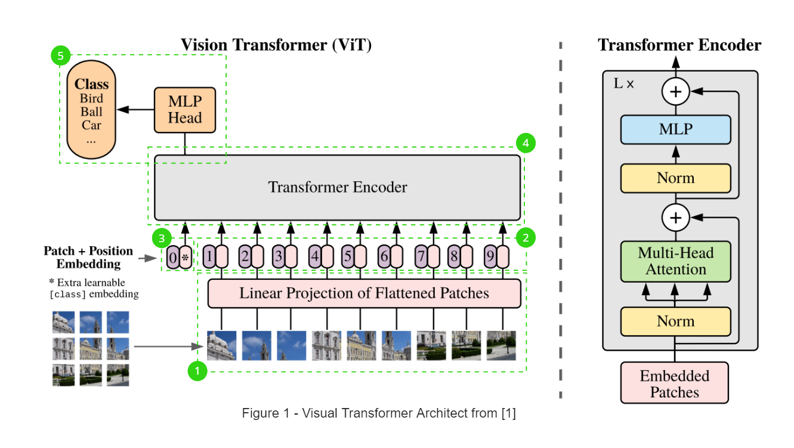
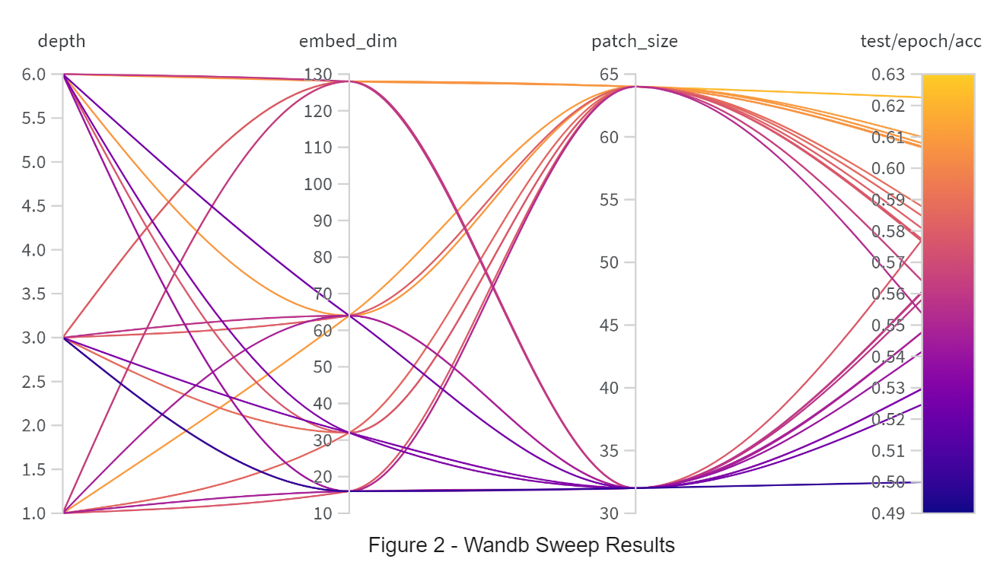
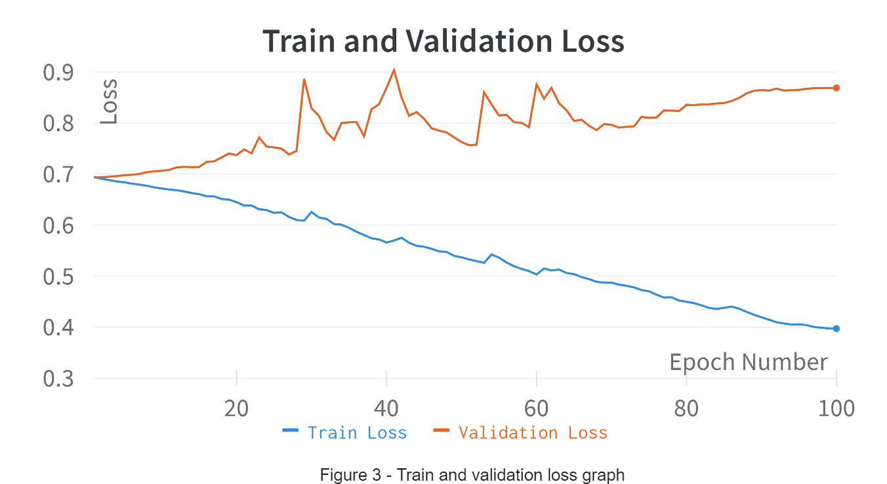
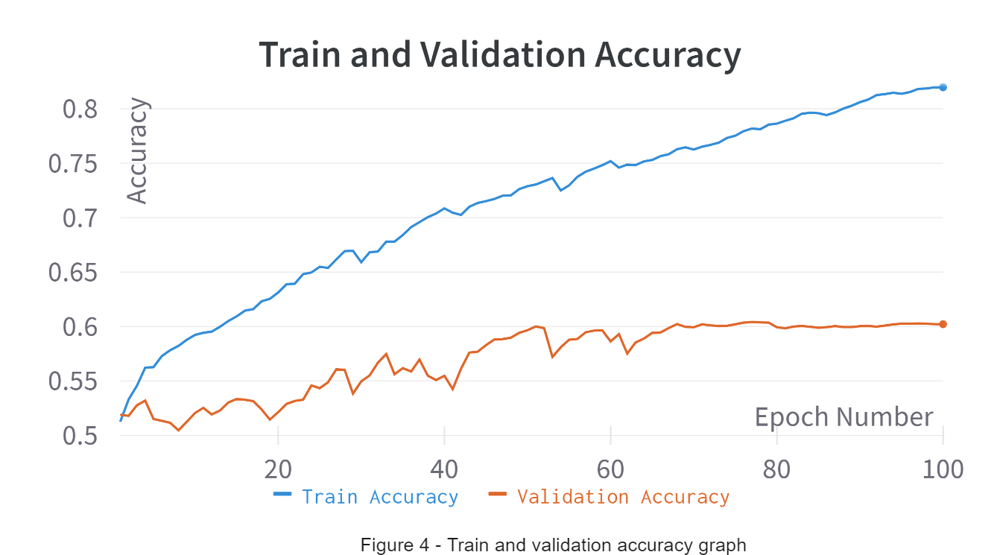

*Rodger Xiang s4642506*
# Classifying Alzheimer’s Disease with Vision Transformers
This project aims to classify Alzheimer's disease of the ADNI brain data set using a vision transformer, trying to achieve a minimum accuracy of 80%. However, end results of this project only achieve 62% accuracy on the test set after various hyperparameter tuning and model modifications. 

## Model Description
#### Model Architecture:
The vision transformer utilises the transform encoder from the transformer architecture to take advantage of the self-attention properties adapted for image recognition. Below is a description of all the main components of the vision transformer and how they interact with each other and their purpose (Figure 1). 

    

1. Image Patching + Linear Embedding: Takes an image and split them into smaller patches and then transforming each patch into a their respective 1D vector representation. This is to convert the image as a suitable input for the transform encoder. Which requires the input to be in the form of a token, in this case we use a smaller patch of the images as the token representations.
2. Positional Encoding: Encodes spatial information, allowing the model to understand where each patch belongs on the input image. This is added to the input after image patching and linear embedding.
3. Class Token: Append a learnable class token to the input, which represents the class that the image belongs to. This is what is used to determine what the image class is at the end of the model.
4. Transform Encoder: Input is finally passed into multiple layers of transform encoders learning features of the image through a global context instead of a local area like convolutional networks. The main part of the encoder is the self-attention mechanisms where it Learns a correlation matrix between image patches, which corresponds to looking at each image patch at a global context.
5. Classification Head: simple linear layer that takes the class token at the start of the output of the encoder layers and classifiers an image based on the token

## Training
#### Preprocessing 
A patient level split of the 20000 training images into a 70/30 split for a validation set which comprises of 3000 AD class and 3000 normal class brain images *(see folder structure below)*. Images are then greyscaled to reduce the channels to 1 as images are black and white. This should improve computation time since the number of channels has been reduce from 3 to 1. Data augmentation use are random vertical, horizontal flip and random rotation up to 30 degrees. This is to expand the small dataset to improve the generalisation of the trained model.
#### Folder Structure
    .
    ├── AD_NC                   
    │   ├── train              
    │   ├── validate                
    │   └── test                
    └── ....py

#### Hyperparameters Tuning
Wandb sweeps was used to tune hyperparameters listed in the table below. Training data was used to train the models, while the validation data was used to compare each model's performance to each other. After the best model was chosen it was trained again for 100 epochs and then tested with the test set to get a final accuracy of its performance. 

| Hyperparameter    | Value/s |
| :---:             | :---: |
| Depth             | 1, 3, 6 |
| Embeded Dimension | 16, 32, 64, 128 | 
| Patch Size        | 32, 64 |
| Epochs            | 30 |
| Batch Size        | 512 | 
| Image Size        | 256 |
| Attention Heads   | 8 |
| MLP Dimension     | 1024|
| Dropout Probability| 0.1|
| Learning Rate     | 0.001|
| Optimiser         | SGD|
| Weight Decay      | 1e-7|

Below are the methods to reproduce the hyperparameter tuning or training and testing models without the use of sweeps.
#### Tuning Parameter Sweeps
1. Modify the `param_dict` in utils.py line 78 for parameters to be tuned 
2. Modify the `GENERATE_SWEEP_ID` in train.py line 20 to `True`
3. Run train.py and go to the sweep URL generated
4. Go to the overview of the sweep URL and find the Launch agent and copy the last string
5. Paste the string into train.py on line 220 at `sweep_id`
6. Set GENERATE_SWEEP_ID to `False` and WANDB_SWEEP to `True` and run train.py
#### Training Without Sweeps
1. Modify `CONFIG` on line 20 in train.py to change parameters
2. Make sure `WANDB_SWEEP` and `GENERATE_SWEEP_ID` are `False`
3. Run train.py and click the Wandb link to see graphs of training and validation loss, accuracy
#### Testing Final model
5. Modify line 14 in predict.py, `MODEL_NAME` to the Wandb run name
5. Run predict.py to generate final test accuracy of trained model

## Results
#### Hyperparameter Tuning Results
Figure 2 shows the results of the hyperparameter tuning using Wandb parameter sweep. The best model has a validation accuracy of 62% and test accuracy of 60%. Figures 3, 4, shows the training and validation loss of the best model and the table below shows its parameters.

    
    
    

From Figure 3 we can see that the training is progressing well by the downwards trend of the loss. However on the validation test set it doesnt perform well. Indicating that the model is not generalising well. This is further seen in Figure 4 where there is a large gap between the accuracy curves, suggesting overfitting of the model to the training data.

This could be attributed to multiple problems with the model and data processing, such as:
- wrong data augmentations 
- relatively small data set used to train on compared to the original paper [1]
- hyperparameter tuning could be further include the other parameters 
- model type, other variants of ViT exists to improve on the base ViT which could see improvements to the validation and test accuracy 

Therefore for future improvements would to be to gather a larger dataset to train on and then include more hyperparameters to the tuning process. And further experimentations on different types of ViT models could see improvements to the low 60% accuracy of the current model.   

## Requirements
    Python 3.10
    Pytorch 2.0.1
    Pytorch-Cuda 11.7
    Torchvision 0.15.2
    einops 0.6.1
    tqdm 4.65
    wandb 0.15
## References
[1]	https://browse.arxiv.org/pdf/2010.11929.pdf 

[2]	https://jalammar.github.io/illustrated-transformer/ 

[3]	https://uvadlc-notebooks.readthedocs.io/en/latest/tutorial_notebooks/tutorial15/Vision_Transformer.html 
