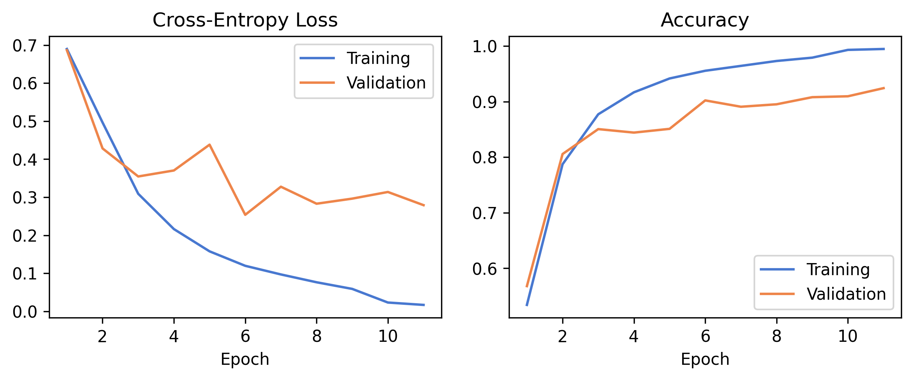
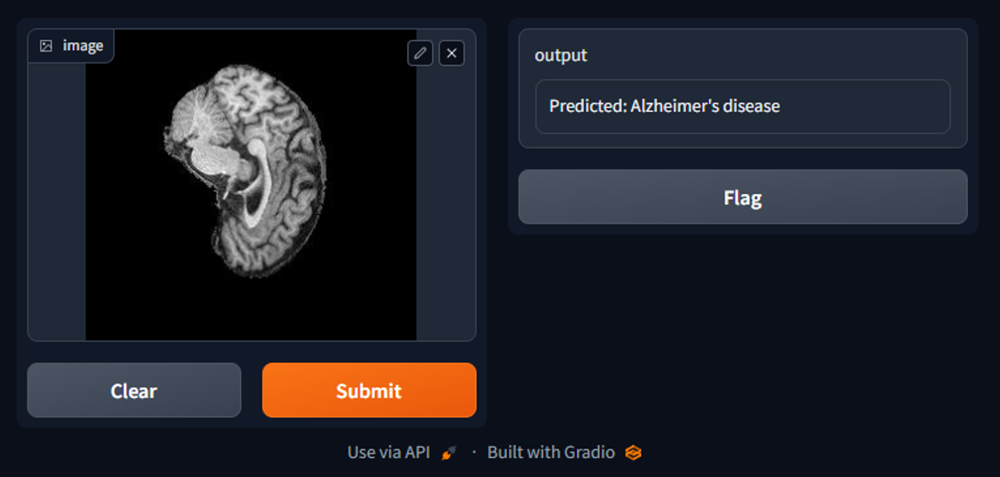
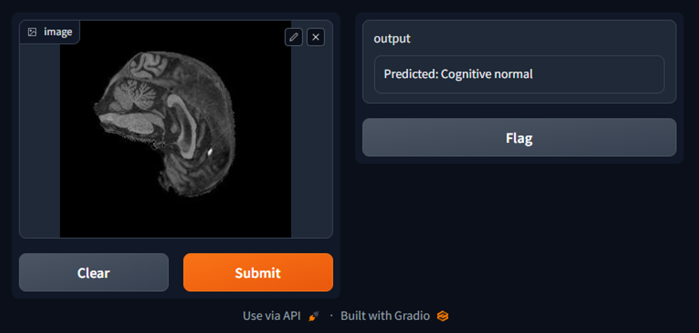
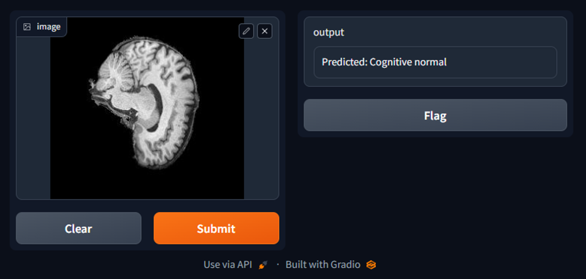

# Vision Transformer for Alzheimer's Disease Classification

This project applies the Vision Transformer architecture to the task of classifying MRI brain images as either Cognitive Normal (CN) or representative of Alzheimer's disease (AD). The ViT is trained and tested on patient-level splits of the dataset from the [Alzheimer's Disease Neuroimaging Initiative (ADNI)](http://adni.loni.usc.edu). A patient-level test accuracy of 75.11% is achieved using transfer learning techniques.

## Model Architecture

The Vision Transformer (ViT) is a self-attention-based architecture which has consistently demonstrated state-of-the-art performance on various image recognition benchmarks while requiring substantially fewer computational resources to train than convolutional neural networks (CNNs), which are now superseded as the ubiquitous architecture for computer vision tasks [2].

ViTs extend the Transformer architecture introduced by Vaswani et al. [5] for natural language processing tasks [2]. The following figure presents a graphic representation of the model architecture from Bazi et al. [1].

![Vision Transformer architecture from [1]](static/vit_model_architecture.png)

Transformers rely on attention, which calculates the pairwise inner product for every pair of tokens in a set [3]. This method has less inductive bias than other architectures, enabling better generalisation and hence better performance given enough training data [3]. However, as a quadratic operation, attention is too expensive to apply to each individual pixel in an image [3]. Images are therefore divided into patches, which are vectorised and linearly projected using an embedding matrix [3]. The projected patches are combined with positional embeddings, which inform the relative positions of the patches [3]. These _embedded patches_ can then be input into a regular Transformer. An extra learnable class embedding is input alongside the embedded patches, whose trained output feeds into the final fully-connected classification layers to yield a prediction.

## Data and Preprocessing

### Dataset

The ViT is trained and tested on patient-level splits of the dataset from the [Alzheimer's Disease Neuroimaging Initiative (ADNI)](http://adni.loni.usc.edu). The train-test split dataset was obtained from the COMP3710 course page on the UQ Blackboard website.

The training split contains 21,520 images:
- 11,120 images are cognitive normal (NC); and
- 10,400 images are Alzheimer's disease (AD).

The test split contains 9000 images:
- 4540 images are cognitive normal (NC); and
- 4460 images are Alzheimer's disease (AD).

All subsets contain exactly 20 images per patient and there are no common patients between the sets. The training set is additionally 80/20 patient-level split into training and validation sets. Again, there are no common patients between the sets.

The data loading script (`dataset.py`) looks for the data in different locations depending on the operating system.
- On windows, it looks for `.\ADNI\AD_NC`
- On Linux, it looks for `/home/groups/comp3710/ADNI/AD_NC`

In both cases, the data inside `AD_NC` is expected to be organised identically to the dataset on the COMP3710 course page.

### Preprocessing

Preprocessing of the training data consists of data augmentation and type conversion:

1. A [`RandomHorizontalFlip`](https://pytorch.org/vision/0.15/generated/torchvision.transforms.RandomHorizontalFlip.html).

2. A [`RandomCrop`](https://pytorch.org/vision/main/generated/torchvision.transforms.RandomCrop.html) to 224x224, with padding size of 4 and `reflect` padding mode.

3. Conversion to tensor float type.

Validation and testing images are simply centre-cropped to 224x224 then converted to tensors.

## Model Training and Results

### Model Training

This solution implements a vanilla ViT-B/16 architecture introduced by [2], with 12 encoder layers and a patch size of 16. The classification head is replaced with a fully-connected layer having 2 outputs rather than 10.

The solution leverages transfer learning using the [`IMAGENET1K_V1`](https://pytorch.org/vision/main/models/generated/torchvision.models.vit_b_16.html) weights from PyTorch. Transfer learning avoids retraining the more general, lower-level feature extractors of the ViT, which have been trained to high efficiency on the larger ImageNet dataset. Only the higher-level feature extractors and fully-connected classification head need to be retrained to be specific to the ADNI dataset. This improves training efficiency significantly. The model is fine-tuned by freezing all layers but the classification head for 1 epoch, then unfreezing and training the full number of epochs.

The model is trained for 16 epochs (unfrozen) or until validation loss does not improve for five consecutive epochs, at which point early stopping triggers and the model is reverted to the state following the epoch with the lowest validation loss. The training also uses the [`ReduceLROnPlateau`](https://pytorch.org/docs/stable/generated/torch.optim.lr_scheduler.ReduceLROnPlateau.html) scheduler to decrease the learning rate by a factor of 10 if the validation loss does not improve for two consecutive epochs.

The following figure presents example model training and validation metrics.



### Model Testing

There are two ways to test the model. The simpler method, and the default for `train.py` and `predict.py`, runs inference on the test split of the ADNI dataset and returns the percentage of images correctly predicted. This is the typical approach when test images are independent. Using this method, the model trained above achieves 74.28% on the test split of the ADNI dataset.

```
100%|███████████████████████████| 141/141 [01:51<00:00,  1.26it/s]
Test accuracy: 74.28% (00:01:53.86790)
```

The second method recognises that images are not independent, but in fact come in sets of 20 images per patient. Therefore, when running inference, it is possible to keep a running tally for each patient of the number of `AD` predictions versus `NC`. At the end, each patient (rather than each image) is assigned an overall prediction based on which of `AD` or `NC` was more frequently predicted for the patient's set of 20 images. Using this approach, the model trained above achieves 75.11% on the test split of the ADNI dataset.

```
100%|███████████████████████████| 141/141 [01:51<00:00,  1.27it/s]
Test accuracy (agg.): 75.11% (00:01:51.01899)
```

The results are unexpectedly similar. This suggests that for each patient, the trained model generally produces the same prediction for all 20 images - whether correctly or incorrectly. The benefit of the aggregation is therefore minimal.

### Interactive Usage

Finally, `predict.py` can also be used to start a web GUI to interactively use the model. The GUI allows the user to upload any image and will show the model's prediction. For example, the following four images are from the test split of the ADNI dataset. The first two are AD and the following two are NC. We see the model predict with 75% accuracy.






## Reproducing Results

### Dependencies

This implementation uses Python 3.10 and PyTorch 2.1.0+cu118. PyTorch (specifically `torch` and `torchvision`) can be installed for the machine of choice following: https://pytorch.org/get-started/locally/

Other Python package dependencies include: `pandas`, `tqdm`, `gradio` and `seaborn`. These can be installed all at once using:
```
pip install pandas tqdm gradio seaborn
```
Of these packages, `seaborn` is only required for generating plots of training metrics from generated CSV files. If this is not a forseen use case, installing `seaborn` may be omitted and can always be installed later if found necessary.

A virtual environment ([`venv`](https://docs.python.org/3/library/venv.html)) is recommended for the installation, but is not mandatory.

### Setup and Run

1. Navigate to `recognition/adni_vit_45285545`.

2. Run the following to train the model and print a test result. The `--pg` option will show training progress bars. The model is automatically saved to file after training.
```
python train.py N_EPOCHS [--pg]
```

3. Run the following with a saved model file to run inference. The `--test` option will run the model on the test split of the ADNI dataset and print a test result. The `--gui` option will start a web-based GUI to interactively use the model.
```
python predict.py MDLFILE [--test] [--gui] [--agg]
```

_NOTE: while the GUI accepts any image, samples from the ADNI dataset are useful for demos because the ground truth is known._

## References

[1] Y. Bazi et al., "Vision Transformers for Remote Sensing Image Classification," _Remote Sens._, vol. 13, pp. 516-535, Feb. 2021, doi: 10.3390/rs13030516.

[2] A. Dosovitsky et al., "An Image is Worth 16x16 Words: Transformers for Image Recognition at Scale", arXiv: 2010.11929 [cs.CV], 2021.

[3] Yannic Kilcher. An Image is Worth 16x16 Words: Transformers for Image Recognition at Scale (Paper Explained). (Oct. 4, 2020). Accessed: Oct. 11, 2023. [Online video]. Available: https://www.youtube.com/watch?v=TrdevFK_am4

[4] K. S. Krishnan and K. S. Krishnan, "Vision Transformer based COVID-19 Detection using Chest X-rays," 2021 6th International Conference on Signal Processing, Computing and Control (ISPCC), Solan, India, 2021, pp. 644-648, doi: 10.1109/ISPCC53510.2021.9609375.

[5] A. Vaswani et al., "Attention Is All You Need", arXiv: 1706.03762 [cs.CL], 2017.
