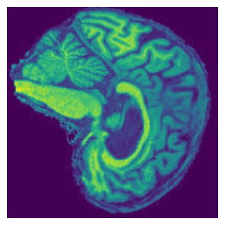
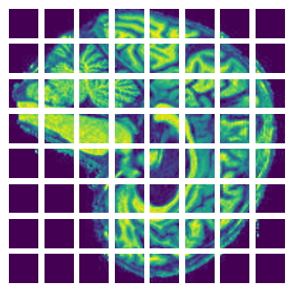
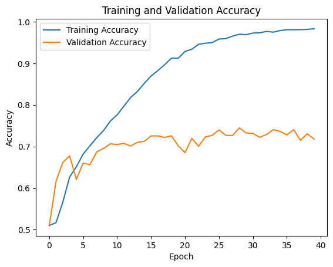
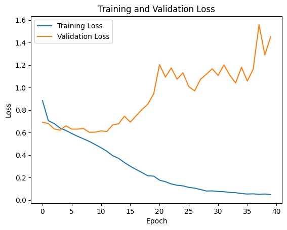
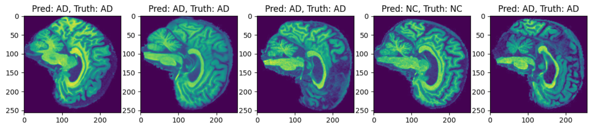
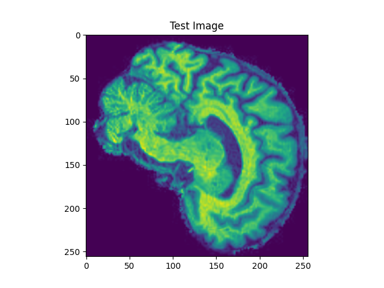

# Classification of Alzheimer's Disease with Vision Transformer

## ADNI Dataset

The ADNI Dataset consists of brain MRIs of patients with Alzheimers, as well as MRIs of healthy patients. A binary classification exercise is proposed to detect Alzheimers in patients from brain MRI image alone.

 

**Sample Brain MRI Image of Alzheimers Patient (Left) and Healthy Patient (Right)**

The dataset directory structure should resemble the following example file tree.

```
recognition/adni_vit_46468505/AD_NC/
|-  test
|-  |-  AD
|-  |-  |-  388206_78.jpeg
|-  |-  |-  ...
|-  |-  NC
|-  |-  |-  1182968_94.jpeg
|-  |-  |-  ...
|-  train
|-  |-  AD
|-  |-  |-  218391_78.jpeg
|-  |-  |-  ...
|-  |-  NC
|-  |-  |-  808819_88.jpeg
|-  |-  |-  ...
```

## Vision Transformers

Vision transformers are able to effectively process images by splitting them into many small, "bite-sized" patches. While these patches are processed individually, the positional context of each patch within the original image is preserved with positional embeddings. Self-attention is used in most architectures in order to determine the most useful patches to good performance.

Vision transformers can produce a variety of useful outputs, including segmentation, classification and image-generation. Vision transformers trained on large datasets have shown advanced performance on CNNs by a small margin, which have historically been the preferred choice for computer-vision tasks. 


## Model Design

The model consists of multiple transformer blocks, which themselves consist of normalisation, multi-head attention, skip connections, and MLP layers. Multi-head attention layers allow the model perform self-attention on its patches, determining the most useful ones for classification. Encoded patches are passed through a series of transformer blocks, and the result is flattened into a classification output.

Categorical Cross-Entropy (CCE) loss was used, as it is designed to provide the best performance in multi-class and binary classification tasks by accounting for prediction confidences as well as the hard prediction. The labels are one-hot encoded, so the sparse version of CCE is used to account for this format.

Adam Optimisation with a learning rate of 0.001 and weight decay of 0.0001 were used. Low learning rates are used to avoid a model learning "too quickly" leading to overfit, however it can increase the number of epochs of training required to get good performance. Weight decay is another hyperparameter used to avoid overfitting. It discourages learning large parameter values in a networl, where arge values of the weight decay hyperparameter penalises large parameters more harshly.

## Model Training

30000 images are provided for model training. A split of 70% training images and 30% testing images is chosen. This split provides an optimal trade-off between the maximising the accuracy of the test evaluation, while allowing as much breadth of training data as possible. Within the 70% training set, 20% of the samples were set aside to use to validate the model during training. This validation set allows overfitting to be monitored during training.

As pre-processing, the negative space is cropped from the borders of each image, which has the effect of focusing the model on the brain only as well as rescaling and centring the brains in-frame. Each image is analysed in patches.

 

**Cropping Negative Space and Splitting Image into Patches**

The model was trained on the training set for 40 epochs, and test error was evaluated at each step. The plot of loss and accuracy for testing and training sets were recorded throughout training.





A sample of predictions is shown.



## Usage

All packages used to develop the code for this model are listed in `myenv.txt` and can be installed with pip using the following command.

```pip install -r myenv.txt```

### Prediction

The code in `predict.py` will load a previously trained model specified by a path variable. During runtime the user will be prompted to specify a testing image path for the model to make a prediciton on. The results are printed to the terminal. Ensure that path variables are changed to align with the directory structure being used. Example usage is shown.

```
Path of Image to Analyse: ./recognition/adni_vit_46468505/images/ad_sample.jpeg
1/1 [==============================] - 3s 3s/step
Test Image is Class Alzheimers with Confidence 4.9522
```

The testing image is also shown before a prediction is made.



### Training

Code used to train the vision transformer can be found in `train.py`. 40 epochs were used to train the model, however a 70% validation accuracy was achieved by the 10th epoch. The training loop runs for the number of epochs specified by the user, and saves the model to the working directory. Figures are also generated to show the training history, by plotting the loss and accuracy values for training and validation set for each epoch. Ensure that path variables are changed to align with the directory structure being used.

## References
Kumar, R., Sarker, M.K., Islam, S.R. (2023). Vision Transformers for Galaxy Morphology Classification: Fine-Tuning Pre-trained Networks vs. Training from Scratch. In: Conte, D., Fred, A., Gusikhin, O., Sansone, C. (eds) Deep Learning Theory and Applications. DeLTA 2023. Communications in Computer and Information Science, vol 1875. Springer, Cham. https://doi.org/10.1007/978-3-031-39059-3_8

Dosovitskiy, A., Beyer, L., Kolesnikov, A., Weissenborn, D., Zhai, X., Unterthiner, T., ... & Houlsby, N. (2020). An image is worth 16x16 words: Transformers for image recognition at scale. arXiv preprint arXiv:2010.11929.


