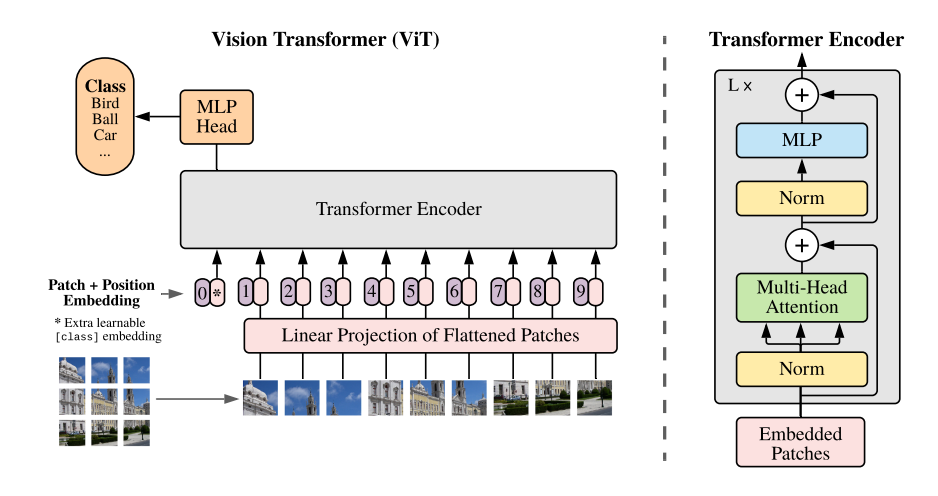
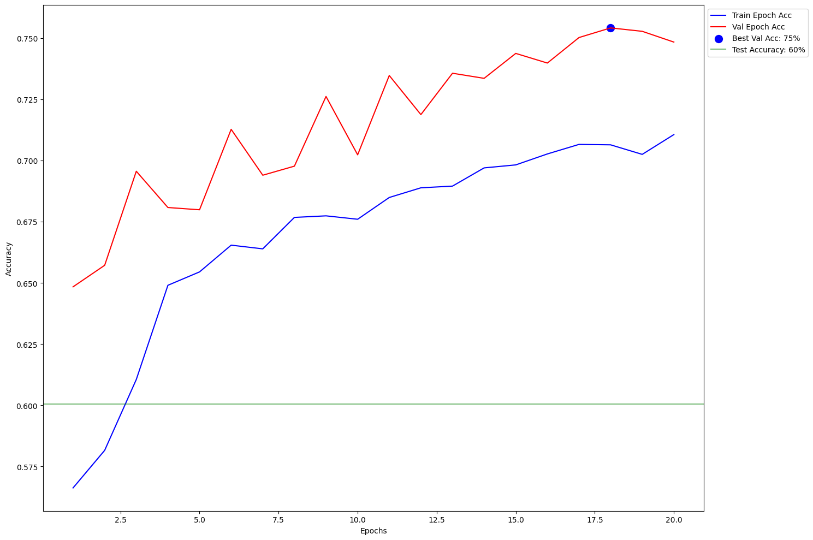
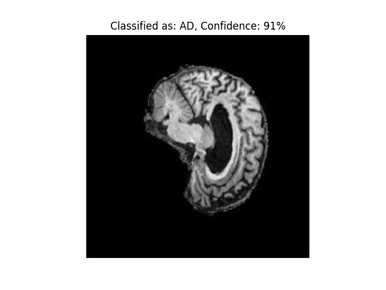
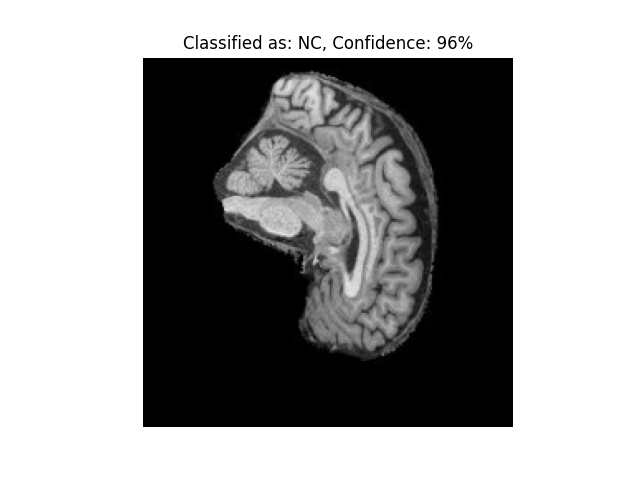
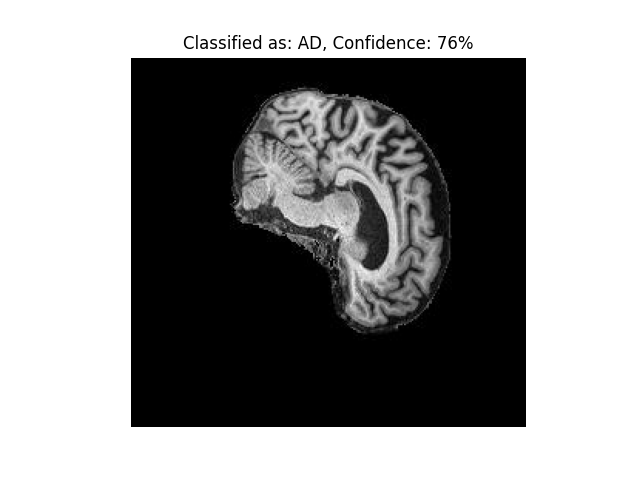

# Vision Transformer applied to ADNI Dataset - Binary Classification

## Description
This algorithm addresses the problem of diagnosing Alzheimer's disease using brain scan images from the ADNI dataset. It works by employing a Vision Transformer (ViT), a deep learning architecture originally designed for image classification tasks. Instead of traditional convolutional layers, the ViT divides an input image into fixed-size patches, linearly embeds them into vectors, and then processes them in a sequence, much like words in a sentence, using transformer mechanisms. The transformer's self-attention mechanism enables the model to focus on varying spatial details, making it suitable for detecting the intricate patterns associated with Alzheimer's in brain scans. After processing, the model outputs a binary classification, indicating the presence or absence of the disease.


Visualisation of ViT (Dosovitskiy et al., 2020)

## Dependencies
To run this algorithm, you will need the following dependencies:
- torch (2.1.0)
- torchvision (0.16.0)
- sklearn (1.2.2)
- matplotlib (3.7.2)
- torchinfo (1.8.0)
- PIL (9.4.0)

... 
_Note: The following results may not be directly reproducable due to the fact gradients are activations functions are randomly set. Although, with the same hyperparameters, very similar results and accuracies should be achievable_

_Note: Hyperparameters and other options can be changed when running train.py and predict.py on the command line (try train.py -h or predict.py -h)

## Example train.py
### Inputs (terminal):
_Note: Most of these hyperparameters are also set as default_
```bash
python train.py --lr=0.00001 --weight_decay=0.003 --num_epochs=20 --dropout=0.1 --train_interval=100 --val_interval=100 --plot=True
```

### Outputs:
[exmaple_output.txt](readme_resources/exmaple_output.txt)

### Plot:



## Example predict.py

### Input 1:
```bash
python predict.py --model_file='vit-valacc71.27.pth'
```

### Output 1:
```
Test Accuracy: 0.6696
Test Loss: 0.6060
```

### Plots 1:



### Input 2:
```bash
python predict.py --model_file='vit-valacc71.27.pth' --image_path='/home/groups/comp3710/ADNI/AD_NC/test/AD/388206_78.jpeg'
```

### Output :
N/A


### Plots 2:



## Pre-Processing and Data Splits

There were several transforms applied to the dataset prior to training and testing. All subsets had normalisation applied, with the mean and std calculated through a random sample of 1000 datapoints.

Regarding the data splits:
- Training/Validation: 80%/20% (patient-level splitting)
- Testing: 9,000 Images (50% each class)

The 80/20 training/validation split was chosen since the Vision Transformer is a complex and requires large amounts of training data. Since the dataset itself is reasonably large (~20k), the remaining 20% for validation will still provide an good distribution. This was a patient-level split, meaning all scans of the same patient are within the same split in order to avoid data leakage.

The data was resized to 224x224 for the ViT.

There were 2 data augmentations applied to the training data:
- Random rotations (10 degrees)
    - Used since many of the brain scans were slightly tilted, so this was added so the model could generalise to this
- Random resized crops (90% - 110%)
    - Similarly to random rotations, many of the brain scans took up more of the image, so adding random croping 

## References

Dosovitskiy, A., Beyer, L., Kolesnikov, A., Weissenborn, D., Zhai, X., Unterthiner, T., ... & Houlsby, N. (2020). An image is worth 16x16 words: Transformers for image recognition at scale. arXiv preprint arXiv:2010.11929.
