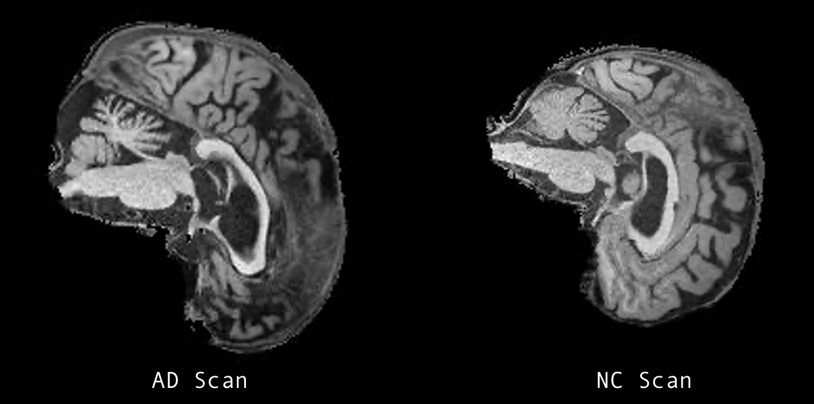
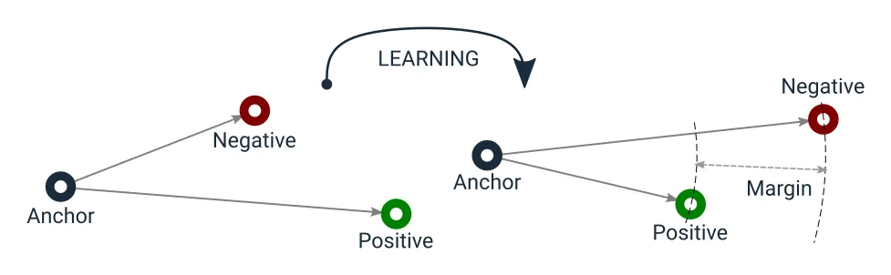

# Classifying Alzheimer's Disease using Siamese Networks

## 📣 Introduction
The task was to "create a classifier based on the Siamese network to classify either Alzheimer’s disease (normal and AD) of the ADNI brain data set or classify the ISIC 2020 Kaggle Challenge data set (normal and melanoma) having an accuracy of around 0.8 on the test set."

As such, this project aims to distinguish between Alzheimer's disease (AD) and normal (NC) brain images from the ADNI dataset.

## 🧠 Dataset
- **Description**: The ADNI dataset is split into 'training' and 'testing' sets. Each set has two categories: 'NC' (Normal Cognitive) and 'AD' (Alzheimer's Disease). Specifically, the training set includes 11120 'NC' and 10400 'AD' images. The test set contains 4460 'AD' and 4540 'NC' images.

    Images in the dataset are slices of a patient's brain. Each image is broken down into patient ID to represent which patient and also their corresponding brain slice. For example, an image like '388206_78' refers to the 78th slice of patient 388206's brain.

<p align="center">
  
</p>

<p align="center">
    <em> Figure 1: Brain scans of AD and NC patient slices of ADNI dataset</em>
</p>

- **Dataset Link**: [ADNI Dataset](http://adni.loni.usc.edu/) (However, the provided preprocessed data from UQ Blackboard was used)
- **Preprocessing Steps**: Images were resized to 256x240 pixels and normalized. Data augmentations like rotations and flips were applied during training (further in-depth preprocessing detailed will be discussed in the **Data Preprocessing** section).

## 🪄 Data Preprocessing

The dataset preprocessing is aimed at generating triplets of images for training Siamese networks using triplet loss. The triplets consist of an anchor, a positive, and a negative image.

### Dataset Structure

The data is organised in a directory structure with separate subdirectories for Alzheimer's Disease (AD) and Normal Control (NC) images.

```
root_dir/
│
├── train/
│ ├── AD/
│ └── NC/
│
└── test/
├── AD/
└── NC/
```

### Triplet Generation

For each anchor image from either the AD or NC class:
- A positive image is selected from the same patient but a different slice.
- A negative image is then chosen from the opposite class.

This ensures that the positive image is similar (as it's from the same patient), whereas the negative image is distinct.

### Data Augmentation

During training, data augmentation is applied to the images to introduce variability and improve generalisation. The following augmentations are applied:
- Random rotation of up to 10 degrees.
- Random horizontal flip.
- Random vertical flip.

### Patient-wise Data Split

The dataset is split patient-wise rather than image-wise. This ensures that all slices of a particular patient either belong to the training set or the testing set, preventing data leakage.

### Dataset Implementation

The `TripletDataset` class, a subclass of `torch.utils.data.Dataset`, facilitates the creation of triplets and data loading. The main components of this class include:

- `__init__`: Initialises the dataset, loads image paths, applies transformations, and splits data patient-wise.
- `__len__`: Returns the total number of images (AD + NC).
- `__getitem__`: Given an index, it returns a triplet of images along with the label of the anchor image.

The `patient_wise_split` function is a utility that splits the dataset based on unique patient IDs. It ensures that all images from a single patient are either in the training or testing set.

## 🐱 Siamese Network Architecture

### Overview
- **Siamese Networks**: These networks consist of twin networks which accept distinct inputs but are joined by an energy function at the top. This energy function computes a metric between the highest-level feature representation on each side.
- **Objective**: The Siamese network's goal is to differentiate between pairs of inputs. In this context, it's used to differentiate between different Alzheimer's Disease (AD) and Normal Control (NC) images.

### Model Architecture

#### Feature Extractor
- **Purpose**: This sub-network is responsible for extracting features from an input image. These features form the basis upon which differences or similarities between images are recognised.
- **Implementation**:
  - Employs a Convolutional Neural Network (CNN) structure with added depth.
  - The first convolutional layer expects grayscale images and outputs 32 channels with a 5x5 kernel.
  - The subsequent convolutional layer takes these 32 channels as input, producing 64 channels with another 5x5 kernel.
  - Two fully connected layers follow the convolutional layers. The first reduces the dimension to 256, while the final layer further reduces it to a 2-dimensional output for visualisation and analysis.
  - ReLU activation functions and max-pooling operations are applied post-convolutional layers, with dropout layers introduced for regularisation.

  
#### Siamese Network
- **Composition**: The Siamese network uses two copies of the above-described Feature Extractor. Both images in a pair go through these identical subnetworks. The outputs from these twin networks are then used to compute the triplet loss.
  
### Loss Function

#### Triplet Loss
- **Purpose**: The Triplet Loss emphasises the relative distance between the anchor-positive pair and the anchor-negative pair. The objective is to ensure that the anchor and positive (both from the same class) are closer to each other in the embedding space than the anchor and negative (from different classes).
- **Implementation**:
  - The Euclidean distance between the anchor and positive, as well as the anchor and negative, is computed.
  - The difference between these distances, plus a margin, is the loss. The margin ensures a buffer between positive and negative pairs.

<p align="center">
  
</p>

<p align="center">
    <em> Figure 2: Triplet Loss Diagram [1]</em> 
</p>

### Additional Classifier
After the Siamese network has been trained, a simple classifier is built on top of the embeddings generated by the network.
- **Architecture**:
  - Two-layer feedforward neural network.
  - The first layer reduces the 2-dimensional embedding to 64 dimensions using a ReLU activation function.
  - The second layer maps the 64 dimensions to 2 outputs, representing the AD and NC classes.


## Training and Evaluation

### Training Procedure
- The Siamese network undergoes training for 30 epochs with a batch size of 16 for improved generalisation.
- An early stopping mechanism halts training if the validation loss doesn't improve over a specified number of epochs.
- The Adam optimizer is employed with a learning rate of 0.0005.
  
### Evaluation and Visualisation
- The training and validation losses are plotted to visualise the model's performance over epochs.
- The embeddings generated by the Siamese network are visualized using t-SNE, a technique for dimensionality reduction.
- A simple classifier is trained on these embeddings to classify them into AD or NC categories.
- The classifier's performance is evaluated using a confusion matrix.


## 🛠️ Setup and Installation
Ensure you have Python 3.7+ installed. Then, set up a virtual environment (optional) and install the dependencies:

`pip install -r requirements.txt`

## 👨‍💻 Usage
To train the Siamese network and visualise the embeddings:

`python train.py`

To predict embeddings for a pair of sample images using a trained Siamese network, modify the `predict.py` script with the paths to your sample images and then run:

python predict.py


## ✨ Results
- **Training Results**: Training and validation loss curves are saved for the Siamese network training process.
- **Test Results**: The trained Siamese network's embeddings are used to train a simple classifier, which is then evaluated on the test set.
- **Visualisations**: t-SNE visualizations of embeddings, loss curves for both Siamese network and classifier, and a confusion matrix for the classifier's performance are generated.

## 🔮 Future Work & Improvements
1. Experiment with different architectures for the Feature Extractor.
2. Explore other distance metrics or loss functions.
3. Incorporate more sophisticated data augmentation techniques.

## 📚 References

[[1]: Triplet Loss — Advanced Intro](https://towardsdatascience.com/triplet-loss-advanced-intro-49a07b7d8905)  

Bromley, Jane, et al. "[Signature verification using a" Siamese" time delay neural network](https://www.cs.cmu.edu/~rsalakhu/papers/oneshot1.pdf)." Advances in neural information processing systems. 1994.


