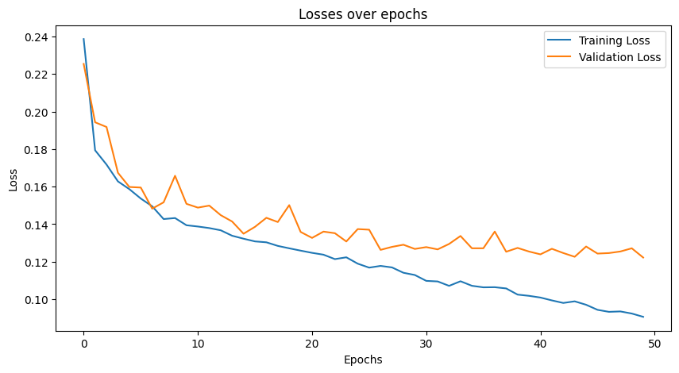

# Improved UNET for Image Segmentation on ISIC 2018 Dataset

## Contents 
- [Introduction](#introduction)
- [Dataset](#dataset)
- [Model Architecture](#model-architecture)
- [Model Training](#model-training)
- [Model Evaluation](#model-evaluation)
- [Using this repository ](#using-this-repository)

## Introduction 

This project provides an implementation of the Improved UNET model for image segmentation to identify skin lesions. The dataset used for the model is from the ISIC 2018 Challenge. The Improved UNET architecture is from the paper by Isensee et al [1]. The objective of this model was to achieve a dice similarity coefficient of greater than 0.8 on the test set; an average coefficient of 0.86 was achieved.


## Dataset 
The ISIC 2018 Dataset was released as a resource for an automated image analysis tool development competition run by the International Skin Imaging Collaboration. The goal of the competition was to promote automated melanoma detection. 

The train dataset consists of 2594 RGB images of skin lesions with corresponding ground truth masks that identify the skin lesion. The validation dataset conssits of 100 images with corresponding ground truth masks. The dataset is available on the [ISIC 2018 Website](https://challenge.isic-archive.com/data/#2018). An example input image and ground truth is shown below. 


### Preprocessing Steps 
1. All images were transformed to 256 x 256 shape to ensure a consistent shape for all images in the dataset. 
2. Masks were specifically converted to grayscale to align with the 1 output channel from the Improved U-Net, which is also in grayscale.
3. Training and Validation Split: From the initial training images, separate training and validation datasets (80-20 split) were created to track validation loss throughout the training process. The model was tested using the validation dataset because no ground truth test images were made available, as mentioned in this [thread](https://edstem.org/au/courses/13207/discussion/1632137?answer=3648471).

## Model Architecture   
The UNET is a convolutional neural network (CNN) architecture used for biomedical image segmentation. The network forms a U-shaped structure when visualised, hence its name. It consists of a downsampling path on the left side where data is contracted to reduce spatial dimensions while encoding abstract essential features. This is done traditionally through stacks of convolutional and max pooling layers. The bottom of the “U” represents the bottleneck of the architecture where the network learns the most abstract features of the input. Finally, the right path forms the expansive path. This expansive path decodes data using transpose convolutional layers to recombine abstract representations with shallower features to retain spatial information for accurate segmentation. 

The UNET is also symmetrical between its downsampling and upsampling paths; each level (vertical depth) in the encoding path has a corresponding level in the decoding path, connected by skip connections to preserve information. The Improved UNET builds upon a standard UNET by using complex aggregation blocks in its downsampling aggregation pathway, having additional layers and employing skip connections across different levels of the network. 


The image above represents the Improved UNET architecture as depicted in the reference paper. It's important to note that the architecture utilizes 3x3x3 convolutions due to its 3D input nature. However, since the ISIC dataset comprises 2D images, all convolutions in our scenario will be 2D, albeit with a 3x3 filter. In the following sections, an in-depth examination of the architecture is provided, alongside references to the respective modules in the code.
#### Downsampling path:
The downsampling path inputs the image into several convolutional blocks and context modules. Each downward step doubles the number of channels while halving the spatial dimensions of the image. This structure allows the network to learn and encode more complex features at different levels of the abstraction. 
Components:
- 3 x 3 convolution: This performs a 2D convolution with a kernel size of 3x3 with stride one to output the same shape as as the input. This is connected to an instance normalisation layer and a leaky ReLU activation.
- 3x3 convolution with stride 2: Performs a 3x3 convolution with a stride of 2. This reduces spatial volume as we go deeper into the network. 
- Context module: In each context module block, there are two convolutional layers with a dropout layer in between to avoid overfitting. 

#### Upsampling Path
The right side of the U-Net architecture receives the left side's output, upscales it, and then concatenates it with earlier layers' outputs (skip connections). These concatenated outputs are further processed through localization modules, repeating this process up through the network, gradually increasing the spatial dimensions while decreasing the feature channels. At the first level, a 3x3 convolution with 32 filters is used instead of a localization module. These skip connections help in recovering spatial information lost during downsampling, which is crucial for precise segmentation in the upsampling part of the network.
Components:
- Upsampling Module: the upsampling module upsamples input via a convolutional transpose 2d, then goes through a convolution again. This doubles the input shape.
- Localisation Module: the localisation module recombines features. It consists of two convolutional layers: a 3x3 layer followed by a 1x1 layer, each accompanied by instance normalisation and a leaky reLU activation function. 

#### Segmentation Components:
In the architecture, the Segmentation Level processes the localisation module's output from the third and second levels using a segmentation layer. The output of the third level's segmentation is upscaled to align with the second level's dimensions, and an element-wise summation is then performed, serving as a brief skip connection. This approach is mirrored with the output from the first level's 3x3 convolution, incorporating both upscaling and element-wise addition. The ultimate skip connection undergoes a sigmoid activation, yielding a final single-class output with a 2D segmented shape of 256x256x1.

- Segmentation Layer:  Performs a 2D convolution using a 1x1 kernel and no padding, ensuring consistent input-output dimensions, and follows up with instance normalisation and a leaky ReLU activation (with a 0.01 negative slope).
- Upscale: Doubles the input dimensions for its output.
- Sigmoid: Carries out a 2D convolution with a 1x1 kernel, maintaining the same input-output size, and then applies a sigmoid activation to produce the final result. A Sigmoid is used since the output is a grayscale image, the paper uses SoftMax. 


## Model Training

#### Hyperparameters
The following parameters were mirrored from the reference paper for the improved UNET:
- Adam Optimizer with L2 regularisation weight decay. 
- **L2 Weight Decay**: \(10^{-5}\)
- Initial learning rate of 5e-4
- **Learning Rate Schedule**: \(0.985^{\text{epoch}}\)
- Batch size of 2 
- Drop out layer probability of 0.3 
- Dice similarity coefficient adapted for the loss function

#### Dice Similarity Coefficient
The Dice Similarity Coefficient quantifies the similarity between two samples, often employed in segmentation tasks. To adapt it as a loss metric, one subtracts it from 1; this is because an ideal match yields a coefficient of 1, and the subtraction ensures that minimizing the loss to 0 corresponds to optimal overlap.

## Training Results 
The model was trained for 50 epochs and the model was saved. The training and validation losses were plotted. 



## Model Evaluation
Inference was conducted on the test set. Below, you'll find input images, their predicted leison and the ground truth. The model achieved an average Dice coefficient of 0.86, indicating its commendable performance. 


Additionally, the Dice scores for individual images are also presented.


## Using this repository 
There are four files required for training and testing on the Improved UNET architecture. 
- dataset.py: Preprocesses data and gets it ready for training. 
- modules.py: Contains implementation of ImprovedUnet architecture using pytorch. 
- train.py: Trains ImprovedUnet architecture, saves the model and plots losses. 
- predict.py: Performs inference using trained model

#### Data Requirements 
The following folders are required from the [ISIC 2018 Website](https://challenge.isic-archive.com/data/#2018)
- Training Data
- Training Ground Truth
- Validation Data
- Validation Ground Truth

#### Dependencies 
- Python 3.10.12 
- Matplotlib 3.4.3
- Numpy 1.26.0
- Pillow 2.2.1
- PyTorch 2.1.0
- Torchvision 0.16 
- tqdm 4.66.1

#### Reproduction 
To reproduce this project:
1. Download and store required data
2. Set up an environment with the required dependencies 
3.  update the `TRAIN_DATA_PATH` and `TRAIN_MASK_PATH` variables in train.py with the training dataset path.
4. update `TEST_DATA_PATH` and `TEST_MASK_PATH` variables in predict.py with the validation dataset path. 
5. Run train.py to train and save the model.
6. Run predict.py to perform inference.

```python
# assuming environment activated and dependencies downloaded, data in place.
python train.py 
```

```python
# assuming environment activated and dependencies downloaded, data in place.
# assuming train.py ran completely
python predict.py 
```

## References 
[1] F. Isensee, P. Kickingereder, W. Wick, M. Bendszus, and K. H. Maier-Hein, “Brain Tumor Segmentation and Radiomics Survival Prediction: Contribution to the BRATS 2017 Challenge,” Feb. 2018. [Online]. Available: https://arxiv.org/abs/1802.10508v1
