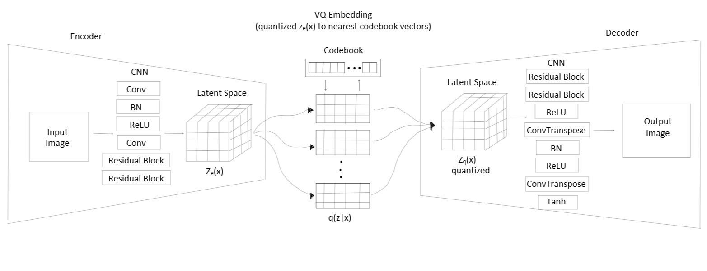
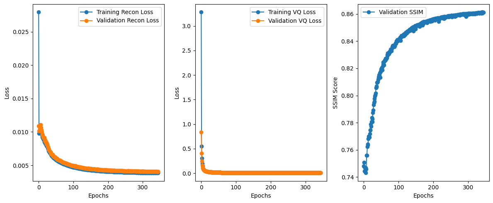
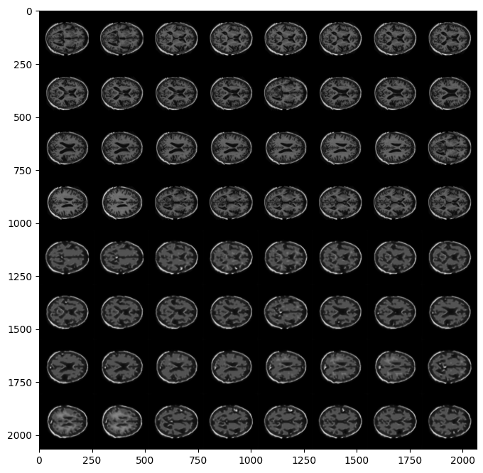

# OASIS Brain Image Generation with VQ-VAE

## Description:
This repository provides an implementation of the Vector Quantized Variational AutoEncoder (VQ-VAE) to generate brain images based off the OASIS dataset. The objective is to create a generative model that produces reasonably clear images of the brain and achieves a Structural Similarity (SSIM) index of over 0.6. This work aims to offer a reliable method for generating high-quality representations of brain images, which can be beneficial for various neuroscience and medical applications.

## How it Works:
The VQ-VAE is a type of Variational AutoEncoder that incorporates vector quantization for its discrete representation. This allows for a distinct encoding of the input data, leading to more effective generation of images. This VQ-VAE model is trained using the OASIS brain dataset, specifically, the brain slices in PNG format. During training, the model learns to compress and reconstruct the brain images with high fidelity. In addition to metric evaluations, images were also generated during training to visually compare and ensure they were reasonably clear. The quality of the generated images is evaluated using the SSIM index through validation, which measures the structural similarity between the original and reconstructed images.

## Visualisation:
### Architecture of VQ-VAE

This diagram depicts the architecture of a Vector Quantized Variational Autoencoder (VQ-VAE) for generative modeling. The process begins with an input image fed into an encoder comprised of Convolutional Neural Network (CNN) layers, Batch Normalization (BN), ReLU activation functions, and Residual Blocks. The encoder transforms the image into a latent space representation, Ze(x). This representation is then quantized to the nearest codebook vectors using VQ embedding, producing a quantized latent space, Zq(x). The decoder, mirroring the encoder in structure but using transposed convolutional layers, reconstructs the original image from the quantized latent representation.

### Training
  

This graph showcases the decline in both reconstruction and VQ loss values throughout the training process. Concurrently, there is a proportional rise in SSIM scores during validation. These trends highlight the effective learning capability of the model when applied to the OASIS brain dataset

### First generation in training
  

Initial generated images from the first epoch of training, providing a baseline representation of the OASIS brain dataset using the VQVAE model.

### Final generation based off model parameters
  

Final set of generated images based on optimized model parameters, showcasing a refined representation of the OASIS brain dataset with improved clarity and a SSIM score of 0.8724.

## Dependencies:
- Python 3.x
- PyTorch
- torchvision
- numpy
- matplotlib
- skimage

## Reproducibility:
To replicate the results presented in this repository, follow these steps:
1.	Ensure you have all the dependencies necessary.
2.	Execute **train.py**. This script handles the training process, including validation and testing, and saves model checkpoints based on improvements in the combined metric of SSIM and reconstruction loss.
3.	After training, run **predict.py** to generate and save a batch of brain slice images using the best saved model parameters determined during training. 

By following these steps, you will be able to reproduce the results described above, including the achieved SSIM score and the quality of generated images. It must be noted that reproducibility may still be influenced by hardware configurations and GPU-specific operations, so running the code on the same hardware and software setup is recommended for consistent outcomes. The model was trained and executed on the Rangpur GPU to generate the results presented in this README.

Additionally, although all hyperparameters are hardcoded in this project, here a few of the main constants used to generate the results:
- **batch size**: 32
- **number of epochs**: 345
- **number of workers**: 1

## Example Inputs and Outputs:
### Input: 
Brain slice images from the OASIS dataset.
### Output: 
A batch of generated brain slice images from the trained VQ-VAE model.
### Plots: 
Generated images based on the best saved model parameters. Additionally, training and validation losses and validation SSIM scores plotted over epochs.

## Pre-processing:
The brain slice images from the OASIS dataset are loaded as grayscale images, converted to tensors, and normalized to the range [0, 1]. This normalization helps the neural network converge faster and achieve better performance. No other specific pre-processing steps have been applied.

## Data Splits Justification:
The data is divided into three sets: training (80%), validation (10%), and testing (10%). The training set is the largest to ensure the model has enough data to learn effectively. The validation set assists in hyperparameter tuning based on SSIM performance. The test set is reserved to evaluate the final model's performance on unseen data. This 80-10-10 split is commonly used in machine learning to ensure a balance between model training and evaluation while preventing overfitting which is why it was implemented for this project. The data loading was performed in the dataset.py module, where the dataset images were split up in this 80-10-10 ratio in the train, validate, and test directories accordingly. 

## Code structure:
**modules.py**
- Contains helper functions and main VQVAE model classes, including the encoder, decoder, and the vector quantization process.

**dataset.py**
- Sets up data preprocessing for the OASIS brain dataset and initializes data loaders for training, validation, and testing splits using a batch size of 32 and grayscale normalization.

**train.py**
- Main training loop for the VQVAE on the OASIS dataset. This script handles the training process, validation, and testing of the VQ-VAE model. Model checkpoints are saved based on improvements in the combined metric of SSIM and reconstruction loss.

**predict.py**
- This script reads the saved model parameters from the best epoch, loads the corresponding pre-trained VQVAE model, and uses it to generate and save an image sample from the test data. 

