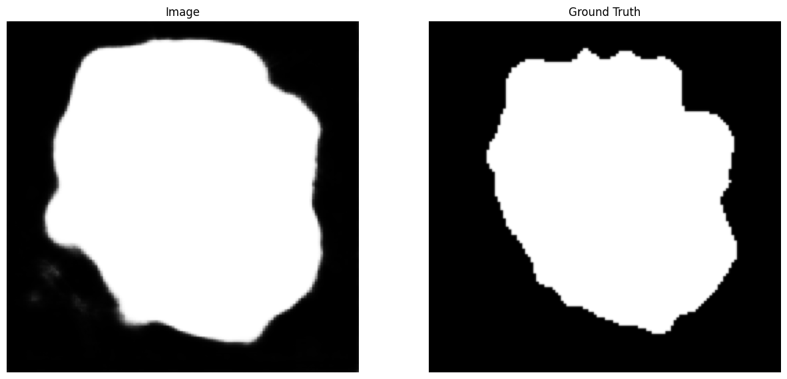

## UNET segmentation of ISIC 2018
### Table of Contents
  - [Dataset](#dataset)
  - [UNET Architecture](#unet-architecture)
  - [Training procedure](#training-procedure)
  - [Results](#results)
  - [Dependencies](#dependencies)

  

Batch of images sent through the model side by side with original images.

### Dataset
The ISIC 2018 dataset used for this project is part of a public data repository. This dataset includes training data in the form of png and jpg images of skin lesions as well as their ground-truth segmentation. The training data has been preprocessed by resizing the images to 256x256, followed by a normalization with the data's respective mean and standard deviation (which had to be calculated).
Dataset source: [ISIC 2018](https://challenge.isic-archive.com/data/#2018)
- Training set: 2075
- Validation set: 519
- Test set: 1000

The images in the test set did not have masks and are therefore not part of any of the logged metrics. For these, the training and validation sets were used. Based on lectures in COMP3710, the split between training and validation set seems reasonable.

### UNET Architecture
The UNET architecture is based on the architecture proposed by [ISIC_paper](https://arxiv.org/pdf/1802.10508v1.pdf). The network was originally used to do 3D image segmentation on the BRATS 2017 dataset, but has been restructured in accordance with the task at hand. It consists of four downsampling blocks, one bottom layer and four upsampling blocks:

#### Downsamling block
- Stride convolution: doubles the amount of features in the map and downsamples the image by a factor of two.
- Double convolution: two convolution layers with preactivation, instance normalization and inbetween dropout. Generates feature maps from the downsampled image tensor.

#### Bottom layer
- A downsampling block
- An upsampling block, consisting of an upsampling layer and a convolution that halves the number of features in the produced map.

#### Upsampling block
- Concatenation with corresponding downsampled feature map. 
- Two convolutions, both with batch normalization and leaky activation functions, one 3x3 and one 1x1 that halves the number of feature maps

The resulting network has two pathways: a context pathway that extracts increasingly complex features from the dataset, and a localization pathway that localizes where those features can be found within the original images. In the localization pathway, deep supervision is employed to make sure no information from the feature maps from lower layers are lost. If trained for an appropriate number of epochs, this architecture should produce segmented versions of the image training set, which can be used to identify lesions on later patients' skin.

### Training procedure
As proposed in the paper, a dice similarity loss function is used to train the network. The dice function uses how much the predicted image overlaps with the masked image to quantify how similar the two images are. Pytorch enables training the network on GPUs. To utilize this UQ's Rangpur Cluster was used. However, due to the number of jobs in queue for GPU training the results in this report were obtained using the GPU provided by Google Colab.

### Results
 Due to the limitation in training and a batch size of 16 the results here are obtained from the 30 epochs of training. The metrics used to evaluate the model were dice score, dice loss and the accuracy of the model. The accuracy is computed by accepting the predicted image as a 1.0 where the prediction is > 0.5. After 18 epochs, this was how the models prediction compared to the actual mask:

  

  

  

  

- Max dice score: 0.8024
- Min loss: 0.1976
- Max accuracy: 0.911 (in hindsight this is not as useful a metric)

### Usage 
This 
### Dependencies
- python 3.11.4
- conda 23.5.2
- cuda 11.7.99