# MRI Super Resolution Network - Elijah Nelson

### Abstract
This project implements a brain MRI super-resolution network by training on the ADNI brain dataset. The network is trained to up-scale from 4x down-sampled input images and produce reasonably clear output images.

As proposed by [Shi, 2016](https://arxiv.org/abs/1609.05158), the model utilises efficient sub-pixel convolution by extracting feature maps in the low-resolution space. This reduces computational complexity by waiting until the end of the model to reconstruct to higher dimensions.

An example of the model upsampling a low-resolution image to a higher resolution image:

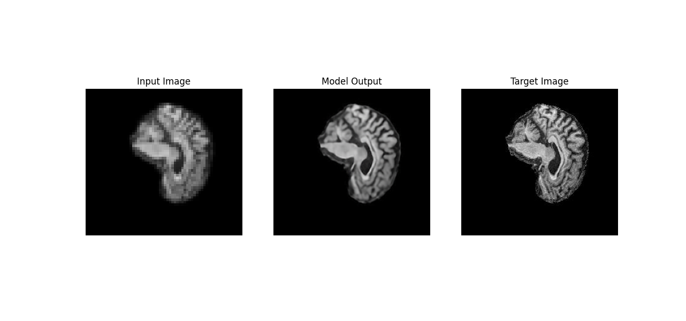

### Model Architecture

The model consists of multiple 2d convolutional layers to extract features, using LeakyReLU activation functions. The model architecture is as follows:

    SuperResolutionModel(
        (inputs): Sequential(
            (0): Conv2d(3, 64, kernel_size=(3, 3), stride=(1, 1), padding=(1, 1))
            (1): LeakyReLU(negative_slope=0.01, inplace=True)
            (2): Conv2d(64, 128, kernel_size=(3, 3), stride=(1, 1), padding=(1, 1))
            (3): LeakyReLU(negative_slope=0.01, inplace=True)
            (4): Conv2d(128, 128, kernel_size=(3, 3), stride=(1, 1), padding=(1, 1))
            (5): LeakyReLU(negative_slope=0.01, inplace=True)
            (6): Conv2d(128, 128, kernel_size=(3, 3), stride=(1, 1), padding=(1, 1))
            (7): LeakyReLU(negative_slope=0.01, inplace=True)
            (8): Conv2d(128, 128, kernel_size=(3, 3), stride=(1, 1), padding=(1, 1))
            (9): LeakyReLU(negative_slope=0.01, inplace=True)
            (10): Conv2d(128, 128, kernel_size=(3, 3), stride=(1, 1), padding=(1, 1))
            (11): LeakyReLU(negative_slope=0.01, inplace=True)
            (12): Conv2d(128, 48, kernel_size=(3, 3), stride=(1, 1), padding=(1, 1))
        )
        (outputs): Sequential(
            (0): PixelShuffle(upscale_factor=4)
        )
    )

The model was visualised using ``visualkeras``*:

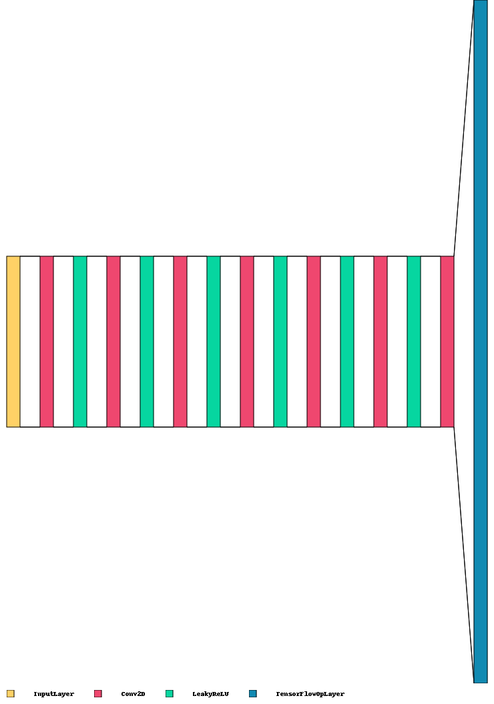

*Note that in order to use ``visualkeras``, the model was rebuilt in ``tensorflow.keras``, which is why the output layer is called ``TensorFlowOpLayer`` instead of ``PixelShuffle``.

This demonstrates the idea of learning the feature maps in the low-resolution space, and only constructing the high-resolution at the output layer to reduce computational complexity.

Tanh, ReLU and LeakyReLU were all tested for the activation functions, and LeakyReLU resulted in the clearest image outputs.

### Data Processing and Training Procedure
The original MRI images are 240px $\times$ 256px:

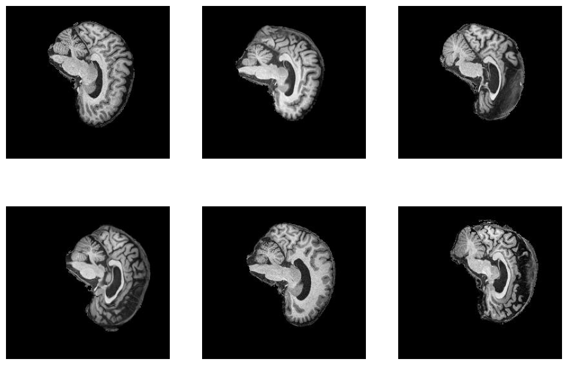

As they are loaded, a Random Horizontal Flip is applied:

Once loaded, they are downsampled by a factor of 4 using the Resize() transform:

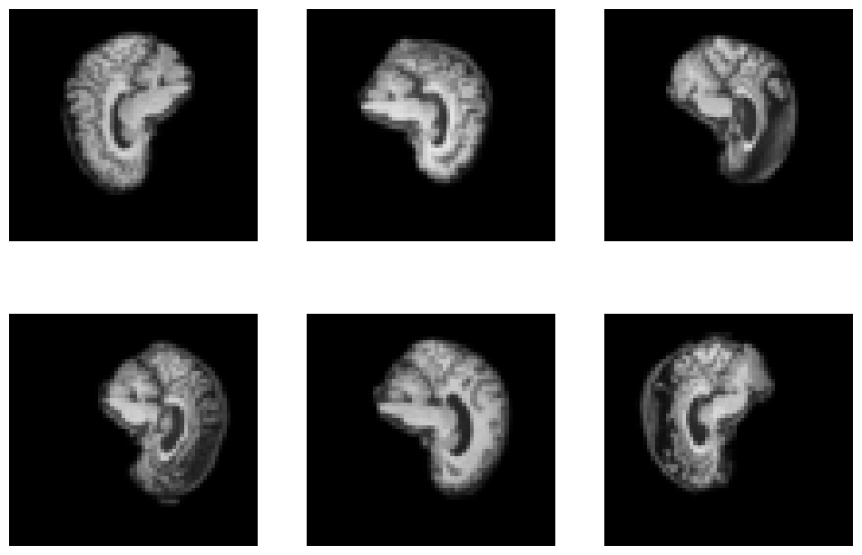

These downsampled images are fed into the model, and the model loss is calculated using the original images. A validation set was used to generate regular checkpoint outputs during training, and these are later inspected to verify the model isn't getting overfitted. As an example, here are some checkpoints from the first two epochs (chronologically left-to-right, top-to-bottom):

<table>
    <tr>
        <td> 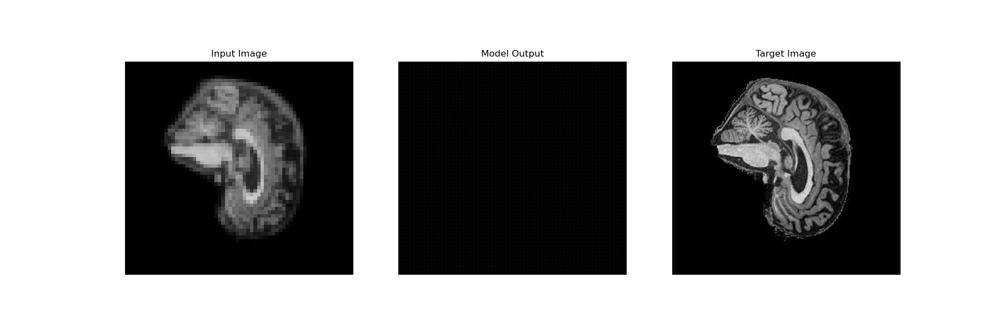 </td>
        <td> 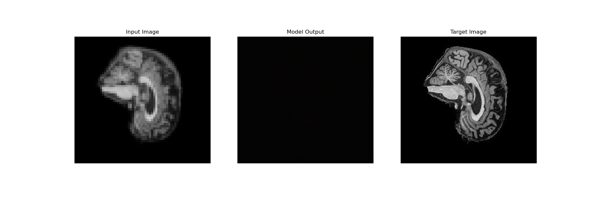 </td>
        <td> 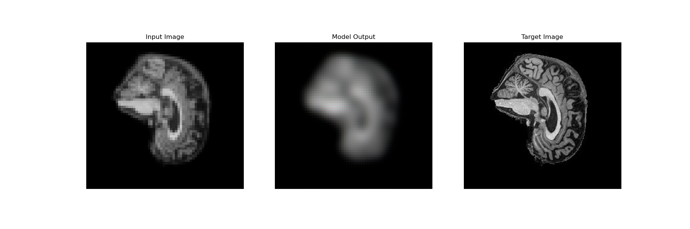 </td>
    </tr> 
    <tr>
        <td> 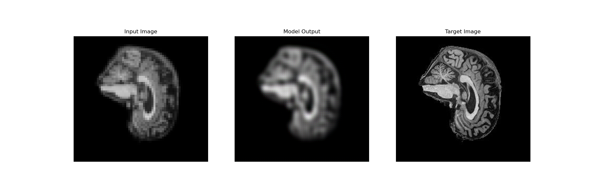 </td>
        <td>  </td>
        <td>  </td>
    </tr>
    <tr>
        <td> 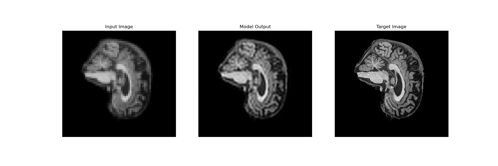 </td>
        <td> 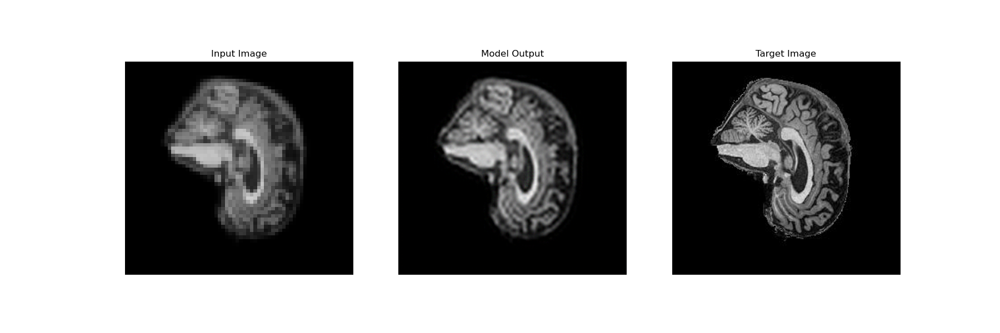 </td>
        <td> 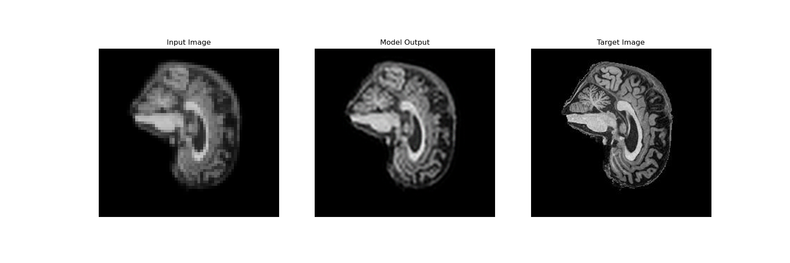 </td>
    </tr>
</table>

Using a validation set during training is critical when trying to prevent overfitting.

The model was trained for 10 epochs, which likely that 10 epochs is more than necessary. This can be seen in the loss plot:

We see a steep drop followed by stability for the rest of the training. Examining the checkpoint images supports this.

The end of epoch 4:

Looks almost identical to the end of epoch 10:

For future model applications, the number of epochs could likely be reduced to decrease training time without significantly impacting model performance.

#### Loss Function - MSE
The MSE (Mean Squared Error) loss function was used with mean reduction:
    $$ℓ(x,y)=\frac{1}{n}\sum^N_{i=1}{l_i}, \text{where }  l_i =(x_i−y_i)^2$$
For tensors $x$ and $y$ with $N$ total elements. MSE is incredibly common for non-classification models, and it is useful for punishing significant outliers in the outputs. In this context those would be significantly different pixels.

#### Optimiser - ADAM
ADAM is well known for its reliable performance in a variety of contexts. It was the first optimiser I tried, with a learning rate of 0.001. Since that produced good results, I didn't test any others - instead I focused my model improvement on architecture changes, activation functions, etc.

### Directory Structure

    data/
    └── AD_NC/
        ├── train/
        │   ├── AD-parent/
        │   │   └── AD/
        │   │       ├── 218391_78.jpeg
        │   │       └── ...
        │   └── NC-parent/
        │       └── NC/
        │           ├── 808819_88.jpeg
        │           └── ...
        └── test/
            ├── AD-parent/
            │   └── AD/
            │       ├── 388206_78.jpeg
            │       └── ...
            └── NC-parent/
                └── NC/
                    ├── 218391_78.jpeg
                    └── ...
    doc/        # Folder for images used in the README
    imgs/       # Folder that generated images are saved to
    config.py   # Hyperparameters and other constants
    dataset.py  # Data transformation, preprocessing and loading
    generate.py # Model output generation
    modules.py  # Model architecture definition
    predict.py  # Example model usage
    train.py    # Model training and validation

Note the additional parent folders that I've added - AD-parent, NC-parent, ...

This is due to a quirk in how I loaded the images.

### Dependencies

This project requires the following packages:

 - pytorch: v2.0.1
 - matplotlib: v3.7.1