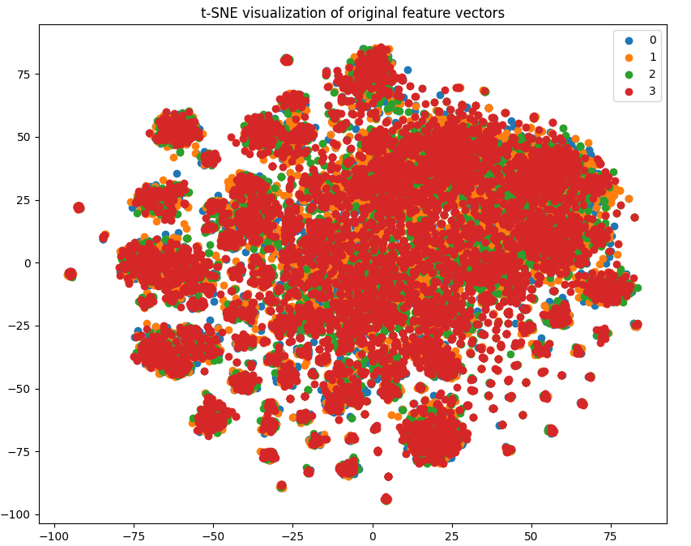
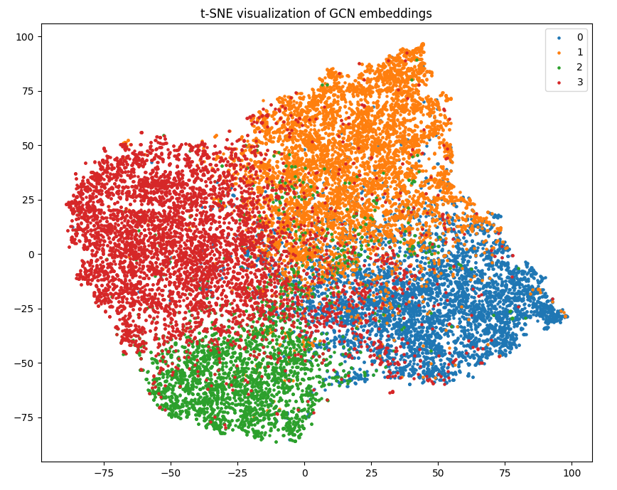

# Multi-layer GCN Model (s4696681)

This folder contains the implementation of a semi-supervised multi-layer GCN (Graph Convolutional Network) for Facebook's Large Page-Page Network dataset 
Hyperlink to dataset: https://snap.stanford.edu/data/facebook-large-page-page-network.html

## Forewarning
Due to the extreme size of the dataset, the adjacency matrix compution takes a copius amount of system memory to execute. I had to use a cloud GPU service in order to run this part of the code since even my 16GB or system memory was not enough. To mitigate this, I tried providing a local copy of this computation as a numpy file. However the file is 3.9GB which is far too large to be uploaded to github. To resolve this I have attached a shareable link to this file below. If you do not have sufficient memory on your system or virtual GPU, please download the file from this link: https://drive.google.com/file/d/1s1oZKkCDb9WA-IAjvSCuqsjWW0_goGvR/view?usp=sharing, and put it in the multi-layer_GCN_model_s4696681 folder. This means that instead of having to attempt this huge computation every time we run the model, we can just access the local copy since it will not change ever. It is redundant and extremely computationally inefficient to recalculate this every time we want to run the model which is my reasoning for including this in my project folder. The function that creates the adjacency matrix still is included in the dataset.py file, it just isn't called due to the reasoning above. If you want to test it, ensure you have a local or virtual system with high RAM and follow the instruction described below the normalise_adjacency_matrix() function in the dataset.py script.

## Overview
Semi-supervised Graph Convolutional Networks (GCNs) for node classification leverage labeled and unlabeled data within a graph to classify nodes. They operate by learning a function that maps a node's features and its topological structure within the graph to an output label. During training, the model uses the available labels in a limited subset of nodes to optimize the classification function, while also considering the graph structure and feature similarity among neighboring nodes. This approach allows the model to generalize and predict labels for unseen or unlabeled nodes in the graph, enhancing performance particularly when labeled data are scarce. 

The Facebook Large Page-Page Network dataset has nodes that represent official Facebook sites, with the edges being mutual likes between the sites. The Nodes are classified into one of four categories, these being: politicians, governmental organizations, television shows, and companies. By leveraging both node feature information (from site descriptions) and topological information (from mutual likes between pages), the GCN can exploit local graph structures and shared features to infer the category of a page. This classification allows for a more efficient organization, retrieval, or understanding of the pages without manually labeling each one. In essence, it enables the automatic categorization of Facebook pages based on both their content and their relationships with other pages.

## Data Preprocessing
The preprocessing undertaken ensures that the data is in a suitable format and structure to be used with a GCN. It handles the irregularities in the dataset, normalize crucial components, and prepare training/testing subsets. The following is an outline of the data preprocessing done.

Adjacency Matrix Creation:
The function create_adjacency_matrix reads edge data from the CSV file musae_facebook_edges.csv to create an adjacency matrix.
It initializes the matrix with zeros and fills it based on the relationships (edges) given in the CSV file.
Diagonal entries are set to 1 since every node links to itself.

Adjacency Matrix Normalization:
The function normalise_adjacency_matrix normalizes the adjacency matrix. This normalization uses the inverse square root of the degree matrix D.

Feature Vector Creation:
The function create_feature_vectors reads node features from a JSON file musae_facebook_features.json.
As the features for nodes are inconsistent, it creates an n-dimensional "bag of words" feature vector for each node, where each dimension corresponds to the presence (or absence) of a particular feature.

Label Conversion:
Labels given in the file musae_facebook_target.csv are in string format. The function convert_labels converts these string labels to integer format.
It maps "politician" to 0, "government" to 1, "tvshow" to 2, and "company" to 3.

Data Splitting and Tensor Creation:
The function create_tensors prepares data for training and testing. This involves splitting node IDs into training and test sets and creating masks to select training and test nodes.
All the data are then converted into PyTorch tensors and transferred to the GPU.

## Model Architecture
The GCNLayer class represents a single layer of the GCN, taking in node features and an adjacency matrix, performing matrix multiplication with a learnable weight, and propagating information through the graph using the adjacency matrix.
The weights of this layer are initialized using the Xavier uniform initialization method.

The GCN class represents the entire network, which consists of two consecutive GCNLayers: 
- the first one applying a ReLU activation function after its operation, followed by a dropout layer,
- the second one without any activation.

The final output of the GCN is the log softmax of the output of the second layer, and the intermediate embeddings from the first layer are also be retrieved using the get_embeddings method.

## Training and Validation
Evidence of training can be seen in the hyperparameter_tuning.txt file. This logs the output of the nested 10-fold cross validation enacted on the model to tune the hyperparameters and compute the best model. Nested cross validation was chosen as it provides a way to not only tune the hyperparameters but evaluate each set of hyperparameters in a nested loop thus there is no need to have a seperate validation loop. Since the nested cross validation trains the model for every combination of possible hyperparameters, several cases for each hyperparameter were chosen instead of a range of values. This significantly reduced the computation time of the nested validation. By logging the progress of this nested cross validation, we gain insight onto how the model reacts to different sets of hyperparameters thus allowing us to understand our model better.

The outcome of this hyperparameter tuning showed that the best hyperparameters to use were the following:
{'epochs': 300, 'hidden_features': 64, 'learning_rate': 0.01}

Doing 10-fold cross validation on the model with these hyperparameters yielded an accuracy of 91.046%

To gain more insight on the performance of the model, A TSNE plot was created to visualise the data before and after being inputted into the model. This is how the dataset looked before:

And this is the TSNE visualisation after being trained by the model:

As can be seen, the model has transformed the data into four distinct regions representing the four classes of the dataset. Though there are some outliers that exist in other classes decision regions, the overwhelming majority of the datapoints have been clustered into the correct class region. This clearly shows that my GCN model is effective at node classification.

Improvements to the model:
Some possible improvements to the model would be to attempt to reduce the number of outliers that are misclassified. Despite the 91% accuracy, it still could be improved as shown in the TSNE plot. One way to go about this is to experiment with the models architecture. Though I did perform hyperparameter tuning, I did not try utilise nested cross-validation to optimise the model architecture itself.  More layers could be added or some sort of dropout could be applied. There are so many different options for modifying the models architecture so the model may in fact be improved if this is done.

## Libray packages and dependencies
My project utilised the following packages:
torch                             2.0.1+cu118
torchaudio                        2.0.2+cu118
torchvision                       0.15.2+cu118
scikit-learn                      1.3.2
scipy                             1.11.3
matplotlib                        3.8.0
numpy                             1.24.1

