# Generative VQ-VAE for the OASIS Brain Dataset
### Ryan Ward - 45813685

## Model Overview
This repository contains a pytorch implementation of a Vector Quantized Variational Autoencoder for use with the OASIS brain dataset. The architecture of the VQ-VAE was first outlined in Oord et. al. [1](https://arxiv.org/abs/1906.00446), where the authors use a standard Variational Autoencoder as a basis for encoding onto a discrete latent representation. This vector quantisation layer aims to better represent real world data, which is inherently discrete. In addition, the VQ-VAE architecutre prevents posterior collapse, which is a prevelant issue in standard VAEs. A simple GAN was used to generate new quantized representations, which were then fed into the VQ-VAE decoder to generate novel images of the OASIS dataset.

## VQ-VAE Algorithm and Architecture
The VQ-VAE is similar in structure to the standard VAE, however, their embedding spaces vastly differ. Unlike standard VAEs, which have a continuous latent space, the VQ-VAE implements a discrete embedding space, also known as a codebook. This codebook updates with discrete representations for input data during training. Figure 1 below shows the architecture diagram from [1](https://arxiv.org/abs/1906.00446). During a forward pass, the data is encoded, then 'snapped' to a codebook indice in the embedding space. This indice is then referenced by the decoder, which in turn generates an accurate reconstruction of the image from the discrete latent space. 

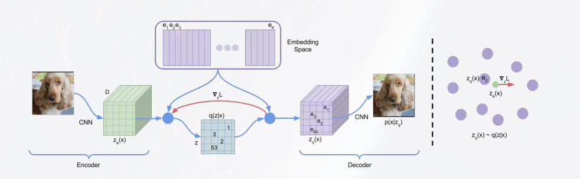

The drawback to a discrete latent space is that gradients are unable to propagate backwards, therefore, the loss function differs from a standard VAE loss function to include a commitment cost beta, and the stopgradient operator. Figure 2 below shows the total training loss function of the VQ-VAE:

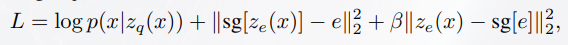

## GAN Architecture
The VQ-VAE does not generate novel images, and instead a GAN is used, trained on the quantized output of the VQ-VAE encoder and vector quantized layers. The GAN is used to train new quantized representations of the OASIS dataset, which can be input to the VQ-VAE decoder to generated original MRI images. Figure 3 below [2](https://www.computationalarchitecturelab.org/generative-adversarial-networks-and-plan-stylistic-plan-generation) shows a trivial GAN architecture, used in the training process of this project.

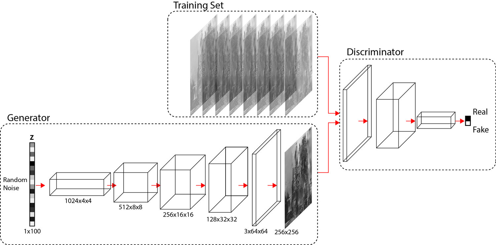

## OASIS Dataset and Pre-processing
The OASIS Dataset is an open source project aimed at making neuroimaging datasets freely available to the scientific community [3](https://www.oasis-brains.org/#about). The datasets used in the project were split into two primary classes - segmented and original. The original datasets were used, as they are a more accurate representation of an MRI image, however, the data path can be edited to change to the segmented datasets. The data class was separated into train, test and validate, with 9664, 544 and 1120 image samples respectively. A custom data class (see ```dataset.py```) was used to separate out the train, test and validate sub directories into their respective loaders. The scikit-image libary was used to get each image, and automatically converted the image from RGB (3 channel) to grayscale (1 channel). The only other transform needed was to convert the image to a tensor before passing it to the dataloader. 

## VQ-VAE Training 
The training loop for the VQ-VAE can be found in ```train.py```, and uses the pytorch tensorboard utility to track the VQ-VAE reconstructions throughout training. The hyperparameters specified in the paper were used, with a batch size of 32, commitment loss of 0.25, learning rate of 0.001, and was trained for 15 epochs. The large number of images in the train dataset, as well as the inherent similarity between each image allowed the network to converge quite quickly, reaching a maximum structured similarity of 0.942 and a minimum reconstruction loss of 0.0001. The training process involved taking the reconstructed image output from the VQ-VAE, and finding the total loss, consisting of the embedding loss when the quantized representation is 'snapped' to a codebook indice, and the mean squared loss with respect to the original image. This loss was the back propagated through the network and the gradients were updated accordingly. The model and graphs were saved for use in the report and further image generation.

## GAN Training
The GAN training is quite standard, however, rather than having a 3 channel input and output (for standard RBG images), the output channel represented the embedding dimensions present in the quantized output of the vector quantized layer. A real image was loaded into the trained VQ-VAE, and the quantized output is used as a training input to the GAN. After the GAN had been trained novel images were generated by passing a fixed noisy latent space to the GAN to generate an original quantized image. This quantized representation was passed to the VQ-VAE decoder to generate a completely original MRI brain image.

## Results
The training loss is shown below.

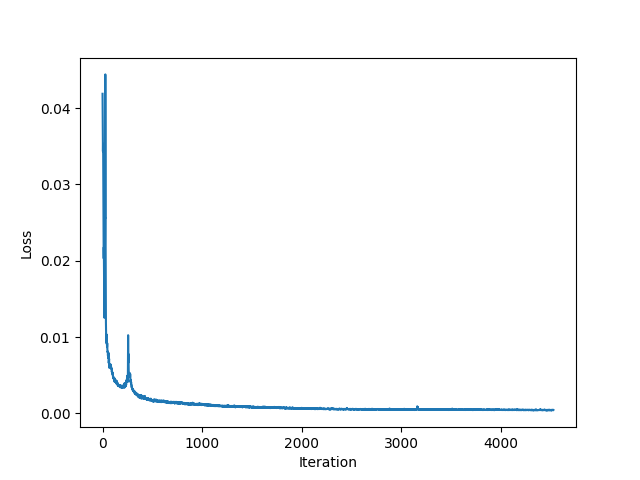

As seen, the loss converges to 0 over the training iterations, which results in a high structured similarity when the network is presented with the test dataset.

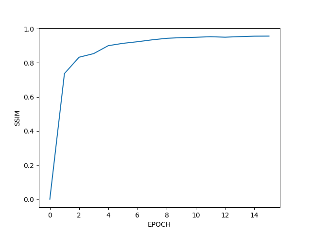

The Structured Similarity was calculated using scikit-image's structural_similarity function, and the model clearly satisfies the requirement of SSIM > 0.6.

A batch of input images are shown below.

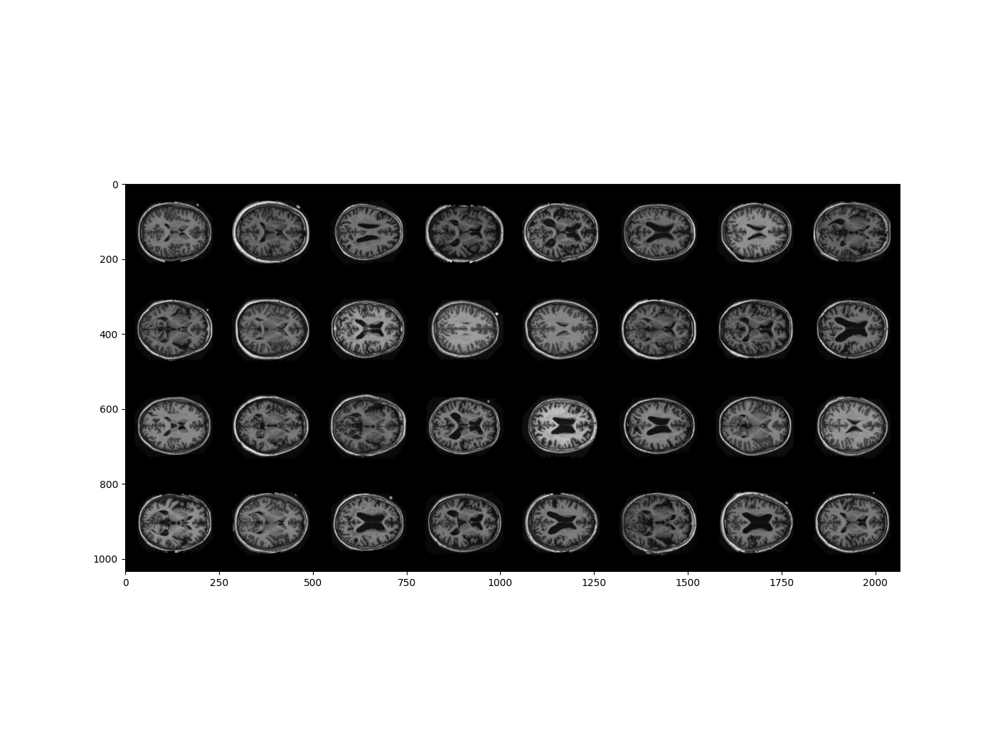

A batch of 32 images are passed through the VQ-VAE, and after the first epoch, the reconstructed images are shown below:

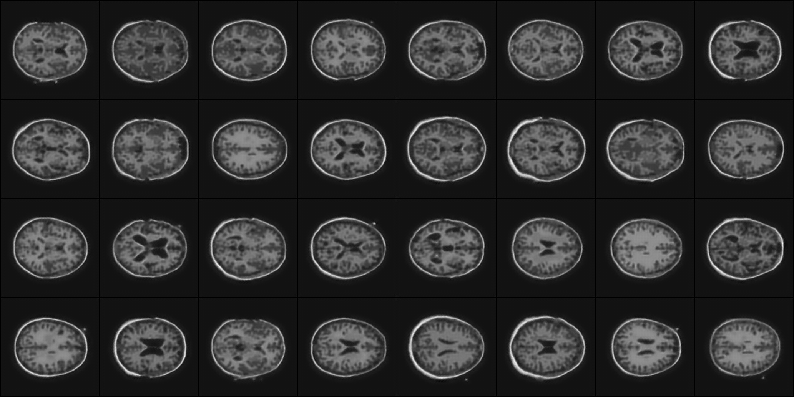

After 15 epochs, the output of the VQ-VAE shows some much higher quality images.

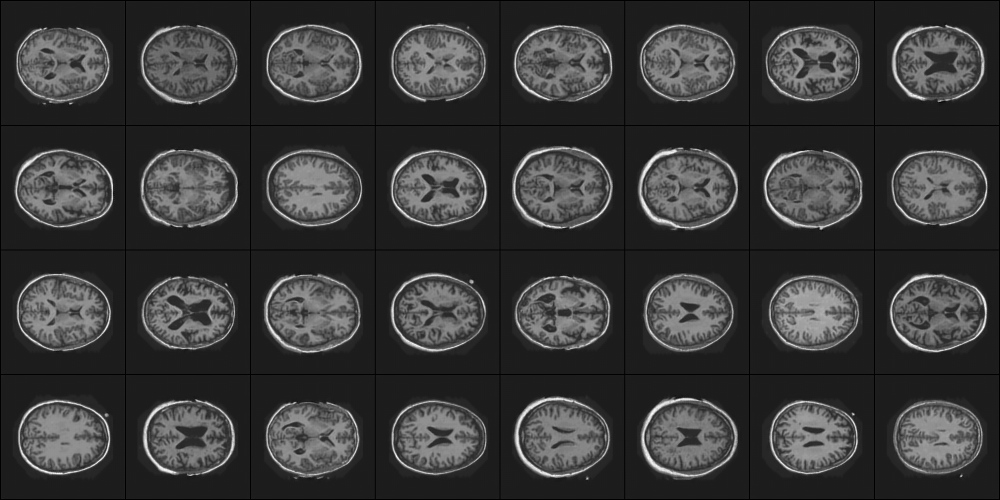

A quantized sample output is shown below, which represents a given quantized image.

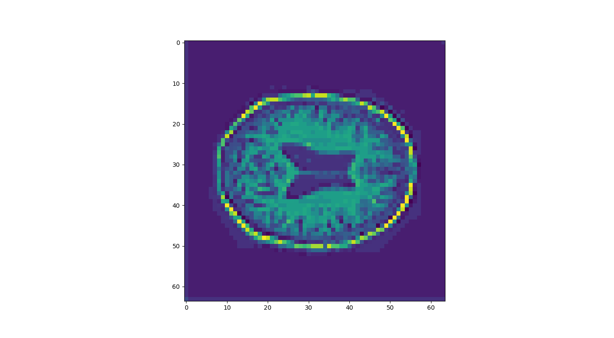

After training and validation, the GAN can be trained on the quantized output of the VQ-VAE. The generated images are shown below.

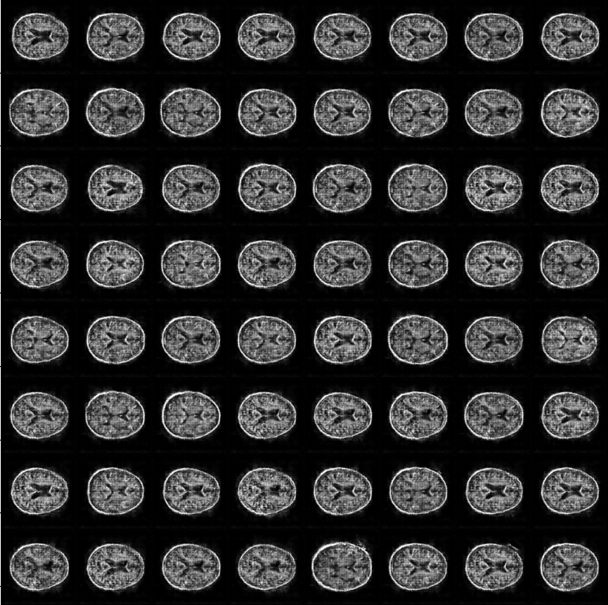

As seen, the images are quite blurry and contain some amounts of noise, due to the untuned hyperparameters of the GAN. A subplot of six images is shown below for more visual granularity.

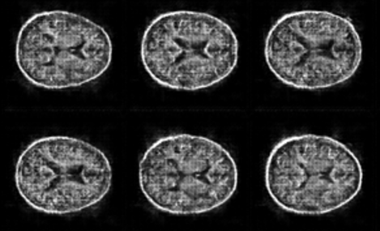

## Reproduction 
To generate the images shown above, ensure the OASIS data path is either specified or in the working directory, install all necessary dependencies, ensure that you are in a conda environment, and run ```driver.py```. This will generate the ```log``` and ```model``` directories in the workspace, which save the various models, logs and tensorboard logfiles for each time the training script is run.

## Model Dependencies
| **Library** | **Version** |
| --- | --- |
| pytorch | 2.0.2 |
| torchvision | 0.15.2 |
| matplotlib | 3.7.2 |
| scikit-image | 0.22.0 |
| numpy | 1.25.2 |

## References
[1] Oord. Aaron van den, Vinyals. Oriol, Kavukcuoglu, Koray, "Neural Discrete Representation Learning" (https://arxiv.org/pdf/1711.00937.pdf)

[2] Computational Architecture Research Lab (https://www.computationalarchitecturelab.org/generative-adversarial-networks-and-plan-stylistic-plan-generation)

[3] OASIS Brain Project (https://www.oasis-brains.org/#about)

    
