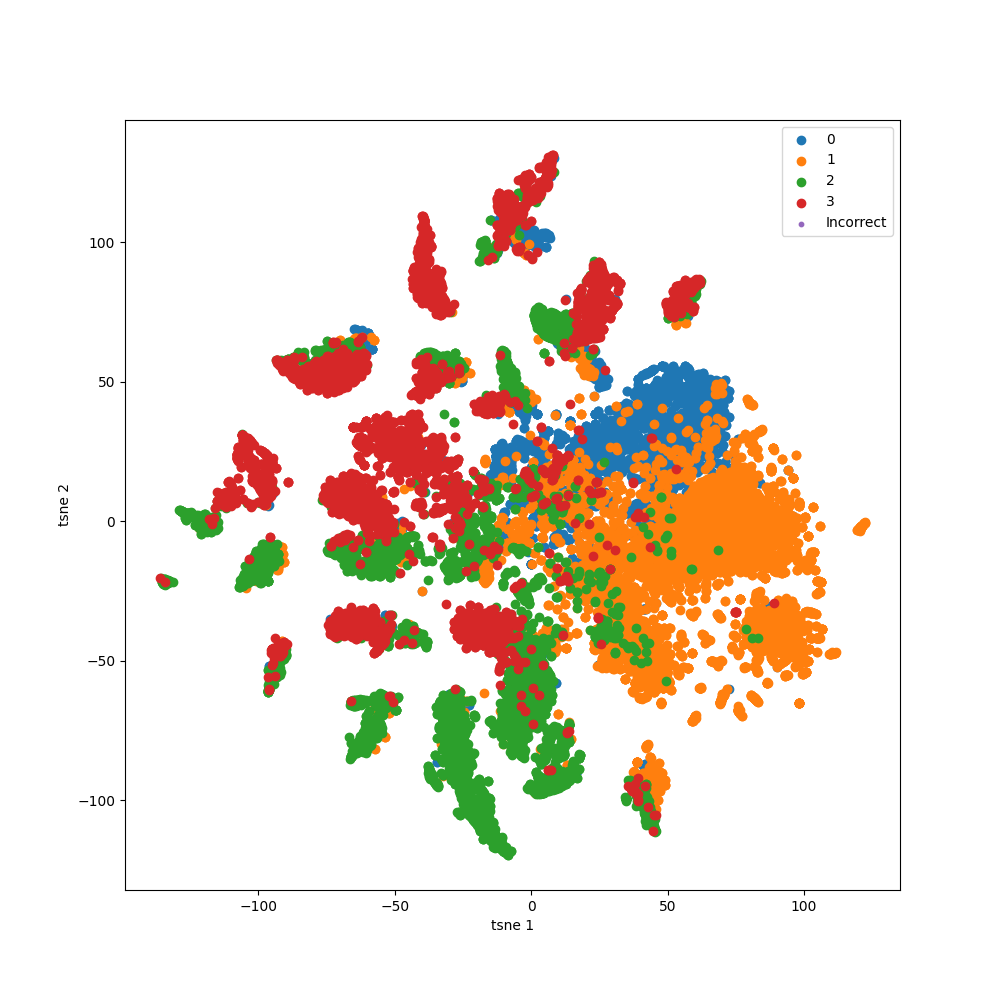

# Semi Supervised node classification on Facebook Large Page-Page Network dataset
## Description
The facebook large page-page network dataset is a page-page graph of verified Facebook sites. Each node representa a Facebook page and the edges between nodes represent mutual likes between each page. The node features are descriptions of the page as written by the page owners, and have been embedded into an embedding space. The aim of this project is to classify each page into one of four categories: polititions facebook page, govermental facebook page, a tv show facebook page or a company page. 

The neural network is trained in a semi supervised manner. This models a real world problem where the data for the graph exists, but only a subset of nodes are labelled. In semi-supervised learning, the entire graph is used for training, but only the labeled nodes are used to compute the loss function. This way, the model learns from the graph structure and node features for the entire graph even though only a subset of node labels are available. 

## Graph neural networks and Graph Convolutional Networks
### Deep Learning Basics
In the simplest case, a deep neural network is a composition of parameterised linear functions $f^l$ for $l \in \{1, \dots, L\}$, each followed by an element-wise non-linear activation $\sigma$. 
```math
\begin{align}
    NN_\theta = f^L \circ \sigma \circ \dots \circ f^2 \circ \sigma \circ f^1.
\end{align}
```
Neural networks can be used as function approximates with learnable parameters $\theta$. The simplest neural network architecture is a multilayer perceptron, MLP where $f^l$ is defined to be 
```math
\begin{align}
    f^l(h) = W_l h + b_l
\end{align}
```
where $W_l$ is a matrix of learnable weights for the $l$th layer, $b_l$ is a learnable bias vector, and $h_l$ represents the feature vectors (or hidden representations) of the input data. For the activation function $\sigma$, a common choice is the rectified linear unit, or ReLU function, defined as 
```math
\begin{align}
    ReLU(h) = \max (0, h).
\end{align}
```
Neural networks are trained using the backpropagation algorithm and variants of the stochastic gradient descent algorithm to minimise a loss function $L$. The loss function $L$ is typically chosen to guide the network towards a specific output. In the case of multiclass classification with $C$ classes, the output layer of the neural network will have $C$ outputs, one for each class. The outputs are then passed through a softmax function which estimates the probability distribution over each class. The softmax is defined as
```math
\begin{align}
    \textrm{Softmax}(z_i) = \frac{exp(z_i)}{\sum_j exp(z_j)}
\end{align}
```
where $z_i$ represents the neural network output for class $i$. After estimating the probabilities using the softmax function, the loss function is typically chosen to be the cross-entropy loss, defined to be
```math
\begin{align}
    \textrm{CrossEntropyLoss}(y, \hat{y}) = -\sum_{c=1}^C y_c \log(p_c)
\end{align}
```
where $y_c$ is a binary indicator indicating the true class of the sample, and $p_c$ is the output softmax probability of the sample belonging to that class (\cite{hastie_neural_2009}).

### Graph Convolutional Networks
Graph neural networks are a neural network architecture built on top of graph structures. It takes in a graph $G = (V, E)$, where $V$ is a set of nodes $\{v_1, \dots, v_N\}$ and $E$ is a set of edges $(v_i, v_j)$ that connect the nodes $v_i$ and $v_j$. If for all $i, j$, $(v_i, v_j) \in E$ and $(v_j , v_i) \in E$, we say that the graph is undirected. Associated with each node is a $d$-dimensional feature vector $x_i$, where $d$ is the number of features for each node. Optionally each edge can have an associated feature vector $x_{(i, j)}$. 

The structure of the graph then determines the message-passing updates, which are executed in sequence to obtain updated node representations and edge representations. Let $h^l_i$ be the node representation of node $v_i$ on the $l^{th}$ iteration, and let $h^l_{(i, j)}$ be the edge representation after the $l^{th}$ update. Set $h^0_i = x_i$ and $h^0_{(i,j)} = x_{(i,j)}$.
```math
\begin{align}
    h_{(i, j)}^{l+1} &= f_{edge}(h_i^l, h_j^l, x_(i, j))\\
    h_i^{l+1} &= f_{node}(h_i, \sum_{h_i \in N(v_i)}h_{(j, i)}^l, x_i)
\end{align}
```
where $N(v_i)$ is the neighbourhood of $v_i$, that is all the nodes $v_j$ that $v_i$ is connected to. The update to the network is called a message-passing operation. Since each message-passing operation collects information from each of the neighbours, more message-passing operations aggregate information from further along the graph.

For a graph convolutional network, the message passing is done through the following function:
```math
\begin{align}
    h_i^{(l+1)} = \sigma\left(W_0^{(l)T} h_i^{(l)} + \sum_{v_i \in N(v_i)} c_{i, j} W_1^{(l)T} h_j^{(l)}\right)
\end{align}
```
where $\sigma$ is a non-linear activation function such as the element-wise ReLU function, $W_0^{(l)}$ and $W_1^{(l)}$ are learnable $d_l \times d_{d+1}$ parameter matrices and $c_{i, j} = 1/\sqrt{D_{i,i}D_{j,j}}$ is a normalisation constant, where $D_{i,i}$ is the degree of node $v_i$. The final node representations $h^L$ can then be used for regression or node classification problems in the normal way described above. 


The image shows how message passing works in a graph convolutional network, where information is aggregated on the nodes over time (credit: Understanding Graph Convolutional Networks for Node Classification by Inneke Mayachita - Towards Data Science). 

## Training and validation
The model is trained using a random sample of 80% of the labels as training data, and a random holdout 20% as validation. Randomness insures that there is no structure intentionally included, or accidently not noticed, in the training data that is not available in the validation data. The graph is loaded with embedded node features, and is split into batched using PyTorch geometric KNeigborLoader, which is a data loader that splits the graph into multiple subgraphs for training. The model consists of two graph convolutions, each with 128 channels, and passes the output into a relu function before the next layer. The final output is passed through a linear layer before being passed to the cross entropy loss function. The exponential learning rate schedular was trialed for a number of experiments, but was found to ultimately hinder performance. 

The model is trained using stochastic gradient decent with a constant learning rate of 0.65 with no learning rate schedular, and is trained for 400 epochs. Validation is run on the final model to determine the accuracy on the holdout testing set, and the accuracy on the entire graph. The results are tabulated below

| Metric | Result |
|-----|-----|
| Final Training loss | 0.34 |
| Test loss | 0.38 |
| Final Accuracy on Test Set | 0.88 |
| Final Accuracy on full graph | 0.88 |
| Class 0 | 0.80 |
| Class 1 | 0.87 |
| Class 2 | 0.91 |
| Class 3 | 0.95 |

The model achieves reasonable accuracy and will perform well in production for the last three classes. For the first class, the accuracy is 79%, so while most results can be trusted there is still a 20% chance that the page will be misclassified. 

## T-SNE
A T-SNE plot is made that shows the final embedding of the nodes before the linear layer is applied to reduce the final dimension. 128 embedded features are used and the first two T-SNE features are plotted. As can be seen, the classes are grouped together in the embedding with little overlap for most classes. This allows the linear model to distinguish between the classes in the high dimensional embedding space and output a value that can be used to derive the predicted class. 



## Running
The algorithm can be run in full by running
> bash run_model.sh

or can be trained using 
> python3 train.py

Alternatively, you can test the latest run of the training on a saved model using
> python3 predict.py

## Dependencies
alembic==1.12.0
asttokens==2.4.0
backcall==0.2.0
certifi==2023.7.22
charset-normalizer==3.2.0
cmaes==0.10.0
cmake==3.27.5
colorlog==6.7.0
comm==0.1.4
contourpy==1.1.1
cycler==0.12.0
debugpy==1.8.0
decorator==5.1.1
exceptiongroup==1.1.3
executing==1.2.0
filelock==3.12.4
fonttools==4.43.0
greenlet==3.0.0
idna==3.4
ipykernel==6.25.2
ipython==8.16.0
jedi==0.19.0
Jinja2==3.1.2
joblib==1.3.2
jupyter_client==8.3.1
jupyter_core==5.3.2
kiwisolver==1.4.5
lit==17.0.1
Mako==1.2.4
MarkupSafe==2.1.3
matplotlib==3.8.0
matplotlib-inline==0.1.6
mpmath==1.3.0
nest-asyncio==1.5.8
networkx==3.1
numpy==1.26.0
nvidia-cublas-cu11==11.10.3.66
nvidia-cuda-cupti-cu11==11.7.101
nvidia-cuda-nvrtc-cu11==11.7.99
nvidia-cuda-runtime-cu11==11.7.99
nvidia-cudnn-cu11==8.5.0.96
nvidia-cufft-cu11==10.9.0.58
nvidia-curand-cu11==10.2.10.91
nvidia-cusolver-cu11==11.4.0.1
nvidia-cusparse-cu11==11.7.4.91
nvidia-nccl-cu11==2.14.3
nvidia-nvtx-cu11==11.7.91
optuna==3.3.0
packaging==23.1
pandas==2.1.1
parso==0.8.3
pexpect==4.8.0
pickleshare==0.7.5
Pillow==10.0.1
platformdirs==3.10.0
prompt-toolkit==3.0.39
psutil==5.9.5
ptyprocess==0.7.0
pure-eval==0.2.2
pyg-lib==0.2.0+pt20cu118
Pygments==2.16.1
pyparsing==3.1.1
python-dateutil==2.8.2
pytz==2023.3.post1
PyYAML==6.0.1
pyzmq==25.1.1
requests==2.31.0
scikit-learn==1.3.1
scipy==1.11.3
seaborn==0.13.0
six==1.16.0
SQLAlchemy==2.0.21
stack-data==0.6.2
sympy==1.12
threadpoolctl==3.2.0
torch==2.0.1
torch-cluster==1.6.1+pt20cu118
torch-geometric==2.3.1
torch-scatter==2.1.1+pt20cu118
torch-sparse==0.6.17+pt20cu118
torch-spline-conv==1.2.2+pt20cu118
torchaudio==2.0.2
torchvision==0.15.2
tornado==6.3.3
tqdm==4.66.1
traitlets==5.10.1
triton==2.0.0
typing_extensions==4.8.0
tzdata==2023.3
urllib3==2.0.5
wcwidth==0.2.8
