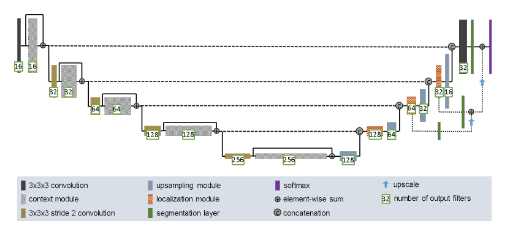

# Segmentation of the ISIC 2018 Dataset with the Improved UNet

<!-- Author Information -->
## Author
Name: Mitchell Keefe

Student ID: 45574539

<!-- The Task Chosen For the Project -->
## Task
> Task 1: Segment the ISIC 2017/8 data set with the Improved UNet [1] with all labels having a minimum Dicesimilarity coefficient of 0.8 on the test set.

<!-- Dataset Information -->
## Dataset

### Description
The International Skin Imaging Collaboration (ISIC) datasets contain dermoscopic images, with challenges being set each year in hope to improve melanoma diagnosis. For this project, the ISIC 2018 challenge dataset has been used. It contains 2594 images of skin lesions of varying size, and 2 separate folders of input and output images. The input images (training) are in JPG format and are dermoscopic images (of skin lesions). The output images (ground truth) are masks for the skin lesion images in PNG format. An example of the input and output images is given below:

  

    <h4 style="display:inline;">Image (Input)</h4>
    
  

  

    <h4 style="display:inline;">Mask (Output)</h4>
    
  

### Pre-processing
The image folders were saved and the images shuffled before being split. The training, validation, test split used in this project was a **70%, 15%, 15% ratio** respectively: 1816 training images, 389 testing images, and 389 validation images. This was chosen because it is a widely accepted data split ratio and is suitable because the ISIC 2018 dataset is not too small (> 2000 images). During the pre-processing stage, images were resized to (256px, 256px) to keep them uniform. The dimensions were selected as they were close to equalling some of the smallest images in the set. This allowed for training time to be enhanced while, also, maintaining the quality of the images. Images were then normalized, and saved into tensorflow datasets to be used in the training process.

<!-- Model Information -->
## Model

### Improved UNet [1]
The UNet is a convolutional network which is used for image segmentation, with its name given because of the U-shaped architecture. It is comprised of encoding and decoding sections. The improved UNet architecture [1] makes use of convolution layers with a stride of 2 between the context modules to allow for more features while encoding. The localization pathway takes feature from deeper levels in the network which have been encoded in lower resolution, and decode them in higher spatial resolution. For this process, it upsamples / upscales, then has a 3x3x3 convolution which halves amount of feature maps. The upsampled features are then recombined with the results from the element-wise sums performed on the context modules on the same level via concatenation. It also makes use of softmax activation for the outputs rather than sigmoid which is used generally in the traditional UNet architecture.

  <kbd>
  
  </kbd>

### Dice Similarity Coefficient
>The Sørensen–Dice coefficient is an evaluation metric which assesses the similarity of two values. [2]

The values of the coefficient range between (0, 1), with a value of 1 being identical / ideal.

As described in the Task section of this project, our goal is to obtain a Dice Similarity Coefficient value above 0.8 on the test set.

Note: Reference [3] was used as a resource when implementing the function in this project (information used is under the heading 'Defining custom metrics and loss functions').

<!-- Project Results  -->
## Results

After 10 EPOCHS, the model achieved:

accuracy: 0.9325 - dice_similarity: 0.9229 - val_loss: 0.1791 - val_accuracy: 0.9308 - val_dice_similarity: 0.9232

<!-- Usage Instructions -->
## Usage

### Dependencies
* Python 3.9
* Tensorflow 2.14.0
* Keras 2.14.0
* Numpy 1.23.1
* Matplotlib 3.8.0
* Scikit-Learn 1.3.1
* Glob

### How To Run
1. Create a new folder named DATA in the project folder (s45574539)
2. Download the ISIC 2018 Segmentation Task Data into the new DATA folder

    This can be accessed via the COMP3710 Blackboard page -> Course Help/Resources -> ISIC 2018 Segmentation Task Data
3. Ensure necessary dependencies (listed above) have been installed.
4. Run the main function in train.py to run and save the model.

    This will train the model and output results (listed, graphed, etc).
5. (Optional) Run the function in predict.py to obtain prediction results based on the saved model.

## References
[1] F. Isensee, P. Kickingereder, W. Wick, M. Bendszus, and K. H. Maier-Hein, “Brain Tumor Segmentation and Radiomics Survival Prediction: Contribution to the BRATS 2017 Challenge,” Feb. 2018. [Online]. Available: https://arxiv.org/abs/1802.10508v1

[2] Wikipedia contributors. "Sørensen–Dice coefficient." Wikipedia, The Free Encyclopedia. Wikipedia, The Free Encyclopedia, 29 Aug. 2023. [Web]. Available: https://en.wikipedia.org/wiki/S%C3%B8rensen%E2%80%93Dice_coefficient

[3] Notebook Community contributors. "Image Segmentation with tf.keras", Notebook Community, 2020, [Web]. Available: https://notebook.community/cshallue/models/samples/outreach/blogs/segmentation_blogpost/image_segmentation
