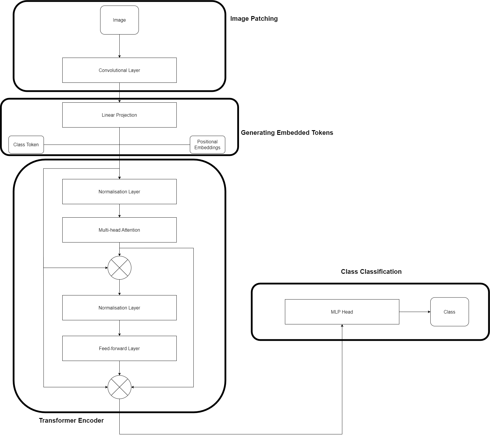
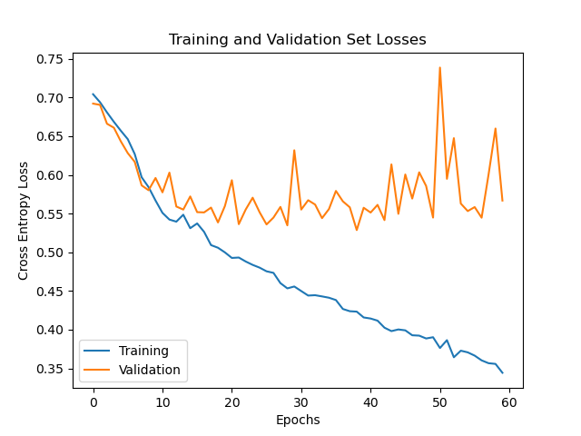
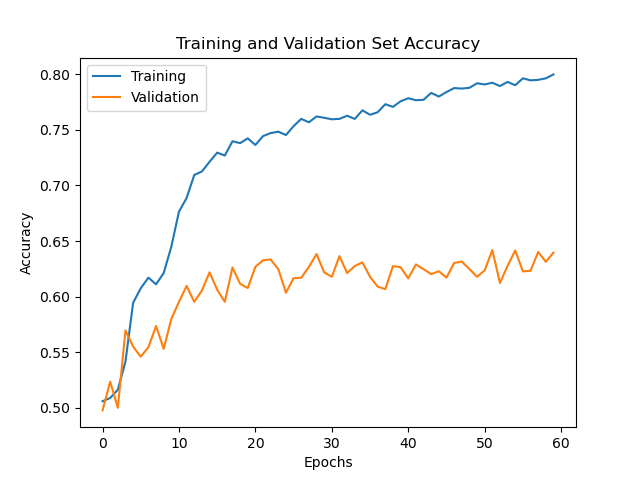
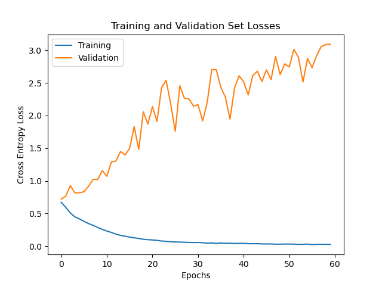
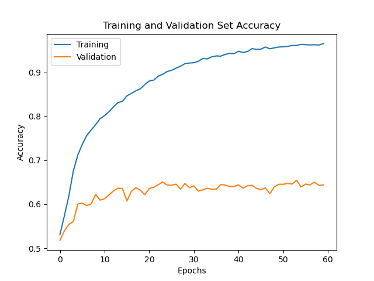
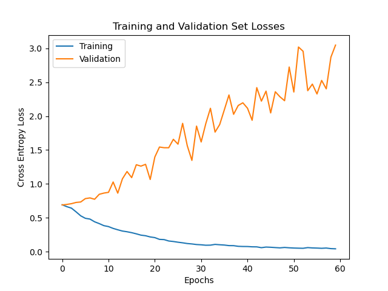

# Classifying Alzheimer's Disease Using a Visual Transformer

The aim of this project is to classify Alzheimer's disease of the ADNI brain dataset using a vision transformer (ViT). The ADNI brain dataset is composed of two classes - AD meaning Alzheimer's disease, and NC meaning Normal Cognitive. The goal is to perform classification with a minimum accuracy on the test dataset of 0.8.

## Vision Transformer
Vision Transformers, often referred to as ViTs, signify a groundbreaking departure from the traditional Convolutional Neural Networks (CNNs) in the realm of computer vision. These models are primarily characterized by their utilization of the Transformer architecture, originally designed for natural language processing but adapted for visual data processing.


In a ViT the first step involves dividing an input image into non-overlapping patches of fixed size, typically 16 by 16 pixels. These patches are then linearly embedded into low-dimensional vectors treated as a sequence of tokens. After these patches are linearly embedded a class token is prepended to the sequence. The class token is a learnable embedding focused on representing the entire image, and is hence crucial in classification. All embedded tokens are then added with a positional embedding which is generally just a random tensor representing the location of the embedding on the image.

This sequence of embedded vectors is then processed through a transformer encoder. Within the encoder are multiple feed-forward layers and self-attention layers. This self-attention mechanism is crucial as it allows the model to learn the long-range depedencies between patches. The output of the encoder is fed into a MLP which classifies the image.

## ADNI Dataset
It was mentioned there were two classes in the ADNI dataset, Alzheimer's disease and Normal Cognitive. Below there are examples for both classes (AD top, NC bottom)


## Installation and Dependencies
Training this model assumes conda is installed on your machine. If it is not installed, please see [miniconda](https://docs.conda.io/projects/miniconda/en/latest/miniconda-install.html). Follow the steps below to prep your environment for training:
```bash
conda create -n vit_adni 
conda activate vit_adni
conda install python=3.10
conda install pytorch torchvision torchaudio pytorch-cuda=11.8 -c pytorch -c nvidia
conda install matplotlib
conda install numpy
conda install -c conda-forge tqdm
```

## Model

### Pre-processing
The ADNI dataset provided was given in training and test folders. So, one of the first pre-processing steps used was to seperate the train folder into a training and validation set. It was decided a 80/20 train/validation split would be applied to the data. This is a common split ratio so it was a clear choice to use. On top of this, a patient-level split is also applied. As there are multiple scans of the same patient in the dataset, it was important to ensure that a patient scans only lies in the training or validation set. This is because the model would learn the patients number and hence, if the same patient existed in both datasets, the validation loss (and accuracy) would become a meaningless performance metric. 

When loading images into Python using PyTorch's ImageFolder class, the images undergo several transformations. These being:
 * Image resizing to 240px x 240px 
 * Normalisation with mean 0.5, and standard deviation 0.5
 * Image crop about the centre

The images were resized and cropped about the centre for a size of 240px x 240px because the original size of the image did not faciliate a patch size of 16px x 16px, so it was appropriate to resize the images. Furthermore, the images were normalised as this is a standard pre-processing technique. The values for the mean and standard deviation of normalisation were altered; however, it did not appear to have any significant impact on the results. A batch of brain scans after pre-processing are shown below:


## Model Implementation
The designed model follows the following architecture:



The architecture above describes the general flow of a vision transformer; however, to segment the images into patches, a convolutional layer is used. It is believed this convolutional layer improves performance. As such, the hyperparameters of the model are:

```python
'''
HyperParameters

This class stores all the hyperparameters for the vision transformer
'''
class HyperParameters(object):
    def __init__(self) -> None:
        self.patch_size = 8             # image patch size
        self.mlp_dim = 128              # dimension of mlp in transformer encoder
        self.head_dim = 1024            # dimension of mlp head
        self.n_channels = 3             # number of channels for convultional layer
        self.num_encoders = 4           # number of transformer encoders
        self.num_heads = 4              # number of attention heads
        self.dropout = 0.0              # dropout regularisation
        self.num_classes = 2            # number of classes
        self.epochs = 60                # max number of epochs
        self.lr = 1e-3                  # learning rate
        self.weight_decay = 0.00        # weight decay regularisation
        self.batch_size = 32            # batch size
        self.hidden_size = 64           # size of convolutional layer
```
The final vision transformer object is described as such:
```python
'''
ViT

This class defines the vision transformer architecture. It contains the code to interface between
the modules of the vision transformer (i.e. input embedding object to encoder objects to MLP head for 
classification). The object takes a batch of images as the input.
'''   
class ViT(nn.Module):
    def __init__(self, args) -> None:
        super(ViT, self).__init__()
        self.dropout = args.dropout
        self.num_classes = args.num_classes
        self.num_encoders = args.num_encoders
        self.mlp_dim = args.mlp_dim
        self.head_dim = args.head_dim

        # Transformer encoder layer(s)
        self.encoders = nn.ModuleList([Encoder(args) for i in range(self.num_encoders)])

        # Input embedding layers
        self.embedding = InputEmbedding(args)

        # MLP head for classification
        self.MLP = nn.Sequential(
            nn.LayerNorm(self.mlp_dim),
            nn.Linear(self.mlp_dim, self.head_dim),
            nn.Linear(self.head_dim, self.num_classes)
        )

    def forward(self, input):
        # Get the embedding of the input
        encoderOut = self.embedding(input)

        # Loop through all the encoder blocks
        for layer in self.encoders:
            encoderOut = layer(encoderOut)

        # Output of MLP head is classification resul
        out = self.MLP(torch.mean(encoderOut, dim=1))
        return out
```
With the transformer encoder and input embedding modules described accordingly:
```python
'''
InputEmbedding

This class defines the input embedding module of the ViT. The object will take in the batch input,
spit the images into patches using a convolutional, project these patches onto a linear plane, prepend
the class embedded token and finally add the positional embedding tokens. The output of this model is the 
embedding tokens to pass into the transformer encoder.
'''
class InputEmbedding(nn.Module):
    def __init__(self, args) -> None:
        super(InputEmbedding, self).__init__()
        self.batch_size = args.batch_size
        self.mlp_dim = args.mlp_dim
        self.head_dim = args.head_dim
        self.n_channels = args.n_channels
        self.patch_size = args.patch_size
        self.device = torch.device('cuda' if torch.cuda.is_available() else 'cpu')
        self.input_size = args.hidden_size

        # Convolutional layer to patchify images
        self.conv1 = nn.Conv2d(
            in_channels=3,
            out_channels=args.hidden_size,
            kernel_size=self.patch_size,
            stride=self.patch_size,
            padding='valid'
        )

        # Positional embeddings
        self.positionalEmbedding = nn.Parameter(torch.randn(self.batch_size, 1, self.mlp_dim)).to(self.device)

        # Class token
        self.classToken = nn.Parameter(torch.randn(self.batch_size, 1, self.mlp_dim)).to(self.device)

        # Linear projection layer
        self.linearProjection = nn.Linear(self.input_size, self.mlp_dim)

    def forward(self, input):
        input = input.to(self.device)

        # Patch the image using a convolutional layer
        patches = self.conv1(input)
        seq_len = (input.shape[2] // self.patch_size) * (input.shape[3] // self.patch_size)
        imagePatches = torch.reshape(patches, [-1, seq_len, self.input_size])

        # Project the patched images onto a linear plane using a FC linear layer
        linearProjection = self.linearProjection(imagePatches).to(self.device)

        # Define the class token
        self.classToken = nn.Parameter(torch.randn(linearProjection.shape[0], 1, self.mlp_dim)).to(self.device)

        # Concatenate the class token to the embedding tokens
        linearProjection = torch.cat((self.classToken, linearProjection), dim=1)

        # Add the positional embeddings to the input embeddings and class token
        linearProjection += self.positionalEmbedding[:linearProjection.shape[0], :linearProjection.shape[1] + 1, :]
        return linearProjection
```

```python
'''
Encoder

This class defines the encoder block for the ViT. It implements the transformer encoder architecture as described in the
README.md. The encoder takes the embedding tokens as an input, and passes these through the transformer.
'''
class Encoder(nn.Module):
    def __init__(self, args) -> None:
        super(Encoder, self).__init__()
        self.dropout = args.dropout
        self.num_heads = args.num_heads
        self.mlp_dim = args.mlp_dim
        self.head_dim = args.head_dim

        # Normalisation layer
        self.normLayer = nn.LayerNorm(self.mlp_dim)

        # Multi-head Attention Layer
        self.attention = nn.MultiheadAttention(self.mlp_dim, self.num_heads, dropout=self.dropout)

        # MLP Encoder
        self.encoderMLP = nn.Sequential(
            nn.Linear(self.mlp_dim, self.mlp_dim),
            nn.GELU(),
            nn.Dropout(self.dropout),

            nn.Linear(self.mlp_dim, self.mlp_dim),
            nn.GELU(),
            nn.Dropout(self.dropout)
        )
    
    def forward(self, embeddedPatches):
        # Normalise the embedded patches
        normalisation = self.normLayer(embeddedPatches)

        # Multi head attention output
        attentionOut = self.attention(normalisation, normalisation, normalisation)[0]

        # Second normalisation block
        normalisation = self.normLayer(attentionOut + embeddedPatches)

        # Encoder output
        return (self.encoderMLP(normalisation) + attentionOut + embeddedPatches)
```

## How to Train the Model
Ensure the ADNI brain dataset is in this folder. Run ```utils.py``` to split the train dataset appropriately.
```bash
python utils.py
```
Then, simply call ```train.py``` as such:
```bash
python train.py
```
If you want to hide the losses and accuracy plots use:
```bash
python train.py --hide-plots true
```

## Results
After the training and hyperparameter tuning process, the trained vision transformer performed with a test accuracy of ```67.65%```. 




The training and validation accuracy of the model lies at about ```85%``` and ```75%``` respectively. This is indicative of some overfitting to the training data. It was particularly hard to reduce this overfitting effect due to the small size of the dataset. In order to improve the model, more data is needed (need more samples or higher dimensional data). 

### Example Usage of Model
```predict.py``` shows an example use of the trained model by taking a random batch of the test dataset, showing this batch, and then predicting the classes to test accuracy. The script relies on the ```model.pt``` file that is saved after training the model. To use this script please run:
```bash
python predict.py
```
An example run of this script is as such:
```bash
Using batch 2

Sample 0:
Target Class NC - Predicted Class NC

Sample 1:
Target Class AD - Predicted Class NC

Sample 2:
Target Class NC - Predicted Class NC

Sample 3:
Target Class AD - Predicted Class AD

Sample 4:
Target Class AD - Predicted Class NC

Sample 5:
Target Class AD - Predicted Class AD

Sample 6:
Target Class AD - Predicted Class NC

Sample 7:
Target Class AD - Predicted Class AD

Sample 8:
Target Class AD - Predicted Class AD

Sample 9:
Target Class NC - Predicted Class AD

Sample 10:
Target Class NC - Predicted Class NC

Sample 11:
Target Class NC - Predicted Class AD

Sample 12:
Target Class NC - Predicted Class NC

Sample 13:
Target Class NC - Predicted Class NC

Sample 14:
Target Class AD - Predicted Class AD

Sample 15:
Target Class AD - Predicted Class AD

Sample 16:
Target Class AD - Predicted Class AD

Sample 17:
Target Class AD - Predicted Class NC

Sample 18:
Target Class NC - Predicted Class NC

Sample 19:
Target Class AD - Predicted Class AD

Sample 20:
Target Class AD - Predicted Class AD

Sample 21:
Target Class NC - Predicted Class NC

Sample 22:
Target Class NC - Predicted Class NC

Sample 23:
Target Class AD - Predicted Class AD

Sample 24:
Target Class AD - Predicted Class NC

Sample 25:
Target Class NC - Predicted Class NC

Sample 26:
Target Class AD - Predicted Class NC

Sample 27:
Target Class NC - Predicted Class NC

Sample 28:
Target Class NC - Predicted Class NC

Sample 29:
Target Class NC - Predicted Class NC

Sample 30:
Target Class NC - Predicted Class NC

Sample 31:
Target Class NC - Predicted Class NC

Test Accuracy 68.04
Test CE Loss 0.69
```
So, for this particular batch of data, the model performed admirably at ```68.04%```.

### Reproducibility
Running ```predict.py``` several times to test the reproducibility of the model produced similar results. Accuracies of ```63.88%```, ```65.62%```, and ```75.08%``` were achieved over several runs. These results suggest the results of the model are reproducible once trained. In terms of training the model again and getting the same results, tests indicated that a retrained model produces similar results with full test dataset accuracies ```71%``` and ```68%``` being achieved.

## Training and Hyperparameter Tuning
This section describes the methodology and thought process behind the training and hyperparameter tuning process.

The hyperparameters of an initial training run were:
 * Patch size = 16
 * Number of encoders = 6
 * Number of attention heads = 4
 * Dropout regularisation = 0.1
 * Number of epochs = 60
 * Learning rate = 1e-3
 * Batch size = 32
 * Hidden size = 64
 * Optimiser = Adam
 * Loss Criterion = Cross entropy loss
 * Learning rate scheduler = ReduceLROnPlateau
 * Weight decay = 0.0
 * MLP Dimension = 768
 * MLP Head Dimension = 768

The plot below shows the cross entropy loss of the training at each epoch:



From this, it was clear that the model was overfitting to the training data. To try and rectify this, more dropout layers were implemented, and the dropout rate was increased to 0.2. Also, the learning rate was decreased to 1e-4, and the number of encoders was increased to 10. The model responded as below:




The model was still overfitting but the changes have decreased the losses in the validation dataset. To try and introduce more regularisation, weight decay was introduced at 1e-4. Additionally, the number of neurons in the feed-forward layers of the transformer encoder was increased, so that the MLP dimension is 1024.




The model is still overfitting. At this point, I decided to take a different approach. As there is significantly less data in the dataset than a usual deep learning model is trained on, I decided to make the model more simple. All regularisation (dropout and weight decay) was removed, the number of encoder layers was decreased to 4, the image patch size was decreased to 4, the MLP dimension was decreased to 128, and the MLP head dimension was decreased to 512. On top of this, at this point I realised the code may be experiencing some data leakage, so I cleaned this up. The results of this changed produced the model which performed with ```67.65%``` test accuracy.


