# Generative model using VQ-VAE
COMP3710 Pattern Recognition Report
Sophie Bates, 45837663.

## Project overview

### File structure
The modules contained in this project are as follows:

| **Module** | **Description** |
|---|---|
| [dataset.py](dataset.py) | Loads the data and preprocesses it for use by the train loaders. |
| [modules.py](modules.py) | Core components of the model required for the pattern recognition task, includes VQVAE and GAN models. |
| [predict.py](predict.py) | Example usage of the trained model, generates results and provides visualisations. |
| [README.md](README.md) | This file! |
| [train.py](train.py) | Training script for the VQVAE and GAN models, including validation, testing, and saving of the model, and plotting losses and metrics observed during training. |


### Dependencies
This is a python project that requires at least Python 3.11.x. Miniconda3 was used for package and dependency management. The dependencies (and their version numbers) required for running this project are as follows:
| **Dependency** | **Version** |
|---|---|
| pytorch | 2.0.1 |
| numpy | 1.25.0 |
| matplotlib | 3.7.1 |
| torchvision | 0.15.2 |
| scikit-image | 0.20.0 | 

The `.yaml` file [environment.yml](environment.yml) contains the conda environment used for this project, generated on a Linux OS (AlmaLinux release 8.8). To create the environment `conda-torch`, run the following command:
```bash
conda env create -f environment.yml
```

### Reproducing training and testing results
The entrypoint to the project is [train.py](train.py). This assumes you are in the PatternAnalysis-2023 root directory. To train the model, run the following command:
```bash
python3 python3 recognition/s4583766_vqvae/train.py
```
This will train the model and create a new directory `/gen_imgs/x` where `x` was the date and time that the run started. This directory will contain the images generated in training, as well as the best model checkpoint (saved as a `.pth` file), and the training and validation losses and metrics (saved as `.png` files).

To evalute training results, the [predict.py](predict.py) script can be used. This script will load the best VQVAE model checkpoint and generate images from the test set. To run this script, run the following command, passing the path to the model checkpoint as an argument (the path should be relative to the `gen_img/` directory, i.e. ``):
```bash
python3 recognition/s4583766_vqvae/predict.py path/vqvae.pth
```
This will generate testing plots and images in a new directory. 

### Other notes
[Conventional commits](https://www.conventionalcommits.org/en/v1.0.0/) were used to structure commit messages in this project. 


## Deep learning pipeline overview

1. [Data preparation](#1-data-preparation)
1. [Data pipeline](#2-data-pipeline)
1. [Model architecture](#3-model-architecture)
1. [Training procedure](#4-training-procedure)
1. [Testing procedure](#5-testing-procedure)

## 1. Data preparation

The data preparation methods are contained in the [dataset.py](dataset.py) file.

The dataset used for this project was the OASIS-3 dataset, from the Open Access Series of Imaging Studies (OASIS) [[1]](https://www.oasis-brains.org/). The dataset contains approximately 11,000 MRI scans of different brains, given as grayscale PNG images of dimension 1 x 256 x 256. To train the models, the OASIS dataset was split into training, testing, and validation datasets as follows:

| Dataset | No. images |
|---|---|
| Training | 9664 |
| Validation | 1120 |
| Testing | 544


These splits correspond to roughly 85%, 10%, and 5% of the dataset respectively. It was important that there were sufficient images in the testing set to ensure that the models were able to generalise to unseen data adequately. 

Shuffling of the training data was enabled in the data loader to ensure that the order of the images did not affect the training process. 

## 2. Data pipeline

No augmentation was performed to the images in the dataset, given it was of a sufficient size for VQVAE and GAN training. The only transforms required were to convert each image to a tensor, which is done in the OasisDataset class, in [dataset](dataset.py) module.

## 3. Model Architecture

The [modules.py](modules.py) module contains the model architecture for the VQVAE and GAN models.

### VQ-VAE 

The Vector Quantized Variational Autoencoder (VQ-VAE) is an extension of the regular auto-encoder architecture that contains an additional vector quantization layer between the encoder and decoder. The vector quantization layer is used to discretize the latent space, which allows for the model to learn a discrete latent representation of the data. 

The goal is to use the VQ-VAE as a generative model, where the latent space is used to generate novel images. This is achieved by imposing structure into the latent space. 

Previously, the latent space in a VAE was continuous, and the prior was a standard Gaussian. The VQ-VAE uses a discrete latent space, and the prior is a learned distribution (where the DCGAN comes in).

For this dataset, (1 channel etc. )

The model was created using PyTorch, and the architecture was adapted from the paper [Neural Discrete Representation Learning](https://arxiv.org/pdf/1711.00937.pdf). 
<!-- TODO -->

<details>
<summary>VQ-VAE Model structure (click me)</summary>
<br>
<pre>
VQVAE(
  (encoder): Encoder(
    (layers): Sequential(
      (0): Conv2d(1, 64, kernel_size=(4, 4), stride=(2, 2), padding=(1, 1))
      (1): ReLU(inplace=True)
      (2): Conv2d(64, 128, kernel_size=(4, 4), stride=(2, 2), padding=(1, 1))
      (3): ResidualBlock(
        (_residual_block): Sequential(
          (0): ReLU()
          (1): Conv2d(128, 32, kernel_size=(3, 3), stride=(1, 1), padding=(1, 1), bias=False)
          (2): ReLU()
          (3): Conv2d(32, 128, kernel_size=(1, 1), stride=(1, 1), bias=False)
        )
      )
      (4): ResidualBlock(
        (_residual_block): Sequential(
          (0): ReLU()
          (1): Conv2d(128, 32, kernel_size=(3, 3), stride=(1, 1), padding=(1, 1), bias=False)
          (2): ReLU()
          (3): Conv2d(32, 128, kernel_size=(1, 1), stride=(1, 1), bias=False)
        )
      )
    )
  )
  (conv1): Conv2d(128, 64, kernel_size=(1, 1), stride=(1, 1))
  (vector_quantizer): VectorQuantizer(
    (embedding): Embedding(512, 64)
  )
  (decoder): Decoder(
    (layers): Sequential(
      (0): Conv2d(64, 128, kernel_size=(3, 3), stride=(1, 1), padding=(1, 1))
      (1): ResidualBlock(
        (_residual_block): Sequential(
          (0): ReLU()
          (1): Conv2d(128, 32, kernel_size=(3, 3), stride=(1, 1), padding=(1, 1), bias=False)
          (2): ReLU()
          (3): Conv2d(32, 128, kernel_size=(1, 1), stride=(1, 1), bias=False)
        )
      )
      (2): ResidualBlock(
        (_residual_block): Sequential(
          (0): ReLU()
          (1): Conv2d(128, 32, kernel_size=(3, 3), stride=(1, 1), padding=(1, 1), bias=False)
          (2): ReLU()
          (3): Conv2d(32, 128, kernel_size=(1, 1), stride=(1, 1), bias=False)
        )
      )
      (3): ConvTranspose2d(128, 64, kernel_size=(4, 4), stride=(2, 2), padding=(1, 1))
      (4): ReLU(inplace=True)
      (5): ConvTranspose2d(64, 1, kernel_size=(4, 4), stride=(2, 2), padding=(1, 1))
    )
  )
)
</pre>
</details>

### DCGAN

The Deep Convolutional Generative Adversarial Network (DCGAN) is a generative model that uses convolutional layers to generate images.


## 4. Training procedure
<!-- Hyper-parameters etc.  -->

The [train.py](train.py) module contains the training procedure. The training module contains two main functions: `train_vqvae` and `train_gan`. These functions are responsible for training the VQVAE and GAN models respectively.

### VQ-VAE training

The VQ-VAE is an implementation of the description provided the original paper on VQ-VAEs [[3]](#references). The core of the training functionality was adapted from [[2]](#references), including the hyper-parameters. The goal of the VQ-VAE training is to minimise the reconstruction error between a real image and the same image that has been fed through the VQ-VAE's encoder, vector quantizer, and then decoder.

#### Model parameters
* BATCH_SIZE = 32
* EPOCHS = 6
* EMBEDDINGS_DIM = 64  # Dimension of each embedding in the codebook (embeddings vector)
* N_EMBEDDINGS = 512  # Size of the codebook (number of embeddings)
* BETA = 0.25
* LEARNING_RATE = 1e-3

Loss function: Mean-squared error loss of the original image vs the reconstructed image. 

Optimizer: Adam, with learning rate = 1e-3. 

#### Training procedure
At each epoch, the the VQVAE model was trained by feeding real images through the entire model (encoder, vector quantizer, decoder). For each image, the embedding and reconstruction losses were calculated and backpropagated through the model to update weights. At each model update, the validation set was used to calculate the average Structural Similarity (SSIM) score. The model with the highest SSIM score was saved as the best model checkpoint.

#### Results
To visualise the training results, the following plots show a fixed batch of images before training:

<!-- insert file from resources/ -->

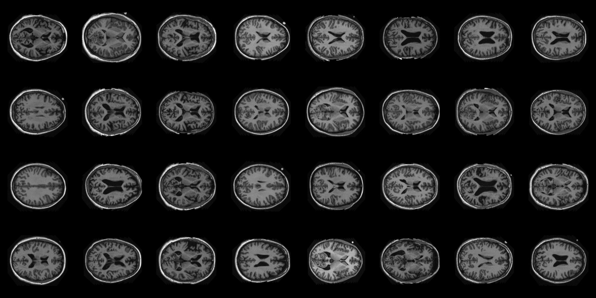

The same batch of images being passed through the VQ-VAE (after the first epoch):


After 12 epochs:

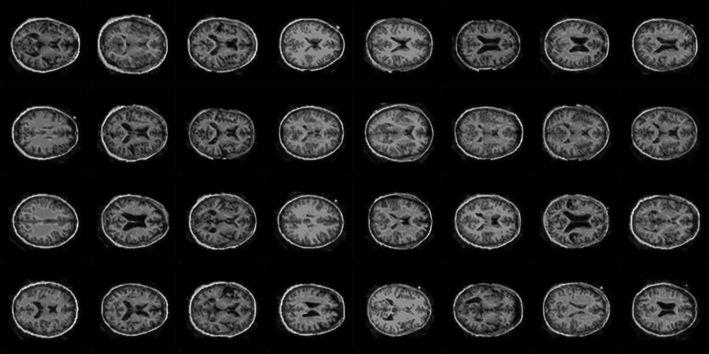

It is clear from these images that the reconstructions became clearer with training, however they did converge very quickly. A clearer comparison is shown below:

<p align="center">
  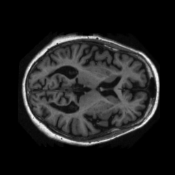
   
  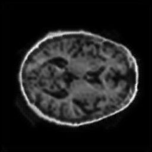
</p>

The following images show a single image comparison of the input image -> codebook embedding representation of the image -> and decoded reconstruction from the codebook:

<!-- 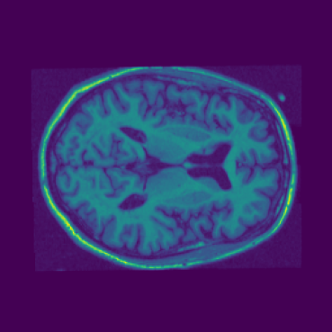 

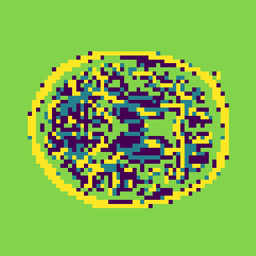 

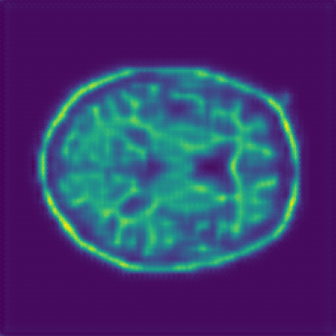 -->

<p align="center">
    
     
    
</p>

For each epoch, the training reconstruction losses were calculated and plotted. Additionally, the average Structural Similarity (SSIM) loss was calculated over the entire validation set for each iteration of the model. The epoch with the highest average SSIM was epoch 12, with the following results:

```bash
Epoch: 12
Training loss: 0.0019006850286571939
Validation avg. SSIM loss: 0.8407445546841268
Max SSIM loss: 0.8716488444340117
Min SSIM loss: 0.7713548554737547
```

The plots below show the training SSIM scores and reconstruction losses for each epoch:

<!-- TODO: plots here -->

<p align="center">
    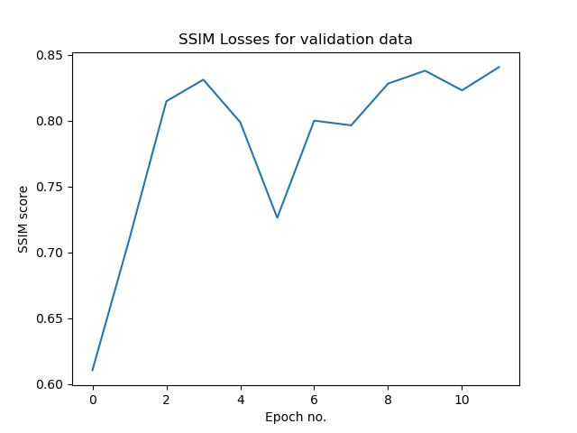
    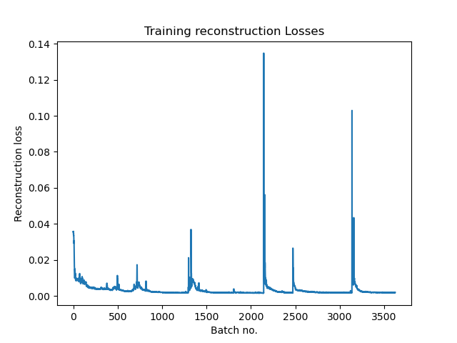 
    <!--  -->
</p>

<!-- 
 -->

### DCGAN training

The goal of this step is to train a DCGAN model that can generate the priors for the VQ-VAE. 

#### Model parameters
* LEARNING_RATE = 2e-4
* BATCH_SIZE = 256
* EPOCHS = 20

Loss function: binary cross entropy loss.

Optimizer: Adam, with betas = (0.5, 0.999)

#### Training procedure

The traing procedure for the DCGAN model was adapted from the [DCGAN tutorial](https://pytorch.org/tutorials/beginner/dcgan_faces_tutorial.html) provided by PyTorch. In general, training a DCGAN employs elements from Game Theory to simultaneously train both the discriminator and generator models. At each epoch, the following steps are performed over each batch in the training set:
1. A batch of real images are fed through the discriminator, and the loss is calculated. 
1. Using a randomly sampled latent, the generator produces a batch of fake images.
1. The generated fake images are fed through the discriminator, and the loss is calculated. 
	1. The discriminator loss for each training step is the sum of the loss for the real and fake images: `log(D(x)) + log(1 - D(G(z)))`, where `D(x)` is the discriminator output for the real image, and `D(G(z))` is the discriminator output for the fake image.
	1. The generator loss for each training step is just the loss of the fake images: `log(D(G(z)))`. 
1. The losses for each model is backpropagated through the model, and the parameters are updated.

#### Results

The following plot shows the loss results from training the DCGAN model. The loss for the discriminator and generator are shown in blue and orange respectively.

TODO: plot goes here. 


## 5. Testing procedure
The [predict.py](predict.py) module contains the script for model evaluation, which calculates the Structural Similarity (SSIM) metrics over all training data. It loads in and evaluates any VQVAE model checkpoint. 

### VQ-VAE

#### Results

The output from evaluation was as follows:

```
SSIM mean: 0.7041
Min SSIM score: 0.5730
Max SSIM score: 0.7698
Number of images with SSIM >= 0.6: 535, 98.35%.
```

The plot of the SSIM scores is shown below:

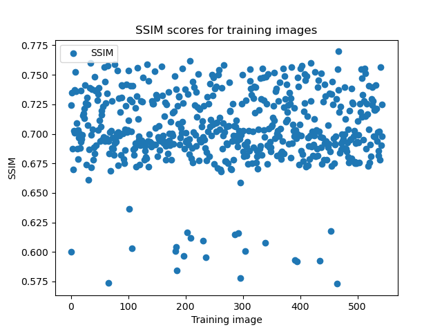

The highest SSIM score, 0.7698, was observed for the following image:

<p align="center">
  <!-- <figure> -->
    <!-- <figcaption style="max-width: 100%;">Figure 1: Before and after encoding and reconstruction.</figcaption> -->
    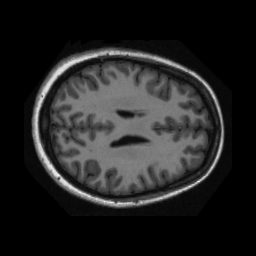
    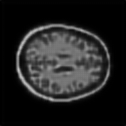 
  <!-- </figure> -->
</p>


The lowest SSIM score, 0.5730, was observed for the following image:

<p align="center">
	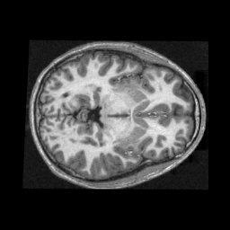
	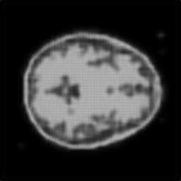 
</p>

Overall, the SSIM scores were quite high, with 535 out of the 544 images (98.35%) in the dataset being above the miniminum threshold of 0.6. This indicates that the VQ-VAE model was able to reconstruct the images with a high degree of accuracy. Also, importantly, these scores showed that the model has decent generalisability and isn't overfitting, being only <!-- TODO --> lower than the training SSIM scores. 

## 6. Analysis

Results here from evaluation

## Future work

## Applications of this work
* Discretized = smaller images, so can be used for compression. 

## References
* [1] OASIS brain MRI dataset: https://www.oasis-brains.org/
* [2] VQ-VAEs: Neural Discrete Representation Learning: https://www.youtube.com/watch?v=VZFVUrYcig0.
* [3] Paper: *Neural Discrete Representation Learning*, Aaron van den Oord, Oriol Vinyals, Koray Kavukcuoglu, 2017. https://arxiv.org/abs/1711.00937
* [4] DCGAN tutorial by Pytorch: https://pytorch.org/tutorials/beginner/dcgan_faces_tutorial.html.
* [Sonnet VQ-VAE implementation](https://github.com/google-deepmind/sonnet/blob/v1/sonnet/examples/vqvae_example.ipynb)

