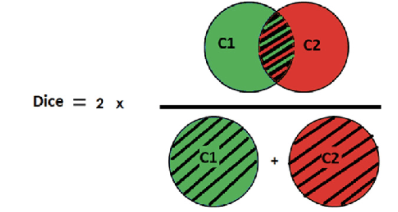
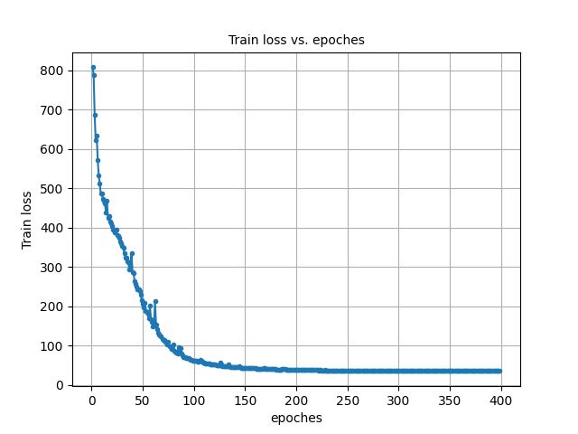
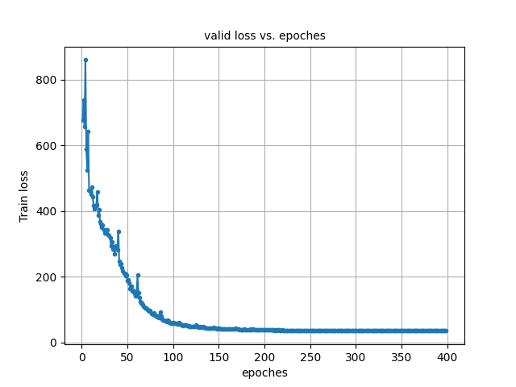
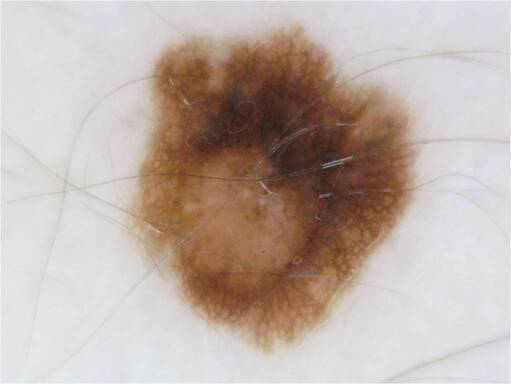
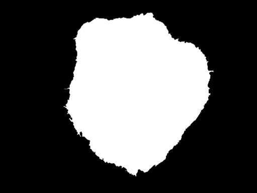

## COMP_3710_Report
( Medical condition, Extended to 27 OCT)


## This report is focused on the first task (a)
   Segment the ISIC data set with the Improved UNet
   with all labels having a minimum Dice similarity coefficient of 0.8 on the test set.

## Model
U-Net is a convolutional neural network architecture primarily used for biomedical image segmentation. 
Its U-shaped structure consists of a contracting path, which captures context, and an expansive path,
which enables precise localization. Through skip connections, features from the contracting path are concatenated
with the expansive path, enhancing localization capabilities.


The improved U-Net architecture introduces several key enhancements over the original U-Net architecture:

- **Context Module**: This module captures contextual information around each pixel, which is crucial for understanding the bigger picture in segmentation tasks. By using multiple convolutions and dropout for regularization, it aims to enhance feature extraction without overfitting.

- **Upsampling Module**: This module is responsible for increasing the spatial resolution of feature maps. In contrast to simple transposed convolutions from the original U-Net, this could provide smoother and more refined upsampling.

- **Localization Module**: This module focuses on localizing features within the upsampled feature map, helping the network to regain the spatial details lost during downsampling. 

- **Segmentation Layer**: This layer is dedicated to producing the final segmentation map from the feature maps. 

## Dataset
In this report, the ISIC 2018 dataset will be used. 
The ISIC 2018 dataset is a publicly available dataset for skin lesion image segmentation,
provided by the International Skin Imaging Collaboration (ISIC). Given that the real-world
images in the dataset come in different sizes, they are uniformly resized to a 128x128 dimension.
These images use RGB with 3 color channels for input. The label data, which indicates where the lesions are,
is treated in the same way as the real data. However, these labels are input as grayscale images with a single channel,
making them simpler and more focused on the lesion's location and shape.

### example usage:
```
Training_Data_Whole = Images_Dataset_folder(t_data, l_data)

train_size = int(0.8 * len(Training_Data_Whole))
val_size = len(Training_Data_Whole) - train_size

Training_Data, Validing_Data = random_split(Training_Data_Whole, [train_size, val_size])
```

## Losses
The loss function used is calculates a combined loss that is a weighted sum of Binary Cross-Entropy (BCE) loss and Dice loss. 
It is used to balance between pixel-wise accuracy (captured by BCE) and overlap accuracy (captured by Dice loss) is important.

### example usage:
```
lossT = calc_loss(y_pred, y)
```

## Dice_score
Dice score measures the similarity between two sets. 
Specifically, it's used to quantify the overlap between predicted and ground truth binary segmentations.
Values range between 0 (no overlap) to 1 (perfect overlap). 
It's a common metric for evaluating the accuracy of image segmentation models, 
highlighting the spatial overlap accuracy between prediction and truth.


### example usage:
```
dice_score = dice_coeff(s, s3)
```

## Training and Validation
After data pre-processing, the model is trained using Adam optimizer with 
an initial learning rate of 0.0005 and L2 weight decay of 0.000001. 
A learning rate scheduler is also used for adjusting the learning rate during training.
Besides, 400 epoches are trained with a bach size of 16.

### example usage:
```
python3 train.py
```

### Training loss vs Epoches

   


### Valid loss vs Epoches

   


## Predict

### example usage:
```
python3 predict.py
```

The input is 




The output is  




    
## Results
The final model get a Mean Dice Score : 0.9940897984524689.

## Environment
    python 3.9    
    pytorch=2.0.1
    numpy==1.23.5
    torchvision=0.15.2
    matplotlib==3.7.2
      Pillow==9.3.0
      tqdm==4.64.1
      wandb==0.13.5

## References
-  F. Isensee, P. Kickingereder, W. Wick, M. Bendszus, and K. H. Maier-Hein, 
“Brain Tumor Segmentation and Radiomics Survival Prediction: Contribution to the BRATS 2017 Challenge,” 
Feb. 2018. [Online]. Available: https://arxiv.org/abs/1802.10508v1


   


