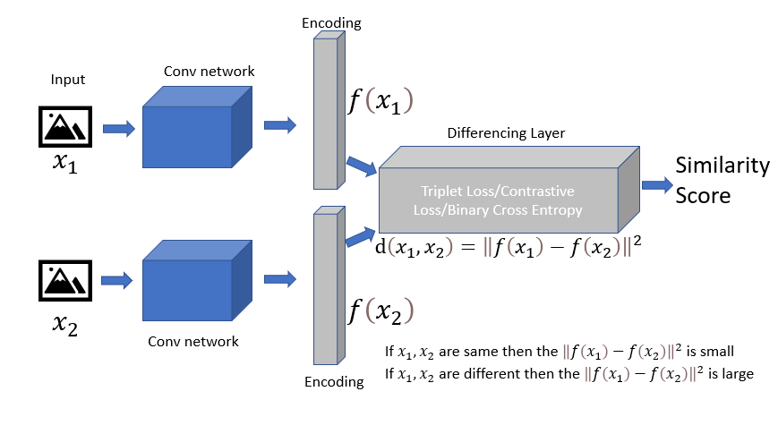
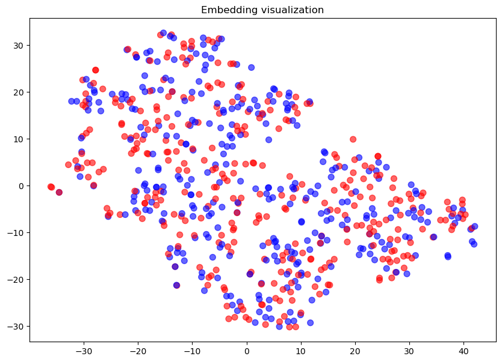
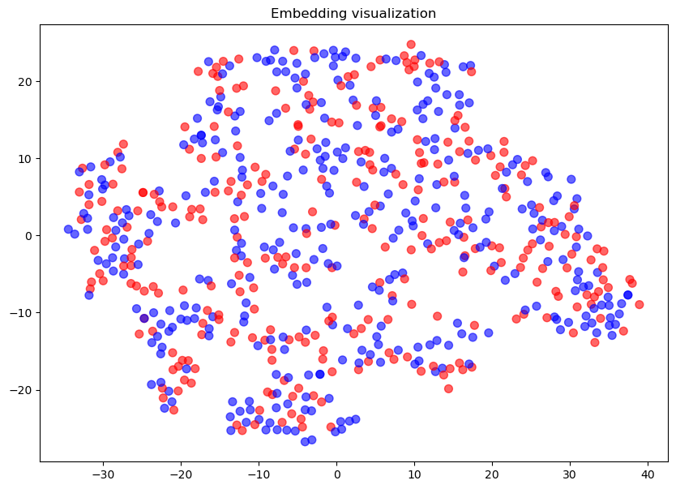
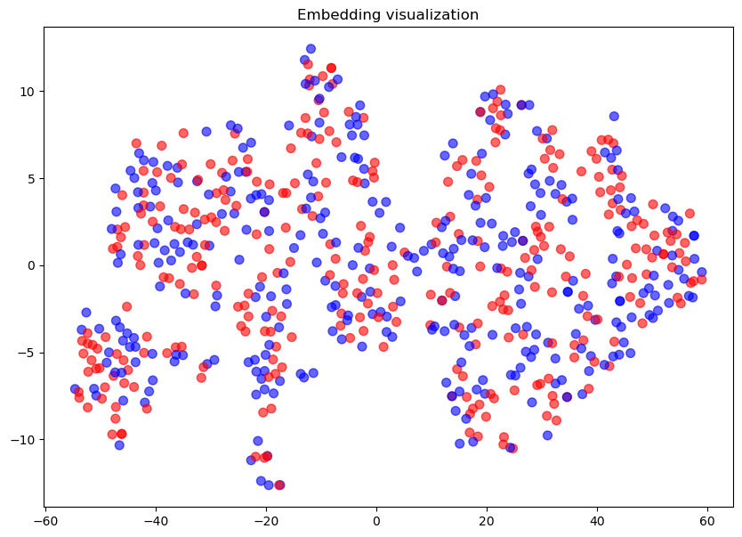
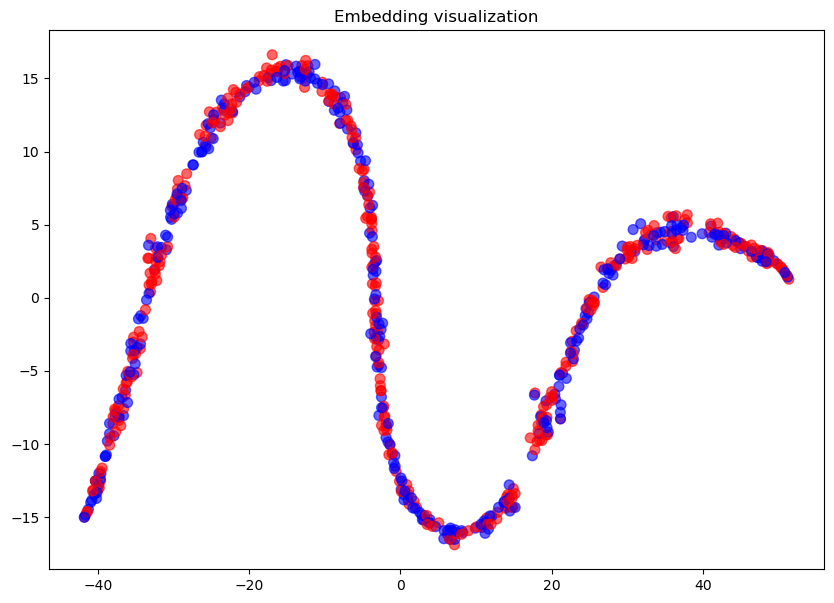
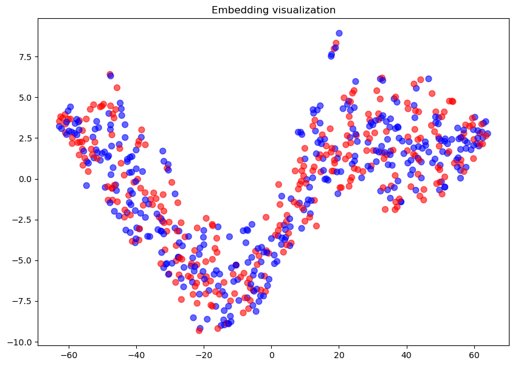
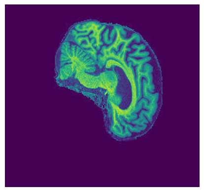

# KNN classifier based on siamese network embedding
Liang Kaige s4627382
## Introduction
The purpose of this project is to construct a [Siamese network](#siamese-network) and use its embedding to train a [knn classifier](#k-nearest-neighbour-classifier) to classify the [Alzheimer's Disease Neuroimaging Initiative (ADNI)](#adni-dataset) brain dataset.

### ADNI Dataset
The ADNI dataset that use in here comprises 30,520 MRI brain slice in total. Of these, 14,860 images are associated with Alzheimer’s disease (AD), while 15,660 images correspond to cognitively normal (NC) conditions.  
 .  
AD sample and NC sample

### Siamese Network
A Siamese network is a distance-based neural network. It consists of two weight-shared subnetworks and a designated loss function. The network takes two images as inputs, and then pass through their corresponding subnetworks for feature extraction. These subnetworks produce two flattened layers, called embeddings, which are then fed into the loss function. 
.

In this project, contrastive loss will be used. The definition of contrastive loss is $$L(x_1, x_2, y) = (1 - y) \times \frac{1} {2} D^2 + y \times \frac {1} {2} max(0, m - D)^2$$ where $y$ is label, $D$ is distance and $m$ is margin.  
When the distance between two inputs are smaller than margin, they will be considered as similar (y = 0), dissimilar otherwise (y = 1). This loss function will pull similar samples closer to each other while push dissimilar samples away.

### K Nearest Neighbour classifier
The knn classifier utilizes the embeddings from the Siamese network as its dataset. It predicts the label of new sample based on the majority vote from its k nearest neighbors. 

## Training process
### Data loading
The data images should save in a folder with following stracture:  
- AD_NC
  - Train
    - AD
      - images
    - NC
      - images
  - Test
    - AD
      - images
    - NC
      - images 

```python
def load_data(train_folder_path, train_ad_path, train_nc_path, test_ad_path, test_nc_path, batch_size=batch_size):
    # calculate mean and std for train set
    mean, std = compute_mean_std(train_folder_path)

    # define transform
    transform = transforms.Compose([
        transforms.ToTensor(),
        transforms.Normalize((mean,), (std,))
    ])

    # create dataset
    train_set = CustomDataset(ad_dir=train_ad_path, nc_dir=train_nc_path, transform=transform, validate=False, split_ratio=0.8)
    validation_set = CustomDataset(ad_dir=train_ad_path, nc_dir=train_nc_path, transform=transform, validate=True, split_ratio=0.8)
    test_set = CustomDataset(ad_dir=test_ad_path, nc_dir=test_nc_path, transform=transform, validate=False, split_ratio=1)

    # create dataloader
    train_loader = DataLoader(train_set, batch_size=batch_size, shuffle=True)
    validation_loader = DataLoader(validation_set, batch_size=batch_size, shuffle=False)
    test_loader = DataLoader(test_set, batch_size=batch_size, shuffle=False)

    return train_loader, validation_loader, test_loader
```
The function above defines how to load the data. It uses **Train** folder to get all images inside and calculate the mean and standard deviation. Then it splits the training data into two parts, one part (80%) for train, and another part (20%) for validate. This will keep test data totally unknown to prevent overfitting.  

The data will be maked into 4 pairs, with label 0 when they are considered as similar and 1 otherwise.  
(ad, ad, 0), (nc, nc, 0), (ad, nc, 1), (nc, ad, 1)  
These four group of data will be evenly selected, but the image will be randomly choose from their belonging class.  

### Model training
The embedding model is a simple convolutional neural network, which accepts images in the size 256*240 as input and return a flatten layer with size in 256.
```python
class Embedding(nn.Module):
    def __init__(self):
        super(Embedding, self).__init__()
        self.conv = nn.Sequential(

            nn.Conv2d(1, 32, kernel_size=3, padding=1),
            nn.BatchNorm2d(32),
            nn.ReLU(inplace=True),
            nn.MaxPool2d(kernel_size=3, stride=2, padding=1), # size: 256*240 -> 128*120

            nn.Conv2d(32, 64, kernel_size=3, padding=1),
            nn.BatchNorm2d(64),
            nn.ReLU(inplace=True),
            nn.MaxPool2d(kernel_size=3, stride=2, padding=1), # size: 128*120 -> 64*60

            nn.Conv2d(64, 64, kernel_size=3, padding=1),
            nn.BatchNorm2d(64),
            nn.ReLU(inplace=True),
            nn.MaxPool2d(kernel_size=3, stride=2, padding=1), # size: 64*60 -> 32*30
            )

        self.fc = nn.Sequential(
            nn.Linear(64*32*30, 512),
            nn.ReLU(inplace=True),

            nn.Linear(512, 256),
            )

    def forward(self, x):
        out = self.conv(x)
        out = out.view(out.size()[0], -1)
        out = self.fc(out)
        return out
```
After training, the siamese net and knn model will be saved to the given directory, but the trained model will not be uploaded to github.

I trained the model in 10 epochs with the margin of 1, and draw the embedding visulization in every two epochs here are the accuracies and the losses.  
Epoch [1/10], Loss: 0.8536, Accuracy: 0.5056, validate loss: 0.1353, validate accuracy: 0.5180  
.  
Epoch [2/10], Loss: 0.2237, Accuracy: 0.5203, validate loss: 0.1375, validate accuracy: 0.4966  
Epoch [3/10], Loss: 0.1366, Accuracy: 0.5546, validate loss: 0.1245, validate accuracy: 0.5851  
.  
Epoch [4/10], Loss: 0.1373, Accuracy: 0.6181, validate loss: 0.1189, validate accuracy: 0.6135  
Epoch [5/10], Loss: 0.1001, Accuracy: 0.7056, validate loss: 0.1202, validate accuracy: 0.6541  
.  
Epoch [6/10], Loss: 0.1335, Accuracy: 0.6911, validate loss: 0.1147, validate accuracy: 0.6692  
Epoch [7/10], Loss: 0.0730, Accuracy: 0.7964, validate loss: 0.1131, validate accuracy: 0.6788  
.  
Epoch [8/10], Loss: 0.0565, Accuracy: 0.8521, validate loss: 0.1001, validate accuracy: 0.7147  
Epoch [9/10], Loss: 0.0654, Accuracy: 0.8594, validate loss: 0.1076, validate accuracy: 0.6868  
.  
Epoch [10/10], Loss: 0.0594, Accuracy: 0.8644, validate loss: 0.1047, validate accuracy: 0.7055  
KNN Accuracy: 0.4992

As can see, the model start overfitting in about epoch 7. The data tend to separate to two parts but finally become a squiggle. However, the two classes are still evenly mixed together and has no sign to seperate apart. I tried tons of different hyperparameters (different combinations of learing rate, margin and epochs), different model (tried many different way to construct embedding network), and different loss function (triplet loss, contrastive loss), but they all perform similarly. I also did normalize the data, and use hard sample mining, semi-hard sample mining, but they are all not work well. However, I have done everything I could to improve the model, but with little success, so this is my final version.

### Prediction
```python
predict_image(image_path)
```
This function takes a path of image as the input and it will return a predict value.  
Here is the example usage:  
```python
image_path = "D:/Study/MLDataSet/AD_NC/test/AD/388206_78.jpeg"
predicted_label = predict_image(image_path)
display_image(image_path)
print(f"Predicted label: {predicted_label}, Ture label: AD")
```

The return is:  

Predicted label: ad, Ture label: ad

.  

## Dependencies
- python 3.11.5
- pytorch 2.1.0 py3.11_cuda11.8_cudnn8_0 pytorch
- torchvision 0.16.0
- matplotlib 3.7.2
- PIL  10.0.1
- sklearn  1.2.2


## Reference
Khandelwal, R. (2021, January 28). One Shot Learning with Siamese Network. The Startup. Medium. Retrieved from https://medium.com/swlh/one-shot-learning-with-siamese-network-1c7404c35fda
