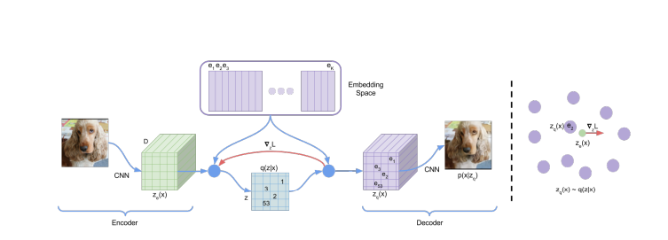
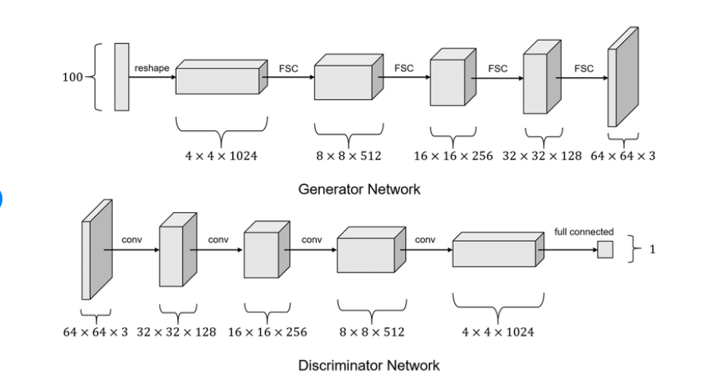
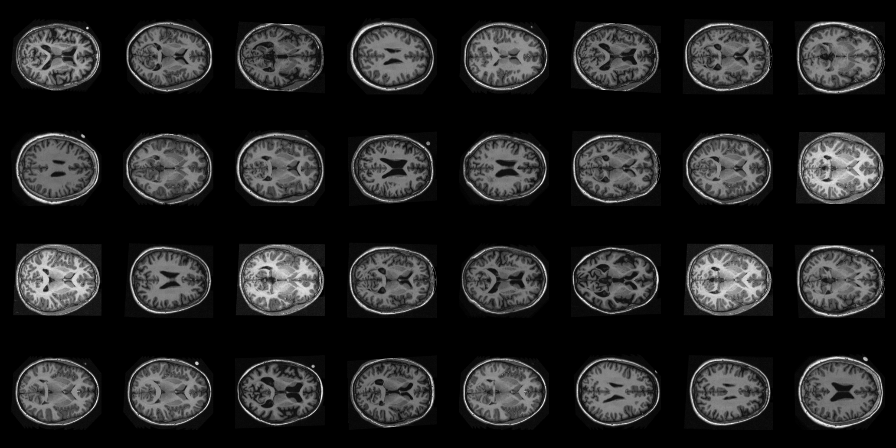
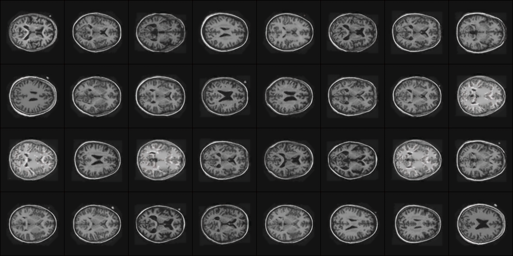
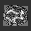
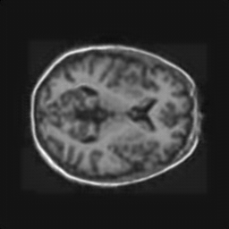
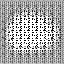
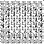
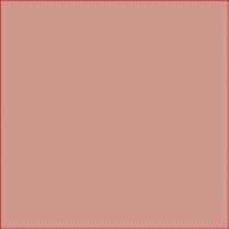

# Generative Model for OASIS Brain Dataset - VQVAE and GAN

## Description
The algorithm presented in this project attempts to utilise multiple models to generate new MRI brain scans. A generative model fabricates codebook indices that are then fed into the decoder of a VQVAE model that has been trained on the OASIS Brain dataset.

### VQVAE
The VQVAE paper, published in 2017, presented an improvement to the Variational Auto-Encoder (VAE) model. VAEs encode and decode data by training two networks, an encoder and a decoder, to compress and decompress data in and out of a continuous latent vector space that is much smaller than the original images. The continuous nature of the vector space presents numerous problems that VQVAE addresses by discretising the vector space into individual quanta called embeddings. Encodings are mapped to their closest embedding, and the embeddings are fed into the decoder to reconstruct the original image.



### DCGAN
After the embeddings are learnt for the given dataset, a way to create new data is needed. A Generative Adversarial Network (GAN) exploits a min-max, zero-sum game between two agents, a discriminator and a generator. It is the job of the discriminator to detect real from fake data, while the generator tries to create convincing fake data to trick the discriminator into thinking it is real. 



## Training/Results
### VQVAE
Real samples:



Reconstructed samples:



Codebook sample:



Reconstructed Codebook sample:



### DCGAN

Generated Codebook Sample:



Generated Embedding Sample:



Generated Reconstruction Sample:



There is some brain structure present but something went wrong in the decoding process and I was unable to get it to correctly decode the generated images

## Replication
Change the paths for the OASIS brain data and network models to your desired locations, found in `dataset.py`. 

Results were obtained with exact hyper parameters present in `train.py`.

## Depedencies
```
pytorch: 2.1.0+cu118
torchvision: 0.16.0+cu118
matplotlib: 3.4.3
Pillow: 8.2.0
```

## References

https://arxiv.org/abs/1511.06434 (DCGAN paper)

https://arxiv.org/abs/1711.00937 (VQVAE paper)
