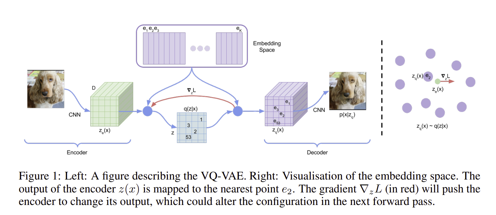
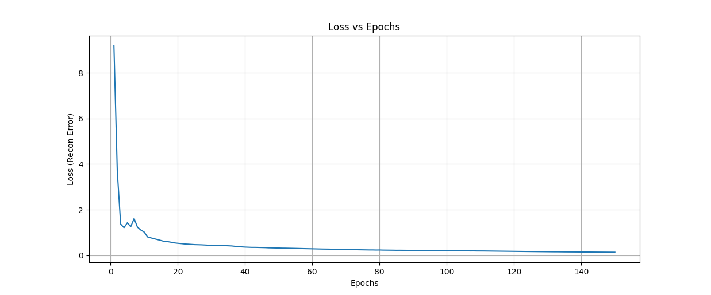

# Generative VQ-VAE model on the OASIS brain dataset

## Overview
The project aims to implement a generative model using VQVAE on the OASIS brain dataset to achieve a result of a 
"reasonably clear image" of the decoded output and a Structured Similarity (SSIM) of over 0.6.

## Model
### VQ-VAE Overview

A variational autoencoder is an unsupervised model that takes input images, encodes them into representations within a 
latent space, and then decodes these representations to generate reconstructed images.
The key difference is that a Vector Quantized Variational AutoEncoder (VQ-VAE) introduces a discrete codebook structure into the latent space. 
This is achieved through the inclusion of a vector-quantization layer. The discrete codebook comprises a set of vectors, 
or embeddings, each identified by an index and having a specific dimension size. The model operates as follows:

1) Encoding: It compresses input data into a set of discrete codes.
2) Vector Quantization: These codes are mapped to predefined codebook vectors.
3) Decoding: The codebook vectors are used to reconstruct the input data.

### Loss function
There overall loss function consists of 3 components to train different parts of VQ-VAE. 
1) **Reconstruction loss**: optimizes the decoder and the encoder through estimator
2) **Codebook alignment loss**: update dictionary of codebook by finding the error to move the embedding vectors
3) **Commitment loss**: ensure that the encoder commits to an embedding and its output does not grow.

The loss function is defined as:

Where:
loss = q_latent_loss + commitment loss * e_latent_loss

### VQ-VAE Architecture
The architecture the VQ-VAE follows the one specified in [1], it can be summarised as follows: 
1) **Encoder**: 2 strided convolutional layers with stride 2 and window size 4 × 4, followed by two residual
3 × 3 blocks (implemented as ReLU, 3x3 conv, ReLU, 1x1 conv), all having 256 hidden units
2) **Decoder**: two residual 3 × 3 blocks, followed by two transposed convolutions with stride
2 and window size 4 × 4

The pytorchinfo summary (with batch 32, channel=1, dimension=128x128 is given as:

## Hyperparameters
### Preprocessed Dataset
- The model is trained on a given preprocessed OASIS brain dataset with a training size of 9,664 images, test size of 
544 images, and a validation set of 1,120 images. The entire partition provided is used in training, validating, and 
testing as using more data best ensures better results.
- A batch size of 32 was used throughout all sets. 
- The data was resized to 128x128 from 256x256 as this improved memory consumption and decrease training time over large 
epochs however it should be acknowledged that this would take a toll on the accuracy/performance of the model.

### Model parameters
- Learning rate = 0.002 using the Adam optimiser
- Commitment cost = 0.25
- Num of hidden units = 128
- Latent space = 64
- Discrete latents = 32
- Discrete space dimension = 512

The model hyperparameters were chosen based on the VQ-VAE paper.
Note: The hyperparameters can be tuned to achieve a faster result as currently it takes around 100 epochs for
a satisfiable result. **To reproduce the same results, use 150 epochs**

## VQ-VAE Results
### Training
The VQ-VAE model was trained for 150 epochs, and a steady decrease in training and validation loss was observed.
Convergence of the losses can also be inferred meaning that the model can converge. The final reconstruction loss after
150 epochs are obtained for **training and validation as 0.003 and 0.011 respectively**.

To confirm convergence, my model was ran over 1000 epochs and this was the training reconstruction loss observed:

In each epoch, the mean SSIM between the validation input and decoded output image was calculated. The mean SSIM can be
observed to overall increase as the epoch also increases. **The final mean SSIM obtained was 0.944.**

### Reconstructions

The model is evaluated after training by inputting it test images and calculating the average SSIM and max SSIM
observed over the entire testing dataset. The input images, codebook representation, and decoded images used for 
testing is shown:

The average SSIM obtained over the test dataset is **approximately 0.946 as well as a maximum SSIM obtained as 0.950.**

## Usage
### Dataset configuration
Ensure the OASIS dataset folder is defined appropriately in dataset.py. Change the path to your desired path while
following this structure

- ./keras_png_slices_data
- - /keras_png_slices_train
- - /keras_png_slices_test
- - /keras_png_slices_validate

### Running the model
1) Ensure the appropriate variables and file paths are set in parameters.py
2) Run train.py to begin training
3) Run predict.py to evaluate the trained model or another instance saved specified at the file path set 
in parameters.py

Note: To reproduce the results using the OASIS data set ensure that the files are set up properly and the 
hyperparameters are also set accordingly.

## Dependencies
- torch >=1.8.1
- torchaudio==2.1.0
- torchmetrics==1.2.0
- torchvision==0.16.0
- Pillow >=5.3.0,!=8.3.*
- numpy > 1.20.0
- matplotlib any

The use of cuda and GPU is highly recommended.

## References
- [1] https://arxiv.org/pdf/1711.00937.pdf
- [2] https://keras.io/examples/generative/vq_vae/
- [3] https://github.com/MishaLaskin/vqvae