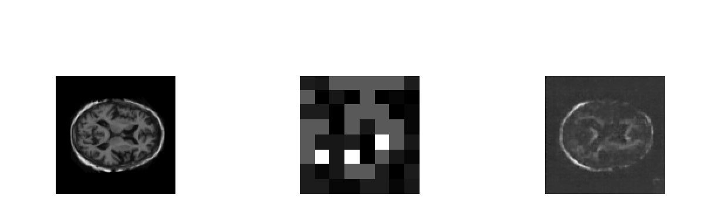
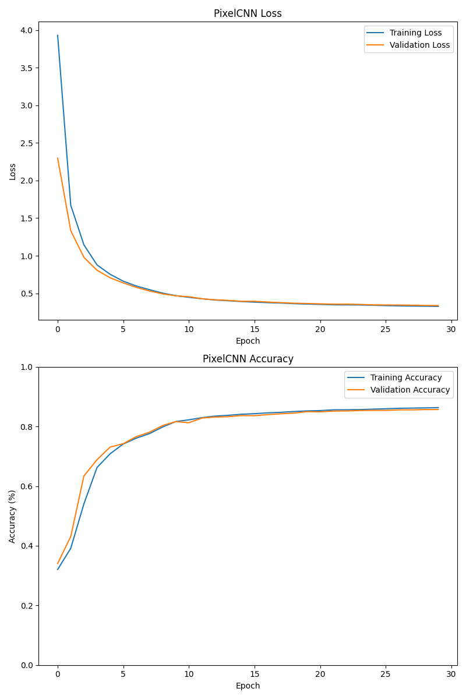
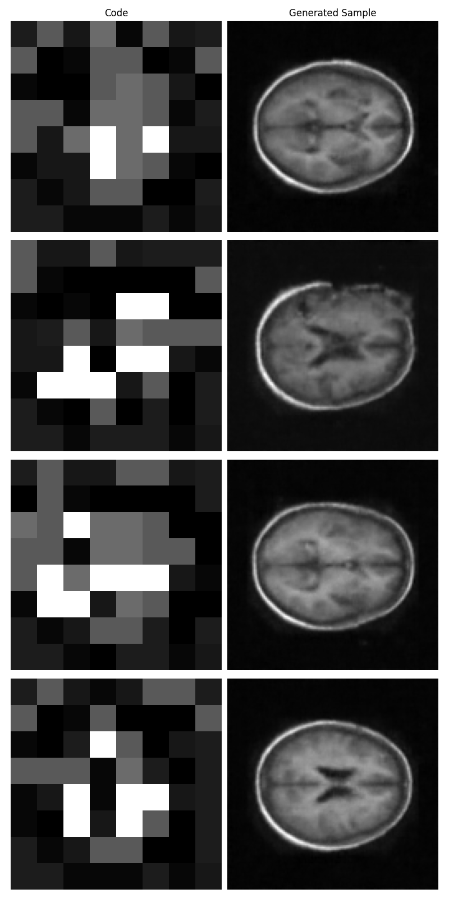
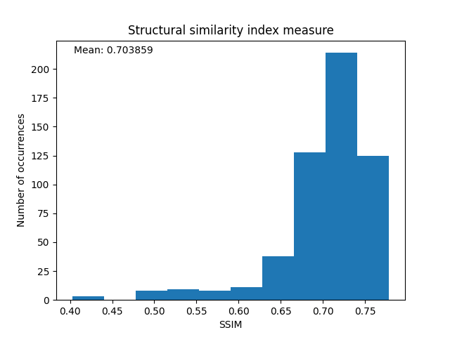

# OASISVQ: Enhancing Brain Image Generation with VQVAE

OASISVQ is a project dedicated to advancing brain image generation using the Vector Quantized Variational Autoencoder (VQVAE) deep learning model. This README provides an overview of the project and its goals.

# Ploblem Overview
Brain image generation is a crucial task in neuroimaging research, aiding in the study of brain structure, function, and various neurological conditions. OASISVQ aims to utilize the capabilities of VQVAE, a powerful variant of Variational Autoencoders, to enhance the generation of brain images from the OASIS Brain dataset.

# Objectives
- Implement a VQVAE model for brain image generation.
- Achieve a "reasonably clear image" with a Structured
- Similarity (SSIM) score exceeding 0.6.


# Dataset
Data were provided by OASIS in [this resouce](https://www.oasis-brains.org/#data)
The OASIS Brain dataset is used as the foundation for training and evaluating the VQVAE model. This dataset encompasses structural and functional MRI scans, covering a wide range of subjects, including healthy individuals and those with neurological conditions.

# Model Architecture

##### VQ-VAE Definition
A VAE is a type of generative model that falls under the umbrella of autoencoders. It consists of an encoder, a decoder, and a latent space where the data is represented in a compressed form. VQ-VAE is an extension of the basic VAE architecture, and it incorporates vector quantization to improve the quality of generated samples. In a VQ-VAE, the encoder produces discrete latent variables, and a separate codebook (dictionary) is used to quantize these variables

##### Overview
 The VQ-VAE model archictecture consists of three parts, the encoder, the Vector Quantization layer, and the decoder. 
 
<p align="center">
	
	<p>
    <em>Left: The Encoder, Middle: the Vector Quantization layer, Right: the Decoder</em>
		


</p>

######Encoding layer

Summarised from [this paper](https://shashank7-iitd.medium.com/understanding-vector-quantized-variational-autoencoders-vq-vae-323d710a888a), the encoder layer takes in an image noted as x with the following parameters: 
- n: batch size
- h: image height
- w: image width
- c: number of channels in the input image

######Vector Quantization layer

The VQ layer operates in six key steps, illustrated in Figure 2. Initially, a Reshape combines dimensions into vectors. Distances are then calculated between these vectors and those in the embedding dictionary, yielding a matrix. The Argmin step finds the index of the closest dictionary vector for each input vector. Subsequently, the closest dictionary vectors replace the original vectors. Reversing the Reshape operation, vectors are restored to the shape (n, h, w, d). Since backpropagation can't flow through Argmin, gradients are approximated by copying them from the quantized vector (z_q) back to the original vector (z_e). Despite not directly minimizing the loss function, this process transmits information for training.

######Decoding layer
 The decoder in a VQ-VAE is typically a neural network responsible for generating data samples from the latent representations produced by the encoder. In the context of a VQ-VAE, the decoder is responsible for reconstructing the data, such as images or audio, from the discrete latent variables learned during the encoding process.


# Models and HyperParameters 
#### VQ-VAE

#### Pixel-Cnn


# Set Up and Example Usage 
## Requirements and Dependency
matplotlib >= 3.5.2
numpy >= 1.21.5
requests >= 2.28.1
tensorflow >= 2.10.1
tensorflow-probability >= 0.14.0
python >= 3.7.13

### Installments
Installing conda is reccomended for the depedencies, especially PyTorch. Please follow the custom environment set up for project requirements.


If you prefer do it manually, use this example:
1. Create a conda environment and name it eg. my-torch 


```
conda create -n my-torch python=3.7 -y
```
2. Activate the new environment
``` 
conda activate my-torch
```
3. Inside environemnt my-torch, install PyTorch:

```
conda install python=3.6 pytorch torchvision matplotlib pandas -c pytorch
```
### Package Overview
__predict.py__
Predict shows example ussage of the trained model. 
Requires a trained model saved to files from running train.py
```
python predict.py

```
__dataset.py__
Dataset holds the class for the OASIS dataset attributes, downloads the data to your device and preprocesses the data. Dataset is called from train.py and does not need to run on its own.

__models.py__
Models.py contains the VQ-VAE encoder and the 


__train.py__


## References
[1] https://shashank7-iitd.medium.com/understanding-vector-quantized-variational-autoencoders-vq-vae-323d710a888a
- https://en.wikipedia.org/wiki/Structural_similarity
- https://keras.io/examples/generative/vq_vae/
- https://keras.io/examples/generative/pixelcnn/
- https://arxiv.org/abs/2101.08052

- OASIS-1: Cross-Sectional: Principal Investigators: D. Marcus, R, Buckner, J, Csernansky J. Morris; P50 AG05681, P01 AG03991, P01 AG026276, R01 AG021910, P20 MH071616, U24 RR021382
- OASIS-2: Longitudinal: Principal Investigators: D. Marcus, R, Buckner, J. Csernansky, J. Morris; P50 AG05681, P01 AG03991, P01 AG026276, R01 AG021910, P20 MH071616, U24 RR021382

# Results

SSIM index: 0.70385885


<p align="center">
	
</p>

<p align="center">
	
</p>
<p align="center">
	
</p>
<p align="center">
	
</p>


# Validation
## SSIMS
The Structural Similarity Index (SSIM) is a metric used to measure the similarity between two images. It was designed to assess the perceived quality of images by considering both structural information and luminance. SSIM is widely used in image processing and computer vision tasks, including image compression, denoising, and quality assessment. 

<p align="center">
	
</p>


