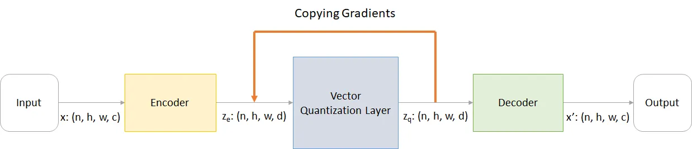
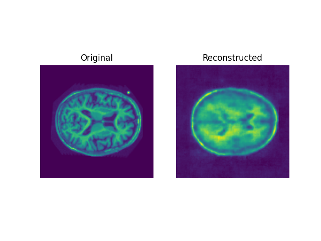
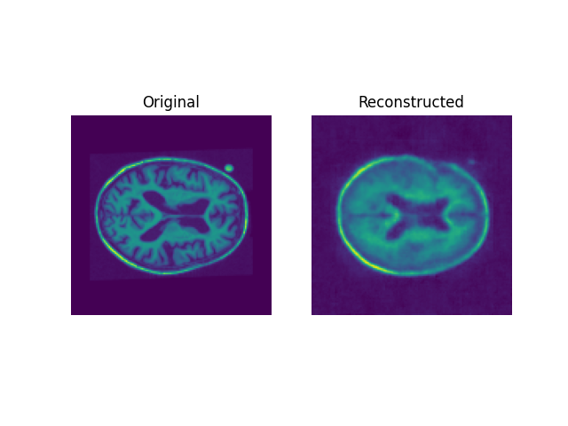
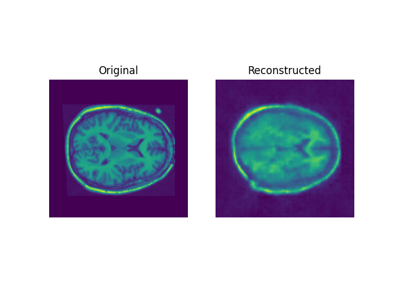
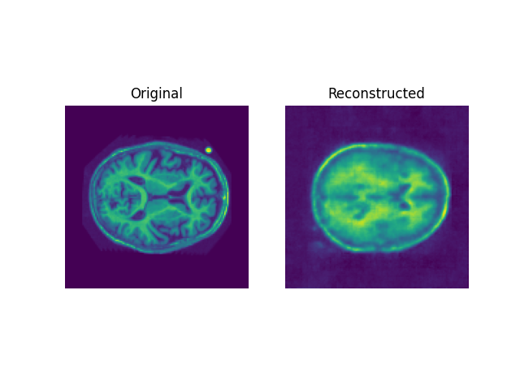
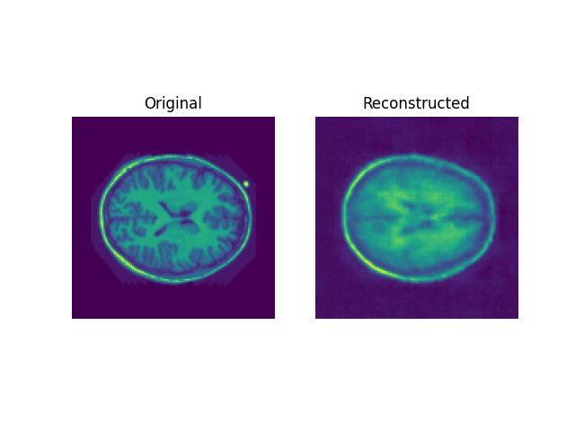
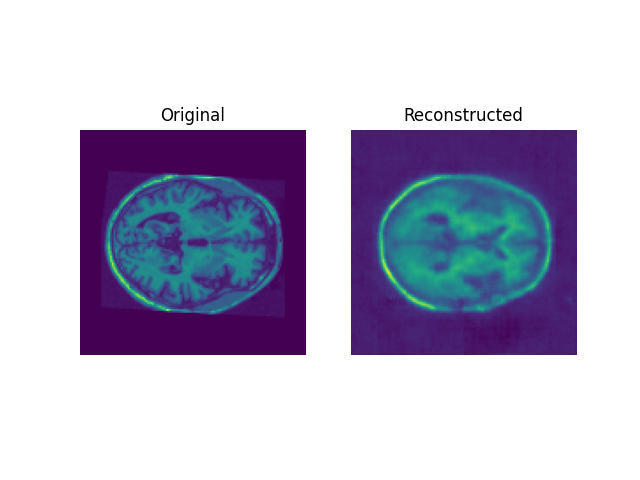
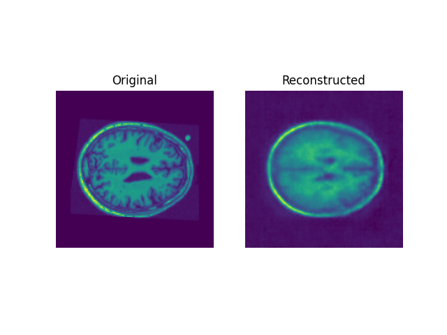
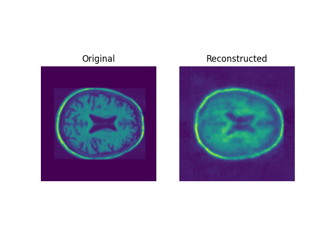

# OASISVQ: Enhancing Brain Image Generation with VQVAE

OASISVQ is a project dedicated to advancing brain image generation using the Vector Quantized Variational Autoencoder (VQVAE) deep learning model. This README provides an overview of the project and its goals.

# Problem Overview
Brain image generation is a crucial task in neuroimaging research, aiding in the study of brain structure, function, and various neurological conditions. OASISVQ aims to utilize the capabilities of VQVAE, a powerful variant of Variational Autoencoders, to enhance the generation of brain images from the OASIS Brain dataset.

# Objectives
- Implement a VQVAE model for brain image generation.
- Achieve a "reasonably clear image" with a Structured
- Similarity (SSIM) score exceeding 0.6.


# Dataset
Data were provided by OASIS in [this resouce](https://www.oasis-brains.org/#data) [6] [7].  The OASIS Brain dataset is used as the foundation for training and evaluating the VQVAE model. This dataset encompasses structural and functional MRI scans, covering a wide range of subjects, including healthy individuals and those with neurological conditions. OASIS 1 and 2 were both used in this problem [6] [7].

---

# Model Architecture

##### VQ-VAE Definition
A VAE is a type of generative model that falls under the umbrella of autoencoders. It consists of an encoder, a decoder, and a latent space where the data is represented in a compressed form.[5]  VQ-VAE is an extension of the basic VAE architecture, and it incorporates vector quantization to improve the quality of generated samples. In a VQ-VAE, the encoder produces discrete latent variables, and a separate codebook (dictionary) is used to quantize these variables

##### Overview
 The VQ-VAE model archictecture consists of three parts, the encoder, the Vector Quantization layer, and the decoder. 
 
<p align="center">
	
	<p>
    <em>Figure 1: Left: The Encoder, Middle: the Vector Quantization layer, Right: the Decoder</em>
		


</p>

#####Encoding layer

Summarised from [this paper](https://shashank7-iitd.medium.com/understanding-vector-quantized-variational-autoencoders-vq-vae-323d710a888a), the encoder layer takes in an image noted as x with the following parameters: 
- n: batch size
- h: image height
- w: image width
- c: number of channels in the input image

##### Vector Quantization layer

The VQ layer operates in six key steps, illustrated in Figure 2. Initially, a Reshape combines dimensions into vectors. Distances are then calculated between these vectors and those in the embedding dictionary, yielding a matrix. The Argmin step finds the index of the closest dictionary vector for each input vector. Subsequently, the closest dictionary vectors replace the original vectors. Reversing the Reshape operation, vectors are restored to the shape (n, h, w, d). Since backpropagation can't flow through Argmin, gradients are approximated by copying them from the quantized vector (z_q) back to the original vector (z_e). Despite not directly minimizing the loss function, this process transmits information for training.

#####Decoding layer
 The decoder in a VQ-VAE is typically a neural network responsible for generating data samples from the latent representations produced by the encoder. In the context of a VQ-VAE, the decoder is responsible for reconstructing the data, such as images or audio, from the discrete latent variables learned during the encoding process.

<p align="center">
	
	<em>Figure 2: Encoded, Quantisation and Decoded Scans</em>
</p>

---

# Models and HyperParameters 

#### VQ-VAE
| Layer Name         | Layer Type        | Output Shape       | Hyperparameters/Info |
|--------------------|-------------------|--------------------|-----------------------|
| Input              | Input             | (128, 128, 1)      | Input image shape    |
| Encoder            | Conv2D            | (64, 64, 32)       | Filters: 32, Kernel: 3x3, Strides: 2, Activation: ReLU, Padding: Same |
| Encoder            | Conv2D            | (32, 32, 32)       | Filters: 32, Kernel: 3x3, Strides: 2, Activation: ReLU, Padding: Same |
| Encoder            | Conv2D            | (16, 16, 64)       | Filters: 64, Kernel: 3x3, Strides: 2, Activation: ReLU, Padding: Same |
| Encoder            | Conv2D            | (8, 8, 64)         | Filters: 64, Kernel: 3x3, Strides: 2, Activation: ReLU, Padding: Same |
| Encoder            | Conv2D            | (8, 8, 128)        | Filters: 128, Kernel: 3x3, Activation: ReLU, Padding: Same |
| Vector Quantizer   | Custom Layer      | (8, 8, 16)         | Number of Embeddings: 16, Beta: 0.25 |
| Decoder            | Conv2DTranspose    | (8, 8, 128)        | Filters: 128, Kernel: 3x3, Activation: ReLU, Padding: Same |
| Decoder            | Conv2DTranspose    | (16, 16, 64)       | Filters: 64, Kernel: 3x3, Strides: 2, Activation: ReLU, Padding: Same |
| Decoder            | Conv2DTranspose    | (32, 32, 64)       | Filters: 64, Kernel: 3x3, Strides: 2, Activation: ReLU, Padding: Same |
| Decoder            | Conv2DTranspose    | (64, 64, 32)       | Filters: 32, Kernel: 3x3, Strides: 2, Activation: ReLU, Padding: Same |
| Decoder            | Conv2DTranspose    | (128, 128, 32)     | Filters: 32, Kernel: 3x3, Strides: 2, Activation: ReLU, Padding: Same |
| Output             | Conv2DTranspose    | (128, 128, 1)      | Filters: 1, Kernel: 3x3, Padding: Same |


#### Pixel-Cnn
The PixelConvLayer is a custom layer used in your PixelCNN model. It is designed to implement pixel-wise convolutions with specific mask types, which are commonly used in autoregressive models like PixelCNN for image generation.

| Layer Name           | Layer Type           | Output Shape       | Hyperparameters/Info                                 |
|----------------------|----------------------|--------------------|-------------------------------------------------------|
| Input                | Input                | (8, 8)             | Input shape: (8, 8)                                  |
| PixelConv Layer 1   | PixelConvLayer       | (8, 8, 128)        | Mask Type: "A", Filters: 128, Kernel: 7x7, Activation: ReLU, Padding: Same |
| Residual Block 1     | ResidualBlock        | (8, 8, 128)        | Filters: 128, Kernel 1: 1x1, Kernel 2: 3x3, Activation: ReLU |
| PixelConv Layer 2   | PixelConvLayer       | (8, 8, 128)        | Mask Type: "B", Filters: 128, Kernel: 1x1, Activation: ReLU, Padding: Valid |
| Residual Block 2     | ResidualBlock        | (8, 8, 128)        | Filters: 128, Kernel 1: 1x1, Kernel 2: 3x3, Activation: ReLU |
| PixelConv Layer 3   | PixelConvLayer       | (8, 8, 128)        | Mask Type: "B", Filters: 128, Kernel: 1x1, Activation: ReLU, Padding: Valid |
| Residual Block 3     | ResidualBlock        | (8, 8, 128)        | Filters: 128, Kernel 1: 1x1, Kernel 2: 3x3, Activation: ReLU |
| PixelConv Layer 4   | PixelConvLayer       | (8, 8, 128)        | Mask Type: "B", Filters: 128, Kernel: 1x1, Activation: ReLU, Padding: Valid |
| Residual Block 4     | ResidualBlock        | (8, 8, 128)        | Filters: 128, Kernel 1: 1x1, Kernel 2: 3x3, Activation: ReLU |
| Output               | Conv2D                | (8, 8, 128)        | Filters: 128, Kernel: 1x1, Activation: None, Padding: Valid |


---
# Training Images and Reconstructed Brains
In the context of medical image analysis, the OASIS dataset has been instrumental in advancing our comprehension of brain structure and functionality. This section presents a series of ten training images extracted from the OASIS dataset, with each image representing a distinct cross-section of the human brain.
These images serve as the foundational dataset for the training of a state-of-the-art VQ-VAE (Vector Quantized Variational Autoencoder) model. The VQ-VAE architecture is purposefully designed for capturing intricate patterns and structures within medical imaging data.
Let us take a glimpse into this dataset, revealing the original brain images and their respective reconstructions generated by the trained VQ-VAE model. The VQ-VAE excels in compressing high-dimensional brain data into a concise latent space, subsequently reconstructing it while preserving critical anatomical details essential for in-depth medical analysis.

The following showcases a subset of this process, presenting the original brain images and their corresponding reconstructions:

<p float="left">
  
  
  
</p>

<p float="left">
  
  
  
</p>

<p float="left">
  
  
  

  <em>Figure 3: Figures of Training Images and Reconstructed Brain</em>
</p>

# Generated Images 
One of the remarkable capabilities of the VQ-VAE model is its capacity to generate novel sample images, offering a glimpse into the realm of possibilities within the medical imaging domain. These generated images can be invaluable for various applications, including research, diagnosis, and training.

To obtain generated sample images from the VQ-VAE model, follow these steps:

1. Load the Trained VQ-VAE Model: Ensure that the VQ-VAE model has been trained on your dataset and is loaded into your Python environment.
2. Generate Sample Latent Codes: To create new brain images, you'll need to sample latent codes from the VQ-VAE's latent space. This process involves random sampling or choosing specific codes of interest.
3. Decode Latent Codes: Using the trained VQ-VAE model, decode the sampled latent codes to produce reconstructed brain images. 
4. Visualize the Generated Images: 


<p align="center">
	
	<em>Figure 4: Generated Samples from Prediction</em>
</p>


# Loss Functions and Structual Similarity 
Reconstruction Loss (reconstruction_loss): This loss measures the dissimilarity between the original input data and the data reconstructed by the VQ-VAE model. It is computed as the mean squared difference between the input and the reconstructed output. The goal is to minimize this loss, ensuring that the VQ-VAE can accurately reconstruct the input data.

<p align="center">
	
	<em>Figure 6: Loss Functions of Reconstruction, VQ-VAE and Epoch</em>
</p>

Sparse Categorical Crossentropy Loss (keras.losses.SparseCategoricalCrossentropy): This loss function is commonly used for models that generate discrete outputs, such as image generation with PixelCNN. It measures the dissimilarity between the predicted probability distribution (logits) and the ground truth discrete values (in this case, the codebook indices). The goal is to minimize this loss, encouraging the model to generate pixel values that match the target distribution.

<p align="center">
	
	<em>Figure 7: Pixel CNN loss over Epoch</em>
	
</p>

The Structural Similarity Index (SSIM) is a metric used to measure the similarity between two images. It was designed to assess the perceived quality of images by considering both structural information and luminance. SSIM is widely used in image processing and computer vision tasks, including image compression, denoising, and quality assessment. 

<p align="center">
	
	<em>Figure 8: Structual Similarity Measureshowing convergence towards 0.7</em>
</p>

| SSIM Range | Interpretation |
|------------|----------------|
| 1.0        | Perfect Match   |
| 0.7 - 0.99 | Good            |
| 0.5 - 0.69 | Fair            |
| < 0.5      | Poor            |

An SSIM index of 0.70385885 is considered good. It suggests that the two images being compared have a strong structural similarity, and the differences between them are relatively small and likely not easily discernible to the human eye. This level of similarity is generally desirable in various image processing applications, such as image compression, denoising, or image quality assessment.

---

# Set Up and Example Usage 
## Requirements and Dependency
matplotlib >= 3.5.2
numpy >= 1.21.5
requests >= 2.28.1
tensorflow >= 2.10.1
tensorflow-probability >= 0.14.0
python >= 3.7.13

### Installments
Installing conda is reccomended for the depedencies, especially PyTorch. Please follow the custom environment set up for project requirements.


If you prefer do it manually, use this example:
1. Create a conda environment and name it eg. my-torch 


```
conda create -n my-torch python=3.7 -y
```
2. Activate the new environment
``` 
conda activate my-torch
```
3. Inside environemnt my-torch, install PyTorch:

```
conda install python=3.6 pytorch torchvision matplotlib pandas -c pytorch
```
### Package Overview
__predict.py__
Predict shows example ussage of the trained model. 
Requires a trained model saved to files from running train.py
```
python predict.py

```
__dataset.py__
Dataset holds the class for the OASIS dataset attributes, downloads the data to your device and preprocesses the data. Dataset is called from train.py and does not need to run on its own.

__modules.py__
Models.py contains the VQ-VAE model [3] and the Pixel CNN [4]. Modules.py should be called from predict.py or train.py. 

__train.py__
Train.py loads the dataset onto the compuer, and trains the VQ-VAE in 30 epochs and saves the history of the model for loss graphing. Next, the weights of the VQ-VAE are saved. These weights are implemented into a temporary VQ-VAE model to train the PixelCNN. The PixelCNN's weights are saved into the package folder. Training loss and plots are graphed and saved. 

To load the weights of the VQ-VAE into another program or software, simply follow these steps. 
1. Run the train.py module
```
python train.py

```
2. In your python file, run the following commands
```
from dataset import *
from modules import *

models_directory = <directory_of_saved_model>
vqvae_weights_filename = <filename_of_vqvae_weights>

vqvae_trainer.load_weights(models_directory + vqvae_weights_filename)

```
[2]
__similarity.py__
Similarity.py runs the structural similairty score. This file can be run on its self and plots the structural similarity. [3]
```
python similarity.py
```


### gitignore 
__hyperparemeters.py__
The hyper-parameters for this model are specified below and incorporated throughout the problem. For improvement it may be better to save the hyperparameters as a seperate python file 

---
## References
[1] https://shashank7-iitd.medium.com/understanding-vector-quantized-variational-autoencoders-vq-vae-323d710a888a
[2] https://keras.io/examples/generative/vq_vae/
[3] https://en.wikipedia.org/wiki/Structural_similarity
[4] https://keras.io/examples/generative/pixelcnn/
[5] https://arxiv.org/abs/2101.08052
[6] OASIS-1: Cross-Sectional: Principal Investigators: D. Marcus, R, Buckner, J, Csernansky J. Morris; P50 AG05681, P01 AG03991, P01 AG026276, R01 AG021910, P20 MH071616, U24 RR021382. https://www.oasis-brains.org/#data
[7] OASIS-2: Longitudinal: Principal Investigators: D. Marcus, R, Buckner, J. Csernansky, J. Morris; P50 AG05681, P01 AG03991, P01 AG026276, R01 AG021910, P20 MH071616, U24 RR021382.https://www.oasis-brains.org/#data


