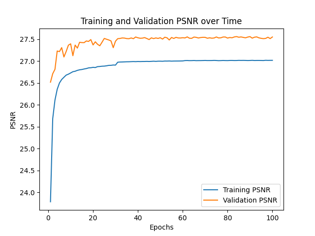
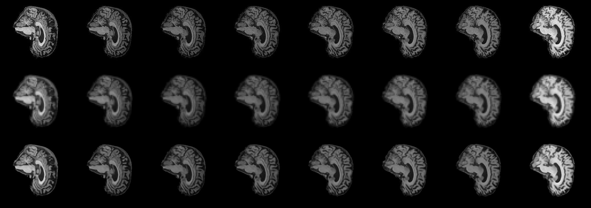

# Super Resolution CNN

Written by Harrison Tolley (47447842)

## Introduction

In this project, we have implemented a super-resolution convolutional neural network (SRCNN) to upscale the resolution of images. This has been done with the MRI ADNI brain scan dataset.

Example images of the dataset can be seen below (before downscaling):


## What we've done

We have implemented a SRCNN using pytorch modules to increase the resolution of an image. We have taken the ADNI MRI brain scan dataset, downsampled it (to simulate a low resolution image), and trained our SCRNN on these images. We then can use that model to increase the resolution of the images, and compare the results to the original images. For the purpose of this assignment, we have downsampled the original data by a factor of 4, and then have trained our model to increase the resolution by a factor of 4. This means that the output image will (should) be the same size as the original image.

All metrics for the model are displayed in their appropriate sections below.

## The Problem

If we posses a large quantity of low-resolution images (or images that we would like to be higher resolution), we can use a SRCNN to reconstruct a low resolution image into a high resolution image. SRCNNs and their more advanced successors have a variety of applications in present day technology and day-to-day life. For instance, as demonstrated in this report, we can enhance the resolution of images like MRI scans, X-rays, etc., providing a clearer image for doctors to use to diagnose potential ailments. Another application is to upscale security camera footage, which we can use to identify possible criminals.

## How it works

As we've mentioned, in short, we have taken the ADNI MRI brain scan dataset, downsampled the images by a factor of 4, and trained out model on these images. We then use the model to increase the resolution of the images, and compare the results to the original images.

This is done through a series of steps:

1. Down sample the original images by a factor of 4
2. Train the model on the downsampled images to learn the upscaling process/
   The model we implemented can be seen as follows:

```python
class Network(nn.Module):
    def __init__(self, upscale_factor=upscale_factor, channels=1, dropout_probability=0.3):
        super(Network, self).__init__()

        self.conv1 = nn.Sequential(
            nn.Conv2d(channels, 64, kernel_size=5, padding=2),
            nn.BatchNorm2d(64),
            nn.ReLU(),
            nn.Dropout(dropout_probability))

        self.conv2 = nn.Sequential(
            nn.Conv2d(64, 128, kernel_size=3, padding=1),
            nn.BatchNorm2d(128),
            nn.ReLU(),
            nn.Dropout(dropout_probability))

        self.conv3 = nn.Sequential(
            nn.Conv2d(128, 128, kernel_size=3, padding=1),
            nn.BatchNorm2d(128),
            nn.ReLU(),
            nn.Dropout(dropout_probability))

        self.conv4 = nn.Sequential(
            nn.Conv2d(128, 64, kernel_size=3, padding=1),
            nn.BatchNorm2d(64),
            nn.ReLU(),
            nn.Dropout(dropout_probability))

        self.conv5 = nn.Sequential(
            nn.Conv2d(64, channels * (upscale_factor ** 2), kernel_size=3, padding=1),
            nn.ReLU())

        self.pixel_shuffle = nn.PixelShuffle(upscale_factor)

    def forward(self, x):
        x1 = self.conv1(x)
        x2 = self.conv2(x1)
        x3 = self.conv3(x2)*
        x4 = self.conv4(x3)
        x5 = self.conv5(x4)
        out = self.pixel_shuffle(x5)
        return out
```

Note the key features of the model being:

Input: 1 channel (greyscale) image of size 60x64

Layer 1:

- 64 filters with 5x5 kernels
- Batch Normalisation
- ReLu activation
- Dropout (30%)

Layer 2:

- 128 filters with 3x3 kernels
- Batch Normalisation
- ReLu activation
- Dropout (30%)

Layer 3:

- 128 filters with 3x3 kernels
- Batch Normalisation
- ReLu activation
- Dropout (30%)

Layer 4:

- 64 filters with 3x3 kernels
- Batch Normalisation
- ReLu activation
- Dropout (30%)

Layer 5:

- 16 filters with 3x3 kernels
- ReLu activation

Pixel Shuffling Layer:

- Upscales the images by rearranging pixels in the feature map (based on the upscale factor)

3. Use the model to increase the resolution of the images to match the original size.
4. Compare results to the original images to gauge effectiveness of the model. This is done with using a combination of loss functions, validation loss, and PSNR (peak signal-to-noise ratio) metrics.

## Dependencies:

To run this project and reproduce the results, you will need the following dependencies:

- Python: Version 3.10.12
- Libraries: Numpy, Matplotlib, Pytorch (version 1.9.0), Torchvision

Additionally, you will need the ADNI Brain MRI 2D Dataset. You will also need to update the appropriate paths in the code to point to the dataset (this can be done within the utils.py file).

## Preprocessing

As the images are already quite simple in nature, minimal preprocessing was required. The major preprocessing step was to downsample the images by a factor of 4. This was done using the following code:

```python
down_sample = transforms.Compose([transforms.Resize((new_height, new_width))])
```

Additionally, while the images are already greyscale, we have to ensure consistency by explicitly converting them within torch. This also converts the images to tensors. The code can be seen below:

```python
    training_transform = transforms.Compose([
        transforms.Grayscale(),
        transforms.ToTensor(),
    ])
```

The given data was already split into training and testing sets, so no further preprocessing was required. The training dataset was used to train the model while the test dataset was used as the validation dataset.

## Results

We trained the model using 100 epochs, with a batch size of 8, and a learning rate scheduler (initially 0.001, taking a step every 30 epochs).

As it can be seen in the figures below, the loss function decreased rapidly initially, eventually plateauing as the epochs progressed. We can see this in the following graphs:


As it can be seen, the validation loss and accuracy did not change much after approximately ~30-40 epochs. This is consistent with other implementations of SRCNN such as [Long (2020)](https://keras.io/examples/vision/super_resolution_sub_pixel/#introduction). While our validation loss is consistently lower than training loss, there could be a few reasons for this. By utilising dropout and batch normalisation, some neurons will deactive during training, making the networks task harder. This was experimented with and it lead to a lower overall loss, so was implemented for final version. Batch normalisation uses statistics during training to normalise the data, which is not used during validation. This could lead to a lower validation loss as the data is normalised. Note that differences between loss was not significant (approximately 0.0024 for training loss after 30 epochs whereas validation loss was approximately 0.0020 after 30 epochs). This was not investigated futher.



We have measured the peak signal-to-noise ratio ([PSNR](https://en.wikipedia.org/wiki/Peak_signal-to-noise_ratio)) of the images to gauge the effectiveness of the model. The PSNR is a metric that measures the differences between two images. A higher PSNR value indicates that the quality of the reconstructed image is better, whereas a lower value suggests theres a larger difference - indicating lower quality. The PSNR is calculated within our training loop as follows:

```python
# Note that this code was generated using GitHub Copilot
def compute_psnr(mse, max_pixel_val=1.0):
    mse_tensor = torch.tensor(mse).to(device)
    if mse == 0:
        return float('inf')
    return 10 * torch.log10(max_pixel_val**2 / mse_tensor)
```

As our validation PSNR is higher than our training PSNR, it aligns with our earlier observation between training/validation loss. This means we are having a better reconstruction of the images during validation than during training. This could be due to the reasons mentioned above. This is a good sign that our model is performing well with its' generalisation.

# Raw Results

The results can be seen in the following figure. The top row is the original images, the middle row is the downsampled images, and the bottom row is the reconstructed images (sampled from using the model above).



## References

Team, K. (2020). Keras documentation: Image Super-Resolution using an Efficient Sub-Pixel CNN. Keras.io. https://keras.io/examples/vision/super_resolution_sub_pixel/#introduction
Wikipedia Contributors. (2019, October 10). Peak signal-to-noise ratio. Wikipedia; Wikimedia Foundation. https://en.wikipedia.org/wiki/Peak_signal-to-noise_ratio
VISOULIA, K. (2023, October 7). Image-Restoration-using-SRCNN. GitHub. https://github.com/kunal-visoulia/Image-Restoration-using-SRCNN
‌Dong, C., Loy, C. C., He, K., & Tang, X. (2015). Image Super-Resolution Using Deep Convolutional Networks. ArXiv:1501.00092 [Cs]. https://arxiv.org/abs/1501.00092

# Acknowledgements

Throughout the development of this project, some code was generated using GitHub Copilot + ChatGPT.
