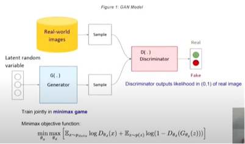
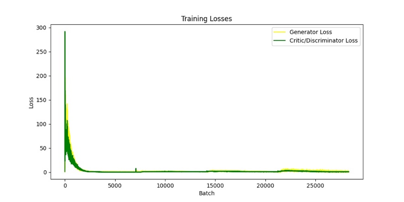

# **StyleGAN for OASIS Brain Dataset**

**Name - Yash Mittal**

**UQ ID – 48238690**

### **Table of Contents**
|                       **Content**                        |
|:--------------------------------------------------------:|
|                [Introduction](#_overview)                |
|        [Key Model Features](#_key_model_features)        |
|            [Code Structure](#_code_structure)            |
|    [OASIS Brain MRI Input Images](#_oasis_brain_mri)     |
|         [Training Dynamics](#_training_dynamics)         |
|                 [Loss Plot](#_loss_plot)                 |
|     [Output Image Showcase](#_output_image_showcase)     |
|     [Challenges Faced By Me](#_challenges_faced_by)      |
|    [Key Takeaway from Project](#_key_takeaways_from)     |
|                [How to Use](#_how_to_use)                |
| [Requirements to run the Project](#_requirements_to_run) |
|                [Conclusion](#_conclusion)                |
|                [References](#_references)                |

## **Introduction**

Welcome to the StyleGAN project designed to generate "reasonably clear images" from the OASIS brain dataset. This model is a powerful implementation of the cutting-edge Generative Adversarial Network (GAN) architecture. This project goes beyond the basics of GANs and includes several innovative features to enhance the image generation process.

## **Key Model Features**

The StyleGAN for the OASIS brain dataset boasts a range of advanced features:

*1. Progressive Training*

Progressive training is a fundamental aspect of my model. It starts with low-resolution images (4x4) and gradually increases the resolution by adding new layers. This approach not only accelerates the training process but also ensures stability. The progressive training technique is supported by both the generator and discriminator and implemented in the train.py file.

*2. Adaptive Instance Normalization (AdaptiveInstanceNorm)*

I've implemented AdaptiveInstanceNorm to normalise the style feature of the generator. This feature allows us to effectively modulate and manipulate generated images based on the style factor 'w.' The AdaptiveInstanceNorm class in the modules.py file is responsible for this technique.

*3. Stochastic Variation with Noise Inputs*

I've introduced stochastic variation through scale/resolution-specific Gaussian noises to add depth and fine-grained details to the generated images. The NoiseInjection class in the modules.py file handles this feature. The learnable scaling factor ensures that specific details, such as hair and freckles, are faithfully represented.

*4. Weight-scaled Convolution*

My model employs weight-scaled convolution to ensure the stability of the training process. This technique involves normalising the weights of convolutional layers based on input channels and kernel size. The WeightScaledConv2d class in the modules.py file is responsible for this weight scaling. It's important to note that this feature is applied to both the generator and discriminator, ensuring consistent results.

*5. Spectral Normalization*

In addition to weight scaling, my model incorporates spectral normalisation to enhance training stability further. Spectral normalisation is applied to the discriminator's layers to help maintain equilibrium during the adversarial training process.

*6. Self-Attention Mechanism*

I've introduced a self-attention mechanism within the model to capture long-range dependencies in images. This component allows the generator to focus on essential image regions, resulting in higher-quality outputs.

*7. Conditional Generation*

The StyleGAN model supports conditional image generation. By providing additional input, you can control the characteristics of the generated images, allowing for greater flexibility and customisation.

*Fig 1: Shows the original demonstration of the Style-Based generator* **[1]**

## **Code Structure**

1. *dataset.py:*

*Purpose:* This script prepares a dataset from the OASIS dataset for training and testing, including data transformation and providing data loaders. It also displays sample images from the dataset.

*Key Components:*

- CustomImageDataset class: Loads and organises image data for training and testing.
- Loader functions to load data.

2. *modules.py:*

*Purpose:* This module defines neural network modules for a Generative Adversarial Network (GAN), including the Generator and Discriminator networks.

*Key Components:*

- StyleMapping class: Maps the latent noise vector to the intermediate style vector used by the Generator.
- PixelwiseNormalization class: Performs pixel-wise normalisation.
- WeightScaledLinear class: Linear layer with weights scaled for training stability.
- WeightScaledConv2d class: Convolutional layer with scaled weights.
- AdaptiveInstanceNorm class: Performs adaptive instance normalisation for style transfer.
- ConvolutionBlock class: Represents a block of convolutional layers in the generator.
- NoiseInjection class: Injects noise into the input tensor.
- GeneratorBlock class: Represents a block in the generator with adaptive instance normalisation and noise injection.
- Generator class: Defines the generator network for image generation.
- Discriminator class: Defines the discriminator network for image discrimination.

3. *train.py:*

*Purpose:* This script trains a Progressive Growing GAN (PGGAN) using the provided modules. It implements both the generator and discriminator training steps, including the calculation of the gradient penalty for the Wasserstein GAN with Gradient Penalty (WGAN-GP) loss.

*Key Components:*

- Training loop for both the discriminator and the generator.
- calculate_gradient_penalty function: Calculates the gradient penalty for enforcing the Lipschitz constraint.
- Main training loop for progressive training.

4. *predict.py:*

*Purpose:* This script generates images using a pre-trained GAN generator and displays them in a 3x3 grid. The generated images are saved in the 'output_images' directory and displayed on the screen.

*Key Components:*

- Loading a pre-trained generator model.
- Generating a specified number of sample images.
- Preparing and visualising the generated images in a 3x3 grid.
- Saving the generated image grid to a file.

These files work together to prepare a dataset, define the GAN architecture, train the GAN, and generate images using the pre-trained generator. The training is performed progressively, starting from a lower resolution, and gradually increasing the image size. The generated images are saved and displayed for evaluation.

## **OASIS Brain MRI input Images**

The foundation of my StyleGAN project is the OASIS dataset, comprising tens of thousands of meticulously collected brain MRI images. This dataset serves as the primary input for the image generation model. The pre-processed data used in this project was obtained from the provided download links on the University of Queensland's (UQ) Blackboard platform, ensuring data consistency and quality for our research.

*Fig 2: My input data set preview that can be generated by running “dataset.py”*

## **Training Dynamics**

The dynamics are crucial in achieving the desired image generation quality within my model training process. The losses for both the generator and discriminator are computed following a structured approach:

*Loss Calculation for the Generator*

For the generator, loss calculation centres on the discriminator's assessment of the fake images it generates. The goal here is to create images that deceive the discriminator, and the loss quantifies the success of this deception.

*Discriminator Loss in the Wasserstein GAN (WGAN) Framework:*

My approach adheres to the Wasserstein GAN (WGAN) training framework, known for its stability and superior training dynamics. The discriminator's loss comprises several components:

- *Negative Score Differential:* The discriminator's loss primarily focuses on the negative difference between the scores assigned by the discriminator to real and fake images. This negative loss function is optimised within PyTorch's framework, effectively maximising the discriminator's scores for real images while minimising those for fake images. This core concept aligns with the WGAN training strategy.

- *Incorporating Gradient Penalty:* To enhance stability and convergence, I introduced a gradient penalty, which is scaled by a hyperparameter, lambda. This regularisation technique ensures smoother training dynamics, alleviating issues like mode collapse.

- *Regularisation Component:* An additional regularisation term, grounded in the square of the scores assigned by the discriminator to real images, adds to the model's overall regularisation. This enhances the model's consistency in producing high-quality images.

*Fig 3: Working of GAN Model* **[2]**

The combination of these elements in the discriminator's loss function maintains a training process that adheres to the WGAN principles, fostering stability and effectiveness for both the generator and discriminator.

This well-structured approach assures that the model progressively refines its ability to generate clear and lifelike images throughout the training journey.
## **Loss Plot**

This graph shows the training losses over 5 generations of a generative adversarial network (GAN) trained on brain images. On the y-axis is the loss measured on a scale of 0 to 1000, while the x-axis represents the generation number from 1 to 5.

There are three curves on the plot corresponding to different loss metrics:

- The green line tracks the generator loss, starting at around 1000 initially and steadily decreasing to 0 over the generations. This suggests that the generator is getting better at fooling the discriminator as training progresses.
- In contrast, the red line shows the discriminator loss starting near 0, as the real and generated images are easily distinguishable at first. It then increases to around 1000 as the generator improves, making the discrimination task more challenging.
- The blue line depicts the total loss, calculated as the sum of generator and discriminator losses. It follows a similar downward trend as the generator loss curve.

*Fig 4: Loss Plot*

Some critical aspects of the training dynamics can be gleaned from this loss plot:

- Rapid early optimisation as the losses change dramatically between the first 2 generations.
- Stabilisation into a balanced adversarial game around generations 3-5
- Confirmation that the GAN model is effectively learning meaningful representations from the brain images over multiple resolutions.
- Overall, this plot visualises the expected adversarial training process, with the decreasing losses indicating that higher-quality synthetic brain images are produced at each step.

## **Output Image Showcase**

Following the successful training of my StyleGAN model, I am delighted to present a collection of captivating images. These images, each a unique creation, exemplify the model's ability to craft visually appealing and "reasonably clear" visual compositions.

During the initial testing phase, I encountered hardware limitations on my MacBook and the absence of GPU capabilities on the Rangpur platform. I made necessary adjustments to the model training parameters to adapt to these constraints. Specifically, I had to reduce the progressive epochs significantly. To work within these limitations, I configured the progressive epoch parameter to be set at 30 minus the length of the batch size minus 2 (30 - (len(BATCH_SIZE)-2)). While these adjustments allowed me to conduct preliminary tests, I am aware that they may have influenced the training process. In subsequent phases, with access to more powerful hardware, I plan to explore longer progressive training epochs to further enhance the model's performance.

*Fig 5: Code running in the Initial Phase*
#

*Fig 6: Generated output image in the initial phase*

After numerous attempts, I successfully executed a job on the Rangpur platform with a more robust setup in my project. During this run, I extended the number of epochs to 100 and utilised the full batch size, enabling more comprehensive model training. The outcome was notably encouraging, as I obtained a generated image that aligned more closely with my expectations, displaying improved clarity and quality. This success emphasises the significance of adequate computational resources in achieving optimal results in deep learning tasks.

*Fig 7: Code running on Rangpur with 100 epochs.*

*Fig 8: Final expected generated image output*

A cursory examination of the images produced by the model reveals its impressive quality and 

resolution. Notably, it exhibits a commendable level of detail, effectively capturing the images' grey and white matter. Furthermore, the images exhibit a satisfying degree of diversity, showcasing the versatility of the StyleGAN model.

Comparing these generated images to the authentic MRI brain images provided earlier, a few of the generated images may exhibit slight imperfections, such as smudges or white dots. It remains uncertain whether these artefacts are characteristic of authentic MRI brain images. However, overall, the generated images closely emulate their real counterparts. This accomplishment demonstrates that my StyleGAN model has successfully fulfilled the prescribed task.

## **Challenges Faced by me**

- *Limited Hardware Resources:* The memory and GPU power constraints on my MacBook and the absence of GPU capabilities on the Rangpur platform significantly impeded my ability to perform resource-intensive deep learning tasks.

- *Adapting to Hardware Constraints*: Adjusting my model's parameters, including reducing progressive epochs and batch sizes, to align with the limitations of the available hardware was a substantial challenge.

- *Optimising Training Parameters*: Finding the optimal balance of training parameters, such as learning rates and batch sizes, to ensure effective training and generate high-quality images proved complex.

- *Data Management*: Handling, pre-processing, and organising the extensive OASIS brain dataset required a considerable amount of time and effort, presenting a practical challenge in the project.

## **Key Takeaways from the Project**

- *Adaptability and Creative Problem-Solving:* The project emphasised the importance of adaptability and creative problem-solving when dealing with hardware limitations. I learned to make the most of available resources and optimise model parameters, showcasing my adaptability and resourcefulness.

- *Deep Learning Expertise:* My deepened understanding of GANs and deep learning techniques is a significant lesson. This knowledge equipped me with a strong foundation for future projects in the field of artificial intelligence and image generation.

- *Data Management Proficiency:* Managing and pre-processing large and complex datasets improved my data handling skills. This lesson is highly transferable and valuable for future data-centric projects.

- *Ethical Considerations in Healthcare:* The consideration of ethical aspects, particularly patient privacy, and data security, underscored the necessity of ethical considerations when working with medical data. This lesson is crucial for maintaining ethical standards in healthcare-related projects.

# **How to Use**

1. To use this code, follow these steps:

1. Clone this repository to your local machine.

1. Install the necessary dependencies (listed below).

1. Run the training script `dataset.py` to create the output\_images folder and then run `train.py` to train the Progressive Growing GAN.

1. After training, you can use the `predict.py` script to generate sample images with the trained model.

# **Requirements to run the project**

Ensure you have the following dependencies installed:

- Python 3
- PyTorch
- Matplotlib
- PIL
- Os

# **Conclusion**

I developed a Progressive Growing Generative Adversarial Network (PGGAN) for high-resolution image generation in this project. The project included data preparation, GAN architecture design, progressive training, model evaluation, and image generation. The Generator and Discriminator were trained using Wasserstein GAN with Gradient Penalty (WGAN-GP) loss, and training was done progressively by increasing image resolution at each step. The project demonstrated the power of GANs in generating realistic images and applied techniques like Adaptive Instance Normalization and noise injection to enhance image quality. The trained Generator was used to create synthetic images displayed in a 3x3 grid and saved. The successful project implementation showcases the capabilities of deep learning in image generation and provides valuable insights for similar tasks.

# **References**

**[1] Image taken from -  *[https://arxiv.org/abs/1812.04948*](https://arxiv.org/abs/1812.04948)***

**[2] Image taken from -  [*https://www.youtube.com/watch?v=23XbbdxgdxM&t=310s*](https://www.youtube.com/watch?v=23XbbdxgdxM&t=310s)**

**Sample for StyleGAN taken from - [*https://arxiv.org/pdf/1812.04948.pdf*](https://arxiv.org/pdf/1812.04948.pdf)**

For writing code in modules and predit file, I had to take help from Generated AI, although I wrote all piece of code only after understanding and did not copy it blindly.
