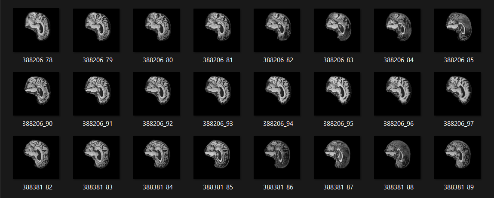
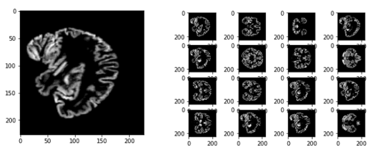
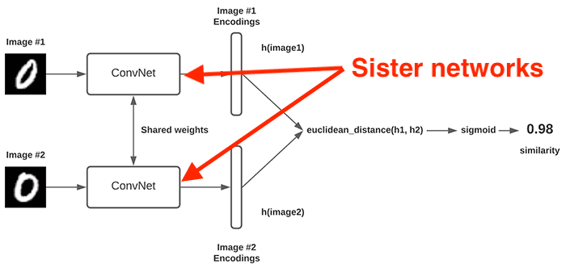
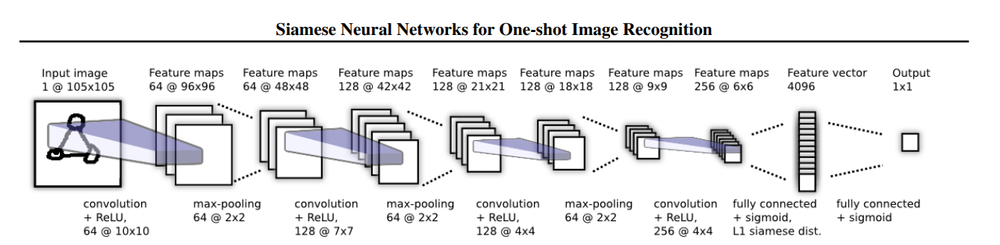
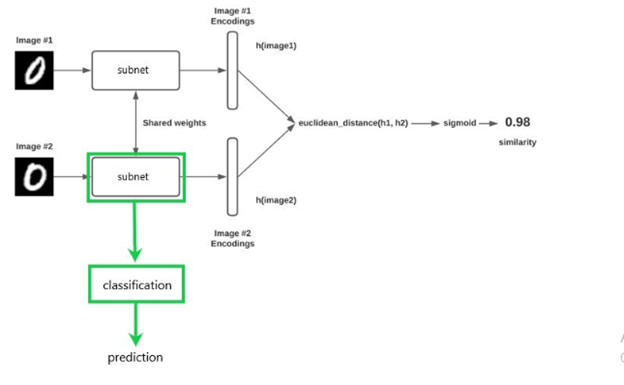
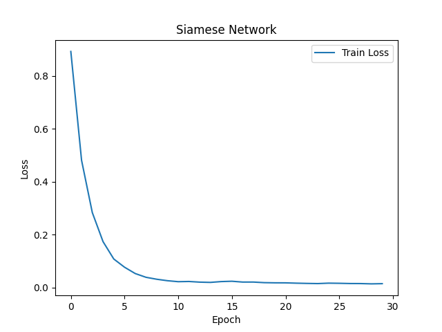
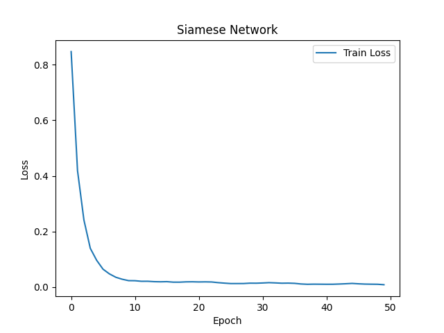
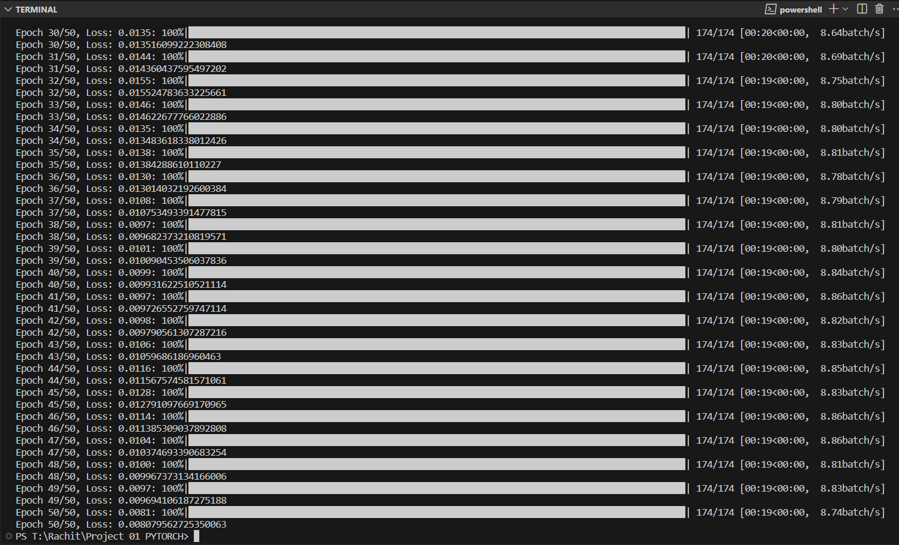

<h3 align="center">Siamese Neural Network for AD/NC Classification </h3>


---

<p align="center"> Name: <b>Rachit Chaurasia</b><br>UQ StudentID: <b>s4823870</b>
    <br> 
</p>

## 📝 Table of Contents

- [Introduction](#-introduction-)
- [Code Overview](#-code-overview-)
- [Detailed Overall Working](#-detailed-overall-working-)
- [Results](#-results-)
- [Dependencies](#-dependencies-)
- [Conclusion](#-conclusion-)
- [References](#-references-)


## 🧐 Introduction <a name = "introduction"></a>

The Siamese Neural Network is a powerful deep learning architecture used for various tasks, including image classification and similarity measurement. In this project, we have developed a Siamese Network to classify medical images into two classes: Alzheimer's Disease (AD) and Normal Control (NC). The network is trained to distinguish between these two classes, and the project is divided into three main components: dataset preparation, neural network architecture, training, and prediction.


## 👨🏻‍💻 Code Overview <a name = "code_overview"></a>

<ol>
<b><li>Dataset Preparation</li></b>
<p>In the dataset preparation phase (<b>dataset.py</b>), we organize the medical image data into a format suitable for training and evaluating the Siamese Network. The key components include:

-	<b>Dataset Classes:</b> Two custom dataset classes, <b>SiameseDataset</b>, are defined for training and testing datasets.
-	<b>Data Loading:</b> The code loads medical image data from the specified directories. The dataset is organized into training and testing sets for AD and NC images.
-	<b>Image Preprocessing:</b> The loaded images are processed to ensure consistency in terms of size, grayscale conversion, and normalization.
</p>
<b><li>Neural Network Architecture</li></b>
<p>The heart of the project is the Siamese Neural Network (<b>modules.py</b>). The network architecture is structured as follows:

-	<b>CNN Architecture:</b> The network consists of a Convolutional Neural Network (CNN) to process the input images. It includes two convolutional layers with max pooling to extract relevant features.
-	<b>Fully Connected (FC) Layers:</b> The output from the CNN is passed through fully connected layers for classification.
-	<b>Two Outputs:</b> The network produces two output vectors, one for each input image in a pair, which are used for comparison during training.
-	<b>Contrastive Loss:</b> A custom loss function, called Contrastive Loss, is employed to train the network. It encourages the network to minimize the distance between similar image pairs and maximize the distance between dissimilar pairs.
</p>
<b><li>Training the Siamese Network</li></b>
<p>The training phase is performed in the train.py script. The key steps are as follows:

-	<b>Data Loading:</b> The training data is loaded using the load_siamese_data function, and a Siamese Network model is created.
-	<b>Device Selection:</b> The code checks for GPU availability and moves the model to the GPU for accelerated training.
-	<b>Training Loop:</b> The model undergoes training for a predetermined number of epochs. During training, the Siamese Network learns to distinguish between AD and NC images.
-	<b>Model Saving:</b> After training, the model is saved to a file (<b>SNN.pth</b>), allowing for future use.
-	<b>Loss Plotting:</b> A plot of training loss is generated to visualize the training progress.
</p>
<b><li>Making Predictions</li></b>
<p>The prediction phase is executed using the <b>predict.py</b> script. The main components of this phase include:

-	<b>Model Loading:</b> The trained Siamese Network model is loaded from the saved file.
-	<b>Device Selection:</b> Like the training phase, the code determines the device for execution (GPU or CPU).
-	<b>Predictions:</b> The model is used to make predictions on test data, determining whether an image is more likely to be AD or NC.
-	<b>Output Display:</b> Predictions are displayed for each sample, allowing an assessment of the model's performance.
</p>
</ol>

## 👽 Detailed Overall Working <a name = "detailed_overall_working"></a>
<h3>Model:</h3>
<p>A Siamese Neural Network is a form of a twin network, consisting of two identical subnetworks. The networks have the same configurations, parameters, and weights, hence identical. A pair of images is passed through each network, thus computing the features of each image. The similarity is then computed by passing the feature pairs through a euclidean distance function. The aim of the network is to produce a value such that we know if the images are different or the same, with 0 for different, 1 for same.</p>
<h3>Triple Loss:</h3>
<p>Due to the nature of SNN's, cross entropy functions do not work. Given this there are other types of loss functions used with SNN's. There are two types that are most used.</p>


<h3>Contrastive Loss:</h3>
<p>Contrastive loss simply takes two inputs and computes the euclidean distance between the image features. Points with similar features will have a low euclidean distance, and high euclidean distance for points with dissimilar features.</p>

```Python
class ContrastiveLoss(nn.Module):
    def __init__(self, margin=2.0):
        super(ContrastiveLoss, self).__init__()
        self.margin = margin

    def forward(self, output1, output2, label):
       
        euclidean_distance = F.pairwise_distance(output1, output2)
        loss_contrastive = torch.mean((1 - label) * torch.pow(euclidean_distance, 2) +
                                      (label) * torch.pow(torch.clamp(self.margin - euclidean_distance, min=0.0), 2))
        return loss_contrastive
```

To use this, the SNN outputs the feature vectors instead of the calculated L1 norm.  With this custom loss function, the training time and impact could be increased.

<h3>Problem Statement:</h3>

> Create a classifier based on Siamese network [10] to classify either Alzheimer’s disease (normal and AD)
of the ADNI brain data set or classify the ISIC 2020 Kaggle Challenge data set (normal and melanoma)
having an accuracy of around 0.8 on the test set 

<p>In this readme we are attempting to classify the presence of Alzheimer's disease through the inspection of a brain scan.
It is possible to classify a brain scan as either Alzheimer's Disease (AD) or Cognitive Normal (CN) using SNN. To do this we need a dataset of image pairs to train the model. The pairs will be either two CN’s or a CN and an AD and have a corresponding label (0 for two CN’s, 1 for combination). After training the model, given a pair of images, the model can then either classify the pairs as either two CN’s or a combination of an CN and an AD.
At this point we can only tell if two images are CN or a combination of CN and AD. However, we want to have a model that we can pass a singular scan into and know whether the scan has AD or is a CN. To accomplish this, we take the trained subnetwork, and retrain the subnetwork with a classifier. Once trained this model can classify a brain scan.
</p>
<h3>Data Set:</h3>


<p>The data used to train this model is the ADNI dataset. The dataset consists of a training set, containing ~10000 images of cognitive normal brain scans (or normal controls) and ~10000 images of brain scans of patients with Alzheimer's disease. The test set contains ~4500 of each type. To train the SNN, the train data is split into 80% for training, and 20% for validation. However, the data in its raw form is not suitable for training an SNN, as we need image pairs and labels. Therefore, we must build image pairs when loading the data. This is done in <b>dataset.py</b>, and is well documented in the code. In short, we take all the image paths, create the pairs and labels corresponding to the pair, turn them into tensorflow datasets, and then shuffle the dataset before splitting into 80% train, 20% validation. No test set is generated from the image pairs, as we only evaluate the final classification model. Further given the large amount of data, 20% is a suitable amount of data to validate on.</p>
<h3>Classification Data:</h3>
<p>To evaluate and train the classification model we must build a new dataset. One that just contains singular images, and a corresponding label for whether the image is AD or CN (0 or 1). We again use an 80/20 train validation split, and use the entire test set to evaluate the model after training.</p>
<h3>Model Architecture:</h3>
<h4>SNN:</h4>



<p>The architecture of the Siamese Neural Network presented in this report follows a general SNN architecture. There is a subnetwork, a euclidean distance layer, and then a classification layer. However, the choice of subnetwork design is the critical part of an SNN. Due to the large effect the subnetwork design has on the output of the model, I experimented with two different subnetwork designs before settling on the final architecture. ResNet50 was initially used for the subnetwork, but this produced underwhelming results both when evaluating the SNN and the classification model. However, during research I encountered the following paper, <a href="https://www.ncbi.nlm.nih.gov/pmc/articles/PMC6874905/">Using Deep Siamese Neural Networks for Detection of Brain Asymmetries Associated with Alzheimer’s Disease and Mild Cognitive Impairment</a>, which was attempting to use an SNN to detect brain asymmetries.</p> 



</p>Though this is not the exact problem being solved, the data is similar, i.e., single color channel brain scans. In the above referenced paper, they used a 6 layer fully connected network. Using what was learnt from that paper a 6 layer fully connected neural network was used for the subnetwork, producing significantly better results. Each layer uses L2 kernel regularization to avoid over/under fitting the model. Each layer also uses ReLu activation.</p>
<h4>Classification:</h4>



<P>The classification takes the trained subnet model from the SNN and retrains the model using a classification layer.

```PYTHON
# Classifier model 
class Classifier(nn.Module):
    def __init__(self):
        super().__init__()
        
        self.fc1 = nn.Linear(2, 256) 
        self.bn1 = nn.BatchNorm1d(256)
        self.drop1 = nn.Dropout(0.2)
        
        self.fc2 = nn.Linear(256, 128)
        self.bn2 = nn.BatchNorm1d(128)
        self.drop2 = nn.Dropout(0.2)
        
        self.fc3 = nn.Linear(128, 64)
        self.bn3 = nn.BatchNorm1d(64)
        
        self.fc4 = nn.Linear(64, 2)

    def forward(self, x):
        x = F.relu(self.bn1(self.fc1(x))) 
        x = self.drop1(x)
        
        x = F.relu(self.bn2(self.fc2(x)))
        x = self.drop2(x)
        
        x = F.relu(self.bn3(self.fc3(x)))
        
        x = self.fc4(x)
        
        return x
```
This model is trained using the adam optimiser with a 1e-4 learning rate. Given we are doing binary classification (0 or 1), binary cross entropy loss function is used.
</P>

## 🐍 Results <a name = "results"></a>

- For 30 epochs



- For 50 epochs



- Epoch cycle running in terminal



<p>The training of the classification model did not have the same success as the siamese model. However, given the main layer of this model, the subnet, was pre trained from SNN, the model saw high validation accuracy from the beginning. Unfortunately, it did not improve too much over the training, only improving by a small percentage. Note in the run shown in this report the model had high validation at the beginning, but the dip at the 5th epoch is more representative of the validation accuracy early in training. 10 epochs were used as this consistently saw the model’s validation accuracy stabilize around 90%. The loss curve again indicated successful training, however due to the subnet being pre trained the loss started low. I suspect if I had trained the subnet less, say < 10 epochs, we would say a higher loss at the beginning of the classifier training.

At this point you can submit a batch of images to the classification model, and it will output a label for each image. If the label is < 0.5 it is an AD brain scan, else it is a CN. The further away from 0.5 the label is the more certain the prediction is.
</p>

## 🦥 Dependencies <a name = "dependencies"></a>
<ul>
<li><b>torch</b> - 2.0.1</li>
<li><b>torch-utils</b> - 0.1.2</li>
<li><b>torchvision</b> - 0.15.2</li>
<li><b>Pillow</b> - 9.4.0</li>
<li><b>numpy</b> - 1.22.0</li>
<li><b>scikit-learn</b> - 1.0.2</li>
<li><b>tqdm</b> - 4.66.1</li>

## 🙏🏽 Conclusion <a name = "conclusion"></a>
<p>In this project, we have successfully developed a Siamese Neural Network for the classification of medical images into Alzheimer's Disease (AD) and Normal Control (NC) categories. The network is trained using a custom contrastive loss function, enabling it to make meaningful distinctions between the two classes. Furthermore, the model can make accurate predictions on test data.</p>

## 🔗 References <a name = "references"></a>

- [Siamese Neural Network](https://en.wikipedia.org/wiki/Siamese_neural_network)
- [Siamese Network Example](https://keras.io/examples/vision/siamese_contrastive/) 
- [G. Koch, R. Zemel, and R. Salakhutdinov, "Siamese Neural Networks for One-shot Image Recognition,"](https://www.cs.cmu.edu/~rsalakhu/papers/oneshot1.pdf)
- [A. Rebiai et al., "Neuroimaging classification of Alzheimer's disease: a comparison of three-dimensional convolutional neural networks and a two-dimensional support vector machine"](https://www.ncbi.nlm.nih.gov/pmc/articles/PMC6874905/)
