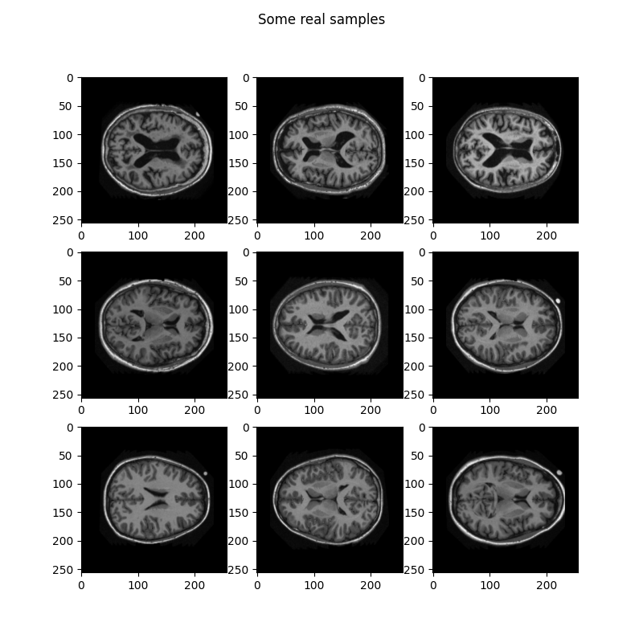

# StyleGAN model on the OASIS brain dataset

Author: Zhixuan Li, s4614899

## Task
The task is to utilize a generative model on the OASIS brain dataset, with the goal of generating "reasonable clear images".

## Model
A styleGAN model is constructed and used for the given task, which is a state-or-art variation of the Generative Adversarial Network(GAN). Built upon regular GAN models, styleGAN is designed to further improve the quality as well as the control of generated images by introducing several extra components:
- Style Mapping:
  Instead of directly feeding the latent space vector *z* into the generator, which might cause the issue of feature entanglement, styleGAN firstly converts the *z* to an intermidiated latent space *w* (also known as the style factor) via a mapping network, in order to untangle the data distribution so that training the generator could be eaiser.
- Adaptive Instance Normalization:
  
- Progressive Training:

- Stochastic Variation as Noise input:

## Input images

## Pre-processing
Rather than importing dataset, the dataset.py file specifically handles the OASIS brain dataset, which is stored on rangpur as three seperate datafiles for training, testing and validation purposes, respectively, by reading all the images from it

## Model training

## Generated images

## Dependencies

## Reference

