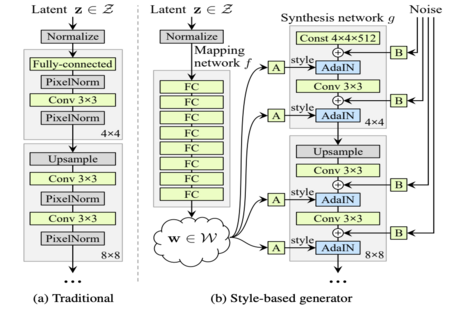
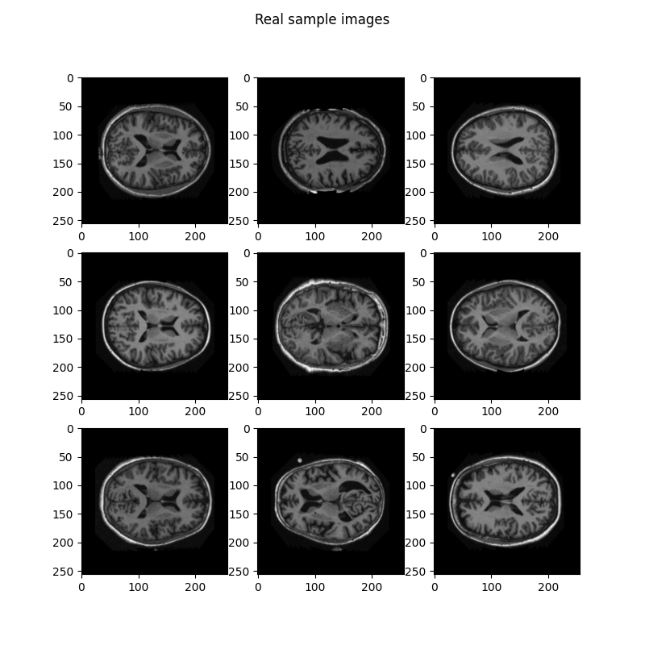
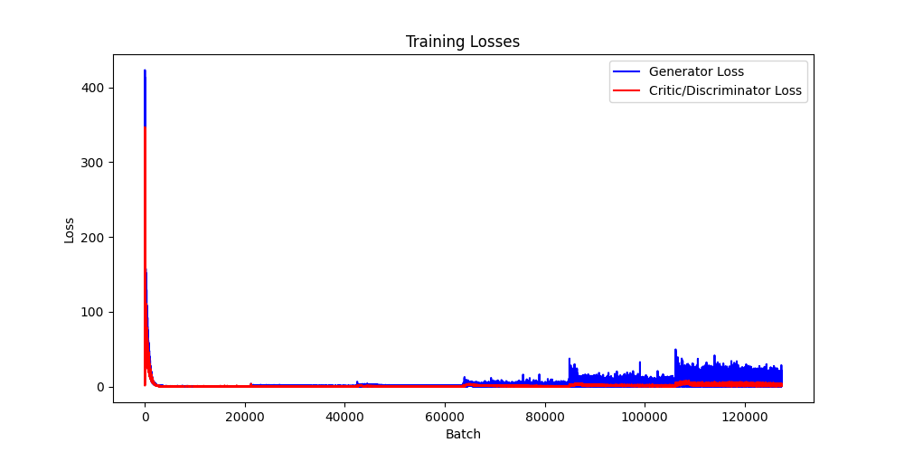
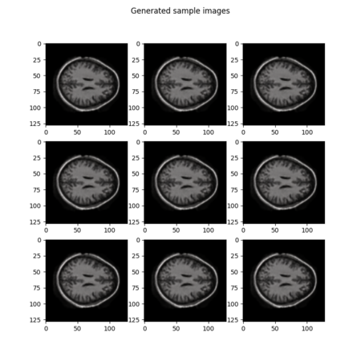

# StyleGAN model on the OASIS brain dataset

Author: Zhixuan Li, s4614899

## Task
The task is to utilize a generative model on the OASIS brain dataset, with the goal of generating "reasonably clear images".

## Model
A **styleGAN** model is constructed and used for the given task, which is a state-of-the-art variation of the Generative Adversarial Network(GAN). Building on regular GAN models, styleGAN is designed to further improve the quality as well as the control of generated images by introducing several extra components:
- **Style Mapping**:
  Instead of directly feeding the latent space vector *z* into the generator, which might cause the issue of feature entanglement, styleGAN firstly converts the *z* to an intermediate latent space *w* (also known as the style factor) via a mapping network, in order to untangle the data distribution so that training the generator could be easier. 
  The style mapping technique is achieved by the *MappingNetwork* class in the *modules.py* file, which is essentially a network of 8 fully connected layers that takes in *z* and outputs *w*;
- **Adaptive Instance Normalization**:
  AdaIN is essentially a normalization technique that aligns the mean and variance of the content feature with that of the style feature in the generator of styleGAN model. It helps to modulate and manipulate generated images based on the style factor *w*.
  The Adaptive Instance Normalization technique is achieved by the *AdIN* class in the *modules.py* file;
- **Stochastic Variation as Noise Input**:
  Stochastic variation is introduced to different layers of the generator using scale/resolution-specific Gaussian noises, where the scale-specificity is achieved by the learnable scaling factor (represented as the *weight* variable in the code), allowing for fine details such as hairs and freckles to be generated.
  The stochastic variation technique is achieved by the *injectNoise* class in the *modules.py* file;
- **Weight-scaled Convolution**:
  In the styleGAN model, the weights of convolutional layers are all normalized by scaling the input to the convolution based on input channels and the kernel size, so that the training procedure is more stable.
  The weight-scaled convolution technique is achieved by the *WSConv2d* class in the *modules.py* file;

*Note: the style mapping, AdaIN and stochastic variation techniques are used to construct the blocks of generator only, while the weight-scaled convolution is applied to both generator and discriminater.*

- **Progressive Training**:
  The training of styleGAN starts with low-resolution images (4 \* 4 in this case) and progressively increases the resolution by adding new layers until it reaches the resolution of the original images to be resembled (256 \* 256). This approach not only accelerates but also stabilizes the training process.
  The progressive training technique is supported by both generator and discriminater and achieved in the *train.py* file.

Apart from those advanced features, styleGAN also inherits the typical adversarial training framework from regular GAN models, in which the generator is trained to "fool" the discriminater and the discriminater is trained to successfully distinguish real images from the ones generated by the generator, with the ultimate goal of achieving, or in practice, approaching the **equilibrium**.

Here's a demonstration figure from the original paper:

## Input images
The **Open Access Series of Imaging Studies (OASIS)** contains tens of thousands of MRI image data of brain, which are used as input data for the styleGAN model. 
Here is a sample of the OASIS images output by the *dataset.py* file:

## Pre-processing
Rather than directly importing the dataset, the *dataset.py* file specifically handles the OASIS brain data, which is stored on rangpur as three separate image files for training, testing and validation purposes, respectively, by using the *CustomImageDataset* class to read all the images. 
The transformations applied here are straightforward and commonly used:
- firstly resize all images to ensure the sizes are all consistent;
- convert the images to Pytorch Tensor;
- randomly and horizontally flip the images with a probablity of 0.5, as a data augmentaion method;
- finally normalize the Tensor images by setting their means and standard deviations to 0.5 for all channels.

Note that due to the limitation of GPU memory, the batch size used is 16, but could be further optimized with more memory allocated.

## Model training
During the training process, the losses of both generator and discriminater are computed: the loss of generator is calculated based on scores that the discriminator assigns to the fake images generated by the generator; on the other hand, according to the **Wasserstein GAN (WGAN) training** framework, which is applied here, the loss of discriminater is calculated based on:
  - the negative of the difference between the scores assigned to real images by the discriminater and the scores assigned to fake images by the discriminater, as Pytorch's optimization framework is designed to only minimize the loss, fitting such negative loss function into Pytorch optimization framework is equivalent to maximizing the score for real images while minimizing the score for fake images, which is the idea of WGAN training;
  - the gradient penalty multiplied by the strength hyperparameter lambda, which acts as a regularization technique used primarily in the WGAN training framework;
  - another regularization term based on the square of the scores assigned to the real images by the discriminater.

For a clearer demonstration as well as comparison, the *train.py* file generates a plot of the losses of both generator and discriminater:

This plot shows typical characteristics of the WGAN training framework:
  - Extreme initial losses: when the model starts to train, the generator produces random output images that the discriminater can easily distinguish from real ones, resulting in extremely high generator loss and low discriminater loss;
  - Rapid convergence: as the model learns for a very short period of batches, the generator loss decreases significantly while the discriminater loss increases accordingly, which suggests the model learns the basic features as well as the distribution of the input images so that the generator gets really smart to fool the discriminater.
  However, after a small number of batches, the discriminater is also getting smarter and it can better distinguish generated images from real ones, thus the discriminater loss also decreases significantly right after the decrease of generator loss.
  The reason why the decrease of discriminater loss comes after the decrease of generator loss is that the gradient penalty and another regularization constraint are applied to the loss of discriminater;
  - Stabilization: after the first hundreds of batches, both losses of generator and discriminater are decreased and reach to a relatively balanced point. From the adversarial perspective, it means the generator and the discriminater are equally strong when they are antagonizing each other at this point, and thus they are approaching the equilibrium.

While from the losses plot we can see this styleGAN model is performing well, the true measure of a GAN's performance is the quality of the generated images, which are displayed below.

Beyond the training losses, both the generator and the discriminater are trained using the Adam optimizer but with slightly different learning rates (lower learning rate for the discriminater), and the progressive training approach mentioned above. Additionally, in order to smooth the transitions from lower resolutions to higher resolutions during progressive training, another parameter *alpha* is introduced and calculated based on the last layer with lower resolution and the next layer with higher resolution, so that the model can gradually adjust to new information from higher resolutions. 

## Generated images
After training the styleGAN model, a sample of generated images is output by the *predict.py* file:

At a glance, the generated images look quite impressive: the quality and resolution are decent; the details such as the grey and white matter seem to be captured well; and the generated images have a certain level of variety. In comparison to the real images shown before, despite a few of the generated images having some smudges / white dots, for which I'm not sure whether or not they are expected to appear in real MRI brain images, generally speaking, the generated images mimic the real ones quite well, which means the styleGAN model has fulfilled the given task.

## Reflection
Future work can be done on this styleGAN model for potential improvement on its performance:
  - Explore more data augmentation techniques on the given dataset;
  - Experiment with more epochs and larger batches when progressively training the model;
  - Further hyperparameter tuning;
  - Test with SGD optimizer using learning rate scheduler;
  - Adapt advanced features from styleGAN2.

## Description of Usage
- dataset.py: imports the dataset, apply certain transformtations to it, and generates sample images from it;
- modules.py: constructs the architecture of the styleGAN model, including structures of the generator and the discriminator, along with their constituent components;
- train.py: progressively trains the styleGAN model and generates the losses plot;
- predict.py: utilizes the trained model to generate fake images and plots of a sample of them.

## Dependencies
  - pytorch                   2.0.1
  - torchvision               0.15.2
  - tqdm                      4.66.1
  - matplotlib                3.7.2
  - pillow (PIL)              9.4.0
  - math
  - os
   
## Reference
  - Original paper on styleGAN: https://doi.org/10.48550/arXiv.1812.04948
  - Referenced implementation of styleGAN model: https://doi.org/10.48550/arXiv.1812.04948

