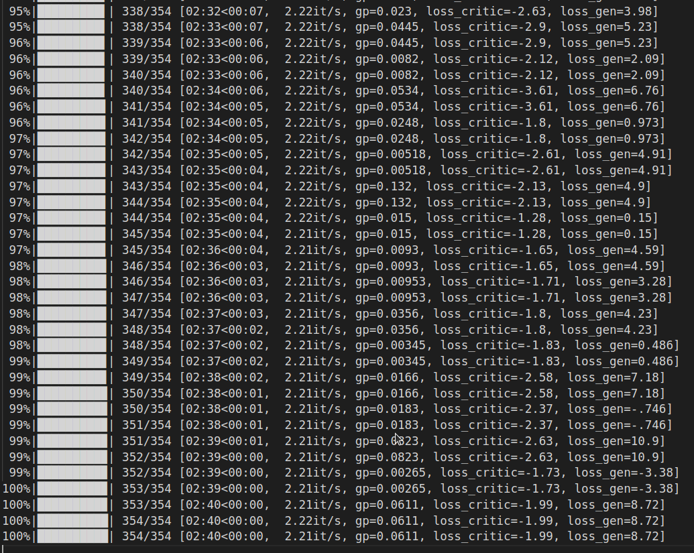

# StyleGAN model on the OASIS brain dataset

Author: Zhixuan Li, s4614899

## Task
The task is to utilize a generative model on the OASIS brain dataset, with the goal of generating "reasonable clear images".

## Model
A styleGAN model is constructed and used for the given task, which is a state-or-art variation of the Generative Adversarial Network(GAN). Built upon regular GAN models, styleGAN is designed to further improve the quality as well as the control of generated images by introducing several extra components:
- Style Mapping:
  Instead of directly feeding the latent space vector *z* into the generator, which might cause the issue of feature entanglement, styleGAN firstly converts the *z* to an intermidiated latent space *w* (also known as the style factor) via a mapping network, in order to untangle the data distribution so that training the generator could be eaiser.
- Adaptive Instance Normalization:
  AdaIN is essentially a normalizaton technique that aligns the mean and variance of the content feature with that of the style feature in the generator of styleGAN model. It helps to modulate and manipulate generated images based on the style factor *w*.
- Progressive Training:
- Progressive Training:
  The training of styleGAN starts with low-resolution images (4 \* 4 in this case) and progressively increases the resolution by adding new layers until it reaches the resolution of the original images to be resembled (256 \* 256).
  This approach accelerates and stablizes the training process. 
- Stochastic Variation as Noise Input:
  Stochastic variation is introduced to different layers of the generator using scale/resolution-specific Gaussian noises, where the scale-specificity is achieved by the learnable scaling factor (represented as the weight variable in the code), allowing for fine details such as hairs and freckles to be generated.

Apart from those advanced features, styleGAN also inherits the typical adversarial training framework from regular GAN models, in which the generator is trained to "fool" the discriminater and the discriminater is trained to successfully distinguish real images from the ones generated by the generator, with the ultimate goal of achieving, or in practice, approaching the equilibrium.

## Input images
The Open Access Series of Imaging Studies (OASIS) contains tens of thousands of MRI image data of brain, which are used as input data for the styleGAN model. Here is a sample of the OASIS data output by the dataset.py file:

## Pre-processing
Rather than directly importing the dataset, the dataset.py file specifically handles the OASIS brain data, which is stored on rangpur as three seperate data files for training, testing and validation purposes, respectively, by reading all the images with a few transformations applied.

## Model training
During the training process, the losses of both generator and discriminater are computed: the loss of generator is calculated based on scores that the discriminator assigns to the fake images generated by the generator; on the other hand, according to the Wasserstein GAN (WGAN) training framework, which is applied here, the loss of discriminater is calculated based on:
  - the negative of the difference between the scores assigned to real images by the discriminater and the scores assigned to fake images by the discriminater, as Pytorch's optimization framework is designed to only minimize the loss, fitting such loss function into pytorch optimization framework is equivalent to maximizing the score for real images while minimizing the score for fake images, which is the idea of WGAN training;
  - the gradient penalty multiplid by the strenth hyperparameter lambda, which acts as a regularization technique used primarily in the WGAN training framework;
  - another regularization term based on the square of the scores assigned to the real images by the discriminater.
Both the generator and the discriminater are trained using the Adam optimizer, the learning rate of *1e-3*, and the prograssive training approach mentioned above. Additionally, in order to smooth the transitions from lower resolutions to higher resolutions during prograssive training, another parameter *alpha* is introduced and calculated based on the last layer with lower resolution and the next layer with higher resolution, so that the model can gradually adjust to new information from higher resolutions. 

## Generated images
After training the styleGAN model, here is a sample of generated images output by the predict.py file:

## Issue
The problem is that the generated images appear to be extremely similar or even identical to each other. To understand how it happened, let's take a look at the losses of both generator and discriminator during the training process:

Despite at some early points, the loss of discrimnator and the loss of generator are equally antagonistic, the figure suggests that in the final stage of training, i.e. when the generated images are scaled at 256 \* 256, the loss of generator is dominant over / larger than that of discriminater, which means the discriminator is actually "smarter" than the generator, and it is more or less a contradiction to the fact that the generator learns which certain kind of generated images can fool/confuse the discriminator and only generates such images, which results in the highly similar / the same generated images!

<!-- which explains why the generated images are highly similar: the generator is trained to be overly smart and powerful so that it learns which certain kind of generated images can fool/confuse the discriminator and only generates such images. -->

## Solution
A naive way to solve 

## Dependencies

## Reference
- Original paper on styleGAN: https://doi.org/10.48550/arXiv.1812.04948
- Referenced implementation of styleGAN model: https://www.kaggle.com/code/tauilabdelilah/   stylegan-implementation-from-scratch-pytorch
