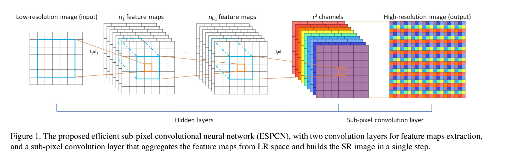
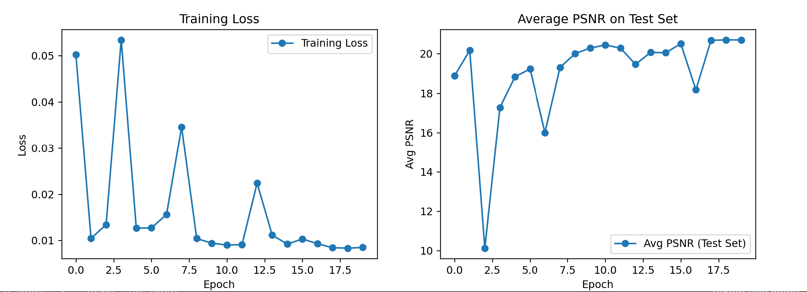
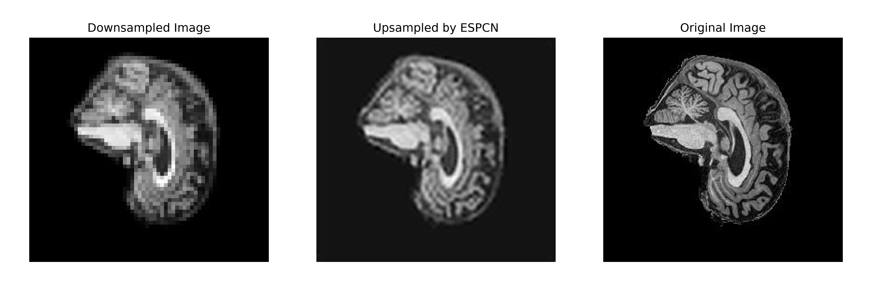

# ESPCN Super-Resolution Model with ADNI Dataset

This project implements the Efficient Sub-Pixel Convolutional Neural Network (ESPCN) for image super-resolution using the ADNI (Alzheimer's Disease Neuroimaging Initiative) dataset. The ADNI dataset is preprocessed and organized in the following format:

```
ADNI
│
└───AD_NC
    │
    ├───test (80% of data)
    │   ├───AD
    │   │   └───*.jpeg (greyscale jpeg images)
    │   │
    │   └───NC
    │       └───*.jpeg (greyscale jpeg images)
    │
    └───train (20% of data)
        ├───AD
        │   └───*.jpeg (greyscale jpeg images)
        │
        └───NC
            └───*.jpeg (greyscale jpeg images)
```

Then the ADNI dataset is transferred to use PyTorch tensors and then normalised to a mean of 0.5 and std dev of 0.5 to ensure that the pixel values are in the range [-1, 1], this is done as it is suitable for deep learning models based on empirical evidence.

## Overview

Existing methods of super-resolution are currently performed in the High-Resolution (HR) space, this would be very computationally expensive which
would lead to a general decrease in performance and speed of super-resolution, making pre-existing methods of super-resolution very inefficient.
The Efficient Sub-Pixel Convolutional Neural Network (ESPCN) is a neural network model created to overcome the weakness of current super-resolution
methods by extracting feature maps in Low-Resolution (LR) space, in essence, images are first downsampled and then feature extraction is performed. 
In ESPCN, upscaling is handled by final layer of network, meaning each LR image is directly fed into the network and feature extraction occurs through
nonlinear convolutions in LR space. Due to reduced input res, a smaller filter size can be effectively used to integrate same information while 
maintaining a given contextual area. The resolution and filter size reduction lowers the computational cost substantially enough to allow super-res of 
HD videos in real-time.
For a network with L layers, we learn n(L - 1) upscaling filters for the n(L - 1) feature maps as opposed to one upscaling filter for the input image.
Not using of an explicit interpolation filter means that the network will implicitly learn the processing necessary for SR. Thus, the network is able
to learn a better and more complex LR to HR mapping compared to a single fixed filter upscaling at the first layer. This results in additional gains
in reconstruction accuracy!
This project focuses on enhancing the resolution of medical images from the ADNI dataset using the ESPCN (Efficient Sub-Pixel Convolutional Neural Network) model. The key features of this project are as follows:

- **Feature Extraction in LR Space:** ESPCN efficiently extracts features from low-resolution images, reducing computational complexity.
- **Sub-Pixel Convolution:** The model employs a sub-pixel convolution layer to upscale LR feature maps to high-resolution output.



## Getting Started

### Prerequisites

Before using this project, ensure you have the following dependencies installed:

- Python 3.10.12
- PyTorch 2.0.1
- torchvision 0.15.2
- PIL (Pillow) 9.4.0
- matplotlib 3.7.1

### File Structure

The project directory should have the following structure:

```
.
├── modules.py          # Contains the ESPCN model definition
├── dataset.py          # Contains the custom dataset class and data loaders
├── train.py            # Contains the training loop and visualization
└── predict.py          # Contains the prediction script to visualize model outputs on test data
```

### Usage

To utilize this project with your ADNI dataset, follow these steps:

1. **Adjust File Paths:**
    - Update the file paths in `train.py` and `predict.py` to point to your ADNI dataset folder, starting at `\\ADNI\\AD_NC` as well as to point
    to the location of where you wish to save/load the trained model.
    - Example usage
    ```bash
    train_loader, test_loader = get_dataloaders("C:\\Users\\soonw\\ADNI\\AD_NC")
    ```

2. **Training the Model:**
    ```bash
    python train.py
    ```
    If you are currently in the same directory as the file, this command trains the ESPCN model using the ADNI dataset and saves the trained model weights. Inside this source code, I am saving the model in the ADNI folder.

3. **Predicting with the Model:**
    ```bash
    python predict.py
    ```
    If you are currently in the same directoy as the file, run this command to load the trained ESPCN model and perform super-resolution on a downsampled image using PyTorch. The results will be 
    visualised as a side-by-side comparison of the `Downsampled Image` - `ESPCN super-resolved image` - `Original Image`.

## Training Plots


## Output


### Model Details

- **Loss Function:** Mean Squared Error (MSE) loss is employed, ensuring that the reconstructed high-resolution image closely matches the original.
                     MSE is a common choice for super-resolution tasks as MSE directly measures the pixel-wise error between the super-resolved
                     image and the ground truth image. It calculates the average squared difference between corresponding pixel values. This pixel-level
                     comparison aligns with the goal of super-resolution, which is to generate high-quality pixel-accurate images resembling the 
                     ground truth.
- **Optimizer:** The Adam optimizer is used due to its faster convergence and effectiveness in deep learning tasks, including super-resolution.
- **Learning Rate Scheduler:** `ReduceLROnPlateau` is utilized to adapt the learning rate based on the model's performance. Just like in the paper,
                               `ReduceLROnPlateau` is used to dynamically adjust the learning rate during training. 
- **Performance Metric:** Peak Signal-to-Noise Ratio (PSNR) measures the quality of the reconstructed image compared to the original. SNR is 
                          sensitive to pixel-level differences between the original and reconstructed images. This sensitivity is crucial for super-resolution tasks, where the goal is to enhance fine details and textures. PSNR penalizes differences in pixel values, which encourages the model to produce results that closely match the ground truth.
- **Activation Function:** Tanh is chosen over ReLU as tanh an produce negative values in its output, which is beneficial for capturing both positive
                           and negative image details during super-resolution. In addition to that, tanh squashes the input values to a range of 
                           [-1, 1] which is beneficial for super-resolution as it ensures that the output falls within a bounded range. While ReLU 
                           is unbounded.

### Notes

- Be sure to adjust the file paths in the scripts to match your directory structure and ADNI dataset location.
- The model is designed for grayscale images. Ensure that your ADNI dataset contains grayscale images or modify the model to handle RGB images.
- The default upscale/downscale factor in this project is 4 as per assignment specifications, do adjust as needed.
- Downscaling is performed using PyTorch's Resize instead of applying a Gaussian blur to the images as per literature, 
  this is done based on the assignment specifications.

## Acknowledgements

Real-Time Single Image and Video Super-Resolution Using an Efficient Sub-Pixel Convolutional Neural Network: https://arxiv.org/abs/1609.05158

