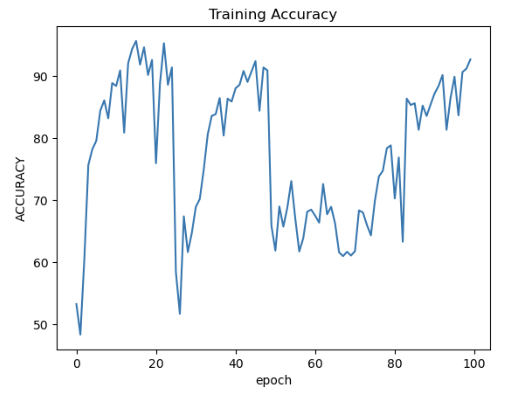
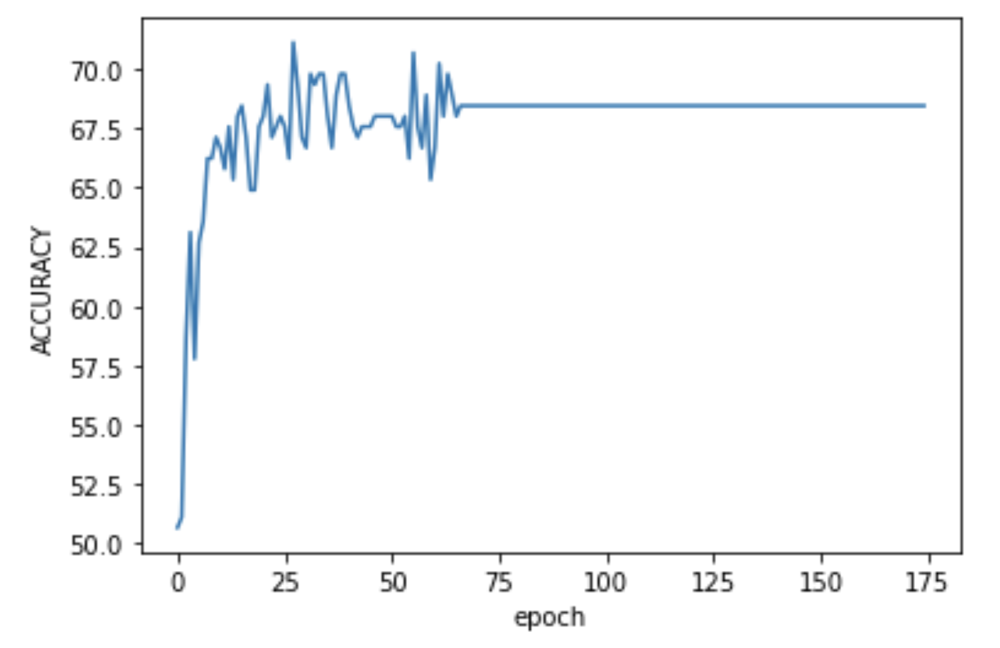
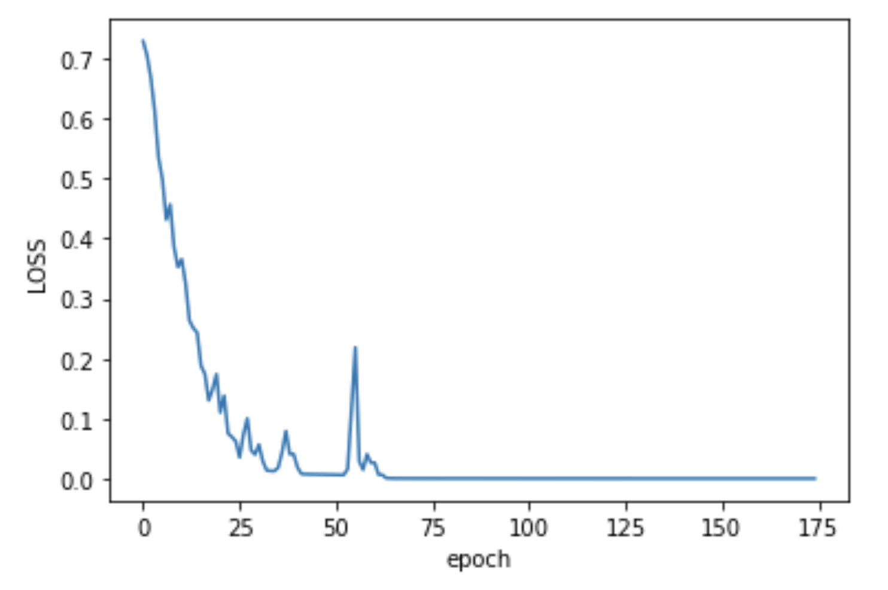

# ADNI brain data classification with Vision Transformer

## Summary

Goal of the project is to classify Alzheimer's disease (normal or AD) of the ADNI 
brain data using a Vision Transformer. Each sample consists of 20 slices of 240x256 
greyscale image corresponding to a patient, which is to be classified as either NC 
or AD. Experiments were also done with data augmentation.

## How to use

There is four files, dataset.py, modules.py, train.py, predict.py. The only files which
need to be run are train.py or predict.py. train.py is responsible for training (and 
testing) the module, with the option of saving the model as well as the loss and 
validation accuracy of each epoch, for use in predict.py. predict.py is able to load 
this data and retest the model on any of the dataloaders (train, validation, test) or 
graph the loss/accuracy curves with matplotlib.

Key point: Inside the dataset.py file, there is a directory address for the images 
(local). Make sure that these are pointing in the right direction. 

Key point: The save model section of the train.py file is commented. Make sure to
uncomment to use this functionality

Key point: The test section of the predict.py file is commented. Make sure to uncomment
to use this functionality.

Key point: Since the dataset is so large, training might need to be done on 4x p100 gpus
(rangpur).

## Architecture

The default Vision Transformer upgraded to include a pre-convolutional module, of 
which there is two designs. The convolutional layers result in less, smaller patches 
so the model is sped up. It is also supposed to introduced inductive bias into the 
model. 3D patches are utilised offering massive boosts to speed. Data augmentation is 
done by flipping images to result in 4x as much data which is said to be very important 
for transformer models.

The standard vision transformer works by inputting embeddings of patches of images, along 
with a positional encoding, into a transformer model. Only the encoder is used, and 
cross entropy loss is used for the classification. Switching the order of normalisation
allows for better propagation of gradient and training stability. If using this patch based
model it is important to use 3D patches for both speed and performance. The later design
used a CNN to instead reduce the image into channels (similar sized to patches) which are
inputted. This further improves speed without impacting performance.

## Training

Training is done for 100 epochs which was found experimentally to be long enough. 
AdamW optimiser is used with a learning rate of 3e-4, this was decreased from 1e-3 
(which did not train well) but also increased from 1e-4. The data is split into train, 
validation and test sets. Majority of the data is in train set, and the validation and
test sets are of equal size.

Hyperparameter tuning was done manually. Learning rate schedulers eg. cyclic, warm up
were found to be ineffective. A learning rate of 1e-3 didn't permit training, but 1e-4
was too slow and didn't perform as good as the final 3e-4. The 20 slices for each image
correspond to the patient-level split.

## Result

Overall, the test accuracy was 68.0% which is ok. The test accuracy was
the same as the validation accuracy, the latter of which became stable during training. 
This was about the same time the loss had rapidly decreased and became stable also. 
This could indicate that the model has adapated very well to the training set and is 
not generalising. This was the key motivator for data augmentation. However, it could 
also indicate that the learning rate is too small and stuck in a local optima. This 
is the key motivator for increasing the learnign rate from 1e-4 to 3e-4.

## References

Dosovitskiy, A. (2021) An Image is Worth 16x16 Words: Transformers for Image Recognition at Scale, Papers with code. Available at: https://paperswithcode.com/paper/an-image-is-worth-16x16-words-transformers-1 (Accessed: 18 November 2023). 