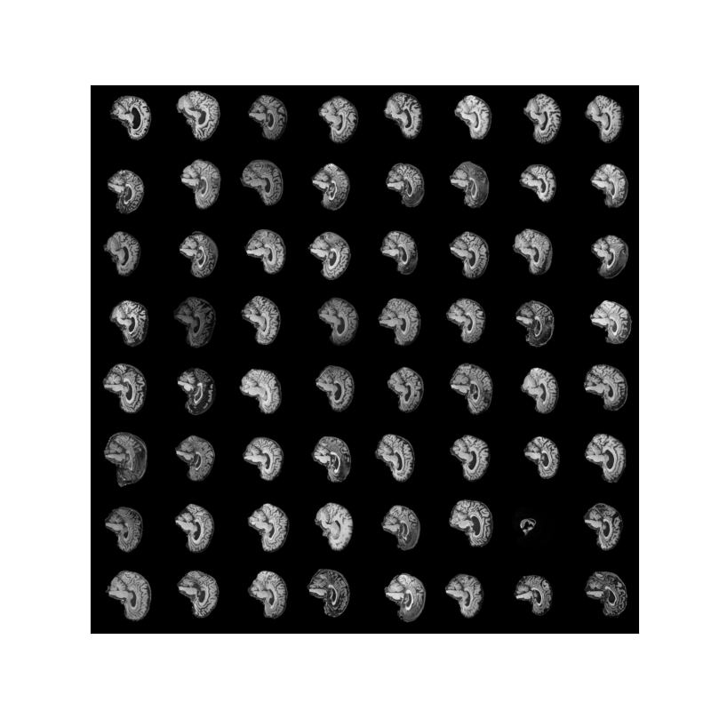
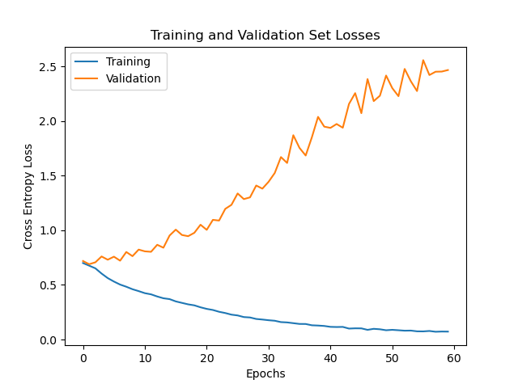

# Classifying Alzheimer's Disease Using a Visual Transformer

The aim of this project is to classify Alzheimer's disease of the ADNI brain dataset using a vision transformer (ViT). The ADNI brain dataset is composed of two classes - AD meaning Alzheimer's disease, and NC meaning Normal Cognitive. The goal is to perform classification with a minimum accuracy on the test dataset of 0.8.

## Vision Transformer
Vision Transformers, often referred to as ViTs, signify a groundbreaking departure from the traditional Convolutional Neural Networks (CNNs) in the realm of computer vision. These models are primarily characterized by their utilization of the Transformer architecture, originally designed for natural language processing but adapted for visual data processing.

In a ViT the first step involves dividing an input image into non-overlapping patches of fixed size, typically 16 by 16 pixels. These patches are then linearly embedded into low-dimensional vectors treated as a sequence of tokens. After these patches are linearly embedded a class token is prepended to the sequence. The class token is a learnable embedding focused on representing the entire image, and is hence crucial in classification. All embedded tokens are then added with a positional embedding which is generally just a random tensor representing the location of the embedding on the image.

This sequence of embedded vectors is then processed through a transformer encoder. Within the encoder are multiple feed-forward layers and self-attention layers. This self-attention mechanism is crucial as it allows the model to learn the long-range depedencies between patches. The output of the encoder is fed into a MLP which classifies the image.

## ADNI Dataset
It was mentioned there were two classes in the ADNI dataset, Alzheimer's disease and Normal Cognitive. Below there are examples for both classes (AD top, NC bottom)

## Pre-processing
The ADNI dataset provided was given in training and test folders. So, one of the first pre-processing steps used was to seperate the train folder into a training and validation set. It was decided a 80/20 train/validation split would be applied to the data. This is a common split ratio so it was a clear choice to use. On top of this, a patient-level split is also applied. As there are multiple scans of the same patient in the dataset, it was important to ensure that a patient scans only lies in the training or validation set. This is because the model would learn the patients number and hence, if the same patient existed in both datasets, the validation loss (and accuracy) would become a meaningless performance metric. 

When loading images into Python using PyTorch's ImageFolder class, the images undergo several transformations. These being:
 * Image resizing to 192px x 192px 
 * Normalisation with mean 0.5, and standard deviation 0.5
 * Image crop about the centre

The images were resized and cropped about the centre for a size of 192px x 192px because the original size of the image did not faciliate a patch size of 16px x 16px, so it was appropriate to resize the images. Furthermore, the images were normalised as this is a standard pre-processing technique. The values for the mean and standard deviation of normalisation were altered; however, it did not appear to have any significant impact on the results. A batch of brain scans after pre-processing are shown below:

## Model Implementation
The designed model follows the following architecture:

The architecture above describes the general flow of a vision transformer; however, to segment the images into patches, a convolutional layer is used. It is believed this convolutional layer improves performance. As such, the hyperparameters of the model are:

* Patch size --> length and width of image patches in pixels
* Number of encoders --> number of encoder layers in the transformer encoder section
* Number of attention heads --> number of heads on the multi-head attention block
* Hidden size --> number of output channels from the convolutional layers
* Dropout regularisation
* Number of epochs
* Learning rate
* Batch size
* Optimiser
* Loss Criterion
* Learning rate scheduler
* Weight decay 

## Training
The hyperparameters of an initial training run were:
 * Patch size = 16
 * Number of encoders = 3
 * Number of attention heads = 4
 * Dropout regularisation = 0.1
 * Number of epochs = 60
 * Learning rate = 1e-3
 * Batch size = 32
 * Hidden size = 64
 * Optimiser = Adam
 * Loss Criterion = Cross entropy loss
 * Learning rate scheduler = ReduceLROnPlateau
The plot below shows the cross entropy loss of the training at each epoch:

From this, it was clear that the model was overfitting to the training data. To try and rectify this, more dropout layers were implemented, and the dropout rate was increased to 0.2. Also, the learning rate was decreased to 1e-4, and the number of encoders was increased to 10. The model responded as below:

The model is still overfitting but the changes have decreased the losses in the validation dataset. To try and introduce more regularisation, weight decay was introduced at 1e-4. Additionally, the number of neurons in the feed-forward layers of the transformer encoder was increased. 

## Test Dataset Accuracy
