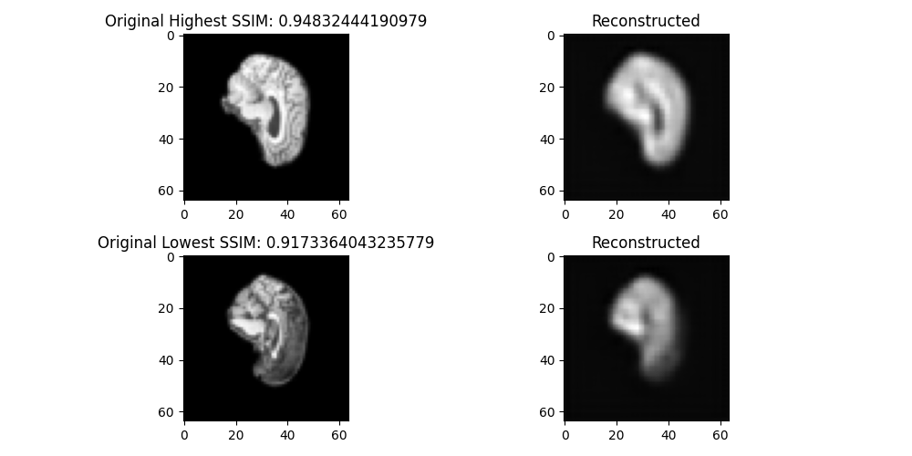

# VQ-VAE for the ADNI Dataset

**Author**: Connor Armstrong (s4703621)

# Project:

## The Vector Quantized Variational Autoencoder
The goal of this task was to implement a Vector Quantized Variational Autoencoder (henceforth referred to as a VQ-VAE). The VQ-VAE is an extension of a typical variational autoencoder that handles discrete latent representation learning - which is where the model learns to represent data in a form where the latent variables take on distinct discrete values, rather than a continuous range. This is done by the model passing the encoders output through a vector quantisation layer, mapping the continuous encodings to the closest vector in the embedding spacve. This makes the VQ-VAE very effective at managing discrete structured data and image reconstruction/generation.

## VQ-VAE and the ADNI Dataset:
The ADNI (Alzheimer’s Disease Neuroimaging Initiative) dataset is a collection of neuroimaging data, curated with the primary intent of studying Alzheimer's disease. In the context of the ADNI dataset, a VQ-VAE can be applied to condense complex brain scans into a more manageable, lower-dimensional, discrete latent space. By doing so, it can effectively capture meaningful patterns and structures inherent in the images.

## Details on the implementation:

# Usage:
**Please Note: Before running please add the directory to the train and test files for the dataset in 'train.py'**

It is highly reccomended to run only the 'predict.py' file by calling 'python predict.py' while in the working directory. It is possible to run from the 'train.py' file as well, but this has implications with data leakage a I could not find a proper way to partition the test set.

If all goes well, matplotlib outputs 4 images: the original and reconstructed brain with the highest ssim, and then the lowest ssim. 

# Data:
This project uses the ADNI dataset (in the form from on blackboard), where the training set is used to train the model, and the test folder is partitioned into a validation set and test set.

# Dependencies:
| Dependency  | Version     |
|-------------|-------------|
| torch       | 2.0.1+cu117  |
| torchvision | 0.15.2+cu117|
| matplotlib  | 3.8.0       |

# Output:
